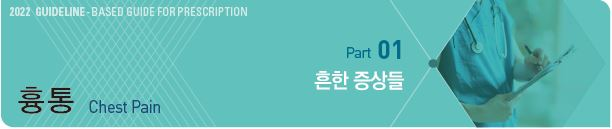
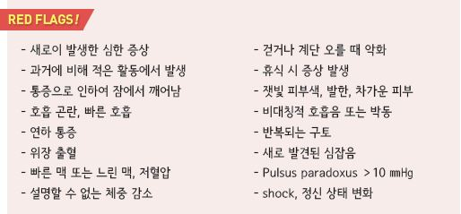
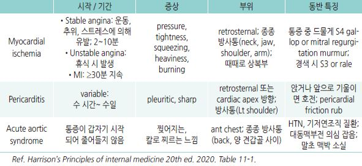
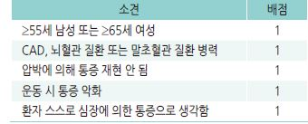
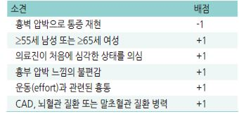
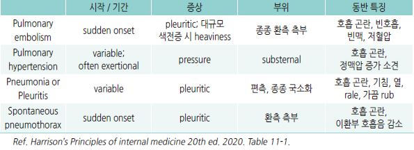
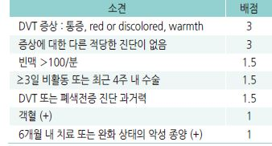
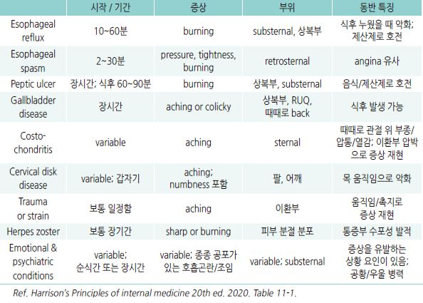
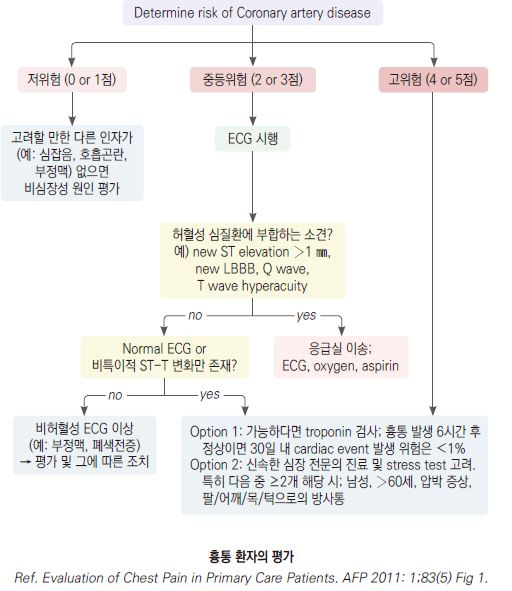
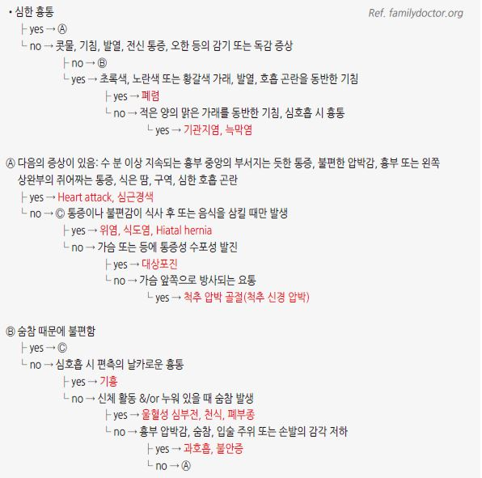

# 흉통 Chest Pain



* Red flags, Acute coronary syndrome 등 응급 의뢰 필요 여부를 판단
*   심장 기원 가능성이 낮으면 다른 원인 감별

    

## 원인

### 심장성

```
(~15% 차지)
```

* 허혈성 : 협심증, 심근경색, 대동맥판 협착증, 고혈압성 심근병증, 관상동맥연축
* 비허혈성 : 심막염, 대동맥박리, 대동맥류, 승모판 탈출증

### 비심장성

* 근골격 (\~50% 차지) : 늑연골염, 늑골 골절, 신경근병증
* 위장관 (\~20% 차지): 역류성 식도염, 식도연축, 식도천공, 위염, 소화성 궤양, 담석증
* 호흡기 : 기흉, 폐색전증, 흉막염, 폐렴, 폐암
* 기타 : 공황장애, 대상포진

## 검사

* 진찰, vital sign(pulse oximetry 포함), 병력 청취
* 12-lead ECG : 심장 허혈이 의심되는 모든 환자에 대하여 시행
* 필요시 treadmill, 흉부 X선, 심초음파, CT, nuclear heart scanning, heart catheterization
*   실험실 검사(심장 기원 배제를 위하여 고려) : CBC, 심장 효소(예: troponin, creatine kinase), CRP, fibrinogen,

    homocysteine, lipoprotein, triglyceride, brain natriuretic peptide, prothrombin

## 심장 기원 흉통

> ```
>     (☞ p.505)
> ```

```

```

#### 급성 심근경색 가능성

*   가능성 높음 : 활동과 관련, 어깨 및 팔 방사통, 발한, 구역/구토, 압박감, 과거에 경험했던 심근경색 증상과 유사하거나

    보다 심함
* 가능성 낮음 : 압박에 의해 재현됨, 예리한 느낌, 위치가 명확, 흉막 통증 느낌, 통증 부위 감염

#### 허혈성 심질환의 전형적인 흉통

*   징후 : ① 특징적인 증상 및 증상 발생 기간 동안 흉골 뒤 통증, ② 운동 또는 정신적 스트레스에 의해 유발,

    ③ nitroglycerin에 의해 30초\~수 분 내 호전(통증은 20분 이상 지속될 수 있음)
*   판정 : 3가지 모두 해당 시 전형적 허혈성 심질환 흉통, 2가지 해당 시 비전형적 흉통, ≤1가지 해당 시 심장 외 요인에 의한

    흉통

#### Marburg Heart Score (coronary artery disease predictive value)



▶CAD predictive : 0\~1점=0.6% (저위험),

```
2~3점=12.1%(중등위험), 4~5점=62.7%(고위험)

☞ [계산기](https://www.mdcalc.com/mar-burg-heart-score-mhs) 
```

> ```
> Ref. Evaluation of Chest Pain in Primary Care
> ```

```
    Patients. AFP 2011:1;83(5). Table 2.
```

#### INTERCHEST Rule (coronary artery disease predictive value)



▶CAD predictive : ≤1점=2%, ≥2점=43%

▶위험도: -1~~0점=저위험, 1~~2점=중등위험, ≥3점=고위험

```
☞ [계산기](https://www.mdcalc.com/interchest-clinical-prediction-rule-chest-pain-primary-care) 
```

> ```
> Ref. Acute Chest Pain in Adults: Outpatient
> ```

```
    Evaluation. AFP 2020:15;102(12). Table 3.
```

### Acute Coronary Syndrome (ACS)

* 급성 심근 허혈로 인한 일련의 임상증후군
* 분류 : unstable angina, ST elevation MI, non–ST segment elevation MI
* ACS 의심 ECG 소견 : ST elevation, new-onset LBBB, Q wave 존재, new T-wave inversions

## 폐 기원 흉통

```

```

#### Modified Wells Score (폐색전증 가능성 평가)



▶판정 : 폐색전증 가능성 : ＞6점=가능성 높음,

```
2~6점=중등도, ＜2점=낮음
```

> Ref. Derivation of a simple clinical model to categorize patients probability of pulmonary embolism: increasing the models utility with the SimpliRED D-dimer. Thromb Haemost. 2000 Mar;83(3):416-20.

## 비-심폐 기원 흉통

### 식도 기원 흉통의 특징

* 음식물 삼킴에 의해 통증 유발
* 자세 변화에 의해 통증 유발
* 운동과 관련 없는 증상
* 방사되지 않는 흉골 뒤 통증
* 자주 발생하는 spontaneous pain
* nocturnal pain
* 심한 통증, 수 시간 동안 지속
* 가슴쓰림, 구강으로의 위산 역류와 관련된 통증
* 제산제에 의해 증상 완화

### 근골격 기원 흉통의 특징

#### 근골격 원인에 의한 증상 특징

* squeezing 또는 oppressive 통증이 아님
* 국소 압통; 압박으로 증상이 재현됨
* 자세 또는 움직임에 의해 영향 받음

#### 질환별 특징

*   Costosternal syndrome (Costochondritis) : 보통 upper costochondral/costosternal junction 부위의 늑연골 압통,

    여러 부위 압통; 부종 없음
*   Tietze’s syndrome : sternoclavicular, costosternal, costochondral joint의 비화농성 국소 통증성 부종; 대부분 2번째 및

    3번째 늑골 관절에서 발생
* Sternalis syndrome : 흉골 몸체 부위의 국소 압통, 종종 양측으로 방사됨
*   Spontaneous sternoclavicular subluxation : 반복되는 힘든 작업과 관련하여 발생. 대부분 dominant side에 발생;

    대부분 중년 여성에서 발생
* Lower rib pain syndrome : costal margin에 압통점이 있는 하부 흉부 또는 상복부 통증
*   Posterior chest wall syndrome : 흉추 추간판탈출증에 의해 야기; 이환부 압통, 편측 dermatome을 따라 통증,

    기침/심호흡에 의해 악화
*   Fibromyalgia : 강하지 않은 자극에 대하여 통증을 느낌; 다른 부위 통증 및 통증 외 증상 동반.

    예) 피로, 수면 장애, 인지 장애, 우울, 불안
*   Rib fracture : 압통, 국소 늑막염성 통증; 보통 외상 병력이 있음 (✽외상 병력 없이도 발생할 수 있음)

    

    

### 증상/병력에 따른 감별 - 급성 흉통

```

```

### 증상/병력에 따른 감별 - 만성 흉통

```

```

> **질병코드** R07.4 상세불명의 흉통
