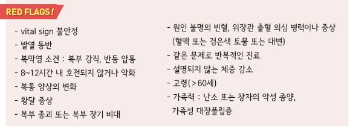
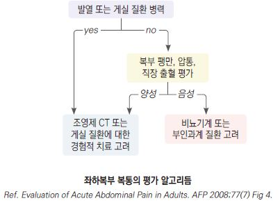
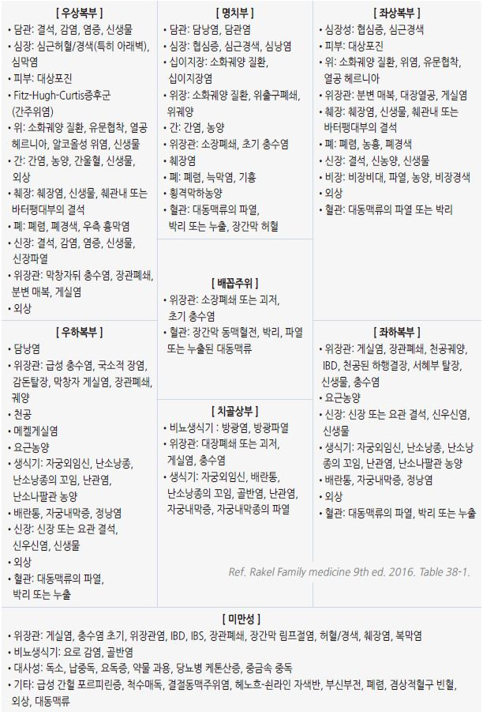
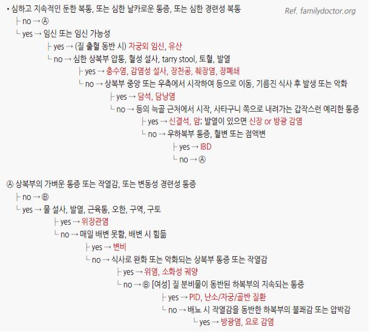

# 복통 Abdominal Pain

    

## 통증 기원에 따른 특징

#### Visceral pain (내장통)
- 기전 : 내장 기관(소장, 대장, 담낭, 요관, 신장 등)의 폐쇄 또는 염증(소화성 궤양, 담낭염, 간염, 충수염, IBD, 신우신염, PID 등)

- 통증 부위 : embryologic origin 관련 부위에 통증이 나타남

  •foregut 기원 : 식도, 위장, 십이지장 근위부, 간, 담낭, 췌장, 비장, 하부 호흡기관 → 상복부 통증

  •midgut 기원 : 십이지장 제2부 원위부~횡행결장 prox ⅔ & hepatic flexure → 배꼽 주위 통증

  •hindgut 기원 : 횡행결장 distal ⅓ 이하 & splenic flexure → 치골 상부 통증

- 임상 양상

  •복부 팽만

  •내장 근육 경련 시 지속적이고 심한 통증

  •허혈 시 극심한 광범위 통증

  •염증이 복벽까지 확장되면 국소 압통 발생

#### Parietal pain (체성통)
- 기전 : 위액, 담즙, 췌장 효소, 대변, 고름, 혈액 등에 의한 복벽의 염증에 의해 발생; 복막 긴장의 변화에 의해 악화

- 임상 양상 : 날카로운, 국소 통증; rebound tenderness

#### Referred pain (연관통)
- 이환된 neurosegment의 지배를 받는 부위에 통증이 나타남

#### Abdominal wall pain (복벽통)
- 근육 경직에 의한 통증

## 위치에 따른 복부 통증의 감별

#### 우상복부 복통
- Biliary colic : RUQ 또는 epigastrium의 심한, 우둔한 통증(＞30분 지속), 구역, 구토, 발한

- Acute cholecystitis : RUQ 또는 epigastrium의 심한 통증(＞4시간 지속), 발열, 복부 강직, Murphy’s sign

- Acute cholangitis : RUQ 통증, 발열, 황달

- Acute hepatitis : RUQ 통증; 피로, 구역, 구토, 식욕 부진, 황달, 검은색 소변, pale or clay-colored stool; 음주 병력

- Liver abscess : RUQ 통증, 발열; 특히 당뇨병, 간/담도/췌장에 기저 질환이 있는 경우 의심

#### 상복부 복통
- Acute MI : MI 증상(예: 흉통, 호흡 곤란) 동반; 관상동맥병 위험이 있는 환자에서 의심

- Pancreatitis : 점차 심해진 후 지속, 앞으로 기대면 호전, 등으로의 방사통; 음주 병력

- GERD : 가슴쓰림, 역류, 삼킴곤란

- Gastritis, Gastropathy : 가슴쓰림, 구역, 구토

- 십이지장궤양 : 식사로 완화, 식후 수 시간 후 발생

- Functional dyspepsia : 식후 팽만감, 조기 포만감

- Gastroparesis : 구역, 구토, 조기 포만감, 식후 팽만감

#### 좌상복부 복통
- Splenomegaly : 왼쪽 어깨 방사통, 조기 포만감

#### 하복부 복통
- Appendicitis : 상복부에서 시작 → RLQ로 이동, 간혹 복부 전체 통증; 식욕 부진, 구역, 구토

- Diverticulitis : 구역, 구토; 임상 증상은 기저 염증의 중증도에 의존; 수일간 지속

- Infectious colitis : 심한 통증, 설사

- Nephrolithiasis : 편측 옆구리 통증, 등 통증

- Pyelonephritis : 편측 옆구리 통증, 늑골척추각 압통, 빈뇨, 급뇨, 배뇨통, 혈뇨, 발열, 오한, 오심

- Cystitis : 치골상부 통증; 배뇨통, 빈뇨, 급뇨, 혈뇨

- Acute urinary retention : 치골상부 통증

#### 미만성 복통
- 복막염 : 움직이거나 흔들리면 악화, 반동 압통, 복부 강직

- 장 폐쇄 : 경련성 복통, 구역, 구토, 변비, 복부 팽만, 높은 음조의 증가된 장음 또는 무음

- GI 천공 : 갑작스런 심한 복통

- Viral gastroenteritis : 상대적으로 덜 심한 복통, 설사, 구역, 구토

- 식중독 : 설사, 구역, 구토, 발열; 원인으로 의심되는 음식 섭취 경력

- 셀리악병 : 부피가 큰 설사, 나쁜 냄새의 지방변, 복부 가스

- Lactose intolerance : 경련성 복통, 복부 팽만, 복부 가스, 설사

- IBS : 만성 복통, 배변 습관 변화

- Diverticulosis : 변비, 종종 무증상

- IBD : 혈성 설사, 급뇨, 뒤무직, 발열, 장외 증상(관절염, 포도막염); 장기간(수년 이상) 지속

- Acute mesenteric ischemia : 급성의 심하고 지속적인 복통

- Chronic mesenteric ischemia : 식후 통증, 구역, 구토, 설사, 체중 감소

    

    

    

    

## 연관통
- 보통 소화관 문제는 복부 중앙부 증상으로 나타남

- 콩팥, 요관, 난소, 상행/하행 결장 문제는 이환된 쪽의 편측 증상으로 나타남

- 소장 문제는 배꼽 주위 증상으로 나타남 (T8~L1)

- 게실염 등에서는 국소, 복막염에서는 미만성으로 복부 강직이 발생

- 깊은 장기의 질환(예: 콩팥 산통, 췌장염)에서는 흔히 복부 강직이 발생하지 않음

    

## 증상에 따른 감별
- 고령(특히 당뇨병, 신부전 환자)에서는 통증, 복부 강직, 발열 등의 증상이 적게 발현되므로 주의

- 가임기 여성에서는 항상 임신 가능성을 고려

### 급성 복통
    

### 만성 복통
    

> **질병코드**
R10.4 기타 및 상세불명의 복통

R10.0 급성 복증
