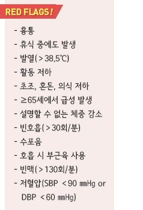
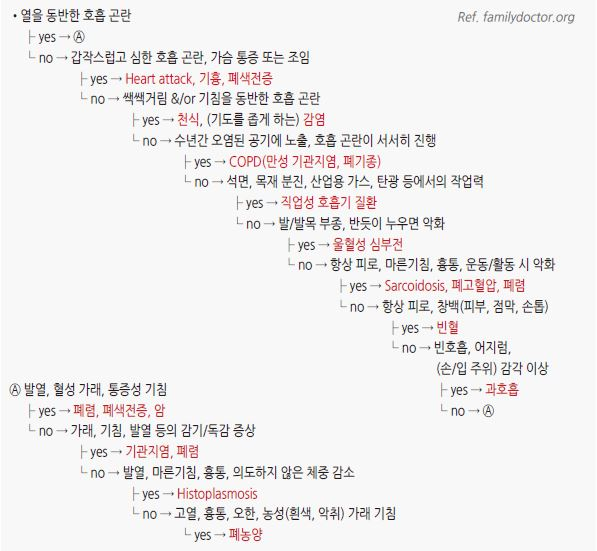

# 호흡 곤란 Dyspnea


## 일반 사항

* 호흡 곤란 : 주관적으로 느끼는 다양한 정도의 숨가쁨
* 급성 : 수 시간\~수일
* 만성 : ＞4\~8주

## 원인

#### 급성

* 호흡기 감염(예: 폐렴) : 발열, 기침, 가래 동반
* 심한 알레르기 반응, anaphylaxis : 가려움, swelling, rash 동반
* 천식 또는 COPD의 급성 악화
* 기도 폐쇄 : 이물/땅콩/기타 음식물 흡인 병력
* 폐색전증 : 갑자기 시작되는 흉막염성 흉통, 객혈 동반
* 기흉 : 흉통 동반
* heart attack : 흉통, 흉부 압박감 동반
* 심부전 : 공기 부족 느낌
* 불안, 공황장애

#### 만성

* 천식, COPD, 결핵, 흉수, 폐동맥고혈압, 진폐증, 만성 혈전색전증
* 부정맥, 심부전, 관상동맥병
* 빈혈, 신부전, 갑상선 질환, 복수
* 비만, 쇠약, 임신

## 진단

### 검사

* 흉부 X선, ECG, CBC/anemia study, CRP, basic chemistry panel, spirometry, pulse oximetry
* 선택적 시행 : echocardiography, cardiac stress tests, PFT, CT

### 증상/병력에 따른 감별

```

```

#### 자세/발생 시간

* 앉아서 숨을 쉬면 다소 호전 → 심부전, 비만, 위식도 역류성 천식
* 누우면 호흡 곤란 증상 악화, 발/발목 부종 → 심부전
* 야간 호흡 곤란 → 심부전, 천식
* recumbent position 시 다소 호전 → 좌심방 점액종, 간폐 증후군

#### 급성

* 급성, 간헐적 → 심장 발작, bronchospasm, 폐색전증
*   급성, 심한 호흡 곤란, 흉통 또는 가슴 조임 → 심장 발작, 기흉, 폐색전증, 무기폐

    •Spontaneous pneumothorax : 기저 폐질환이 있는 마른 체형의 젊은 남자 호발

    •Pulmonary embolism : 4주 내 최근 지속적인 immobilization 또는 수술 병력, estrogen 치료, DVT 위험 인자

    (thromboembolism, 암, 비만, 하지 외상)
* 급성, 지속적 → 폐렴, 급성 기관지염, 만성 질환의 급성 악화

#### 호흡기 상태

* 쌕쌕거림, 기침 동반 → 천식, 기관지 감염
* 긴 호기 시간, 호기 시 쌕쌕거림 동반 → 폐쇄성 폐질환
* 양측 폐 하부의 수포음 → 심부전
* 빠른 호흡, 어지럼, 손/입술 주위의 감각 저하 또는 저림 → 과호흡
* 감기 증상, 점액성 가래 → 기관지염, 폐렴

#### 발열

* 고열, 오한, 흉통, 화농성 덩어리가 들어있는 가래 → 폐농양
* 발열, 통증이 있는 기침, 혈성 가래 → 폐 감염, 폐암, 폐색전증
* 발열, 마른기침, 흉통, 체중 감소 → 히스토플라스마증, 진균 감염

#### 전신 상태

* 만성 피로, 마른기침, 신체 활동 후 호흡 곤란 악화 → 간질성 폐질환, 폐동맥고혈압
* 만성 피로, 창백 → 빈혈

#### 작업/환경 관련

* 일을 하지 않는 기간에는 증상 호전 → 직업적 노출
* 연기/먼지/담배 연기 등에 장기간 노출, 서서히 악화 → 만성 기관지염, COPD, 폐기종
* 석면/나무 먼지/산업용 가스/광산 등에 장기간 노출 → 직업성 폐질환

***

## Management

## 응급 관리

* 앉은 자세 유지
* 심인성 : 종이봉투에 대고 숨쉬기, Valsalva maneuver
* 산소 공급(마스크) : COPD 환자 4 L/분, 그 외 5\~10 L/분
* nitrate : nitroglycerin 0.6 ㎎ 설하 투여 \[니트로글리세린 설하정]\(0.6 ㎎/T) (☞ p.508)
*   이뇨제 : 폐부종에 적용; 빠른 효과를 위하여 가능하면 비경구로 투여

    •furosemide : 40 ㎎ IV, 1\~2분 이상 천천히 투여; 필요시 반복 \[라식스]\(40 ㎎/T, 20 ㎎/A)
* 빈맥(supraventricular tachycardia) : Valsalva maneuver, 경동맥동 마사지(고령 또는 허혈성 심질환에서는 피함)
* 기관지 확장제 : salbutamol 네뷸라이저 또는 MDI \[벤토린] (☞ p.349)
* steroid : 전신 투여는 단기 사용으로 제한; prednisolone 30\~60 ㎎/d \[소론도]\(5 ㎎/T) (☞ p.349)

> **질병코드** R06.0 호흡곤란

J80 성인호흡곤란증후군
