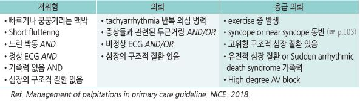
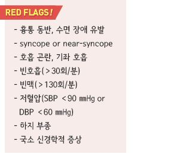

# 두근거림 Palpitation


## 일반 사항

* 심장의 강하고 빠르고 불규칙한, 불쾌한 기분의 박동

### 위험도 단계

```

```

## 원인

### 심장 원인

*   심방세동(15%), 심실상성빈맥(10%), 구조적 심장 질환

    ① “flip-flopping” (or “stop and start”) : 심방이나 심실의 조기 수축

    ② rapid “fluttering in the chest”

    •regular “fluttering” : supraventricular 또는 ventricular

    ```
    arrhythmias(sinus tachycardia 포함)
    ```

    •irregular “fluttering” : variable block(atrial fibrillation,

    ```
    atrial flutter, tachycardia)
    ```

    ③ “pounding in the neck”(neck pulsations) : right atrium

    contract(jugular venous pulsations)
* chest pain 동반 → 허혈성 심질환
* 몸을 앞으로 기울이면 호전 → 심막 질환
* light-headedness, presyncope or syncope → 저혈압, 중증 부정맥
* 힘든 작업 시 발생 → rate-dependent bypass tract, hypertrophic cardiomyopathy

### 비심장 원인

*   정신적 요인(가장 흔함; 30%) : 공포, 불안, 우울, 신체화 증상, 스트레스; 보통 ＞15분 지속

    •과호흡, hand tingling, 과민 반응 → 불안, 공황 장애
*   대사/전해질 이상 : thyrotoxicosis/갑상선항진증, 저혈압, 저혈당, 탈수(설사), 폐경기증후군

    •체중 감소, tremulousness, 심부 건반사 항진, 미세한 손 떨림 → 갑상선항진증

    •홍조, 일시적 고혈압, 두통, 불안, 발한 → pheochromocytoma, paraganglioma
* 심박출량 증가 상태 : 빈혈, 발열, 임신, 월경, 운동, 기립성 저혈압
*   약물 : 교감 신경 항진제(예: 다이어트 약물, 충혈 제거제, 천식 흡입제), 항부정맥제, 혈관 확장제, 항콜린제,

    β-차단제 금단, 카페인(예: 커피, 코코아, 초콜릿, 에너지 드링크), 니코틴, 코카인, 암페타민, 알코올
*   허브 및 영양 보충제, 특정 음식

    

***

## Management

### 치료 방침

* 원인 질환에 대한 치료. 그 외에는 대부분 치료 필요 없음
* 불안, 스트레스 해소 : 명상, 바이오피드백
* 강화 : 매일 유산소 운동, 활발한 신체 활동
* 적당한 체중 유지
* 카페인 함유 음료, 술 등 원인 음식을 피함
* 금연
* 감기약, 허브 등 흥분을 일으키는 약물을 피함

### 대증 치료

* 심장 문제 등 원인 질환 배제 후 시행 (☞ p.19)
* 항불안제 : alprazolam \[자낙스], lorazepam \[아티반] (☞ p.1149)
* β-차단제 : propranolol 10~~120 ㎎/d \[인데놀], metoprolol 100~~200 ㎎/d \[베타록] (☞ p.487)
* non-DHP계 CCB : diltiazem 120~~180 ㎎/d \[헤르벤], verapamil 120~~360 ㎎/d \[이솦틴]

> **질병코드** R00.2 두근거림


