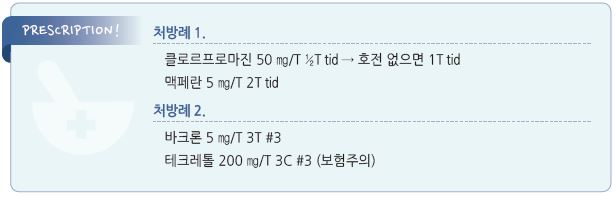

# 딸꾹질 Hiccups, Singultus

## 일반 사항

*   횡격막 등 흡기 근육의 갑작스런 반복적인 불수의적 수축과 glottis의 급속한 폐쇄에 따른 흡기의 멈춤으로 인하여

    발성 기관의 상부에서 특유의 소리가 발생하는 상태

### 분류

* 급성 딸꾹질 : 48시간 내 자연 회복; 대부분 이에 해당
* 지속성(persistent 또는 protracted) 딸꾹질 : 48시간 이상 지속
* 난치성(intractable) 딸꾹질 : 1개월 이상 지속

## 원인

* 불명. 흔히 명백한 유발 요인 없이 발생
* 과식, 탄산음료 등 위장 팽창을 일으키는 음식
* ＞48시간 지속되는 딸꾹질은 간혹 기저 질환 또는 약물 관련
* 기전 : 척수 및 뇌에서의 hiccup center의 hiccup reflux arc(미주신경, 횡격막신경) 자극

### 관련 인자

* 음주, 흡연
* 빠른 식사, 과식, 매운 음식, 뜨거운 음료, 탄산음료
* 주변 또는 복부의 급격한 온도 변화
* 정신적 원인 : 흥분, 스트레스, 충격, 두려움, 성격장애, 신체화장애, 꾀병
* 대사 이상 : Na↓, K↓, Ca↓, 탄산↓, 혈당↑, 요독증, 통풍, 당뇨
* CNS 이상 : 파킨슨병, 혈관 질환, 선천 기형, 악성 종양, 감염(뇌막염), 외상
* 횡격막 자극 : 종양, 심막염, 비장 비대, 간 비대, 복막염, 탈장, subphrenic abscess
* 미주신경 자극 : 귀/고막 자극(이물), 인후염, 목의 종괴, 갑상선종, 녹내장, 수막염
* 흉부 문제 : 폐렴, 대동맥류, 결핵, MI, 폐암
*   소화기 문제 : 복부 팽만, 식도염, GERD, 이완불능증, 위궤양, IBD, 담석, 간염, 췌장염, 담낭염, 충수염, 위장관 폐쇄, 종양,

    수술 후 상태
* 비뇨생식기 문제 : 전립선 질환
* 마취 관련 : 목의 과신전, 위/횡격막 조작, laparotomy, thoracotomy, craniotomy
* 약물 : benzodiazepine, barbiturate, steroid, α-methyldopa, propofol

## 진단

* 신체 질환 유무 진찰
* 급성 딸꾹질은 보통 검사 필요 없음; 48시간 이상 지속되는 경우 검사 고려

### 검사

* 흉부 X선, MRI(뇌, 가슴, 복부), 심초음파
* ECG, 상부 소화기 내시경 검사
* CBC, 전해질, Cr, LFT

***

## Management

### 치료 방침

* 원인이 발견되지 않는 경우 경험적 치료 시행
* 1차적으로 비약물 물리적 치료 시행 → 실패 시 약물 치료

## 비-약물 치료

* 복부 팽만 회피 : 과식이나 가스 유발 음식(예: 탄산음료, 불용성 식이 섬유) 섭취를 피함 (☞ p.1170)
*   고탄산혈증, 미주신경/횡격막 자극 유도 : 숨 참기, 과호흡, 재채기, 종이봉투에 대고 숨쉬기, Valsalva maneuver,

    상체를 앞으로 숙여 knee-chest 자세 유지, 놀라게 하기
* 미주신경 반대 자극 : supraorbit 압박, carotid sinus 마사지(실신 주의), 직장 수지 마사지
*   인두 자극 : 얼음물 마시기, 입자가 굵은 설탕 삼키기(1 teaspoon), 신 음식(예: 식초) 맛보기, 레몬 씹기, 혀 당기기,

    찬 숟가락으로 목젖 밀어 올리기

## 약물 치료

* 근이완제, 항경련제, 항정신병제의 경우 졸음, 어지럼, 저혈압 등 부작용 주의
* 치료 약물에 대한 충분한 연구는 부족함
* 치료 기간 : 7\~10일 (보험주의)

### 항정신병제

* chlorpromazine : 25~~50 ㎎ tid~~qid \[클로르프로마진]
* haloperidol : 초회 2~~5 ㎎ 후 1~~2 ㎎ tid \[페리돌]

### 근이완제

* 금기 : CNS 이상
* baclofen : 5\~10 ㎎ tid \[바크론]
* cyclobenzaprine : 15\~30 ㎎ qd 서방형 \[본렉스 이알]

### 항경련제

* carbamazepine : 200 ㎎ tid\~qid \[테그레톨]
* gabapentin : 300 ㎎ hs → 300\~400 ㎎ tid \[뉴론틴]
* phenytoin : 200\~300 ㎎ hs \[히단토인]

### Benzodiazepine

* diazepam : 2~~5 ㎎ bid~~tid \[디아제팜]
* lorazepam : 0.5\~2 ㎎ qid \[아티반]

### 위장 운동 촉진제

* metoclopramide : 5~~10 ㎎ tid~~qid \[맥페란]
* domperidone : 10\~20 ㎎ tid \[모티리움 엠]

### PPI, 제산제

* 위장관에서 hiccup center로의 자극 감소 효과 기대
* omeprazole : 20\~40 ㎎/d \[오엠피]

### 기타

* nefopam : 비마약성 진통제; 10 ㎎ IV [아큐판](%EB%B9%84%EB%B3%B4%ED%97%98/)
* viscous lidocaine : 구강 마취제; 2% 5 ㎖ tid
* dexamethasone : 화학요법에 기인한 딸꾹질에 고려

> **질병코드** R06.6 딸꾹질

