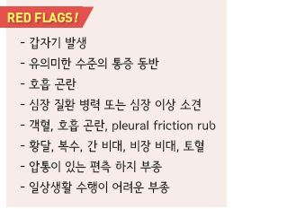
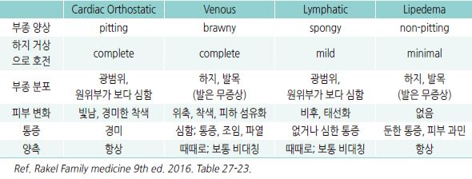
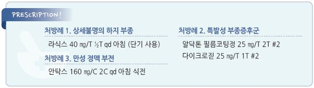

# 부종 Edema

### 기전
- capillary hemodynamics의 변화에 의한 혈관으로부터

    interstitium으로의 체액 이동

  •모세 혈관의 수압↑, 삼투압↓(예: 저알부민혈증), 투과성↑

- 신장에 의한 Na 및 수분 정체 증가 (신부전)

## 전신 부종

#### Cardiac (심부전)

>     (☞ p.515)
- 동반 소견 : 운동 유발 호흡 곤란(종종 orthopnea),

    돌발성 야간 호흡 곤란, 말초 청색증, 사지 냉증

- uric acid↑, Na↓, 간 효소↑

#### Hepatic (간경화)
- 흔히 음주와 관련

- 동반 소견 : 간질환 소견(예: 복수, 황달, 손바닥 홍반, Dupuytren’s contracture, spider angiomata, 여성형유방증), 혈압↓

- 복수가 발생한 경우 이외에는 호흡 곤란은 드묾

- hepatic proteins(transferrin, fibrinogen, albumin)↓, 간 효소↑, cholesterol↓, K↓, 호흡성 알칼리증, macrocytosis(엽산 결핍

    관련)

#### Renal (신부전, 신증후군)

>     (☞ p.617)
- 동반 소견 : 식욕 저하, 미각 변화(예: 쇠맛, 비릿함), 수면 변화, 집중력 장애, 하지불안증, myoclonus, 호흡 곤란(심부전

    경우보다 덜함), 혈압↑, 고혈압성 망막증, 질소성 악취

- Cr↑, BUN↑, u-Alb↑/s-Alb↓, K↑, P↑, Ca↓, 대상성 산증, 빈혈(보통 normocytic)

- 신증후군 : 단백뇨(＞3.5 g/d), s-Alb↓, 고콜레스테롤혈증, 현미경혈뇨

#### 기타
- 알레르기, 두드러기, 혈관부종 : 모세혈관 투과성 증가

- 폐쇄수면무호흡증 : pulmonary hypertension

- protein-losing enteropathy, 심한 영양실조 : 단백질 저하/합성↓

- 임신, 월경 전 : 체액 증가

- 갑상선저하증 : generalized myxedema

## 국소 부종
- 원인 : 봉와직염, 정맥 부전, trauma, DVT, iliac vein obstruction, lipedema, lymphedema

- 만성 하지 부종(편측 or 양측)은 종종 정맥 부전과 관련

- 정맥/림프관 부전은 흔히 DVT의 합병증으로 발생

- DVT 관련 인자 : 암 병력, 움직이지 않음, 1개월 내 주요 수술로 3일 이상 bed rest, 정맥류

### Unilateral predominance
- 원인 : 정맥 부전, DVT, lymphedema, 종양, complex regional pain syndrome

### Bilateral predominance
- 원인 : 전신 질환(심장/간/신장 부전, 영양실조), lipedema, medication-induced edema, 폐쇄수면무호흡증,

    고령(피부 탄력/근력 약화), Graves Dz(pretibial myxedema)

- 약물 : 혈관 확장제(예: CCB, α-차단제), 호르몬제(예: steroid, estrogen, progesterone, testosterone), NSAID,

    thiazolidinedione(Na 재흡수 증가)

### 만성 하지 부종의 감별
    

### 특발성 부종증후군 (Idiopathic edema syndrome)
- 기전 : capillary leak, re-feeding(급속한 다이어트 후 식사 증량), 이뇨제 유발 부종

- 체액 정체에 의한 얼굴, 손, 사지 부종; 아침에 심함

- 주로 20~40대 여성에서 월경 전 기간에 발생

- 심장, 간, 신장 질환 없음

- 관련 인자 : 당뇨병, 비만, 우울 등 정서적 문제

- 진단 : 다른 원인 배제

## 진단

### 감별

#### 발생 부위
- 말초 부종만 존재 → 국소 정맥/림프 질환

- 전신성(특히 눈꺼풀, 안면), 자고 일어난 아침에 심함 → 저단백(알부민＜2.5 g/㎗)

- dependent position, 오래 서 있은 후(저녁) 하지 부종 → 심부전

#### 국소 상태
- 압통 → DVT; 림프부종에서는 보통 압통이 없음 (때로 심한 통증)

- pitting edema(＞5초) → DVT, 정맥 부전, 림프부종; fibrotic form에서는 보통 나타나지 않음

- non-pitting edema → lymphedema(✽약한 pitting은 발생 가능), pretibial myxedema(갑상선 질환)

- medial malleolus 부위의 크고 얕고 중등도 이하의 통증성 궤양 → 만성 정맥 부전

- 작고 깊고 심한 통증성 궤양 → 동맥 부전, 혈관염, 감염

- 통증이 없는 궤양 → diabetic vascular ulcer

- 다른 쪽보다 종아리가 ≥3 ㎝ 굵음 → 심부 정맥 폐쇄 의심

>   ✽tibial tuberosity의 10 ㎝ 하방에서 측정; 일반적으로 왼쪽 종아리가 약간 더 굵음
- 피부 과각화, 경결 → 만성 림프 부종

- 갈색 피부, hemosiderin 침착 → 정맥 부전

#### 동반 증상
- 호흡 곤란 → 좌심부전, 폐부종

- 복수 → 간경화

### 검사
- 초음파, D-Dimer : 명백한 원인이 없는 급성 하지 부종에 대하여 DVT 감별을 위하여 고려

- ankle-brachial pressure index : 만성 정맥 부전 감별; 고령 및 당뇨병 환자에서는 동맥의 compressibility가 감소되어

    있으므로 해석에 주의를 요함

- s-Cr, 소변 시험지봉 검사 : 신질환(특히 신증후군) 감별을 위하여 고려

    

---

## Management

### 치료 방침
- 원인 질환 치료; DVT에 대하여 항응고제, 필요시 이뇨제 투여

- 피부 관리 주의 (피부 손상 및 venous ulcer 예방)

#### 이뇨제 투여 지침
- 서둘러 투여할 필요는 없음; 폐부종 외에는 일반적으로 응급을 요하지 않음

- 주의 : 복수 환자 또는 정맥/림프관 폐쇄 환자에서는 체액 고갈을 유발할 수 있음

  •만성 정맥 부전에서도 volume overload 상태가 아니면 이뇨제 사용을 권하지 않음

- 1차 선택 : loop diuretics(예: furosemide, bumetanide, torsemide)

- cirrhosis 시 spironolactone + loop diuretics

- furosemide : 야간 투여 시 수면 장애 초래 가능; PO 20~40 ㎎, IV 10~40 ㎎ [라식스]

  •신부전 또는 신증후군 시 고용량 필요

  •심부전 시 hypo-perfusion 증상을 모니터링하면서 사용

### 특발성 부종증후군, 하지 부종
- 이미 이뇨제를 사용하고 있는 경우에는 2~4주 동안 복용 중단 및 저염식 시행

  •이뇨제 중단 후 일시적으로 체중 증가가 나타날 수 있음

#### 이뇨제
- 이뇨제가 필요한 경우 최소 유효 용량으로 투여 (☞ p.485)

- 체액 저류가 저녁에 심해지므로 이른 저녁에 투여

- spironolactone 50~100 ㎎/d, 최대 100 ㎎ qid [알닥톤]

    ± hydrochlorothiazide 25 ㎎/d [다이크로짇]

#### 기타
- 누워서 쉼, 더운 환경을 피함

- leg elevation : 하지 부종에 대하여 심장 높이 이상으로 30분씩 하루 3~4회

- 하지 압박 : 하지 부종에 대하여 깨어 있을 때 (무릎 위까지) 압박 스타킹 착용

  •단순 부종 조절 목적 시 20~30 ㎜Hg, 궤양 등 중증 시 30~40 ㎜Hg의 압력 적용

  •저위험군의 장시간 비행기 여행 시 부종 및 무증상 혈전증 예방을 위하여 12~18 ㎜Hg의 발목 압박 양말 적용

  •림프 부종에 대하여 주 2회 bandaging system 고려

  •활동 감소 상태의 환자에 대하여 간헐적 pneumatic compression 고려

  •개선 후 유지를 위하여 inelastic grosgrain 스타킹 사용 고려

- 저염식, 과도한 수분 섭취를 피함

- 이뇨제에 반응하지 않는 경우 탄수화물 섭취 제한 (90 g/d)

- 적정 체중 유지, 섭식 장애 교정

- 우울 등 정서적 문제 교정

- 걷기 : 종아리 근육이 수축되며 정맥 회귀가 증가됨

- vitis vinifera leaf dry extract : 360 ㎎ 아침 식전 [안탁스]

> **질병코드**
R60.0 국소부종

R60.1 전신부종

R60.9 상세불명의 부종

E87.7 체액과부하

I89.0 림프 부종

