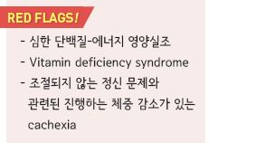
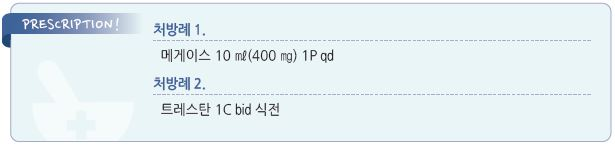

# 체중 감소 Weight Loss

> 

> ***

## 일반 사항

*   일반적 체중 변화 : 40~~50대까지 증가, 이후 10년에 1~~2 ㎏씩

    점차 감소
* 의도하지 않게 6(\~12)개월 내 평소 체중의 ≥5% 감소 시 유의미
*   고령에서의 의도하지 않은 체중 감소는 일생 생활 기능 저하,

    중증 질환 증가, 고관절 골절 증가, 전체 사망률 증가와 관련됨

## 원인

*   암(30%), 위장 장애(15%; 잘 맞지 않는 틀니, 충치, 삼킴 장애, 흡수 장애, 췌장 부전), 심부전, 심리적 문제(15%; 치매,

    우울증, 편집증), 내분비 장애(갑상선 장애, 당뇨병), 섭식 문제(식이 제한, 가난), 사회적 문제(알코올 사용 장애,

    사회적 고립), 약물 부작용
* 원인 미상 : 검사에도 불구하고 \~¼에서는 원인을 찾을 수 없음

#### 체중 감소와 관련된 부작용이 있는 약물들

* 미각/후각 변화 : allopurinol, 항생제, 항콜린제, 항히스타민제, ACEI, levodopa, CCB, propranolol, selegiline, spironolactone
*   식욕 저하 : 항생제, 항경련제, 항정신병약, benzodiazepine, digoxin, levodopa, metformin, neuroleptics, opiates, SSRIs,

    theophylline
* 입마름 : 항콜린제, 항히스타민제, clonidine, loop diuretics
* 소화불량 : bisphosphonate, doxycycline, gold, iron, NSAID, potassium
* 구역/구토 : 항생제, bisphosphonate, digoxin, dopamine agonist, metformin, statins, SSRIs, TCA

## 진단

* 체중 변화 경과, 약물 복용력, 신체검사

#### 1단계 검사

* 체중 변화 경과, 약물 복용력
* 신체검사(특히 치아 문제), 정서/인지 문제 평가(예: 우울증, 치매)
* 실험실 검사 : CBC, LFT, RFT, TSH, 혈당, CRP, ESR, urinalysis, 대변 잠혈
* 영상 검사 : 흉부 X선, UGI, 복부 초음파
* 1단계 검사에서 특이점이 없는 경우 3\~6개월 관찰 고려

#### 2단계 검사

* 1단계 검사에서 정상인 경우 고려
* 흡수 장애 검사, 위/대장 내시경
* 암 선별 검사 : Pap-smear, mammography, PSA

***

## Management

### 치료 방침

* 기저 질환 치료, 식사를 저해할 수 있는 약물 사용 중단
* 식사 환경 개선 : 여유로운 식사, 즐거운 식사, 함께하는 식사
* 식단 수정 : 금기증이 없다면 향신료(예: 소금) 사용, 씹기 쉬운 음식, 환자 선호 음식
*   칼로리 보충 : 체중 감소 정도에 따라 200~~1,000 ㎉/d 또는 30~~40 ㎉/㎏/d의 영양식을 정상 식사를 방해하지 않도록

    식후 또는 식사 2시간 이전에 제공 \[뉴케어, 에너지바]
* exercise training : 저항 운동, 유산소 운동
* 약물 치료 고려

## 약물 치료

*   식욕 자극제 : steroid, progestogen(megestrol), dronabinol, serotonin 대항제(mirtazapine); 사망률을 줄인다는 증거가

    없으며 심각한 부작용이 있을 수 있으므로 제한적 선택 고려

    •megestrol acetate : 암 등의 환자의 식욕부진, 특별한 원인이 배제된 현저한 체중 감소에서 고려;

    부작용- 복통, 불면, 발기부전, 고혈압, 혈전증, 부신부전; 160\~400 ㎎/d \[메게이스]

    •mirtazapine : 우울증이 있는 체중 감소 환자에서 고려 (✽12%에서 체중이 증가가 되었다는 보고가 있음 );

    15\~30 ㎎/d \[레메론]
* anticatabolic agent : 오메가-3, pentoxifylline, hydrazine sulfate, thalidomide
* 영양제 : carnitine, cyproheptadine 등; 위약 효과를 포함하여 일부 환자에서 유효; 증거는 부족함 [트레스탄](%EB%B9%84%EB%B3%B4%ED%97%98/)

> **질병코드** R63.4 이상체중감소

