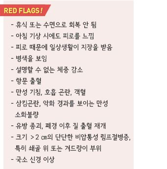
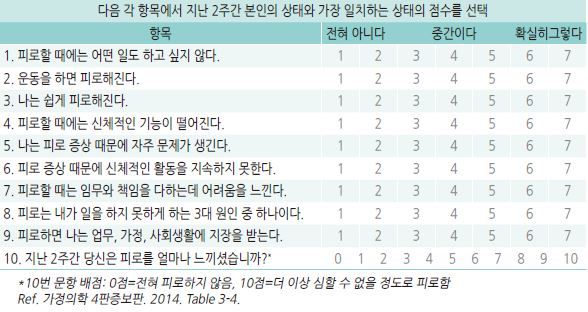

# 피로 Fatigue

## 피로의 상태
- 육체적 또는 정신적 활력 저하, 힘듦, 기진맥진 상태

- 육체적 또는 정신적 활동을 시작하기 어려움, 무기력,

    활동을 유지하기 어려움; 쉽게 힘들어짐, 처짐

## 원인 및 위험 인자
- 흔히 원인이 명확하지 않음

#### 급성 (＜1개월)
- 감염

- 스트레스

- 수면 부족

- 급격한 다이어트

- 만성 피로 원인들의 단기 악화

#### 아급성 (1~6개월), 만성 (＞6개월)
- 지나친 활동 또는 비활동

- 비만, 영양 결핍

- 만성적인 수면 부족, 음주, 흡연

- 고령, 여성

- 만성피로증후군 (☞ p.1031)

- 심장/호흡기 : CHF, COPD, 폐쇄수면무호흡증

- 내분비/대사 : 갑상선저하증/항진증, 만성 신/간질환, Na↓, Ca↑

- 혈액/종양 : 빈혈, 악성 종양

- 감염 : 단핵구증후군, 바이러스 간염, HIV 감염, 아급성 심내막염, 결핵

- 류마티스 : 섬유근육통, polymyalgia rheumatica

- 정신 : 우울, 불안, 신체화장애

- 약물 : 항우울제, 항불안제, 항정신병제, 근이완제, 항경련제, 1세대 항히스타민제, β-차단제

## 진단
- 일상생활, 수면, 스트레스, 감정 변화, 복용 약물 평가

### 검사
- 대부분의 경우에서 실험실 검사는 도움이 되지 않음; 한 달간 관찰 후 시행 여부 결정

- 기본 검사 : CBC, 전해질, 혈당, LFT, RFT, TSH, U/A

- 선택 검사 : ESR, CRP, monospot, ANA, Vit D, 흉부 X선, 수면다원검사

- 우울증 감별 (☞ p.124)

- 피로 환자의 대부분은 검사에서 근육 약화가 없으며 근육 약화가 있는 경우 신경계 질환 등을 고려해야 함

#### 피로 증상 척도 (Fatigue Severity Scale, FSS)
- 피로 상태를 평가. 치료 효과를 평가하는데 활용

    

### 감별 항목 : ‘DEAD, TIRED’

>     (Ref. Conn’s Current therapy 2017. Fatigue. Box 1.)
    Depression                     Thyroid, Tumors

    Environment/Lifestyle     Infection, Insomnia

    Anxiety, Anemia              Rheumatologic

    Drugs (Alcohol)               Endocarditis/Cardiovascular

                                            Diabetes/Endocrine

---

## Management

### 치료 방침
- 원인 치료

- 흔한 원인 및 경과에 대한 정보를 제공하고 안심시킴

- 가족 상담, 증상 및 수면 일지 작성

- 원인이 확실치 않은 경우 대증 치료 : 수면 환경 개선, 통증 관리, 영양 관리, 인지행동 요법

## 생활 요법
  ① 규칙적 운동 : 1주일에 3~4회, 매회 30분 이상

  ② 금연

  ③ 음주 제한

  ④ 카페인(커피) : 카페인이 각성에 도움이 되지만 휴식이나 수면을 대체할 수 없으며 특히 불면증이 있는 경우에

    오후에는 피해야 함

  ⑤ 적절한 체중 유지

  ⑥ 규칙적이고 적당한 수면(일반적으로 하루 7~8시간) (☞ p.69)

  ⑦ 균형 있는 식사 : 지방질 및 당분 섭취 제한, 과식 회피, 충분한 Vit과 미네랄 섭취

  ⑧ 업무량 조절 및 효율적인 시간 계획으로 휴식 시간을 늘림

  ⑨ 스트레스 대처 : 매일 쉽게 할 수 있는 이완 운동, 긍정적인 경험에 대한 연상, 이완 호흡, 어려운 일이 생길 때는

    친구나 가족들과 대화하고 도움을 요청

  ⑩ 습관성 약물 사용을 피함

## 약물 치료
- Vit D : Vit D 결핍 환자의 피로 개선에 도움

- methylphenidate : 일관성 있는 결과를 보여주지 못함

- 식욕 자극제 : 체중 감소가 동반된, 다른 원인이 없는 환자에서 고려 (☞ p.69)

> **질병코드**
R53 피로/피로감
