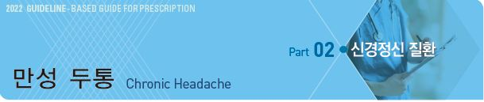

# 만성 두통 Chronic Headache

## 1차성 두통

### 지속 시간이 ＞4시간인 두통
- 종류 : Chronic migraine(☞ p.78), Chronic tension type headache(☞ p.84), New daily persistent headache,

    Hemicrania continua

#### 신생매일지속두통 (New daily persistent headache, NDPH)
- 매일 지속되는 두통, 시작 시점을 명확히 기억함

- 통증은 특징적 양상이 없으며 편두통 또는 긴장형두통 요소를 모두 가질 수 있음

A. 아래의 진단 기준 B, C를 충족시키는 지속되는 두통

B. 뚜렷하고 확실히 기억되는 시작을 갖는 통증이 지속되며, 24시간 이내에 멈추지 않음

C. ＞3개월 존재

D. 다른 ICHD-3 진단으로 더 잘 설명되지 않음1~4)

>   1) 전형적으로 과거 두통의 병력이 없는 사람에서 발생, 시작부터 매일 중단 없이 지속. 만약 환자가 시작 시점을 기억하여 정확히
    묘사할 수 없다면 다른 진단이 내려져야 함. 기존 두통의 빈도가 증가된 것이나 약물과용 후에 기존 두통이 악화된 것은 아니어야 함

>   2) 두통이 만성편두통 또는 만성긴장형두통의 진단 기준을 충족할지라도 본 진단 기준에 맞으면 신생매일지속두통으로 진단함.
    본 두통과 지속반두통의 진단 기준을 모두 충족한다면 후자로 진단함

>   3) 약물과용두통에 정의한 양을 초과하여 진통제를 복용하는 경우에 매일두통의 발생이 약물과용의 시점보다 명확하게 선행하지
    않았으면 신생매일지속두통과 약물과용두통 두 가지 진단을 동시에 붙임

>   4) 모든 경우에서 2차 두통(예: 머리의 외상성 손상, 뇌척수압 관련 두통)을 적절한 검사로 배제해야 함

#### 지속반두통 (Hemicrania continua)
- 항상 편측으로 발생하는 지속적인 통증으로 같은 쪽의 결막 충혈, 눈물, 코 막힘, 콧물, 이마와 얼굴의 땀, 동공 수축,

    눈꺼풀 처짐, 눈꺼풀 부종을 동반

- 두통은 indomethacin에 매우 민감하게 반응

A. 아래의 진단 기준 B~D를 충족시키는 편측 두통

B. 중등증 이상의 강도로 ＞3개월 존재

C. 다음 중 하나 이상 해당

 ⑴ 두통과 동측으로 다음 중 ≥1가지 존재 :

    ① 결막 충혈 &/or 눈물, ② 코 막힘 &/or 콧물, ③ 눈꺼풀 부종, ④ 이마 및 안면 발한, ⑤ 동공 축소 &/or 눈꺼풀 처짐

 ⑵ 안절부절, 초조, 또는 움직임에 의해 통증 악화

D. 치료 용량의 indomethacin에 절대적으로 반응함1)

E. 다른 ICHD-3 진단으로 더 잘 설명되지 않음

>   1) 경구 최소 150 ㎎/d, 필요시 225 ㎎/d까지 증량; 주사제 100~200 ㎎; 유지 용량은 적을 수 있음

### 지속 시간이 ＜4시간인 두통
- 종류 : Chronic cluster headache, Chronic paroxysmal hemicrania, Hypnic headache, Primary stabbing headache,

    Short-lasting unilateral neuralgiform headache attacks

#### 수면두통 (Hypnic headache)
- 수면 중에만 반복적으로 발생하여 잠에서 깨어나게 하는 두통(일명 alarm clock headache)

- 특징적인 동반 증상이 없으며 다른 병리에 기인하지 않음

- 보통 50세 이후에 발생

- 둔한 두통, 종종 양측

A. 아래의 진단 기준 B~E를 충족하는 반복되는 두통 발작

B. 잠자는 동안에만 발생하여 잠에서 깨게 함

C. ＞3개월 동안 ≥10일/월 발생

D. 잠에서 깬 후 15분~4시간 지속

E. 자율 신경 증상이나 안절부절못함은 없음

F. 다른 ICHD-3 진단으로 더 잘 설명되지 않음1,2)

>   1) 효과적인 치료를 위하여 삼차자율신경두통들(군발두통)과의 감별이 필요
  2) 수면 중 발생하여 잠에서 깨어나게 하는 두통의 다른 가능한 원인들(예: 수면무호흡증, 야간 고혈압, 저혈당, 약물과용,
    두개 내 질환) 감별

## 2차성 두통

### 종류
- 약물과용두통

- 뇌혈관 이상과 관련 있는 두통 : 동정맥 기형, 거대세포 동맥염, Carotid dissection, 혈관염

- 뇌혈관 이상과 관련 없는 두통 : 종양, 특발성 두개 내 고혈압, 감염, 외상 후 두통, 경막하 혈종

- 근막 통증 : 경추 질환, 턱관절 이상

- 수면 장애에 의한 두통 : 폐쇄수면무호흡증

### 약물과용두통 (Medication overuse headache, MOH)
- 호발 빈도 : NSAID ＜ triptan ＜ opiate, caffeine ＜ butalbital

- ≥3개월 다음 약물 복용 중 두통 발생 또는 악화하는 경우에는 약물과용두통 가능성을 고려

  •한 달에 ≥10일 triptans, opioid, ergotamine, 또는 복합진통제 복용

  •한 달에 ≥15일 acetaminophen, aspirin, 또는 NSAID 복용

#### 진단 기준
A. 기존 원발 두통을 가진 환자에서 ≥15일/월 발생하는 두통

B. 급성기 &/or 대증 치료로 사용될 수 있는 ≥1가지의 약물을 ＞3개월 동안 규칙적으로 과용1~3)

C. 다른 ICHD-3 진단으로 더 잘 설명되지 않음

>   1) 각 환자들은 과용한 약물들의 종류와 이에 대한 진단 기준에 근거하여 본 두통의 한 가지 이상의 아형으로 분류될 수 있음
    (예: 트립탄과용두통, 단순진통제과용두통, 혼합진통제과용두통)

>   2) 여러 개의 진통제를 병용하고 있으나 각각의 약물은 과용 범위에 해당되지 않는 경우 ‘개별적으로는 과용이 되지 않는
    복수 약물군의 과용에 의한 두통’으로 진단

>   3) 두통의 급성기 또는 대증 치료를 목적으로 약물을 과용하고 있으나 각각의 이름과 용량이 명확하지 않은 경우에는 정확한
    정보가 확인될 때까지 ‘증명되지 않은 복수약물군에 의한 약물과용두통’으로 진단

## 임상 양상 및 진단
감별

- 최근 시작, 최근 변화, 증상 진행 → 2차성 두통

- 발열, 체중 감소, 악성 종양 과거력 → 전신적 질환, 2차성 두통

- 간혹 편두통성 발작 → 만성 편두통

- 편두통 발작 없음 → 만성 긴장형두통

- 갑자기 발생된 만성 두통 → 신생매일지속두통

- 거의 매일 대증 약물 복용, 다른 위험 소견 없음 → 약물과용두통

- 심한 두통, 편측, 눈물/콧물, 시계 같은 규칙성, 군집성 발생, 4시간 이내 → 군발 두통 (☞ p.74)

- 경부 외상력, 목 움직임으로 유발 → 경부인성두통 (☞ p.90)

- 비만, 발열, 여성, 일시적 시각 장애, 박동성 이명 → 특발성 두개 내 고혈압

- 불안, 우울 → 2차성 두통

- 경추/턱관절 움직임 제한 또는 통증 → 경부인성두통, 턱관절 이상

---

## Management

### 치료 방침
- 생활 치료 : 수면 개선, 운동, 스트레스 관리

- 유발 요인 제거, 만성 편두통(☞ p.76) 또는 만성 긴장형두통(☞ p.84) 치료

- 만성 두통 환자에서 낮은 cortisol 수준을 보인다는 주장에 근거하여 steroid 대체 요법 시도

  •prednisolone : 60 ㎎/d ×2d → 40 ㎎/d ×2d → 20 ㎎ qd(아침) ×2d [소론도]

    → 이후 amitriptyline 10~75 ㎎/d (1일 1회 투여 시에는 취침 시 투여) [에트라빌]

#### 신생매일지속두통
- 치료에 잘 반응하지 않음

- 편두통 또는 긴장형두통 치료를 준용

#### 약물과용두통
- 복용 중인 약제, 특히 진통제, 안정제, 카페인 투여 중지; 가능한 한 단번에 중지하며 금단 우려가 있는 약제는 tapering

    또는 다른 계통으로 전환

- 중단 4~8주 후 진단의 적합성 여부 및 추후 치료에 대하여 검토

- 급성 발작 시 약물 치료는 ＜10일/월 시행
