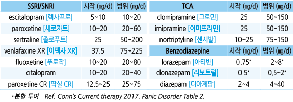
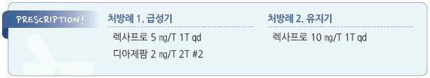

# 공황장애 Panic Disorder

## 일반 사항
- 공황발작 : 예기치 못한, 스스로 통제할 수 없는, 강력한 공포감 및 관련된 육체/정서/인지 증상들(예: 과호흡, 호흡 곤란,

    두근거림, 어지럼, 감각 이상)이 갑작스럽고 짧게 발생; 수 분(10분) 내 절정에 도달하고 1시간 내 사라짐

- 공황장애 : 반복적인 공황발작 및 발작 후 발작 재발에 대한 지속적인 걱정(예: 광장 공포, 불안/우울) &/or 공황 발작을

    피하기 위해 과도한 노력(예: 지나친 의료 이용)을 하는 상태

- 유병률 : 3~5%; 여성이 남성의 2배, 보통 25세 이하에서 시작

- 동반 증상 : 우울, 자살 위험, 강박 장애, 위장 증상(복통, 가슴쓰림, 설사, 변비, 구역/구토; 30%)

## 원인
- 불명

- 추정 기전 : 뇌 기능 이상, 정서적 자극을 다루는 기능의 이상

### 위험 인자
- 스트레스, 대인 관계 갈등 또는 상실, 학대/성폭력 피해 과거력, 불안 또는 과보호 부모

- 양극장애, 주요우울증, 강박장애, 단순공포증

- 손상(예: 사고, 수술), 질병

- 약물 : 알코올, 카페인, opioid, benzodiazepine, bupropion, dextromethorphan, levodopa, amphetamines, steroid,

    albuterol, sympathomimetics, fluoroquinolone, interferon

- 공황장애 치료를 위한 항우울제 투여 초기

- 공황장애 치료를 위한 단기 작용 약물(예: clorazepate, midazolam, triazolam, propranolol)의 투여 공백기

## 임상 양상 및 진단

### 진단 기준 [DSM-5]
- 반복되는 공황발작 및 다음 중 ≥4개 증상 발생

① 빠른 심박동(rapid heartbeat)

② 땀 흘림(sweating)

③ 전율 또는 흔들림(shaking)

④ 호흡 곤란(shortness of breath)

⑤ 숨을 내쉴 수 없음(choking sensation)

⑥ 흉통 또는 흉부 불편감(chest pain or discomfort)

⑦ 구역 또는 복부 통증(nausea or gastrointestinal distress)

⑧ 어지럼증, 균형감 상실, 쓰러질 것 같은 느낌(vertigo, sensation of loss of balance, feeling faint & light-headed)

⑨ 덥거나 추운 느낌(sensations of heat or cold)

⑩ 이상 감각(paresthesias)

⑪ 현실감 상실(derealization)

⑫ 감정 조절 능력 상실에 대한 두려움(fear of losing emotional control)

⑬ 죽음의 공포(fear of dying)

- 적어도 하나 이상의 공황발작이 발생한 후에 한 달 이상 다음 중 하나 이상이 이어짐

① 공황발작의 재발에 대한 만성적인 걱정

② 공황 발작을 피하기 위한 현저한 노력

### 감별
- 갑상선 항진/저하, 천식, COPD, 폐색전증, 과호흡 동반 역류성 식도염, 월경전불쾌장애, 폐경, 임신, 저혈당, 저산소증,

    내이 이상, 심근경색, tachyarrhythmia, 일과성허혈성발작, 자가면역 질환, carcinoid syndrome, pheochromocytoma,

    hyperaldosteronism, 쿠싱증후군

- 다른 정신 질환

### 검사
- 보통 필요 없음; 기저 질환 또는 다른 질환과의 감별을 위한 경우 고려

- ECG, pulse oximetry, Holter monitoring : 다른 질환 및 심한 공황장애 감별

- CBC, 혈당, TSH, 전해질

---

## Management

### 치료 방침 [
    대한불안의학회]

#### 초기 : 항우울제 + BZD계 항불안제 + 인지행동치료
- 광장공포증이 없는 경우의 약물 치료는 항우울제 단독 선택도 가능

- BZD계 항불안제 병합 투여 기간 : 4주

#### 유지 : 항우울제 + 인지행동치료
- 광장공포증이 있는 경우의 약물 치료는 항우울제 + BZD계 항불안제 병용 치료도 가능

#### 약물 치료 반응이 불충분한 경우
- 다른 항우울제로 교체 또는 다른 계열 항우울제/비정형 항정신병제(aripiprazole, quetiapine)/강화 약물(예: propranolol,

    buspirone) 추가 (☞ p.115)

## 비-약물 치료
- 공황 및 관련한 과호흡으로 인하여 증상이 발생하고 악화되고 있으며 이를 수정하면 증상이 완화될 수 있음을 교육

- 인지행동 요법, mindfulness-based therapy, exposure therapy

- aerobic exercise : 공황발작이 시작될 때 10분 동안 활발하게 유산소 운동

## 약물 치료
- 1차 선택 : SSRI, SNRI (☞ p.1146)

#### 항우울제
- 선호 약제 : escitalopram(우선), paroxetine, sertraline, venlafaxine

- TCA는 부작용 때문에 2차 약제로 고려

- 우울증 치료 시작 용량의 절반 정도로 시작 → 점차 증량

- 새로운 약물 투여 시작 후 2주 내 및 4, 6, 12주에 F/U; 12주 후 유지 또는 교체 결정

- 충분한 효과 발현에 2~6주 필요

- 치료 기간 : 치료에 반응이 있는 경우 적정 용량에 도달한 후 6개월 이상 치료 유지, 이후 감량 고려

  •[대한불안의학회] 기본 12개월, 재발 시 24개월 이상 치료 권고

- 투여 중단 시 12주간 tapering(갑자기 중단하지 않음)

  •약물 중단 증상 : 어지럼, 이상 감각, 위장 장애(예: 구역/구토), 두통, 발한, 불안, 수면 장애

#### Benzodiazepine (BZD)
- 동반 질환이 없는 환자에서 빠른 효과가 필요한 경우 1차 약제로 선택

  •[NICE] 장기적으로 좋은 결과를 얻지 못하며 약물 남용 및 의존 문제로 권고하지 않음

- 알코올이나 benzodiazepine 남용 병력이 있는 사람에서 금기

> **질병코드**
F40 공포성 불안장애

F41.0 공황장애[우발적 발작성 불안]

F43 심한 스트레스에 대한 반응 및 적응 장애 

