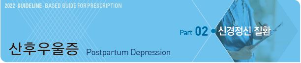
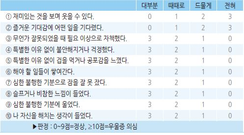
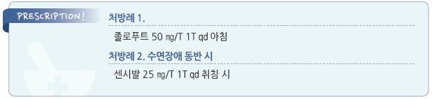

# 산후우울증 Postpartum Depression

## 일반 사항

* 분만(또는 입양) 후 12개월 내 시작되거나 재발한 주요우울증; 주로 12주 내 발생
* 빈도 : \~20%

### 산후 우울 기분 (Postpartum blue)

* 출산 후 일시적으로 발생하는 경증 우울; 출산 후 2\~3일내 발생하여 2주 내 회복
* 빈도 : 산모의 30\~70%에서 발생
* 증상 : 불쾌감, 불면, 감정 기복/정서 불안, 집중력 저하

## 원인

* 불확실
*   추정 요인 : 호르몬(예: estrogen, progesterone) 변동, cytokine, HPA axis 호르몬, 지방산, arginine vasopressin,

    oxytocin, neuro-biologic deficit, 염증, 스트레스

### 위험 인자

* 원치 않는 임신
* 어린 연령 산모
* 조산/저체중 출산, 다자녀
* 분만 후 통증
* 임신 중 불안증
* 육아 스트레스
* 지원 감소
* 수면 장애, 피로
* 낮은 자존감
* 알코올 남용
* 생활 스트레스, 최근 이사
* 관계 단절, 부부 갈등
* 낮은 사회 경제적 상태
* 산후우울증 병력, 주요우울증 병력, 월경전증후군
* 성폭행 피해력
* 우울증 가족력

## 임상 양상

* 우울 기분 또는 과민
* 일상생활에서 즐거움이 없음
* 집중력 저하
* 수면 패턴 변화(불면 또는 과수면)
* 스스로 가치가 없다고 생각 또는 죄책감
* 우는 일이 많아짐
* 체중 또는 식욕 변화
* 피로 또는 활력 상실
* 사회적 상호 작용 또는 책임 있는 일을 피함
* 망상 또는 환각
* 자살, 죽음, 또는 일상으로부터의 탈출에 대한 빈번한 생각
* 신생아 또는 다른 자녀에 대한 관심 상실
* 엄마로서의 능력에 대하여 의심
* 자신이 아기를 해칠 수 있다는 생각 또는 걱정

## 진단

* postpartum unipolar major depression의 진단 기준은 비-산모 진단 기준과 동일함 (☞ p.125)

### 선별 검사

* 모든 산모에 대하여 1,3분기 및 산욕기에 선별 검사(예: 에든버러 산후우울증 척도, PHQ-9) 권고

#### 에든버러 산후우울증 척도 (Edinburgh postnatal depression scale)

* 출산 후 6\~8주째에 적용 (첫 1년 동안 적용 가능)
*   지난 일주일간 자신의 기분에 해당된다고 생각하는 항목에 표시

    

### 검사

* TSH, Vit B12, folate, Vit D

***

## Management

### 모유 수유를 하지 않는 산모

* 일반 우울증 치료와 동일 (☞ p.129)

### 모유 수유 산모

* 모유 수유 유지 (✽항우울제를 복용하면 모유로 항우울제가 분비되지만 수유 가능)
* 신생아와의 적절한 접촉 유지 (예: 신생아 마사지)
* 밝은 환경 유지, 활동
* 신생아 수면 관리 (필요시 주변의 도움 요청)
* 적당한 영양 및 수분 섭취
* 복합 Vit/미네랄, 오메가-3 공급

### 약제

* 경증\~중등증 : 항우울제 단독, 항우울제+비정형 항정신병제
*   중증 : 항우울제+비정형 항정신병제

    •정신병적 양상이 동반된 중증 : 항우울제+비정형 항정신병제

#### 항우울제

*   선택 : SSRI, TCA (☞ p.1146)

    •paroxetine, sertraline이 보다 적게 모유로 분비됨
* 저용량으로 시작 → 점차 증량; 산모 및 영아의 부작용 모니터링
* paroxetine : 10~~60 ㎎/d \[세로자트]; CR 12.5 ㎎/d, 25~~62.5 ㎎/d \[팍실 CR]
* sertraline : 50\~200 ㎎/d \[졸로푸트]
* nortriptyline : 25\~150 ㎎/d; 근골격 통증 적응 \[센시발]; 자살 충동이 있는 경우에는 피함

> **질병코드** F53 달리 분류되지 않은 산후기의 정신 및 행동 장애

O90 달리 분류되지 않은 산후기의 합병증

