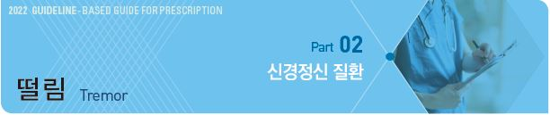
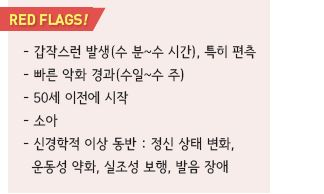
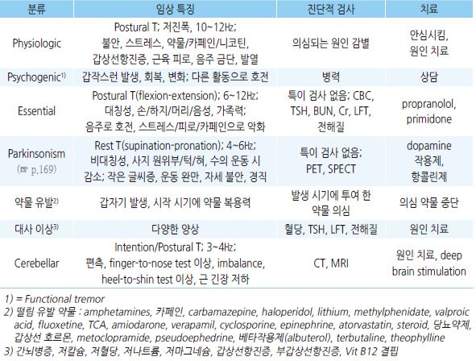
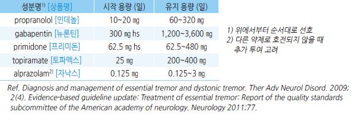
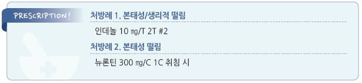

# 떨림 Tremor

## 일반 사항
- 신체 일부분의 리드미컬한 불수의적 진동 움직임

- 진폭은 작고 진동수는 많음

- 손이 가장 흔하고 그 외에도 눈, 얼굴, 머리, 성대, 상체, 다리

    등이 침범될 수 있음

- 보통 간헐적으로 나타나며 악화-완화의 변동이 있음

### 근육 운동과 관련한 분류

#### Action tremor
- 자발적 움직임(근 수축) 시 발생하는 떨림

- postural T : 신체를 중력에 대항하여 유지하고 있을 때(예: 팔을 뻗어 들고 있기) 발생; essential, physiologic,

    cerebellar, dystonic, 약물 유발 떨림 포함

- isometric T : 근육의 단축 없는 수축(예: 힘주어 주먹을 쥠) 시 발생

- kinetic T : 수의 운동 시 발생; classic essential, cerebellar, dystonic, 약물 유발 떨림 포함

- intention T : kinetic T의 아형으로 목표를 향한 움직임 시 심해짐; 소뇌 관련

#### Resting tremor
- 중력에 대해 완전히 지지되고 있는 이완 상태(예: 무릎에 올려 놓은 손)에서의 떨림

- 수의 운동 시 호전

- 관련 질환 : 파킨슨병, midbrain (rubral) tremor, Wilson Dz, severe essential tremor

## 임상 양상 및 진단

### 감별
- 편측 떨림, 다리 떨림, 강직, 서동, resting tremor → 파킨슨병

- 보행 장애 → 파킨슨병, cerebellar tremor

- 불규칙, 경련성 떨림 → dystonic tremor

- 두부 떨림, 두부 위치 이상(head tilting or turning) → dystonic tremor

- 갑작스럽거나 빠른 시작 → functional (psychogenic) tremor, toxic tremor

- 최근 약물 치료 후 떨림 시작 또는 악화 → drug-induced, toxic tremor

    

### 본태떨림 (Essential tremor)

#### 일반 사항
- pathologic tremor 중에서 가장 흔함

- 고령에서 보다 흔함 : 65세- 4.6%, 95세- 22%

- 가족력

- 장기간 이환(＞3년)

#### 원인
- 불명; heterogenous disorder

- thalamo-cortical & cerebello-olivary loop 이상 추정

- 유전적 영향

#### 떨림 양상
- 리드미컬한 떨림, 4~12 ㎐(주로 5~8 ㎐)

- 양측성 비대칭성 postural(주로) or kinetic tremor; resting tremor는 ＜20%에서 발생

- 이환 부위 : 손/아래팔(주로 상지 이환; ~95%), 머리(~34%), 하지(~30%), 목소리(12%)

- cogwheel 현상을 제외한 신경학적 증상 없음

- 스트레스, 피로, 카페인 섭취로 악화

- 소량의 알코올 섭취로 호전

#### 진단
- 특이 진단 방법 없음; 다른 원인 배제

- CBC, TSH, BUN, Cr, LFT, 전해질

### 생리적 떨림 (Physiologic tremor)
- 떨림 형태 : postural 또는 kinetic tremor

- 이환 부위 : 손, 손가락; 보통 양측

- 유발 인자 : 스트레스, 불안, 격렬한 육체 활동, 카페인 섭취, 다른 자극

### 말초신경병증
- 전신 발생 또는 특정 부위에 발생하여 점차 더 넓은 부위로 진행

- 하지 감각 신경 손상 시 다리 떨림, 걷기 및 균형장애, 운동실조증 발생

### 반얼굴연축 (Hemifacial spasm)
- 증상 : 불수의적인 수축이 안면 편측 근육에서 반복적으로 발생

- 편측 눈꺼풀의 경미한 수축으로 시작 → 얼굴 아래쪽으로 확장

- 유발 인자 : 안면 신경 자극(예: 음식을 씹거나 웃는 등 안면 근육을 움직일 때)

- 원인 또는 관련 인자 : 두개 내 혈관 이상, 종양, 다발경화증, 안면 신경 마비의 후유 장애

    

---

## Management

## 본태성 떨림

#### 약제
    

- 떨림이 유발되는 상황에 앞서 propranolol을 1회성으로 투여하는 것이 일부 환자에서 유효

- 환자의 30~50%는 propranolol과 primidone에 반응하지 않음

#### Botulinum toxin A
- 대상 : cervical dystonia, blepharospasm, focal upper extremity dystonia, adductor laryngeal dystonia,

    upper extremity essential tremor

## 생리적 떨림
- 비-약물 치료를 원칙으로 함

- 카페인 섭취, 흡연을 피함

- 일상생활에 지장을 주는 특별한 경우 β-차단제 고려. 단, 사전에 적정 용량에 대한 평가 필요

- propranolol : 10~40 ㎎ 필요시 [인데놀]

  •투여 전 천식, 혈압/맥박 등 평가

## 반얼굴연축
- 항콜린제, 항경련제 (☞ p.371)

- clonazepam : 0.5 ㎎ bid [리보트릴]

- botulinum toxin

> **질병코드**
G25.0 본태성 떨림

R25.1 상세불명의 떨림 

