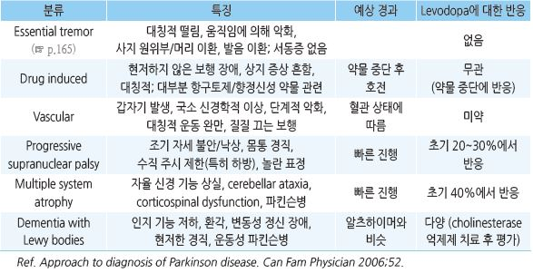
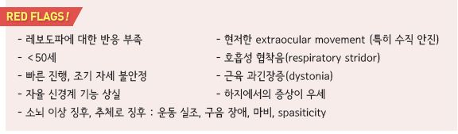
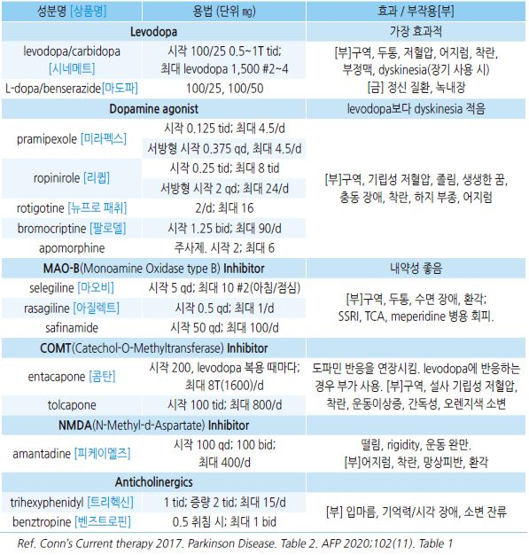
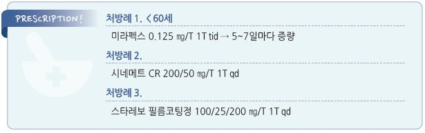

# 파킨슨병 Parkinson’s Disease


## 일반 사항

* ‘resting tremor, rigidity, bradykinesia, postural instability’를 특징으로 하는 진행성 neuro-degenerative disorder
* 보통 45\~65세에 발병; 60세 이상 인구의 1%; 알츠하이머병 다음으로 흔한 신경 변성 질환
* 발병 10년 후 환자의 77%에서 사망, 자세 불안정, 치매 등 나쁜 경과를 보임
* 낙상, 폐렴, 질식 등의 사고에 의한 사망 위험이 증가하므로 운동, 움직임 등 기능 보존이 중요

## 원인

* 불명
*   기전 : basal ganglia(특히 substantia nigra)에서의 dopamin 생성 neurons의 소실, 도파민 뉴런에서 Lewy body 발달

    → 도파민 생성 감소/고갈 → 도파민과 acetylcholine 사이의 불균형

### 위험 인자

* 가족력, 고령
* 반복적 head trauma, 독소(예: 살충제) 노출, 방사선 노출
*   약물 : 위장 운동 촉진제(metoclopramide, levosulpiride), 항정신병제(chlorpromazine, haloperidol, perphenazine,

    fluphenazine, olanzapine, risperidone, lithium, valproic acid), 항우울제(fluoxetine), 심혈관제(amiodarone, diltiazem,

    reserpine, methyldopa)

> ✽니코틴과 카페인이 파킨슨병의 위험을 줄이거나 발생을 지연시킨다는 보고가 있음

## 임상 양상

* 보통 편측 팔(±다리)에서 시작하여 수개월\~ 수년 후 양측에서 발생

#### 운동 증상

1.  resting tremor : 4\~6㎐, 원위부에서 흔함(주로 손(pill-rolling tremor), 드물게 다리/입술/턱/혀 떨림); 움직임/수면 시 호전;

    postural tremor 동반 가능; 환자의 ＞70%에서 발생
2.  rigidity : 수동적 움직임에 대한 저항 증가; cogwheel(catching & releasing) 또는 lead pipe(지속적인 경직), bidirectional;

    웅크린 자세; 통증을 동반할 수 있음; 환자의 ＞90%에서 발생
3. bradykinesia 또는 akinesia : 움직임 속도 감소, 미세 작업 장애; 환자의 80\~100%에서 발생

•[보행 장애](https://www.youtube.com/watch?v=pFLC9C-xH8E) : 느려진 움직임, 좁게 발을 끌며 걸음(종종 걸음), 가속 보행(앞으로 넘어질 듯, 점차 보행 속도가 빨라짐),

```
보행 동결(걸음 시작 또는 돌아설 때 보행을 완전히 멈춤); 근 약화는 보통 없음 ()
```

•운동 증상 : 타이핑/글씨 쓰기 곤란, 얼굴 표정 감소(가면 얼굴), 눈 깜박임 감소, 언어 장애(운동 감소형 구음 장애,

```
발성 부전), 연하 곤란, 과다 침 분비, 침대에서 돌아눕기 힘듦, 의자에서 일어서기 힘듦, 작은 글씨증
```

•달려오는 자동차를 급히 피해야 하는 것 같은 비상 상황에서는 자발 운동 능력이 잠시 회복될 수 있음

4. postural instability : 질환 후기에 발생
5.  시각 : contrast 민감도 저하, hypometric saccade, vestibulo-ocular reflex 장애, upward gaze 및 convergence 장애,

    lid apraxia

#### 비-운동 증상

* 자율 신경 장애 : 기립성 저혈압, 급뇨/빈뇨, 변비, 발기 부전
* 감각 장애 : 후각 상실, 통각/감각 이상(자발적 작열감, 저림, 찌르는 느낌)
* 기분 장애 : 우울, 불안, 무관심/무욕, 의지 상실
* 인지 기능 장애, 치매 : 집중력, 수행 능력, 언어적 기억, 공간시각화 등의 장애, 환각, 망상
* 수면 장애 : 불면, 수면 단절, 악몽, 주간 졸음, REM 수면 행동 장애(수면 중 발음이나 행동)
* 기타 : 피로감, 지루성 피부 질환

## 진단

* 임상적으로 진단

### UK Parkinson’s disease society brain bank diagnostic criteria

#### 파킨슨병 진단

*   bradykinesia 및 다음 중 ≥1개 존재

    ① muscular rigidity

    ② 4\~6 ㎐ resting tremor

    ③ postural instability

#### 파킨슨병 가능성

*   다음 중 ≥3개 존재

    ① 편측 발생으로 시작

    ② 안정 시 떨림이 있음

    ③ 점진적으로 진행되는 장애

    ④ 시작된 쪽에서 비대칭적으로 지속

    ⑤ levodopa에 잘 반응(70\~100%)

    ⑥ 심한 levodopa-induced chorea

    ⑦ levodopa 반응이 ≥5년 유지됨

    ⑧ ≥10년 경과

#### 배제 기준

* 순차적으로 악화되는 파킨슨 양상을 보이는 반복적 뇌경색 병력
* 반복적 두부 외상력, 명확한 뇌염력
* 안구 운동 발작(oculogyric crisis)
* 증상 발병 시기에 neuroleptics 복용
* 이환된 친척 ≥2명
* 지속적인 완화
* 3년 후 절대적인 편측 양상
* supranuclear gaze palsy
* cerebellar signs
* 조기 중증 자율 신경 장애
* 기억력/언어/행동 장애를 동반한 조기 중증 치매
* Babinski’s sign 양성
* 영상 검사로 진단된 뇌종양 또는 뇌수종
* 대용량 levodopa 치료에 반응하지 않음
* MPTP(신경독) 노출

### 검사

* 확진 검사 방법은 없음; 다른 질환 배제를 위해 고려
* SPECT, fMRI, DaTscan

### 감별

```

```

* 우울증 : 무표정, 고저가 없는 발성, 활동 감소; 가족력, 떨림의 특징, 다른 운동 증상으로 감별
*   Wilson Dz : 이른 연령에서 시작, 다른 비정상적 움직임, Kayser-Fleischer rings, 만성 간염, 조직 내 구리 농도 증가

    

***

## Management

## 비-약물 치료

* 규칙적 운동, 재활 운동
* 낙상 예방 : 미끄러짐 방지 장치, 발에 걸릴 위험이 있는 물건을 치움, 조명을 어둡지 않게 함
* 언어/발성 치료
*   식사, 영양 관리, 적당한 칼로리 공급

    •골격과 관련된 영양소(Vit D, Ca)를 포함하여 적절한 영양소 공급

    •변비 예방을 위한 수분 및 식이 섬유 섭취 (☞ p.414, p.1164)

    •소화 장애가 있는 경우 삼키기 쉬운 음식 또는 소화가 잘 되는 음식 선택

    •소량으로 자주 식사

    •과식/큰 음식/고지방 식품 섭취를 피함

## 약물 치료

### 운동 증상 치료

* 도파민 전구체인 levodopa 투여 또는 항콜린제로 acetylcholine 작용 차단
* 증상을 개선시키지만 병의 진행을 막지는 못함
*   투여 중단 시 tapering

    
* 복합제 : levodopa + carbidopa + entacapone \[스타레보]
*   istradefylline : adenosine A2A receptor antagonist; 조절되지 않는 파킨슨 증상에서 levodopa/carbidopa에

    추가 치료제로 고려

#### Levodopa

*   수년간 복용하면 환자의 \~½에서 약효가 저하되므로 levodopa 투여 개시를 늦추기 위하여 다음의 일정으로 투여할 수 있음

    (단, 이러한 기대가 유효한지는 불확실)

    •＜60세 환자 : dopamine 작용제, MAO-B 억제제

    •60\~70세 환자 : levodopa/carbidopa, dopamine 작용제, MAO-B 억제제

    •＞70세 환자 : levodopa/carbidopa
*   carbidopa와 benserazide는 levodopa의 말초 전환을 억제하며 이들 약제 병용으로 levodopa의 투여량과 부작용 발생을

    줄일 수 있음
* 갑작스런 투여 중단은 neuroleptic malignant syndrome을 일으킬 수 있음

#### Dopamine agonists

* 도파민 수용체에 직접 작용
* levodopa 치료 시 발생할 수 있는 response fluctuation와 dyskinesia를 낮춤
* 단독 또는 levodopa와 병용
* 투여 중단 시 금단 증상이 발생할 수 있음

#### Anticholinergics

* tremor 및 rigidity 완화에 도움; 젊은 연령에서 심한 진전 조절을 위해 고려
* 저용량으로 시작하여 점차 증량; 효과적이지 않으면 tapering

### 운동 증상 이외 증상의 치료

* 주간 졸음 : 야간 수면 환경 개선, 적절한 커피 음용; modafinil, methylphenidate (☞ p.138)
* 우울 : 보통 SSRI 선택 (TCA보다 부작용이 적음) (☞ p.124)
*   침 흘림

    •침샘에 botulinum toxin 주사

    •경구 glycopyrrolate

    •설하 atropine, ipratropium
* 콧물 : 비내 ipratropium
* 변비 : 충분한 수분/식이 섬유 섭취, 활동; polyethylene glycol, lubiprostone, probiotics (☞ p.412)
* 치매 : 알츠하이머병 치료제 적용; rivastigmine, donepezil, galantamine, memantine
*   psychosis(망상, 환각) : 항도파민제가 원인으로 의심되는 경우 감량 또는 교체 고려; quetiapine, clozapine, pimavanserin

    

> **질병코드** G20 파킨슨병


