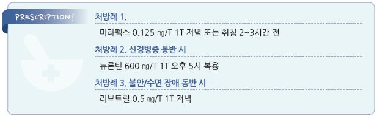

# 하지불안증후군 Restless Legs Syndrome

## 일반 사항
- sensorimotor disorder로서 비활동 중(예: 휴식 또는 움직이지 않을 때)에 갑자기 발생하는, 불수의적(제어할 수 없는) 하지

    움직임; 활동 또는 움직이면 호전

- 다른 이름 : Willis-Ekbom Dz

- 만성적이고 점차 악화되며 다리에서 시작하지만 팔이나 다른 신체 부위에서도 발생할 수 있음

- 원발성 : 보통 ＜45세에 발생, 서서히 진행, 지속; 증상 완화가 치료 목표

- 속발성 : 보다 빠르게 진행; 원인 제거 시 호전

## 원인
- 원발성 (early-onset) : 뇌의 도파민 작용 저하 추정

- 속발성 (late-onset) : 철분 결핍(뇌 철분 결핍), 신부전, 말초신경병증, 스트레스, 임신, 호르몬 변화, 약물(예: 알코올,

    카페인, 항우울제, 항정신병제, 1세대 항히스타민제, 도파민 차단제(metoclopramide), cholinesterase 억제제(donepezil))

### 위험 인자
- 속발성 RLS 인자

- 가족력 : 50%에서 가족력이 있음

- 수면 부족 : 불면증, 폐쇄수면무호흡증

- 고령 : 70세까지 증가

## 임상 양상
- 불쾌한 이상 감각 : 움직이고 싶은 충동, 벌레가 기어 다니는 느낌, 불안정감, 가려움, 통증 피부보다 깊은 부위에서의 느낌

- 활동으로 호전, 비활동으로 재발

- 발생 빈도 : 다양(매일~ ＜1회/월)

- 움직임 빈도 : 10~90초(평균 25초)

- 발생 시기 : 저녁~밤(주로 잠들기 전 발생); 낮에도 발생할 수 있음

- 중증도 : 다양(무시할 만함~생활에 지장을 줌)

- 동반 증상 : 수면 장애, 피로, 불안

## 진단
- anemia study : ferritin, TIBC, Fe, reticulocyte (☞ p.1026)

- 도파민 약물 치료에 대한 반응 평가

- 필요시 수면 검사

### 진단 기준

#### Essential diagnostic criteria
- 다음 사항에 모두 해당

  ① 하지의 불편하고 불쾌한 느낌을 동반하는 하지의 움직임 충동 (간혹 팔 등 다른 부위 이환)

  ② 하지의 움직임 충동 및 동반되는 불쾌감은 휴식 중 시작 또는 악화

  ③ 하지의 움직임 충동 및 동반되는 불쾌감은 움직임(예: 보행, 스트레칭)에 의해 완전히 또는 부분적(최소한 활동할 수

    있는 수준)으로 완화

  ④ 하지의 움직임 충동 및 동반되는 불쾌감은 저녁이나 야간에 발생 또는 악화

  ⑤ 상기 사항들은 다른 의학적 문제(예: myalgia, venous stasis, leg edema, arthritis, leg cramps, positional discomfort,

    habitual foot tapping)의 1차적 증상으로 설명되지 않음

#### Specifiers for clinical course
A. Chronic-persistent RLS : 치료하지 않았을 때 지난 1년간 ≥2회/주 발생

B. Intermittent RLS : 치료하지 않았을 때 지난 1년간 ＜2회/주, 평생 총 ≥5회 발생

#### Specifier for clinical significance
- RLS의 증상이 수면, 활력, 일상 활동, 행동, 인지, 또는 감정에 영향을 끼쳐 사회적, 직업적, 교육적, 또는 기타 중요한

    영역에서 중대한 고통이나 장애를 초래하는 상태

### 감별
- Sleep start : 수면에 들어갈 때 발생하는 통증 없는 움직임

- Habitual foot tapping : 주로 지루하거나 불안할 때 발생(정신적 불안정과 관련 추정); 불편함이나 움직임의 충동 없음,

    일주기 패턴 없음, 수면 장애 없음

- Rhythmic movement sleep disorder : RLS보다 빠른 움직임

- Periodic limb movement disorder : ＞15회/시간, 유의미한 수면 장애, 주간 졸음이나 피로가 발생할 수 있음, 깨어 있는

    동안 움직임 충동 또는 이상 감각 없음, 도파민 치료에 반응 함

- Akathisia : restlessness, 가만히 앉아 있을 수 없는 느낌; 다리에 국한되지 않음(“body rocking”), 국소 이상 감각 없음,

    일주기 패턴 없음, 활동으로 호전 안 됨

- Peripheral neuropathy : 마비, 통증; RLS보다 표면적 느낌, 운동 불안증이나 움직임 충동 없음, 움직임으로 호전 안 됨,

    야간 악화 없음, 일주기 패턴 없음, 도파민 치료에 반응 안 함

- Nocturnal(sleep-related) leg cramp : 매우 심한 국소 근육 수축, 주로 편측 종아리 이환, 갑작스런 시작 및 호전(짧은 지속

    시간), 움직임 충동 없음, 스트레칭이나 보행으로 호전

- Arthritis, lower limb pain : 일주기 패턴 없이 움직일 때 관절 부위의 통증 또는 불편감, 도파민 치료에 반응 안 함

- Positional discomfort : 같은 자세로 오래 앉아 있거나 누워 있을 때 발생, 자세 변경으로 호전, 일주기 패턴 없음

- Fibromyalgia : 대부분 전신 증상, 종종 수면 장애, 일주기 변동 없음, 움직임으로 호전 안 됨 (☞ p.834)

- Varicose veins : 종종 마사지 또는 휴식으로 호전되는 하지 불편감 또는 통증

- Vascular claudication : 보행으로 악화되고 휴식에 의해 호전되는 다리 통증; 움직임 충동 없음, 일주기 패턴 없음,

    수면 장애 없음

- Growing pain : 양측 앞대퇴/정강이/종아리 통증, 깊은 근육 통증/경련; 소아기에 운동 또는 신체 활동을 한 날(특히 심하게

    활동한 날) 발생, 마사지로 호전

---

## Management

### 치료 방침
- 치료 목표 : 증상 완화, 주간 기능 회복, 수면 개선, 삶의 질 향상

- 2차성으로 발생한 경우 원인 교정

- 증상을 악화시키는 약물을 피함

- 약물 치료 : 중등도 이상에서 고려, 장기 복용에 대한 부작용 주의

## 비-약물 치료 및 예방
- 주간의 활발한 활동, 규칙적 운동(지나친 운동은 피함), 저녁 때 가벼운 걷기

- 적절한 수면, 규칙적 수면

- 다리 마사지

- 따듯한 목욕, 온찜질, 다리 보온(긴 양말, 전기 담요)

- 저녁 때 알코올, 카페인, 니코틴 회피

- 활발한 두뇌 활동(게임, 퍼즐)

## 약물 치료

#### 도파민 작용제
- 1차 선택제

- 용법 : 저녁(증상 발생 1시간 전) 복용 또는 저녁 & 취침 시 분할 복용

- 금기 : 정신 질환이 있는 경우, 도파민 대항제 투여 중

- pramipexole : 0.125 ㎎ qd → 4~7일마다 0.125 ㎎/d 증량. 최대 0.5 ㎎ qd [미라펙스]

- ropinirole : 0.25 ㎎ qd → 3일 째 0.5 ㎎ qd → 1주마다 0.5 ㎎/d 증량. 최대 4 ㎎ qd [리큅]

- rotigotine : 장기 사용에서 가장 효과적; 1 ㎎ qd → 1주마다 1 ㎎/d 증량. 최대 4 ㎎ qd [뉴프로 패취]

- 호전 후 3일 간격으로 감량하여 최소 유효 용량으로 유지

#### 항경련제
- 신경병증 동반 시 선택

- gabapentin : 1차 선택제로도 사용; 600 ㎎/d 오후 투여, 100~2,400 ㎎/d [뉴론틴]

- pregabalin : 50~450 ㎎/d [리리카]

- carbamazepine : 200~800 ㎎/d [테그레톨]

#### 항파킨슨제
- 간헐적 증상에 대하여 필요시 선택

- carbidopa/levodopa : 10/100 ~25/250 ㎎ [시네메트]

#### Opioid
- 취침 시 투여

- hydrocodone : 5~20 ㎎/d [하이코돈]

- tramadol : 50 ㎎/d [트라마돌]

- oxycodone : 2.5~20 ㎎/d [아이알코돈]

#### 진정제
- 불면/불안 증상에 대하여 선택

- benzodiazepines •clonazepam : 0.5~3 ㎎/d [리보트릴]

- zolpidem : 5 ㎎ [스틸녹스]

#### Ergotamine dopamine 작용제
- pergolide : 0.05 ㎎

- cabergoline : 부작용 문제로 권고 안 함

#### 기타
- 철분제 : 철분 부족 시 선택 (☞ p.1027)

- Vit/미네랄 보충 : Ca, Mg, Vit B12, folate

- clonidine : 0.05~0.1 ㎎/d [켑베이]

- baclofen : 20~80 ㎎/d [바크론]

> **질병코드**
G25.8 기타 명시된 추체외로 및 운동 장애

