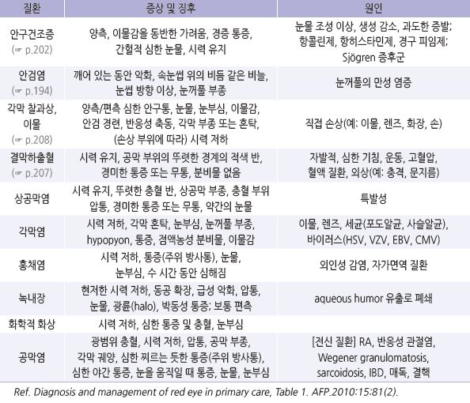
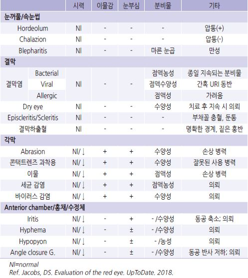
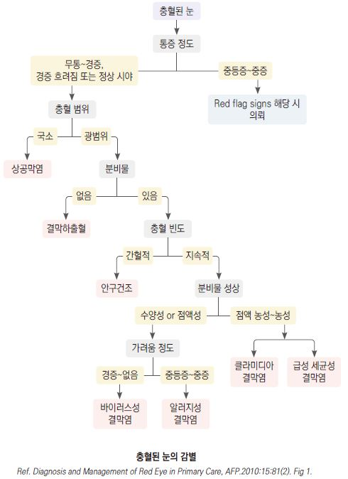
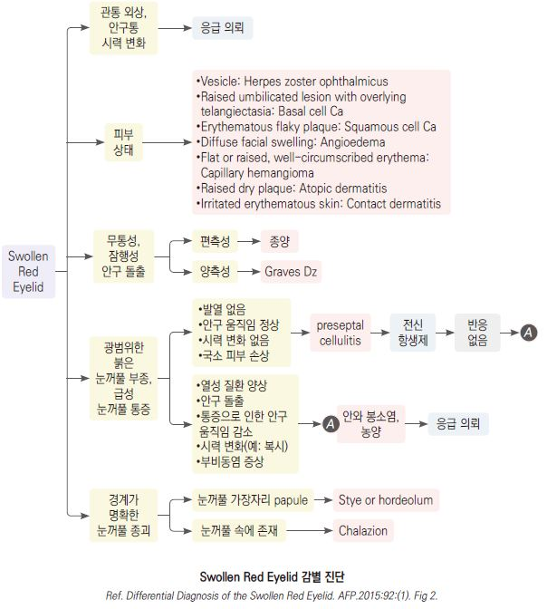

# 눈 충혈 Red Eye

## 원인
- 흔한 원인 : 결막염, 각막 찰과상, 안검염, 안구 건조,

    결막하출혈, 이물

- 덜 흔한 원인 : 다래끼, 군날개, 상공막염, 　검열반

- 심각한 원인 : (일부) 각막염, 포도막염, 홍채염, 공막염, 녹내장

## 눈의 질환별 특징
    

눈 충혈 감별 진단

    

### 콘택트렌즈
- 각막 감염의 위험이 있음

  •소프트 렌즈를 하루 넘게 사용 시 1일 착용에 비해 최소한 5배 이상 감염 위험 증가

  •미용 렌즈는 미생물 오염 발생률이 높음

- 예방 : 밤샘 사용을 피함, 렌즈 교체일 이상 사용을 피함, 세심한 렌즈 위생 관리, 눈이 불편해 지거나 충혈 되면 제거

    

    

## 증상/병력에 따른 눈 문제의 감별
    
