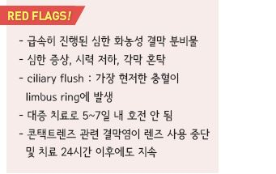
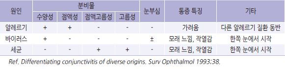
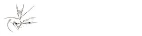
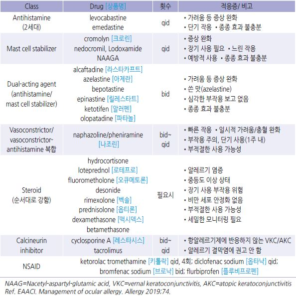
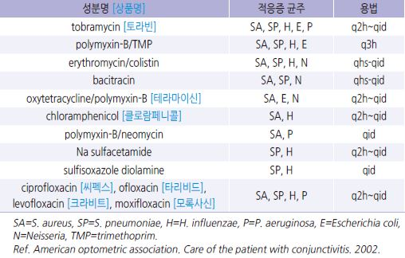
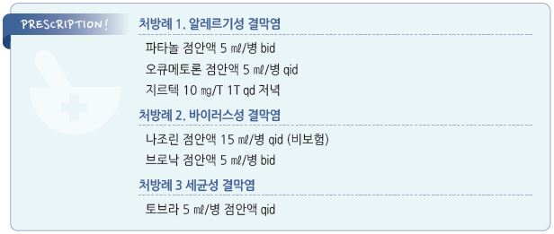

# 결막염 Conjunctivitis

## 일반 사항
- 안구의 흰자위와 눈꺼풀 내측 표면을 덮고 있는 점막인 결막의 염증

- 분류

  •감염성 : 바이러스(가장 흔함), 세균

  •비감염성 : 알레르기, 비-알레르기(예: 건조, 바람, 연기, 외상)

- 증상 : 충혈, 분비물, 가려움, 자극감, 이물감

- 비감염성 결막염은 보통 양측에 발생

- 감염성 결막염의 전염 경로 : 환자의 분비물에 오염된 손이나

    물체의 눈 접촉

## 알레르기 결막염 (Allergic Conjunctivitis)
- 기전 : 공기 중의 알레르겐 접촉 → type 1 과민 반응(IgE 매개) → local mast cell degranulation

### 분류

#### 급성 알레르기 결막염
- 극적인 경과를 보임; 알레르겐 노출 후 빠르게(수 시간 내) 발생, 노출 중단 24시간 내 호전

- 심한 증상

#### 계절적(seasonal) 알레르기 결막염
- 급성 알레르기 결막염에 비하여 덜 극적인 경과를 보임; 발생부터 호전까지 수일~수 주 경과

- 실외 인자와 관련 : 꽃가루, 곰팡이 포자

#### 지속성(perennial) 알레르기 결막염
- 간헐적으로 발생한 경우보다 증상이 덜하며 만성 경과를 보임; 보통 악화-완화 반복

- 실내 인자와 관련 : 집먼지진드기, 실내 곰팡이, 애완동물 비듬

### 임상 양상
- 보통 처음부터 양측 발생 (✽한쪽에서만 발생했더라도 알레르기 결막염을 배제할 수 없음)

- 결막 충혈 및 부종, 눈꺼풀 부종, 눈꺼풀 결막의 소포성 변화(바이러스 결막염보다 적음, 만성 경과에서는 보다 흔함)

- 심한 가려움, 작열감; 간혹 눈부심, 시각 장애

- 수양성/점액성 분비물, 눈물 증가

- 지속성 알레르겐과 계절적 알레르겐이 중복되면 증상이 보다 심하게 발생

- 흔히 다른 알레르기 증상이 있음(예: 알레르기비염, 아토피)

- Vernal keratoconjunctivitis : 연장아, 젊은 성인에서 봄에 호발; large cobblestone papillae가 위 눈꺼풀에 발생

- Atopic keratoconjunctivitis : 성인에서 만성 경과; 위/아래 눈꺼풀의 papillary 변화

>   ✽가려움이 없거나 안구통이 있으면 다른 질환 의심

## 바이러스 결막염 (Viral Conjunctivitis)
- 원인균 : adenovirus(가장 흔함), coxsackievirus, enterovirus, herpes virus

- 경과 : 한쪽에서 시작 48시간 내 반대쪽 전이 → 3~5일간 악화 → 1~2주간 호전; 총 2~3주 내 자연 회복

- 전염 기간 : (증상 발생 후부터) 급성 출혈성 결막염- 4일간, 아데노바이러스- 14일간

### 임상 양상
- 수양성 분비물

  •점액성 분비물이 나타나거나 아침에 화농 양상의 분비물을 호소할 수도 있음

- 모래 느낌, 눈부심, 눈물 증가

- 결막 충혈 및 부종, 눈꺼풀 결막의 소포성(follicle) 변화

- 눈 이외 증상 : 귓바퀴 앞 림프절 압통, 발열, 인두염

### 질환별 특징

#### 급성 출혈 결막염 (Acute hemorrhagic conjunctivitis)
- 원인균 : enterovirus 70, coxsackievirus 24

- 증상 : 출혈성 분비물, 부종, 통증

#### 인두결막열 (Pharyngoconjunctival fever)
- 원인균 : adenovirus가 눈과 인두에 이환

- 증상 : 인두염, 양측 결막염(눈꺼풀 결막의 충혈 및 follicular reaction), 고열, 귓바퀴 앞 림프절병증

#### 유행성 각결막염 (Epidemic keratoconjunctivitis)
- 원인균 : adenovirus type 8, 19, 37

- 증상 : 심한 이물감, 가려움, 작열감, 눈부심, 안구 결막 부종(chemosis), 결막 소포 비대, 결막 위막, 시야 혼탁(각막 이환 시)

#### 단순포진 결막염
- 원인균 : herpes simplex (☞ p.958)

- 증상 : 작열감, 편측 이환, 피부 수포 동반; 가려움은 적음

## 세균 결막염 (Bacterial Conjunctivitis)
- 원인균 : S. aureus (가장 흔함), S. pneumoniae , H. influenzae , M. catarrhalis

  •렌즈 착용과 관련하여 발생한 경우에는 세균 감염의 가능성이 많음

- 경과 : 한쪽에서 시작 → 1~2일 내 반대쪽 전이 → 보통 1~2주 내 자연 회복

- 전염 기간 : 증상 발생 후 7일간

- 균 동정 검사 대상 : 신생아, 면역저하자, N. gonorrhoeae 또는 C. trachomatis 의심

### 임상 양상
- 지속적인 점액농성 삼출물; 닦아낸 후 10분 내에 다시 나타남

- 결막 충혈 및 부종, 눈꺼풀 결막의 papillary change

- 가려움 및 국소 림프절 비대는 적음

#### Gonococcal conjunctivitis
- 경과 : 갑자기 발생, 빠른 진행

- 증상 : 매우 많은 화농성 분비물, 결막 부종

- 관련 인자 : 성 접촉

#### Chlamydia conjunctivitis
- 증상 : 보통 편측 발생, 귓바퀴 앞 림프절 압통

- 관련 인자 : 직간접 생식기 접촉

## 기타

### 콘택트렌즈 관련 결막염
    (☞ p.181)

- 증상 : 편측 또는 양측 충혈, 경미한 가려움, 점액성 분비물, 결막 비후

- 치료 : 최근에 사용한 렌즈 및 케이스 폐기 또는 철저 소독

  •알레르기 또는 감염 의심 양상 시 이에 대하여 치료

  •항생제 투여 시 흔한 원인균인 P. aeruginosa 에 대하여 quinolone 제제 선택

### 기계적 결막염
- 증상 : 국소 또는 광범위 결막 충혈, 이물감, 눈물

- 치료 : 이물 제거, 윤활제(점안 연고제), 감염 치료

### 외상성 결막염
- 증상 : 결막 충혈, 눈물, 이물감

- 치료 : 원인에 따른 치료. 세척, 항생제 연고

### 독성 결막염 (Toxic conjunctivitis)
- 원인 : 안약제(인공 눈물, 콘택트렌즈 액 포함)의 1일 다회, 장기 사용에 의한 자극 반응; 흔히 안약에 포함되어 있는

    방부제와 관련

- 증상 : 가려움, 결막 충혈, chemosis, 점액성 분비물, 눈꺼풀 결막의 follicular/papillary 변화

- 치료 : 원인에 따른 치료. 윤활제

## 진단
- 진단을 위한 검사는 보통 필요 없음

- 다른 질환 배제를 위하여 고려 (☞ p.180)

### 감별
- 분비물 등의 임상 양상으로 감별을 시도하지만 종종 명확하지 않음

    

---

## Management

### 치료 방침
- 콘택트렌즈 사용 중단 : 충혈이 없고 분비물이 24시간 이상 나타나지 않을 때까지 중단

- 접촉 제한 : 감염 의심 시 환자는 14일 동안 수건 등을 혼자 사용함

  •사회 격리(출근/등교 제한) : 눈 충혈 및 눈물 증상이 사라질 때까지

- 알레르기성인 경우 알레르겐 회피

- 감염성인 경우 최근에 사용한 렌즈 폐기 또는 철저 소독, 눈 화장품(특히 마스카라) 폐기

- 항생제 안약 : 제한적 사용; 세균성 결막염에 대하여 고려할 수 있으나 세균성 결막염도 대부분 자연 치유되므로 항생제

    안약 사용이 필요한 경우는 많지 않음

### 안약 사용법
- 개봉하여 사용한 다회 사용 점안액 사용 기한 : 개봉 후 4주(1달)

- 다음의 경우 무방부제 약제 선택 : 1일 5회(미국안과학회)~7회(NHS) 이상 지속 사용, 콘택트렌즈 착용

- 투여량 : 아래 눈꺼풀 안쪽에 액체의 경우 1~2방울 점적, 연고의 경우 0.5 인치 투여

- 다른 성분의 여러 안약제를 투여하는 경우 3~5분 간격으로 투여

#### 점안액 점안 방법
    ① 약병을 확인한다.

    ② 손을 씻는다.

    ③ 병을 열기 전에 몇 번 흔든다.

    ④ 고개를 뒤로 젖힌 후 한 손가락으로 아래 눈꺼풀을 아래로 당긴다.

    ⑤ 약병 끝이 눈에 닿지 않는 높이에서 안구와 눈꺼풀 사이에 떨어뜨린다.

    ⑥ 점안 후 수 초 동안 눈을 살짝 감고 있는다. (✽반복적인 깜박임은 피함)

    ⑦ (약이 좀 더 머물 수 있도록) 눈의 코 쪽 끝을 손가락으로 수 분 동안 눌러 준다.

    ⑧ 손을 씻는다.

### 안약제 종류
    

## 알레르기 결막염
- 문지르지 않는 것이 중요

- 냉찜질 : 가려움 및 부종 감소 효과

- 인공 눈물 : 증상 완화, 알레르겐 제거 효과 (☞ p.203)

- 알레르겐 회피 (☞ p.242, 343)

#### 국소 항히스타민제
- 1차 선택제; 가려움 등의 증상 완화 효과

- 국소 혈관 수축제(충혈 제거제) 또는 비만 세포 안정제 병용 시 보다 효과적

#### 경구 항히스타민제
- 국소 항히스타민제보다 늦게 반응, 효과 적음, 안구 건조를 유발할 수 있음 (☞ p.1144)

- cetirizine : 10 ㎎ qd [지르텍]

- fexofenadine : 120 ㎎ qd [알레그라]

- loratadine : 10 ㎎ qd [클라리틴]

- mequitazine : 5 ㎎ bid [프리마란]

#### 국소 비만 세포 안정제
- 충분한 효과 발현까지 1~2주 소요

- 적용 : 만성 지속성 또는 재발성인 경우 지속 사용을 고려(예방 효과 기대)

#### 국소 충혈 제거제
- 적용 : 발적, 충혈, 부종

- 알레르기 반응을 감소시키지는 못함

- 주의 : 단기 사용(5~7d), 투여 중 렌즈 사용 중지

- 부작용 : 작열감, 속성 내성(tachyphylaxis), 반동성 충혈, 약물 결막염(conjunctivitis medicamentosa)

#### 국소 NSAID
- 적용 : 가려움, 불편감

- 국소 항히스타민제보다 효과 적음

#### 국소 Steroid
- 적용 : 호전되지 않는 결막염에 대하여 단기간(＜2주) 사용 (알레르기 결막염에 드물게 필요)

- 사용 2일 내 호전되지 않는 경우 재평가

- 부작용 : 장기 사용 시 안압 상승, 바이러스 감염, 백내장

- 주의 : herpes simplex, fungal, keratitis 등에서 사용하는 경우 각막 손상이 발생할 수 있음

- loteprednol [로테프로], rimexolone [벡솔], fluorometholone [오큐메토론]이 상대적으로 부작용이 적음

#### 국소 비내 Steroid
- 적용 : 알레르기비염/결막염과 관련된 안구 증상 치료에 효과 (☞ p.243)

- 비염 증상 없이 안구 증상만 있는 경우에는 사용하지 않음

#### 국소 면역 조절제
- 적용 : vernal or atopic keratoconjunctivitis의 steroid 의존 환자에서 steroid 대체 고려

- 이 약제의 사용을 고려할 정도의 심한 환자는 의뢰를 고려

- 종류 : 국소 cyclosporine [레스타시스], 국소 tacrolimus(CsA에 난치성인 경우) (보험기준 ☞ p.204)

#### 알레르겐 면역 치료
- allergen immunotherapy : grass pollen, house dust mite에 기인한 알레르기 결막염에 효과

  •first-line 치료 실패 또는 눈 알레르기 질환의 자연 경과를 변화시키고자 할 때 고려

  •IgE-mediated hypersensitivity가 입증될 때만 고려

- subcutaneous immunotherapy : 알레르기 결막염의 증상 완화에 효과

    

## 바이러스 결막염
- 특별한 치료법은 없음

- 눈꺼풀 세척 : (유아용 비누/샴푸 또는 눈꺼풀 세정제로) 1일 4회 세척

- 냉찜질, 인공 눈물 : 증상 완화에 도움 (☞ p.203)

- 국소 steroid : 증상 완화에 일부 유효하나 바이러스 배출을 연장시킬 가능성이 있음

- 국소 항히스타민제/수축제 : 증상 완화 효과

- 경구 항히스타민제 : 코 증상 및 가려움을 줄일 수 있으나 안구 건조를 유발할 수 있음

#### 항바이러스제
- adenovirus 등 일반적으로는 효과 없음

- herpes 감염에 적용(헤르페스 의심 시 의뢰)

- 국소 : ganciclovir [버간], trifluridine [오큐플리딘]

- 경구 : acyclovir, valacyclovir (☞ p.962)

## 세균 결막염
- 눈 세척(1일 4회)

- 냉찜질

- 인공 눈물

#### 국소 항생제
- 경증의 경우 항생제 치료는 필요 없음; 대부분 항생제가 경과에 유의미한 영향을 주지 못함

- 용법 : 연고 bid, 물약 qid ×5~7d; 수일 후 증상이 호전되면 bid로 줄일 수 있음

- 보통 경험적 선택

- 치료 시작 2일째에도 반응하지 않으면 의뢰 고려

- quinolone제는 1차로 선택하지 않으며 수술 후, 콘택트렌즈 관련 결막염, 다른 항생제에 내성이 있는 경우에 고려

    

#### 국소 항생제 대용
- povidone-iodine : 항생제 대체 또는 보조 [티어드롭]

#### 국소 항생제/Steroid 복합제
- steroid : 증상 완화 효과; 부작용 주의

- tobramycin + dexamethasone [토브라덱스]

- polymyxin-B/neomycin + dexamethasone [포러스]

- chloramphenicol + dexamethasone

#### 경구 항생제
Chlamydial conjunctivitis

- doxycycline : 100 ㎎ bid ×14d [독시사이클린]

- erythromycin : 250 ㎎ qid ×14d

** Gonococcal conjunctivitis**

- ceftriaxone : 1 g IM [트리악손]

> **질병코드**
A74.0 클라미디아결막염

B00.52 헤르페스결막염

B30 바이러스결막염

H10 결막염

H10.1 급성 아토피결막염

H11 결막의 기타 장애

H13.1 달리 분류된 감염성 및 기생충성 질환에서의 결막염

H16 각막염

