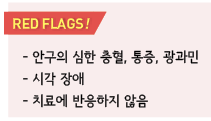
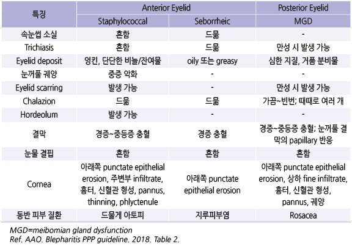
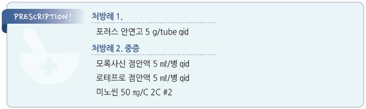

# 안검염 Blepharitis


## 일반 사항

* 감염 또는 비감염 원인의 눈꺼풀 가장자리의 만성 염증; eyelid infection or inflammation
* 보통 양측 발생, 난치성
* 전-안검염 : 눈꺼풀 피부, 속눈썹 base 및 모낭 이환; 종종 포도알균, 지루피부염(비듬) 관련
* 후-안검염 : meibomian gland 이환; 전-안검염보다 흔함

## 원인

### 기전

* 정확한 기전은 불명; 복합적 요인
* dry eye, meibomian gland 이상
* 감염 : 눈 표면의 만성 low grade 감염

•＜40세에서는 포도알균, 50대에는 비-포도알균 우세

•세균 : impetigo(S. aureus), erysipelas(S. pyogenes), angular blepharitis(Moraxella)

•바이러스 : 단순포진, 대상포진, 물사마귀, 인유두종

•기생충 : 사면발니, Demodex folliculorum

*   다른 피부 질환 : 아토피, 접촉피부염, 지루피부염, 건선, acne rosacea, ichthyosis, exfoliative dermatitis,

    actinic keratosis, hemangioma; 기저세포암, 편평세포암, 피지성 암종, 흑색종
* 기타 피부 염증
* 콘택트렌즈, 눈 화장, 외상/독성, 약물(isotretinoin, 항히스타민제, 항콜린제), 흡연

## 종류

#### 지루눈꺼풀염 (Seborrheic blepharitis)

* meibomian gland에서의 증가되고 비정상적인 분비에 2차적으로 발생한 앞쪽 눈꺼풀 염증
* 증상 : 눈꺼풀 홍반, 딱지, 기름진 모습

#### Contact dermatitis/blepharitis, Eczematoid blepharitis

* 원인 : 안약, 화장품 등에 대한 과민 반응 및 2차적 포도알균 감염

#### 포도알균성 눈꺼풀염 (Staphylococcal blepharitis)

* 눈꺼풀 가장자리의 감염
*   증상 : 아침에 심한 속눈썹 주위 딱지, 홍반, 궤양

    •심한 경우 각막염, 눈꺼풀 궤양, 속눈썹 탈락 발생

#### Meibomian gland dysfunction (MGD)

* meibomian gland의 만성적인 폐쇄와 염증
* 관련 인자 : acne rosacea, acne vulgaris, 경구 retinoid 복용

#### Parasitic blepharitis

* 원인 : Demodex folliculorum 감염
* 속눈썹을 따라 이환
* chronic blepharitis의 30%에서 발견됨

## 임상 양상

* 안구 충혈, 작열감, 이물감, 눈부심, 눈물 과다(또는 안구 건조감), 시야 흐림(눈을 깜빡이면 잠시 호전)
* 눈꺼풀 발적, 부기, 가려움, 속눈썹 base 잔여물(fibrin exudate)
* 시간이 지남에 따라 눈썹 탈락(madarosis), 첩모 난생(trichiasis), meibomian gland 범람 또는 농축



## 진단

* 병력, 증상/징후, 증상 기간, 동반 전신 질환,
* 다음 상황에서 증상 악화: 흡연, 바람, 콘택트렌즈, 건조, 음주, 눈 화장

### 검사

* 일률적인 검사는 필요 없음
* slit lamp : 전/후 안검염 구별을 위한 자세한 관찰에 도움
* 눈꺼풀 scraping에서 다형핵 백혈구, gram(+) cocci
* 눈꺼풀 배양 검사

### 감별 진단

* 결막염 : (눈꺼풀보다) 안구의 발적, 분비물 (☞ p.185)
* Hordeolum : 눈꺼풀에 압통이 있는 종창 (☞ p.198)
* Chalazion : 눈꺼풀에 압통이 없는 종창 (☞ p.200)

***

## Management

### 치료 방침

* 눈꺼풀 위생 관리
* 중증 또는 2주간의 비-약물 치료로 해결되지 않는 증상에 대하여 약물 치료

## 비-약물 치료

* 온찜질(따듯한 물수건) : 1일 2~~4회, 매회 5~~10분 적용
* 눈꺼풀 마사지 : 온찜질 후 손끝으로 눈꺼풀 가장자리를 부드럽게 마사지
* 눈꺼풀 세척 : (유아용 비누/샴푸, 0.01% hypochlorous acid) 1일 2회 눈꺼풀 세척
* 금연, 눈 화장 회피, 콘택트렌즈 회피(증상과 관련이 없으면 사용할 수도 있음)

## 약물 치료

### 항생제

#### 국소제

```
(☞ p.192)
```

* 1차 선택 : erythromycin, bacitracin, azithromycin; 취침 시 도포(초기에는 중증도에 따라 자주(\~4회/일) 도포 후 줄일 수 있음)
* 대체제 : fluoroquinolones; gatifloxacin 0.3% \[가티플로], levofloxacin 0.5% \[크라비트], moxifloxacin 0.5% \[모록사신]
* 복합제 : polymyxin-B/neomycin + dexamethasone \[포러스]
* 투여 기간 : 보통 1~~2주; 필요시 염증 소견 소실까지 4~~8주 적용

#### 경구제

* 대상 : 국소제에 반응하지 않는 경우, 특히 meibomian gland 이환
* 1차 선택 : doxycycline \[독시사이클린], minocycline 100 ㎎/d \[미노씬]; 호전 후 50% 감량하여 2\~6주간 투여
*   대체제 : azithromycin 500 ㎎ qd ×3d \[지스로맥스] (✽1주 간격으로 3일씩 3차례 투여하는 것이 보다 효과적이라는 보고가

    있음)

### 국소 항염증제

* 대상 : 다른 치료로 호전되지 않는 중증, 재발성
* steroid : loteprednol \[로테프로], fluorometholone \[오큐메토론], rimexolone \[벡솔]; 2\~3주 이내로 사용 기간 제한 (☞ p.189)
* calcineurin inhibitor : cyclosporine \[레스타시스] (보험기준 ☞ p.204)
* 항생제 복합제 : sulfacetamide sodium + prednisolone acetate

### 인공 눈물

* 대상 : 안구 건조 동반 시

### Demodex 구제

* ivermectin : 200 ㎍/㎏ PO, 1주 후 반복
* tea tree oil : 주 1회 ×6주 병소에 문지름 (효과 입증은 불충분)
* 유아용 샴푸로 매일 눈꺼풀 가장자리 세척

### 영양

* 오메가-3 : 2 g tid \[오마코] (효과 입증은 불충분)

> **질병코드** H01.0 안검염


