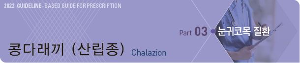
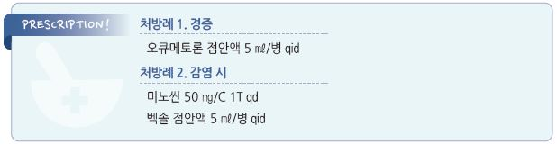

# 콩다래끼 (산립종) Chalazion

## 일반 사항

* 눈꺼풀의 피지선에서의 비감염성 염증에 의한 만성 무통성 육아종(lipogranuloma)
*   기전 : meibomian 또는 Zeis gland의 지방 분해 산물 등에 의한 폐쇄 → lipid 축적 →

    지질 분해 부산물 등에 의해 염증 유발(눈꺼풀 부종 및 홍반) → 섬유화; 수 주\~수개월에 걸쳐 성장

•감염 또한 chalazion으로 이어지는 폐색을 유발할 수 있음

* 호발 연령 : 30\~50세
*   경과 : 작은 병변은 자연 흡수되지만 지속되면 감염되고 통증이 발생할 수 있음; 불결한 위생과 관련하여 재발하거나

    만성 경과를 보일 수 있음; 다래끼보다 더 오래 지속
* 크거나 지속(＞1개월) 또는 재발하는 경우 의뢰

## 원인 또는 위험 인자

* chalazion 과거력
* 불결한 눈꺼풀 위생, 최근 결막염 병력, 만성 안검염, hordeolum
* 지루피부염, acne rosacea
* leishmaniasis, 결핵, 바이러스 감염, trachoma, 면역 저하, 악성 종양
* 고지혈증, Vit A 결핍, 스트레스
* 눈꺼풀 외상
* 장기간의 마스크 사용

## 임상 양상

* 눈꺼풀의 통증/압통 없는 국소 결절(다래끼보다 크고 단단); sterile, painless, red, firm, rubbery nodule
* 인접한 결막과 피부의 부종 및 발적

※ 치료하지 않으면 감염되고 통증이 발생할 수 있음

## 진단

* 임상적으로 진단함; 실험실/영상 검사 등은 시행하지 않음
* 지속 또는 재발하는 경우 악성 여부 감별을 위하여 생검
* 실험실 검사는 필요하지 않음

### 감별

* Hordeolum : 눈꺼풀 가장자리 oil gland의 통증이 있는 감염; hordeolum은 감염이 치유되고 chalazion으로 변형될 수 있음

***

## Management

## 대증 치료 및 예방

* 온찜질 : ductal blockage 용해 및 sebum 배출에 도움; 15분씩 1일 4회
* 눈꺼풀 세척 : 매일 유아용 비누/샴푸 또는 눈꺼풀 세정제로 눈꺼풀 가장자리 세척
* 눈꺼풀 마사지 (not sqezzing)

> ✽아마씨유 섭취 또는 국소 1% azithromycin 점안액 사용으로 재발이 감소했다는 보고가 있음

## 약물/수술 치료

### 항생제

* 육아종성 염증이므로 보통 항생제 치료는 필요 없음
* 감염, 재발성 또는 눈꺼풀염을 유발하는 경우 항생제 치료를 고려
* doxycycline : 100 ㎎ bid ×10d \[독시사이클린]
* minocycline : 50 ㎎ qd ×10d \[미노씬]
* 재발 예방을 위하여 저용량(예: doxycycline 20 ㎎ qd)으로 지속 투여할 수 있음

### 국소 Steroid

* mild steroid drops 적용 : fluorometholone \[오큐메토론], loteprednol etabonate \[로테프로], rimexolone \[벡솔] (☞ p.189)
* 감염이 없는 경우에 병변 내 steroid 주사 고려

### 절개, 배농

* 다음의 경우에 고려 : 눈동자의 움직임을 방해하는 큰 병변, 2\~3주 내 소실되지 않는 병변

> **질병코드** H00.1 콩다래끼

