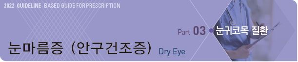
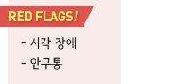
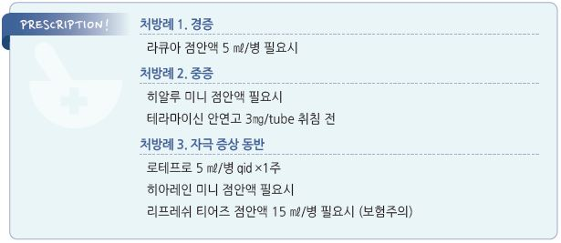

# 눈마름증 (안구건조증) Dry Eye

## 일반 사항
- 눈물 생성 및 tear film 유지의 이상

- 다른 이름 : keratitis(keratoconjunctivitis) sicca, dry eye syndrome

- 보통 양측 발생

- 유병률 : 50세 이상에서 5~30%

- 합병증 : 안검염, cornea neovascularization, cornea epithelial erosion

#### 눈물 층의 구성
- mucin layer : conjunctival goblet cell에서 분비, 눈물막의 안쪽 층; 눈물 퍼짐 및 눈물이 안구에 달라붙어 있도록 작용

- aqueous layer : lacrimal gland에서 분비, 눈물막의 중간 층; 눈물의 대부분을 차지

- oily layer : meibomian gland에서 분비, 눈물막의 바깥층; 눈물 증발 방지

## 원인

#### 눈물 생성 부족/감소
- 안구건조증 원인의 대부분을 차지

- androgen 감소(고령), 눈물샘 결함, Sjögren’s syndrome, RA, 당뇨병, 안검염 후유 장애, 눈 수술(예: blepharoplasty,

    백내장 수술, 시력 교정술)

- 약물 : 항히스타민제, 항콜린제, 항우울제, estrogen(경구 피임제), isotretinoin, 세로토닌 수용체 대항제, 이뇨제, β-차단제,

    amiodarone, nicotinic acid

#### Tear film 불안정, 빠른 눈물 증발
- mucin 또는 lipid 농도 이상과 관련

- meibomian oil 결핍, 안구열 이상, 안검 내반/외반, Bell’s palsy, 알레르기, 콘택트렌즈 착용, 영양 결핍(예: Vit A 결핍),

    약물, 안약의 잦은 장기 사용(특히 보존제 함유 안약)

- 건조한 환경(예: 도서관, 온풍기 사용, 높은 고도), 자극(예: 담배 연기)

- 눈 깜빡임 감소 : IT 기기 사용, 독서, 운전, 파킨슨병

## 임상 양상
- 충혈, 건조, 자극감, 작열감, 가려움, 이물감(모래 느낌), 안구통, 눈부심, 시야 흐림

- 소량의 점액성 분비물 : 눈물 감소에 따른 점액질 분비 증가에 기인

- 과도한 눈물(paradoxical tearing) : 안구 표면의 자극 또는 손상에 따른 눈물샘 반사 자극에 의하여 수성 눈물 분비 증가;

    안구 건조 상태가 지속되면 점차 감소

## 진단
- 명확한 진단 방법은 없으며 보통 검사 필요 없음

- tear osmolarity, tear film breakup time(＜10초), evaporation test

- Schirmer’s test : 5분 후 ＜10 ㎜ wetting

- Sjögren syndrome 자가 항체 검사, 갑상선 기능 검사

- 알레르기 질환과의 감별을 요함 (☞ p.185)

- 필요시 각막 손상 여부 검사(slit-lamp exam)

---

## Management

### 치료 방침
- 예방

- 적절한 인공 눈물 사용(1 drop/회) ± 취침 시 윤활제 안연고 도포

- 알레르기 등 관련 질환 진단 및 치료

- 난치성 질환에 대하여 항염제 고려

## 비-약물 치료 및 예방
- 눈을 자주 깜박임

- 자극을 피함 : 건조 환경, 대기 오염, 담배 연기, 햇빛

- 바람 회피 : 선풍기, 에어컨, 온풍기, 헤어드라이어; 직접 접촉 회피, 습기 유지 안경(moisture chamber) 착용

- 더운 방 회피

- 눈을 작게 뜸(예: 컴퓨터 모니터 위치를 낮춤, 책을 내려서 봄), 자주 눈을 감고 있음

- 콘택트렌즈 착용을 피함; 안경으로 시력 조절

- 충분한 수분 섭취, 실내 가습

- 눈꺼풀 온/냉찜질 및 청결 유지

- 유발 약물 회피

- 눈 수술(예: 라식, 라섹) 회피

## 약물 치료

### 인공 눈물, 윤활제
- 1차 선택제

- 경증 눈마름증에 대하여 필요시 사용

- 정확한 점안 시 한쪽 눈에 한 방울로 충분

- 1일 6~7회 이상 사용 또는 렌즈 착용 중에는 무방부제 제품 사용

>   ✽병 제품에는 대부분 방부제가 포함되어 있음
- 증발이 주요 원인인 경우 연고제 선택(특히 취침 시 적용)

#### 증발 방지
- polyvinylpyrrolidone [옵타젠트]

- hyaluronate [라큐아 점안액], [히알루미니]

- anhydrous liquid lanolin [듀라티얼즈 안연고]

#### 점성 유지
- carboxymethylcellulose [리프레쉬 티어즈], [인프레쉬 플러스]

- hydroxypropyl methylcellulose [아티어](비보험)

#### 표면 장력 완화
- polyethylene glycol [시스탄](비보험)

#### Mucin secretagogue
- reebamipide : 1회 1적, 1일 4회 점안 [레바아이], [레바케이]

- diquafosol : 1회 1적, 1일 6회 점안 [디쿠아이]

### 항염제

#### 국소 Steroid
- 자극 증상이 있는 경우에 단기 사용; 4회/일 사용 시 ＜2주, 가끔 사용 시 수 주간 사용 가능

- 가능한 한 저역가 선택 (☞ p.189)

- fluorometholone [오큐메토론]

- loteprendnol [로테프로]

#### 국소 면역억제제
- 2차 약제

- 대상 : 안구 건조에 의한 염증 발생, 다른 치료로 호전 안 됨

- 한계 : 효과 발현까지 수 주 소요, 장기 사용에 대한 효과 및 안정성 불명. 이 제제의 사용이 필요한 경우 의뢰 고려;

    입원 환자에서만 사용 권고 [NHS]

- cyclosporine [레스타시스]

> (보험기준 : 건성안으로 인하여 병적인 변화 발생(예: 표층각막염 등), tear break up time ≤6초, Shirmer test가 정상보다 ≥30% 감소)

#### 국소 Integrin antagonist
- 작용 : 항염 작용, 증상 개선

- 부작용 : 안구 자극/불편감, 쓴맛

- lifitegrast 5.0% bid

### 분비 자극제
- 중증에서 원인에 대한 적극적 감별 후 고려

- 국소제 : cyclic adenosine monophosphate, 올리브 액

- 경구제 : pilocarpine(cholinergic agonist) 5 ㎎ tid [살라겐], cevimeline 30 ㎎ tid

### 영양 요법
- tear film break-up time 향상 등 증상 호전에 유효하다고 알려짐

- 오메가-3(2 g tid [오마코]), (γ-)linoleic acid [에보프림], 항산화제, Vit A

✽하루 1g의 오메가-3를 장기간(평균 5년) 복용한 결과 안구건조증에 유의미한 호전이 없었다는 보고가 있음

### 항생제
- 대상 : 2차 감염, meibomian gland dysfunction, rosacea, blepharitis

- 국소 항생제 (☞ p.192)

- 전신 항생제 : doxycycline 20~50 ㎎ bid, 3~4개월 [독시사이클린]

## 수술
- 눈물 점 폐쇄(punctal occlusion) 시술 : lacrimal puncta에 silicone 또는 gel plug을 삽입하여 눈물 배출을 늦춤;

    다른 방법으로 조절되지 않는 심한 경우 고려

> **질병코드**
H04.1 눈물샘의 기타 장애

H04.11 건성안증후군

H04.9 눈물계통의 상세불명 장애

