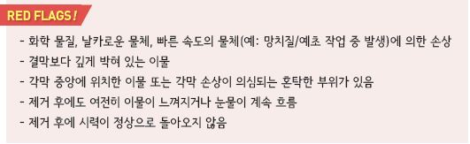

# 눈 이물 Foreign Body in the Eye

## 일반 사항

* 주요 원인 : 속눈썹, 마른 눈곱, 모래, 먼지
*   증상 : 충혈, 눈물, 불편감 또는 통증(특히 눈을 깜박일 때), 눈부심

    •이물에 의한 눈 충혈은 이물 제거 후에도 24시간 이상 지속될 수 있음
* 치료 전 시력 평가
*   철이 들어 있는 물질은 녹 흔적을 남길 수 있음

    

***

## Management

**1. 눈 주위 피부에 붙은 이물 제거**

* 고개를 숙이게 하고 눈은 감은 상태로 눈꺼풀에 바람을 붐
* 테이프로 눈 주위 피부의 이물을 떼어냄
* 물로 눈꺼풀과 얼굴을 씻어냄

**2. 눈 속의 이물 제거**

* 필요시 마취 안약(proparacaine 0.5% \[알카인]) 사용 후 조작
* 생리 식염수(또는 수돗물)로 세척
* 물에 적신 무균 면봉으로 부드럽게 묻혀 냄
* 환자가 이물감을 호소하면 이물질이 남아 있을 가능성이 있음을 주의. 특히 위 눈꺼풀을 뒤집어서 확인함

**3. 이물 제거 후 조치**

*   수일간 항생제 안연고 적용 : tobramycin \[토라빈], TEC/PMX-B \[테라마이신] qid (☞ p.192)

    •상피에 손상이 있는 각막은 감염되기 쉬움을 유의
* 눈을 가리는 것이 반드시 필요하지는 않음
* 1\~2일 후 F/U; 통증 증가, 충혈, 시각 장애 시 곧 진료 받도록 교육

※ 환자에게 마취 또는 통증을 줄이는 안약을 지급해서는 안 됨

> **질병코드** H02.80 눈꺼풀의 잔류이물

T15 외안의 이물
