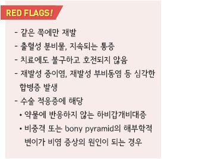
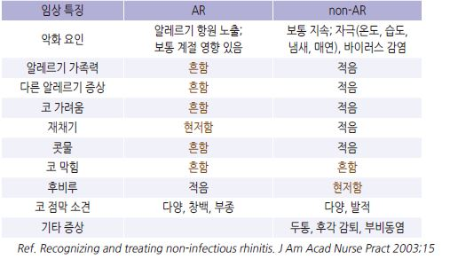
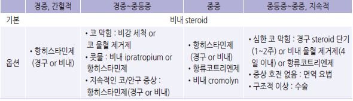
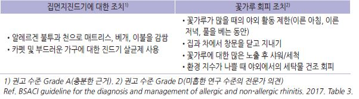
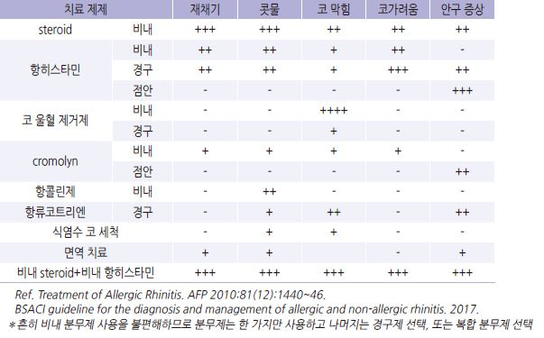
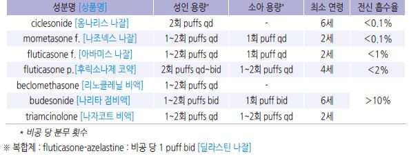
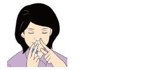
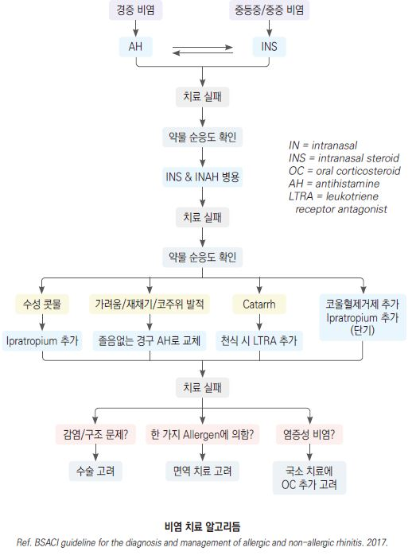
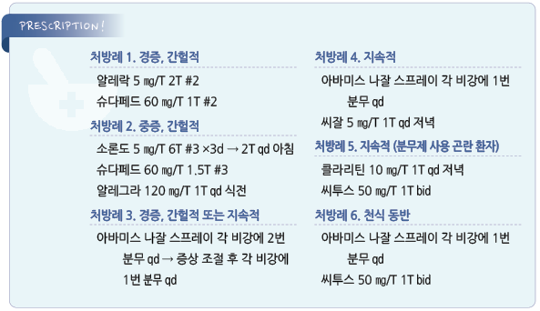

# 알레르기비염 Allergic Rhinitis

## 일반 사항
-  특정 알레르겐에 감작된 사람에서 알레르겐이 비강 점막에

    노출된 후 IgE 매개 면역 반응에 의해 발생한 코의 염증 반응으로

    콧물, 코막힘, 재채기, 코가려움증 등의 증상을 보이는 질환

- 유병률 : 성인의 10~30%, 소아의 ~40%

- 발생 연령 : 평균 8~12세; 1세 이전에는 aeroallergen sensitization은 발생하지 않음

### 분류

#### 기간
- 간헐적 : 증상 기간이 ＜4일/주 또는 ＜4주/episode인 경우;

    흔히 실외 항원 관련

- 지속적 : 증상 기간이 ≥4일/주 및 ≥4주/episode인 경우;

    흔히 실내 항원 관련

#### 발생 시기
- seasonal : 계절적 항원에 반응하여 매년 같은 시기에 발생

- perennial : 1년 내내 발생; 흔히 실내 항원(예: 집먼지진드기, 동물 털/비듬) 관련

#### 중증도
- 경증 : 증상은 있으나 일상생활과 수면에 장애가 없으며 괴로운 상태는 아님

- 중등증~중증 : 일상생활(직장, 학업, 운동)과 수면에 장애가 있으며 괴로운 상태

#### Local allergic rhinitis
- 병력상 알레르기비염이 의심되나 skin-prick test(-), 혈중 IgE 증가 없음

- non-atopy 환자에서 관찰되는 국소 염증 반응

- 대기 중의 알레르겐에 대응하는 국소 eosinophil 및 국소 IgE가 관련됨

## 원인
- 실외 알레르겐 : 계절성; 봄- 꽃이 피는 관목, 나무 꽃가루; 여름- 꽃, 풀; 가을- 돼지풀, 곰팡이

- 실내 알레르겐 : 통년성; 집먼지진드기 배설물, 애완동물 비듬/털, 바퀴벌레 단백질, 곰팡이 포자

### 기전
- 알레르겐이 코의 antigen-presenting cells에 포집되어 antigenic peptide로 분해

→ T-cell 활성화 → cytokine 생성 → B-lymphocyte 및 염증 세포(예: eosinophil)에 작용

  •B-lymphocyte → IgE 생성 → mast cell 및 basophil에 부착-감작-탈과립 → histamine 방출

→ 신경 말단의 histamine 수용체 자극 → 가려움, 재채기, 분비 증가 등 증상 발현

→ 항원 노출 수 분 내 발생, 1시간 내 사라짐 [early-phase response]

  •Eosinophil → IL-5 생성 → 다른 eosinophil 활성화 → 독성 물질 생성 → 국소 점막 세포 손상

    → 코 막힘 등 증상 발현 → 항원 노출 수 시간 후 발생 [late-phase reaction]

### 위험 인자
- 아토피, 습진, 천식, 다른 알레르기 질환 보유

- 알레르기 가족력(특히 부모 모두 해당하는 경우)

- 흡연 노출 (특히 출생 후 첫 1년 동안의 산모 흡연)

- 항생제 조기 사용

- 고형 음식 및 알레르겐 음식에 대한 조기 및 반복 노출

- 실내 알레르겐에 대한 노출

## 임상 양상
- 코 증상 : 코 가려움, 재채기, 콧물(물~점성), 코 막힘, 후비루

- 코 징후 : 점막 부종, 창백 또는 홍반성 점막, 비갑개 비대, 비용종

- 코 외 증상 : 구강 호흡, 기침, 눈/인두 가려움, 눈물, 코골이, 수면 장애, 피로, 두통

- 동반 질환 : 비부비동염, 아토피, 습진, 두드러기, 천식, 알레르기성 결막염, 중이염

>   ✽지속적 비염/만성 비염 환자들은 적응이 되어 큰 변화가 없는 경우에는 증상을 무시하는 경향이 있음

### 알레르기비염(AR) vs 비-알레르기비염(non-AR) 감별
- 알레르기비염과 비-알레르기비염 증상을 동시에 가지고 있는 경우가 많음

    

## 진단
- 증상 및 병력, 치료에 대한 반응

### 검사
- routine Lab test는 보통 정상; 혈청 IgE는 환자의 ⅓에서만 증가(정상인에서도 증가 가능)

- skin-prick test : 민감도가 높고 여러 개의 알레르겐을 동시에 검사할 수 있음; 항히스타민제를 복용 중이거나

    피부 질환(예: 아토피, 피부묘기증)이 있는 환자에서는 시행할 수 없음

   •식품 알레르겐은 3개월 영아부터,  흡입 알레르겐은 2~4세 경부터 양성이 나타나기 시작

- IgE reactivity : skin-prick test로 확인된 알레르겐에 대한 IgE 반응 검사

  •AR 병력을 가진 환자에서 AR 확진을 위하여 aeroallergen skin prick test or IgE test 권고 [AAAAI]

- 특이 IgE Ab 검사 : 부작용이 없고 약물 복용이나 피부 상태에 영향을 받지 않음; 검사하는 항원의 수가 한정되고

    피부단자검사보다 민감도가 낮음; 피부단자검사 시행이 어려운 경우 고려

- 콧물 또는 혈청 eosinophil : 확진 방법은 아님

- 코 내시경, 영상 검사 : 비전형 증상, 치료에 반응하지 않음, 비용종/비강 내 종양 의심 시 시행

---

## Management

### 치료 방침
- 항원 회피, 비강 세척

- 알레르겐(꽃가루 알레르기) 유행 2주 전부터 약물 치료를 시행하면 증상을 줄일 수 있음 

- 약물 선택 : corticosteroid 비내 분무제가 1차 선택제

   • seasonal AR 환자의 1차 선택 : 비내 steroid ± 비내 또는 경구 항히스타민

   • perennial AR 환자의 1차 선택 : 비내 steroid ± 비내 항히스타민

    

## 비-약물 치료

#### 항원 회피
- 금연

- 알레르겐이 생활 전반에 걸쳐 있어 완전한 회피가 어렵고 원인이 명확하지 않을 때가 많아 효과가 제한적임 (☞ p.343)

- 환경 조절에 의한 충분한 효과를 얻기까지 수 주~수개월 소요

    

#### 비강 세척
- 효과 : 비강의 점액/알레르겐/자극 물질 제거. sinus passage 습윤화, 섬모 운동 향상

- 방법 : 고개를 옆으로 뉘이고 위쪽 코에 기구를 사용하여 따듯한 소독 생리 식염수를 주입하여 아래쪽 코로 흘러나오게 함;

    한쪽 코에 ＞100 ㎖ 씩 1일 1~2회 시행

  •세척액 제조 : 3분간 끓여 식힌 물 250 ㎖ + 소금 ½~1 heaping teaspoon(소금 3.5~7 g); 베이킹 소다 1 teaspoon을

    첨가할 수 있음; 1주일이 지난 세척액은 폐기

  •기구 예 : 30 ㎖ 주사기, water pick, squeezing할 수 있는 플라스틱 병, Neti pot

  •기구는 자주(2~3주마다) 교체 또는 소독

>   ✽적절한 비강 세척 방법에 대해서는 논란이 있으며 대한천식알레르기학회에서는 많은 양(1회 200~400 ㎖)의 관류보다는

>     등장성 용액을 이용하는 스프레이 방법을 추천

## 약물 치료
- 지속 유지 치료가 간헐적 치료보다 증상 조절에 보다 효과적이지만 환자의 특성에 따라 결정; 간헐적 발생하는 가벼운 증상에

     대하여 격일 or 필요시 사용하기도 함 (✽매일 사용이 필요시 사용보다 증상 개선에 더 효과적이지만 삶의 질 점수는

    유사한 것으로 알려짐)

#### 알레르기비염 치료제의 효과 비교
    

### Steroid

#### 비내용 제제
- 기전 : 비강 점막의 염증 세포에 작용 → IgE 관련 히스타민 분비를 억제

- 대상 : 코의 모든 증상; 가장 우수한 효과

- 효과 발현 기간 : 효과 발현까지 수 시간, 유의미한 효과까지 2일 소요; 2주 이상 매일 사용 시 최대 효과에 도달하며

    치료 기간 중 날짜 수로 50% 이상 투여해야 유의미한 효과를 얻을 수 있음

- 증상 완화에 따라 점차 감량(1주 간격으로 감량) 또는 4~8주 매일 사용 후 분무하는 빈도를 반으로 줄여 유지

- 제제 간 효과 차이는 없음; 전신 흡수율, 국소 자극 및 환자 선호도는 다를 수 있음

- 임신 중 사용 가능

- 국소 부작용 : 코/목 자극, 코피, 코 마름, 쓴맛, 칸디다 증식(드묾)

- 전신 부작용 : 유의미한 전신적 영향은 없음; 소아에서 장기 사용에 따른 최종 신장에 미치는 영향은 없는 것으로

    알려져 있으나 신장 모니터링을 권고 (✽1년 이상 사용 시의 심각한 부작용 보고는 없으나 이에 대한 연구는 부족함)

- 상호 작용 : fluticasone은 강한 CYP3A4 저해제(예: itraconazole)와 상호 작용 가능성이 있음

    

#### 경구제
- 대상 : 다른 치료로 조절되지 않는 심한 코/눈 증상

- 용법 : 단기 사용(5~7일 이내); 정해진 권고 용량은 없음

  •처음 2~3일간 중간 용량 투여 후 저용량으로 유지하기도 함

  •중간 이하 용량(예: prednisolone ≤30 ㎎/d)으로 단기간(＜2주) 투여 후 중단할 때에는 tapering이 필요 없음

- prednisolone : 5~60 ㎎/d [소론도]

- methylprednisolone : 4~48 ㎎/d [메치론]

#### 주사제
- 다른 제형에 비해 더 효과적이라는 근거가 부족하며, 경구제에 비하여 큰 mineralocorticoid 영향과 긴 작용 시간 등의

    문제로 권고하지 않음

### 항히스타민제
- 기전 : H1-수용체 활성을 낮춤. 일부 항히스타민제는 eosinophil survival을 낮춤

- 알레르겐 노출 전에 투여하면 보다 효과적

- 증상이 발생하는 기간(계절)에는 지속 투여 고려

#### 비내용 제제
- 경구 항히스타민제 대비 동등 이상의 효과; 비내 스테로이드보다 효과 적고 부작용 많음

- 대상 : 간헐적 또는 계절적 AR, 비-알레르기성 혈관운동성 비염의 코 증상 (✽지속적 AR에 대한 효과는 불확실);

    중증 알레르기 및 비알레르기 비염에서 비내용 스테로이드와 병용 고려

- 효과 발현 시간 : 분무 15~30분 내 작용 시작, 4시간 동안 효과 지속

- 부작용 : 쓴맛, 국소 자극, 코피, 두통

- azelastine : 비공 당 1~2 puffs bid [아젭틴 비액]

- steroid 복합제 : 

   • olopatadine-mometasone furoate : 비공 당 2 puffs bid [리알트리스 나잘스프레이 액]

   • fluticasone-azelastine : 비공 당 1 puff bid [딜라스틴 나잘]

#### 경구제
- 대상 : 콧물, 재채기, 가려움, 눈물, 안구 충혈 (✽코 막힘에는 효과 적음)

- 알레르겐 노출에 대비하여 사용하는 경우에는 노출 2~5시간 전에 적용

- 각 세대 내 약제들 간의 효과 차이는 일반적으로 없음, 개인차는 있음 (☞ p.1144)

- 부작용 : 졸음, 항콜린 작용(주로 1세대 제제에서 발생; 입마름, 시야 흐림, 소변 저류, 변비)

- 2세대 제제 우선 선택 : 졸음이나 항콜린 부작용이 적거나 없음

- non-AR의 콧물에 대해서는 1세대 제제가 항콜린 작용 때문에 보다 효과적

- 항히스타민제 증량 효과 : 최대 용량 이상을 투여하는 경우 효과 상승은 없이 부작용이 늘어남

- 항히스타민제 병용 효과 : 1, 2세대 또는 동일 세대 내 병용의 유효성에 대한 근거는 없으며 부작용이 증가할 수 있음

- H1 & H2-차단제 병용 효과 : 두드러기 치료에서는 상승효과가 있으나 알레르기비염에서는 입증되지 않음

- 코 울혈 제거제 병용 효과 : 항히스타민제 단독 사용보다 유효(소변 저류 등의 부작용 증가 가능)

- 효과 부족 시 항히스타민제 증량이나 서로 다른 종류의 항히스타민제 병용보다 비내 스테로이드제 등 다른 치료 약제의

    병용을 권고

- cetirizine : 일부에서 졸음; 5~10 ㎎ qd [지르텍]

- levocetirizine : 대부분 non-sedating; 5 ㎎ qd [씨잘]

- fexofenadine : non-sedating; 120 ㎎ qd [알레그라]

- loratadine : 10 ㎎ qd [클라리틴]

- desloratadine : 5 ㎎ qd [에리우스]

- olopatadine : 5 ㎎ bid [알레락]

### α-Adrenergic agonist (코 울혈 제거제)
- 기전 : 교감 신경 작용 항진 → 코 점막 혈관 수축

- 대상 : 심한 코 막힘

#### 비내용 제제
- 부작용 : rebound rhinitis, 고혈압

- 코 막힘에 가장 강력한 작용을 나타내지만 부작용 문제로 1일 2회 이내, ≤4일/월로 사용 제한;

    소아에서는 권고하지 않음 (비보험)

- phenylephrine [시네프린], naphazoline [나리스타](chlorpheniramine 복합), xylometazoline [오트리빈],

    oxymetazoline [레스피비엔]

#### 경구제
- 부작용 : 불면, 식욕 부진, 불안정, 두근거림, 혈압 상승, 진전, 어지럼, 두통, 소변 저류

- 정기적 또는 자주 사용하지 않도록 함; 특히 고령, 부정맥, CVD, 조절되지 않는 고혈압, 배뇨 장애, 녹내장, 갑상선항진증,

    Tourette syndrome 환자에서 주의

- pseudoephedrine : 30~60 ㎎ tid~qid [슈다페드]

- phenylephrine : pseudoephedrine보다 효과가 적고 10 ㎎에서 유효 증거 부족 [코미](복합제)

### 항콜린제, 비내
- 기전 : 부교감 신경 작용 억제 → 코점막에서의 mucus production 감소

- 대상 : 콧물 증상(✽코 막힘, 재채기에는 효과 적음); 혈관운동성 비염, gustatory rhinitis에 보다 유용

- 국소 steroid 병용 시 효과 상승; 비내 steroid에도 지속되는 콧물 증상에 대하여 추가 고려

- 부작용 : 코/입마름, 국소 자극, 코 막힘, 코피, 두통

- ipratropium : 비공 당 1 puff bid~tid [리노벤트]

### Cromolyn, 비내
- 기전 : mast cell 안정화 → 히스타민 등 염증 매개체 방출 감소

- 대상 : AR의 전반적 증상에 대하여 약간의 효과; 항히스타민제보다 효과 적음

- 효과 발현 시간 : 4~7일째 작용 시작, 수 주 후 최대 효과

- 간헐적 알레르기비염(예: 꽃가루)에 대한 예방적 사용 시 증상 발생 전부터 사용

- 알레르겐 노출에 대비하여 사용하는 경우에는 노출 30분 전에 적용

- 부작용 : 코피, 국소 자극, 재채기

- 용법 : 3~6회/d (✽반감기가 짧음) → 2~3주 후 감량

### 항류코트리엔제 (leukotriene modifier)
- 기전 : 알레르겐에 대한 초기 및 지연성 염증 반응 억제

- 효과 : 경구 항히스타민제 대비 동등 이하; 지속적 AR에 대한 효과는 논란

  •다른 알레르기 질환(특히 천식) 동반 시 유용

- 병용 효과 : 비내 steroid 또는 2세대 항히스타민제와 병용 시 각각의 단독 사용보다 효과적이라는 보고가 있으나

    항히스타민제와 병용 투여 시 상승효과는 확실하지 않음

- 대상 : 다른 약물 치료 실패 시 고려 (보험기준 ☞ p.1180)

- 부작용 : 간 효소 및 빌리루빈 수치 상승, 불안, 우울; 자살 충동 등 정신 건강 부작용 발생 우려

- montelukast : 10 ㎎ qd 저녁 [싱귤레어]

    ; [FDA] 정신 건강 부작용 위험이 있으며, 처방 시 이러한 부작용의 위험과 이점을 고려해야 함

- zafirlukast : warfarin 대사 억제; 20 ㎎ bid 공복 복용

- pranlukast : 225 ㎎ bid [오논]

- zileuton : warfarin, theophylline, propranolol 대사 억제; 600 ㎎ qid

- petasites : 8 ㎎ bid [코살린]

### anti-IgE Ab
- 기전 : 순환하는 IgE와 결합

- 대상 : 혈청 IgE 상승, steroid 및 LABA로 조절되지 않는 중증 지속성 알레르기성 천식

- omalizumab : 150 ㎎~300 ㎎ 4주마다 SC [졸레어 주] (보험주의)

### 면역 요법
- 효과 : AR 예방 효과에 대한 증거 없음

- 대상 : 다른 치료에 반응하지 않거나 부작용으로 다른 치료 적용이 어려운 환자

- 치료 기간 : 환자의 개별적 원인 항원에 따른 제제를 이용하여 3~5년간 시행

- 투여 방법 : 피하주사, 설하, 비강

- 전신 부작용 : 드물게(0.5%) anaphylaxis 발생

>   ✽[히스토불린] : histamine dihydrochloride 0.15 ㎍, human immunoglobulin G 12 ㎎; 성인 4~7일, 소아 6~10일 간격 3회 주사하여

>     이를 1치료 주기로 함. 1개월 이내에 충분한 효과가 나타나지 않을 때에는 1~2 치료 주기의 주사를 반복. 효과의 지속을 위하여

>     3~4 개월마다 1회의 주사를 반복; 개별 환자에 특화된 제제는 아니며 일부 환자에서 효과 (비보험)

### 기타
- prebiotics, probiotics, synbiotics, 침 : 일부 낮은 수준 연구에서 효과; 입증할 만한 결과는 부족

### 펌프식 Steroid 코 분무제 사용법
  ① 약을 사용하기 전에 먼저 코를 푼다.

  ② 마개를 벗기고 용기를 흔든다. 구입 후 처음 사용하는 경우에는 용기를 흔들고 미세한 안개가 뿜어져 나올 때까지

    허공에 수회 분무 한다.

  ③ 펌프 용기의 아래를 엄지손가락으로, 위쪽은 검지와 중지로 잡는다. (용기에 따라 다름)

  ④ 고개를 약간 숙이고 숨을 천천히 내쉰다.

  ⑤ 흡입구를 한쪽 비강에 삽입하여 비강의 수직 또는 약간 바깥쪽 벽을 향하도록 한다. 비중격을 향하지 않는 것이

    중요하다.

  ⑥ 코로 숨을 천천히 들이마시기 시작함과 동시에 펌프를 누른다. 이 때 반대쪽 코는 막는다.

  ⑦ 분무 흡입 후 5초간 숨을 멈춘 후 입으로 천천히 내쉰다.

  ⑧ 흘러내리는 약물은 휴지로 닦는다.

  ⑨ 다른 쪽 코에도 같은 방법으로 반복한다.

  ⑩ 약 흡입 후 15분 정도 코를 풀지 않는다.

>   ✽처음에는 찡한 느낌이 있을 수 있으나 문제없음

## 임신/수유 중 치료

### 임신 중
- 비-약물 치료(예: 비강 세척)를 우선 선택

- 임신 첫 12주 동안은 약물 치료를 피함

- 필요시 안전성 등급 B 경구 항히스타민제 선택 : chlorpheniramine, loratadine, cetirizine, levocetirizine

- 비내 steroid, montelukast 사용 고려

### 수유 중
- 1세대 및 2세대 경구 항히스타민제 : 안전

- 비내 steroid : 안전

    

> **질병코드**
J30.2 기타 계절성 알레르기비염

J30.3 기타 알레르기비염

J30.4 상세불명의 알레르기비염 

