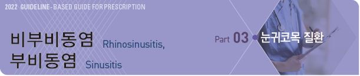
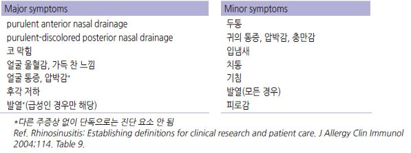
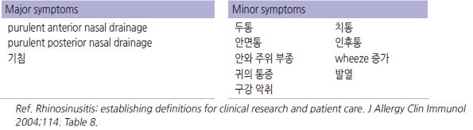
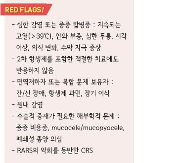
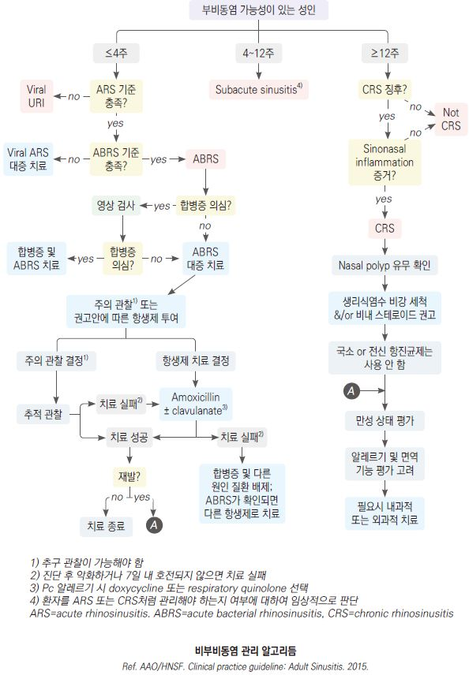
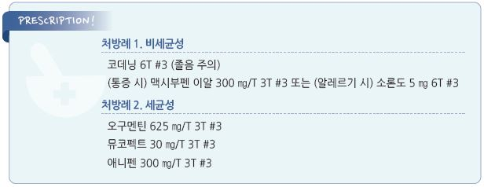

# 비부비동염 Rhinosinusitis, 부비동염 Sinusitis

## 일반 사항
- 비부비동염 : nasal cavity 및 paranasal sinus에 증상이 있는 염증

  •부비동염은 거의 항상 코 점막의 염증을 동반하기 때문에 비부비동염이라는 용어를 사용

- Uncomplicated rhinosinusitis : 비부비동 범위 밖으로 염증이 확장되지 않은 비부비동염; 연조직 및 신경학적,

    안과적 이환 없음

- 경과 : 바이러스에 의한 비부비동염은 보통 7~10일 내 호전

#### 분류
- Acute rhinosinusitis (ARS) : ＜4주

- Subacute rhinosinusitis : 4~12주

- Chronic rhinosinusitis (CRS) : ＞12주

- Recurrent acute rhinosinusitis (RARS) : ≥4회/년 발생; 각 episode 사이는 무증상

※ AAAAI 정의

   •Acute bacterial rhinosinusitis (ABRS) : ＞10일, ＜12주;

   •RARS : ≥7일 지속되는 episode가 ≥3회/년 발생, 각 episode 사이는 무증상

## 원인
- 기전 : sinus mucosa의 염증(neutrophil 유입, cytokine 방출) 및 부종 → sinus mucosa surface 손상,

    mucociliary clearance 장애, sinus ostia(ostiomeatal complex) 폐쇄

### 원인균
- 바이러스 : 감염의 대부분; rhinovirus, adenovirus, influenza virus, parainfluenza virus

- 세균 : ARS의 ＜2% 차지; S. pneumoniae , H. influenzae , S. aureus , M. catarrhalis , 혐기성균

- 곰팡이 : 면역저하자에서 주로 발생

### 위험 인자
- 감기(부비동염의 대부분은 감기와 관련한 바이러스에 의해 발생), 기타 비염

- 부비강 기형, 비중격 만곡, 아데노이드 비대, choanal atresia, 이물질, 코의 폴립, 코/부비동 종양

- 섬모 기능 장애(예: Kartagener’s syndrome, 흡연, 코 울혈 제거제 남용), 치과 질환, cystic fibrosis, 면역 저하(예: 조절되지

    않는 당뇨병, 백혈구 감소, steroid 장기 사용), GERD, 전신 염증 상태(예: sarcoidosis, Wegener’s granulomatosis)

## 임상 양상 및 진단
- 합의된 진단 기준은 없음

### 비부비동염 (Maxillary sinusitis) 추정 기준
- 주증상 ≥2개, 또는 주증상 1개 & 부증상 ≥2개

    

### 세균 감염 진단 기준

#### 의심 소견
- 다음 중 하나 이상 해당

① 농성 콧물, 코 막힘, 안면 압통/충만감 등 ARS 증상이 호전 없이 ≥10일 지속

② 질환 시작부터 최소 3~4일 연속 지속되는 심한 증상 : 발열(≥39℃), 농성 콧물, 얼굴 통증

③ 초기 증상 호전 후 10일 내 ARS 증상 악화(‘double worsening’)

#### 급성 세균성 비부비동염 추정
- 주증상 ≥2개, 또는 주증상 1개 & 부증상 ≥2개

    

### 검사
- 합병증이 발생하지 않는 한 바이러스와 세균 감별을 위한 검사는 필요 없음

> ✽대부분 바이러스에 의해 발생하며 검사를 통한 진단 또는 세균과 바이러스 감염 감별이 용이하지 않음

#### 실험실 검사
- sinus 또는 meatal 배양 검사 : 항생제 치료 실패 시 고려

#### 영상 검사
- sinus X선 : 거의 도움이 되지 않으며 합병증이 없는 비부비동염에서는 권고하지 않음

- CT, 비강 내시경, 알레르기/면역 기능 검사 : 치료 실패(4~12주 이상 증상 지속) 또는 합병증이 있는 환자에서 고려

>   ✽CT는 해부학적 문제, 합병증 진단에 유리; MRI는 액체와 염증과 종양을 구별하는데 유리

### 증상에 따른 감별

#### 코 분비물
- 편측 발생 : 비부비동염의 가능성이 적음

- 색깔

  •맑음 : 비감염

  •노란색 : 알레르기/감염

  •초록색 : 감염

>   ✽콧물 색깔로 원인을 감별할 수 없으며, 초록색 분비물이

>     반드시 세균 감염을 의미하는 것은 아님
- 혈흔

  •편측 : 종양, 이물, 코 후빔

  •양측 : 육아종, 출혈 경향, 코 후빔

#### 코 막힘
- 편측 발생 : 비중격 만곡, 이물, 폴립, 종양

- 양측 발생 : 비염, 폴립, S자 비중격 만곡

- 교대 발생 : 비염

#### 후각 저하
- 일시적, 경증 : 알레르기비염, 바이러스 감염

- 간헐적 : 점막 질환, 폴립, 비부비동염

- 지속 : 심한 폴립, 종양, 아연 결핍, 약물 반응

- 점차 악화 : Parkinson’s Dz, Alzheimer’s dementia

#### 통증
- 분비물, 후각 저하 동반 : 비부비동염

- 다른 코 증상 없이 통증만 존재 : 비부비동염 가능성 적음

### Ethmoidal sinusitis
- maxillary sinusitis에 동반하여 발생

- 증상 : 눈 사이 코의 high lateral wall 위의 안와로 방사되는 통증/압박감; maxillary sinusitis와 유사

### Sphenoid sinusitis
- pansinusitis 시 발생

- 증상 : 머리 가운데/vertex 부위의 두통

### Frontal sinusitis
- 증상 : 전두부 통증/압통; 눈썹의 내측 끝 아래 orbital roof 촉지 시 통증 유발

---

## Management

### 치료 방침
- 대증 치료 : 대부분 대증 치료로 회복

  •진통제 : NSAID

  •고용량 비내 steroid

  •코 세척 : nasal saline, saline mist(20~30 분 tid); 근거 적음 (☞ p.243)

- 항생제 : 대부분 바이러스에 의하므로 효과 없음; 선택적 적용

- 동반 질환 치료 : 알레르기비염, 당뇨

- 추적 관찰 : 합병증 없이 치료된 비부비동염에 대한 추가 평가는 필요 없음

  •기저 위험 인자가 있는 경우 이에 대하여 추가 평가 고려

## 약물 치료

### 코 울혈 제거제
- 경구 : 코 막힘에 대하여 약간의 효과; pseudoephedrine 30~60 ㎎ tid~qid [슈다페드]

- 비내 : 강력한 효과; 부작용 문제로 ≤4일/월로 사용 제한 (비보험); phenylephrine [시네프린],

    naphazoline [나리스타](chlorpheniramine 복합제), xylometazoline [오트리빈], oxymetazoline [레스피비엔]

### Steroid
- 알레르기비염과 관련된 경우에 유효; 세균성 감염에서도 고려

- ＞12세에서 고용량 비내 steroid 고려

- 비내 : budesonide [나리타 점비액], mometasone [나조넥스 나잘] (☞ p.243)

- 경구 : 제한적 사용; prednisolone 5~60 ㎎/d [소론도], methylprednisolone 4~48 ㎎/d [메치론]

### 항히스타민제
- 효과 : 입증 안 됨; 점액 점도 증가 및 점막 건조로 악영향 가능성

- 대상 : 심한 알레르기 증상 동반 시 고려 (☞ p.244)

- 경구 : cetirizine 10 ㎎ qd [지르텍], fexofenadine 120 ㎎ qd [알레그라], loratadine 10 ㎎ qd [클라리틴]

- 비내 : azelastine 비공 당 2번 분무 bid [아젭틴 비액]

### 진통제
- 통증 정도에 따라 선택; 지속 사용이 간헐적/필요시 사용보다 효과적

- ibuprofen : 400~800 ㎎ tid [부루펜]

- acetaminophen : 650~1,300 ㎎ tid [타이레놀]

- tramadol : 100 ㎎ bid~qid [트리돌], tramadol/acetaminophen [울트라셋]

### 항생제
- 대부분 항생제 투여는 필요 없음

>   ✽항생제 사용으로 단지 5%의 환자에서만 증상 기간이 줄어들며 부작용 발생이 위약의 2배라는 보고가 있음
  ✽세균 감염이 의심되는 증상이 지속되거나 중증, 면역 결핍 환자에서 항생제가 치료 실패 확률을 절반으로 줄여준다는 보고가 있음
- 대상 : ABRS 진단 후 악화 또는 7~10일 내 회복 안 됨, 나쁜 전신 건강 상태, 합병증 발생 고위험

- macrolide(azithromycin, clarithromycin), TMP/SMX, 2/3세대 세파계는 내성 가능성이 높아 경험적 치료로는 권하지 않음

- 투여 기간 : 합병증이 없는 경우 성인- 5~10일, 소아- 10~14일

- 투여 시작 2~3일 후에도 악화되거나, 투여 3~5일 내 호전되지 않으면 변경 고려

#### 내성 위험군
- ＜2세 또는 ＞65세 - 보호시설/보육시설 생활자

- 최근 1달 내 항생제 복용 - 최근 5일 내 입원 병력

- 동반 질환 - 면역 저하

#### 대한감염학회 지침 (2017)
** 1차 선택제**

- amoxicillin : 500~875 ㎎ bid [파목신]

- Amox/clav. : Amox 500 ㎎ tid 또는 875 ㎎ bid [오구멘틴]

** 대체제**

- cefpodoxime : 200 ㎎ bid [바난]

- cefdinir : 300 ㎎ bid 또는 600 ㎎ qd [옴니세프]

- cefuroxime : 250~500 ㎎ bid [진네트]

- levofloxacin : 500 ㎎ qd [크라비트]

- moxifloxacin : 400 ㎎ qd [아벨록스]

#### AAO 지침 (2015)
- Amox/clav.의 1차 선택 대상 : 한 달 내 항생제 사용력, 환자와 밀접한 접촉, 이전에 항생제 치료 실패,

    적절한 예방에도 불구하고 감염 발생, 흡연자/가족 흡연자, 항생제 세균 내성 지역, 중증(≥39℃, 화농성 합병증),

    frontal or sphenoidal sinusitis, 재발 병력, ＞65세, 기저 질환(당뇨, 심/간/신질환)

#### NICE 지침 (2017)
- ≤10일 증상에 대해서는 항생제를 사용하지 않음

- ＞10일 증상이 호전되지 않는 경우 세균 감염 가능성에 따라 항생제 사용

- 고위험 환자에서는 즉시 항생제 투여

- 1차 선택 : Pc VK; phenoxymethylpenicillin 500 ㎎ qid ×5d

- 대체

  •doxycycline : 200 ㎎ ×1d & 100 ㎎ qd ×4d [독시사이클린]

  •clarithromycin : 500 ㎎ bid ×5d [클래리시드]

  •erythromycin : 임신부에서 선택; 250~500 ㎎ qid or 500~1000 ㎎ bid ×5d

- Amox/clav. : 500/125 ㎎ tid ×5d; 2차 선택 또는 고위험군에서 1차 선택 [오구멘틴]

### 점액용해제
- 점막 섬모 기능 회복 기대; 효과 입증은 안 됨 (☞ p.285)

- guaifenesin : 200 ㎎ bid~qid [코데닝](복합제)

- ambroxol : 30 ㎎/T tid [뮤코펙트]

### 기타
- mucolytics, Vit C, probiotics, 항히스타민제 : 급성 비부비동염에서 유효성 입증 안 됨

## 치료 실패 시 조치
- Partial response : 호전은 되었으나 정상으로 회복이 안 된 경우; 10~14일간 (추가) 항생제 치료 또는 교체 고려

- Poor response : 3~5일간의 1차 항생제 치료에 거의 반응이 없는 경우; 보다 광범위한 항생제 또는 내성균에 대한

    항생제 치료 고려

- 치료 순응도 확인

- 비-약물 치료 강화

- 기저 위험 인자(예: 알레르기 요인, 비용종, 종양, 면역 저하, 구조적 이상)에 대하여 상세한 평가

- 배양 검사/감수성 검사 등 균주에 대한 평가

- 이번 진단 및 치료와 관련하여 CT를 시행하지 않은 경우 부비강 CT 검사 고려

### ■ 만성 비부비동염

### 일반 사항
- 비부비동염의 객관적 증거 및 주요 증상(안면 통증/압박감, 후각 저하, 콧물, 코막힘) 중 ≥2가지

＞12주 지속

- 만성 비부비동염은 감염보다는 염증 질환으로서, 반복되는 감염에 의한 점막 섬모의 손상과 관련되어 있으며

    항생제 치료에 효과 적음

- 수술 치료를 포함한 모든 치료에도 불구하고 완치가 어렵고 재발이 흔함

- 치료에 반응하지 않으면 의뢰 고려

### 위험 인자
- 고령, 면역 저하

- 알레르기

- 환경 자극/오염에 지속적인 노출

- 해부학적 이상

- mucociliary 기능 저하 : cystic fibrosis, primary ciliary dyskinesia

- 반복적인 상기도 감염

- 전신 질환 : 당뇨병, 만성 심/간/신질환, eosinophilic granulomatosis, sarcoidosis

- 최근 항생제 사용

- 의인성 : 부비동 수술 후유증

### 감별
- 알레르기비염 (☞ p.240)

- 비-알레르기비염 (☞ p.250)

- 2차성 비염 or 코 울혈 : 임신, 갑상선저하증

- 구조적 이상 : 비용종, 이물, 비중격 만곡, 편도/아데노이드 비대

- 편두통, facial pain syndrome

### 검사
- 필요시 구조적 원인 진단과 수술 적응증 감별을 위하여 의뢰 및 검사

- CT(민감도- excellent), nasal endoscopy(good), anterior rhinoscopy(fair)

> ✽CT 검사는 약물 치료 4~6주 후 시행 [AAAAI]
- allergy evaluation

---

## Management

### 치료 방침
- 치료 목표 : 부비강 내 분비물 배출, 염증 감소, 균주 제거

- 치료 방법 : 비강 세척 (☞ p.243), 항생제, 비내 steroid, 수술

- 기저 질환 치료. 예) 알레르기, 당뇨

#### BSACI 지침
- 권고 등급 grade A : 생리 식염수 세척, 비내 steroid, (알레르기 환자의 경우) 경구 항히스타민제, 장기(~12주) 경구 항생제

- grade C : 단기(~2주) 경구 항생제, 점액 용해제, 세균 분해물 [브롱코박솜]

- grade D (연구가 부족한 전문가 의견) : 알레르겐 회피, 국소 항생제, 경구 steroid, (경구/비내) 코 울혈 제거제,

    전신/국소 항진균제, PPI, 면역 치료, 허브 치료

#### 치료 실패 시 조치
- 면역 저하, aspirin-exacerbated respiratory disease, allergic fungal rhinosinusitis 고려

- 부비강 CT (or MRI) 및 배양 검사 : 이번 치료와 관련하여 시행하지 않은 경우 고려

- 비내 steroid 및 생리 식염수 세척 지속

- 경구 항생제 교체(배양 검사에 따라 선택)

- 천식 등 동반 질환 치료

- 수술 치료 고려, 의뢰

### 치료 약물

#### 항생제
- 만성 비부비동염에서의 항생제의 역할과 효과에 대한 근거는 불충분함

- 3개월 내 사용하지 않은 항생제 또는 배양 검사에 따른 선택

- amoxicillin/clav. : amox 500 ㎎ tid 또는 875 ㎎ bid; 소아 45 ㎎/㎏/d #2 [오구멘틴]

- clindamycin : 300 ㎎ qid 또는 450 ㎎ tid; 소아 20~40 ㎎/㎏/d #3~4 [훌그램]

- moxifloxacin : 400 ㎎ qd [아벨록스]

- metronidazole [후라시닐] plus 아래 중 하나

  •cefuroxime [진네트], cefdinir [옴니세프], cefpodoxime [바난], levofloxacin [크라비트], azithromycin [지스로맥스],

    clarithromycin [클래리시드], TMP-SMX [셉트린]

#### 비내 Steroid
☞ p.243

#### 경구 Steroid
- 단기적 증상 완화 효과; 장기적인 이익은 없음

- 심한 증상에 대하여 단기 사용(＜3주)

- prednisolone 40 ㎎/d ×5d → 20 ㎎/d ×5d [소론도]

> **질병코드**
J01 급성 부비동염

J32 만성 부비동염 

