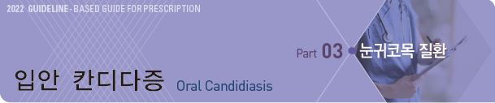
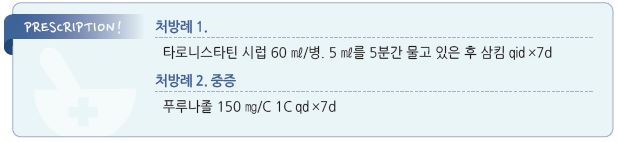

# 입안 칸디다증 Oral Candidiasis

## 일반 사항

* 급만성 또는 반복적으로 발생하는 구강 점막의 표재성 진균 감염
* 신체 다른 부위의 칸디다증 가능성에 대해서도 고려
* 재발성인 경우 기저 원인에 대한 진단 및 치료를 고려
* 경과 : 대부분 자연 치유; 기저 상태에 따라 경과가 다르게 나타남
* 치료 후 혀의 통증이 지속되면 burning mouth syndrome, 구강 암 고려

## 원인

*   원인균 : Candida albicans

    •건강한 성인 50%의 구강에서 관찰되며 다른 요인들의 영향을 받아 발병 (☞ p.933)

### 위험 인자

* 구강 문제 : 흡연, 불결한 구강 위생, 입마름, 틀니
* 약물 : 항생제, (전신 또는 구강) steroid
* 전신 질환 : 심한 빈혈, 당뇨병, 암, 면역 저하

## 분류 및 임상 양상

* 구강의 여러 곳에 각기 다른 형태로 발생할 수 있음

1. Thrush : 가장 흔한 형태
2. Erythematous 또는 Atrophic form : 혀 표면, 틀니 접촉 점막 이환; thin, beefy 모양
3. Fissure : 구각에 발생, angular cheilitis
4. Hyperplastic form : 상피 표면의 patchy, white thickening. 거즈로 긁어도 벗겨지지 않음

### 아구창 (Thrush)

* 원인균 : Candida albicans (대부분)
* 발생 부위 : 혀, 볼 점막, 구개 점막
* 모양 : 흰색, pseudomembranous, curdlike, patch/plaque
* 증상 : 대부분 자각 증상 없음; 약간의 불편감, 작열감, 쓴맛; 영아에서 간혹 보챔/수유에 지장
* 진단 : 거즈로 병소를 닦아내면 제거된 점막 표면에 병소와 같은 모양의 발적/점상 출혈, 따가움 발생

## 진단

* 검사는 보통 필요 없음
* 필요시 병소 가검물에 대한 KOH 현미경 검사 및 배양 검사

***

## Management

### 치료 방침

* 자각 증상이 없는 경우에는 치료 필요 없음; 대부분 항진균제 치료는 필요 없음
*   위험 인자 치료

    •금연

    •치아 문제 치료, 입마름 치료 (☞ p.272)

    •틀니 소독 : 틀니 소독제에 밤새 담가 둠; chlorhexidine \[헥사메딘 액] (보험기준 ☞ p.269)

## 약물 치료

### 국소 항진균제

* 대상 : 자각 증상이 있거나 식도로의 전파 우려 시
* 증상 해소 1주 후까지 적용; 보통 7\~14일 소요
* miconazole oral gel : 60 ㎎/2.5 ㎖ qid (식사 후 물고 있음) ×7d plus 호전 후 7d
*   nystatin suspension : 10만 단위/1 ㎖, 4\~6 ㎖를 양측에 절반씩, 5분간 물고 있은 후 삼킴;

    tid~~qid ×증상 호전 후 2d(통상 7~~14d) [타로니스타틴](%EB%B9%84%EB%B3%B4%ED%97%98/) (✽chlorhexidine 가글과 병용 시 효과가 감소 됨)
*   clotrimazole

    •구강 : 10 ㎎ 트로키를 20분 동안 물고 있음, 5회/d ×7\~14d

    •구각 입술염 : 크림 제제 도포 bid\~tid \[카네스텐]

### 전신 항진균제

* 대상 : 중등도 이상 질환, 국소 치료에 반응하지 않거나 사용할 수 없는 경우, 심한 면역 저하
* fluconazole : 100~~200 ㎎ IV 또는 PO qd ×7~~14d \[푸루나졸] (보험기준 50 ㎎/d)

> **질병코드** B37.0 칸디다구내염

