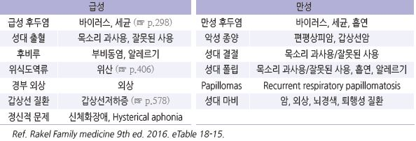
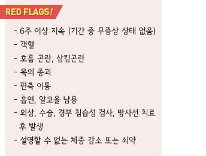
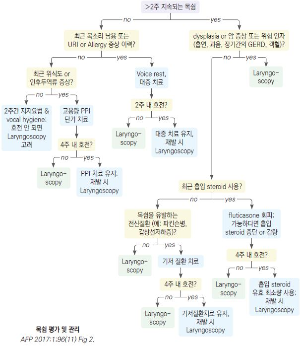
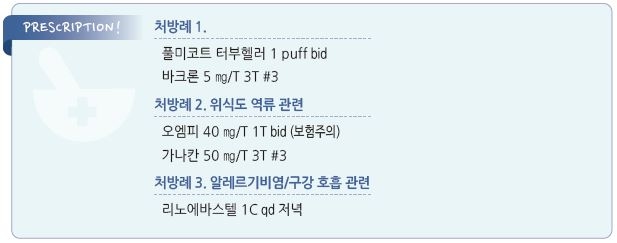

# 목쉼 Hoarseness


* 목소리의 떨림, 약해짐, 긴장, 음조 변화, 성량 부족 등의 현상이 발생한 voice quality의 변화

## 원인

```

```

#### 약물

* coumadin, thrombolytics, PDE5i : vocal fold hematoma
* bisphosphonate : 화학적 후두염
* ACEI : 기침
* 항히스타민제, 항콜린제, 이뇨제 : 점막 건조
* 항정신병제 : laryngeal dystonia
* 흡입 steroid : 용량 의존 점막 자극; 진균성 후두염

## 진단

### 검사

* 후두경 검사 : 음성 치료 전에 시행
* CT/MRI 검사 : 후두 관찰 후 고려
* \[국가암정보센터] 6주 이상 지속되는 원인 불명의 쉰 목소리에 대하여 후두암 검사 권고
* \[AAO-HNSF] 목쉼 증상 3개월 이상 지속되거나 심각한 기저 질환 의심 시 후두경 검사 권고

> ✽URI 후 1주간 목쉼이 지속될 수 있음 ✽dysplasia 고위험군(예: 흡연, heavy alcohol use, 객혈)은 ＞2주 목쉼이 지속되는 경우 후두경 검사를 권하는 견해가 있음

***

## Management

### 치료 방침

* 원인 치료
* 음성 치료(발성법, 목 관리법)
* 약물
*   수술

    

## 비-약물 치료

* 가습, 수분 섭취 늘림
* 이완 훈련
* 오염된 공기 회피 : 흡연, 먼지, 호흡기 자극 물질
* 냉/난방 기기(특히 선풍기, 온풍기) 회피
* 헛기침 또는 throat clearing 자제
* 고성, 소리 지름, 속삭임, 크거나 센 웃음 자제

> ✽속삭임은 성대 긴장을 높이기 때문에 쉰 목소리 회복에 도움이 되지 않음

* 후두 분비물 증가 및 성대 건조 유발 음식 회피 : 설탕, 커피, 고지방식, 유제품, 탄산음료
* GERD 유발 음식 회피 : 과식, 카페인, 음주, 신 음식, 탄산음료

## 약물 치료

* 명확한 적응증이 아닌 경우의 PPI, 경구 steroid, 항생제의 경험적 사용은 피함
*   steroid

    •저용량 흡입제 budesonide \[풀미코트] (☞ p.346) (✽fluticasone은 자극 및 후두염의 원인이 되므로 피함)

    •바로 목소리를 내야 하는 직업인에 대하여 경구/IM steroid를 제한적으로 고려
*   고용량 PPI : 역류 질환에 대한 시험적 치료; 다른 원인을 배제한 후 full-strength로 1일 2회 최소 3개월 투여.

    예) omeprazole 40 ㎎ bid (☞ p.295, p.406)
* 근이완제 : 평활근 이완 : baclofen 5 ㎎ tid \[바크론]
* 보톡스 주사 : 경련성 발성장애가 있는 경우 고려

> ✽쉰 목소리 치료를 위한 일상적인 항생제나 steroid 처방은 피함

> **질병코드** R49.0 목쉼


