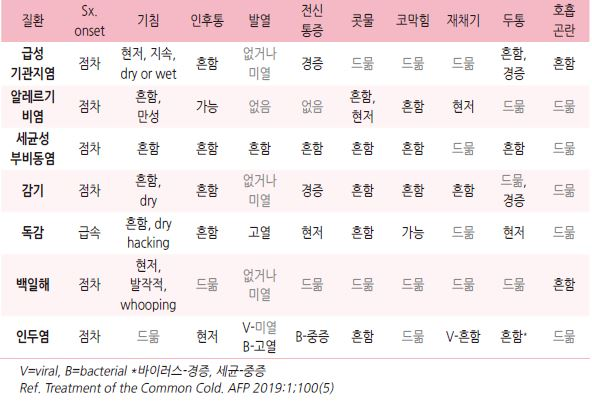
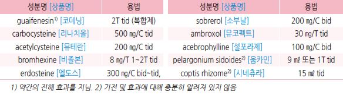
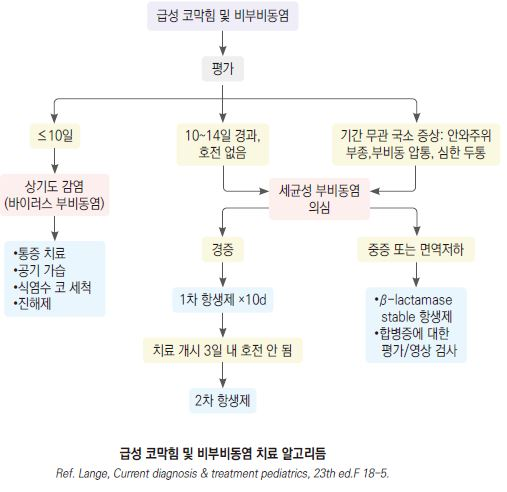
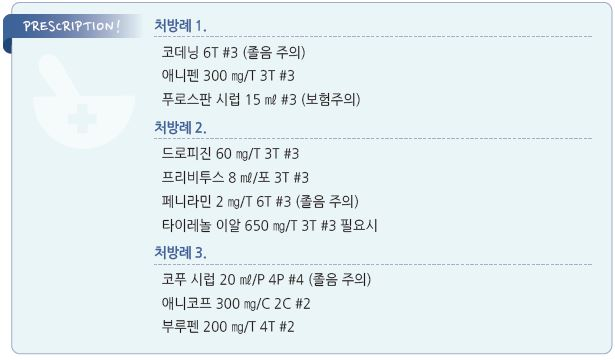

# 감기 Common Cold


## 일반 사항

*   코, 비강, 인후, 후두 등 상기도에서의 단일 또는 복수의 바이러스 감염에 의해 콧물, 코 막힘, 기침 등을 주증상으로

    두통, 근육통, 발열 등의 전신 증상이 발생하는 질환
* 빈도 : 소아 6~~8회/년, 성인 2~~3회/년
*   재감염 : 바이러스마다 다양한 혈청형과 변종이 있으며 잠복기가 짧고 바이러스에 대한 항체의 수명이 짧아 쉽게

    재감염될 수 있음
* 균 배출 기간 : 감염 후 3(\~5)일째 가장 높으며 2주까지 지속; 증상이 완화되어도 균 배출은 지속될 수 있음
* 경과 : 보통 7\~10일 내 자연 치유. \~25%에서 2주까지 지속; 흡연자는 비흡연자의 2배 지속
* 기전 : 코와 비인두 점막 상피 세포에 바이러스 감염 및 증식 → 염증 반응 → 증상

## 원인

### 원인균

* rhinovirus : 30\~50% 차지, 100가지 이상의 아형, 평균 잠복기 1.9일, 봄/가을 유행
*   coronavirus(10~~15%; 잠복기- 3.2일), influenza virus(10~~15%; A형 1.4일/B형 0.6일), parainfluenza(5%; 2.6일),

    RSV(5%; 4.4일), adenovirus(＜5%; 5.6일)
* \~40%에서 바이러스가 검출되지 않음 (검사 오류 또는 알려지지 않은 바이러스 감염 가능성)
* 5%에서 세균(±바이러스) 검출

### 전파 경로

#### 코 분비물의 접촉

* 감기 바이러스에 오염된 손으로 코 또는 눈\*을 만지면 전염됨 (\*비루관을 통하여 코로 유입)
* 환자 손의 50%에서 감기 바이러스가 검출됨
* 바이러스는 피부에서 3시간, 일반 환경에서 그 이상 생존할 수 있음
* 코를 통한 미량의 바이러스 유입만으로도 발병 가능

#### 공기 입자를 통한 감염

* 전염 가능성 낮음

> ✽공기 흡입을 통해 감염되기 위해서는 코를 통한 직접 접촉에 의한 감염에 비하여 20배의 균 농도가 필요하지만 기침/재채기를

> ```
> 통해 배출되는 입자에는 매우 적은 양의 바이러스가 존재하므로 공기 흡입을 통한 감염 가능성은 극히 낮음; 후두 분비물에는
> ```

> ```
> 코 분비물의 수십~백분의 1의 바이러스가 존재하며 침에는 후두 분비물의 ½의 바이러스가 존재 함
> ```

✽influenza virus는 공기 전파가 보다 많음

### 위험 인자

* 소아 : 특히 ＜3세, 위쪽 형제가 있는 경우
* 유아원 등원 : 특히 등원 첫 해에 50% 이상 빈도 증가 (12회/년 발병)

> ✽학교 입학 후에는 유아원을 다녔던 아동이 감기에 덜 걸림

* 계절 : 주로 초가을\~늦은 봄
* 흡연, 스트레스, 피로

## 임상 양상

*   일반적 경과 : 인후통 또는 목 간지럼 → 1\~3일 후 맑거나 점성의 콧물, 코 막힘, 재채기

    → 3\~4일 후 진한 농성의 콧물, 기침 → 자연 치유; 약물 치료가 경과를 변경시키지 못함
* 콧물/코 막힘 : 거의 모든 환자에서 발생; 보통 빨리 호전
* 재채기 : 환자의 ⅔에서 초기에 발생
*   기침 : 환자의 ½에서 발생; 보통 코 증상 발생 후 출현. 가벼운 기침은 다른 증상이 호전된 이후에도 2\~3주간

    지속될 수 있음
* 목구멍의 통증 또는 자극(50%), 쉰 소리(30%), 두통(25%), malaise(25%)
*   발열 : 없거나 첫 1\~3일에 미열

    •influenza virus, RSV, metapneumovirus, adenovirus에서 고열이 보다 흔함

    •어린 소아(＜6세)에서는 심하지 않은 감염에서도 고열이 흔함
* 구토/설사 : 흔하지 않음

## 진단

*   실험실/영상 검사 : 진단과 치료에 도움이 되지 않음; ＞14일 지속 시 감별을 위해 고려

    ✽콧물의 색깔과 점도의 변화(농성 콧물)는 상피 세포 및 중성구 유입과 관련된 일반적인 경과이며 이것으로 세균 감염

    또는 비부비동염을 판단할 수 없음

    

### 감별

* 기침 (☞ p.38)
* 편측의 피가 섞인 악취가 나는 콧물 → 코 이물
* ＞14일 지속되는 콧물 또는 기침, 두통 또는 안면부 통증, 안와 주위 부종 → 비부비동염
* 현저한 코 가려움 및 재채기 → 알레르기비염
* 자극감, 날씨 변화, 매운 음식 등에 의해 유발 → 혈관운동성 비염
* 코 울혈 제거제 사용력 → 약물 비염
* 콧구멍 주위의 긁은 상처, 점액농성 분비물 → 피부 감염 (Streptococcosis)

## 합병증

* 중이염 : 감기에 걸린 소아의 5\~30%에서 발생, 유아원 등원 시 보다 많이 발생 (☞ p.219)
*   비부비동염 : 소아 5~~13%(성인 0.5~~2%)에서 발생; 콧물 또는 주간 기침이 10\~14일 호전 없이 지속되거나

    안면 통증이 있으면 의심 (☞ p.253)
* 폐렴 : 세균성 폐렴은 드묾 (☞ p.308)
* 천식 악화 : 천식 조절이 잘 되고 있는 경우에는 흔하지 않음 (☞ p.336)

※ 감기에 대한 치료로 중이염, 비부비동염, 천식 등의 발병이나 악화를 예방하지는 못함

***

## Management

### 치료 방침

* 휴식, 적당한 영양 및 수분 섭취, 대증 치료
*   항히스타민제, 코 울혈 제거제, 진해제 등의 약물은 효과는 입증되지 않은 반면 심각한 부작용의 위험이 있으므로

    ＜2세에서의 사용을 제한함

## 치료 약물

```
(보험기준 ☞ p.1182)
```

### 진해제 (Antitussive)

* 감기 기침에 대하여 일관성 있는 유의미한 효과를 보이는 진해제는 없음
* 일률적인 진해제 사용은 권고하지 않음
*   감기에서의 기침은 호흡기의 염증 자체보다 후비루가 더 많은 영향을 주기 때문에 코 증상이 심한 시기에 기침도

    심하며 진해제에 대한 반응이 적고 1세대 항히스타민제가 약간의 도움이 됨
*   급성 질환 후 수일\~수 주간 지속되는 기도 반응성 증가에 의한 기침(Virus-induced reactive airway Dz)에 대하여

    기관지 확장제가 효과

#### 중추성

\*\* Dextromethorphan\*\*

* 기전 : 약한 NMDA 수용체 대항제
* 효과 : 일부 연구에서 효과; narcotics에 비하여 효과 및 부작용이 적음
* 30 ㎎ tid\~qid (✽환각 작용에 따른 남용으로 단일제는 판매가 중지되었고 복합제로만 시판 \[코푸정 에스])

\*\* Cloperastine\*\*

* 기전/효과 : 불명; σ1-receptor ligand, GIRK channel blocker, 항히스타민, 항콜린 작용 추정
* 부작용 : 졸림
* \[프리비투스] 8 ㎖/포, 5~~8 ㎖ tid, 2~~4세 2 ㎖ bid

\*\* Codeine\*\*

* 기전/효과 : 연수 기침 중추 억제; narcotics
* 부작용 : 졸음, 변비, 소화 장애
*   복합제로 시판; \[코푸 시럽] 20 ㎖/포 tid\~qid, \[코데닝] 6T #3. ＜12세에서 사용 금지

    ✽\[코푸 시럽] 10 ㎖ 중 dihydrocodeine 5 ㎎/methylephedrine 13.1 ㎎/ chlorpheniramine 1.5 ㎎/ammonium chloride 0.1 g;

    20 ㎖ tid\~qid

    ✽\[코데닝] dihydrocod. 5 ㎎/methylephed. 17.5 ㎎/chlorphen. 1.5 ㎎/ guaifenesin 50 ㎎; 6T #3

#### 비중추성

\*\* Levodropropizine\*\*

* 기전/효과 : 기침 경로의 C-fiber 억제; 일부 연구에서 dextromethorphan 대비 동등 이상 효과
* \[드로피진] 60 ㎎/T or 10 ㎖/P tid, 3 ㎎(0.5 ㎖)/㎏/d #3; \[레보케어 CR] 90 ㎎/T bid

\*\* Ivy leaf 추출물 (hederacoside C)\*\*

* 기전/효과 : 항경련 작용(아세틸콜린-유도성 기관지 연축을 방지), 항염, 점액 용해
* \[푸로스판] 5~~7.5 ㎖ bid~~tid, 2\~5세 2.5 ㎖ bid

\*\* Benzonatate\*\*

* 기전/효과 : 미주신경 억제, 뇌간 기침 중추 일부 억제; 효과는 다양하고 예측할 수 없음
* \[지콜] 100, 200 ㎎/C 3C #3

\*\* Theobromine\*\*

* 기전/효과 : methylxanthine 유도체. 미주신경 구심 신경 활성 억제
* 부작용 : 대용량에서 오심/구토
* \[애니코프] 300 ㎎/C 2C #2

\*\* β2-agonist\*\*

* 기전/효과 : 기도 폐쇄, 기관지 경련이 있는 경우에 도움 (☞ p.349)
* 부작용 : 떨림, 불안감
* salbutamol \[벤토린 에보할러]
* tulobuterol : 6개월~~3세 미만 0.5 ㎎, 3~~9세 미만 1 ㎎ \[호쿠날린 패취]
* formoterol : 40 ㎍/T 4T #2 \[아토크]
* procaterol : 50 ㎍/T 1T qhs\~bid \[메프친]

\*\* Ipratropium\*\*

* 기전/효과 : 천식성 기침에 대하여 효과
* \[아트로벤트 흡입액] (보험기준 ☞ p.1181)

#### 기타

\*\* Amitriptyline\*\*

* 기전/효과 : 바이러스 감염 후의 미주신경 장애 또는 감각 신경 장애와 관련된 기침, 주관적 기침
* \[에트라빌] 10 ㎎/T 1T hs

\*\* 항히스타민제\*\*

* 기전/효과 : 진정 작용
*   후비루와 인후 불편감을 포함한 급성 기침에 대하여 1세대 항히스타민제가 약간의 진해 효과가 있음;

    진정 작용이 없는 2세대 항히스타민제는 효과적이지 않음 (☞ p.1144)
* chlorpheniramine : 2 ㎎/T 1~~3T bid~~qid, 0.5 ㎎/㎏/d #4 \[페니라민]
* clemastine : 1 ㎎/T 1T bid \[마스질]

\*\* 박하, 자일리톨, 기타 사탕/껌\*\*

* 기전/효과 : 흡입 또는 물고 있는 동안 인후 민감도 감소
* 사탕은 흡인 위험을 감안하여 ≥6세에서 고려

\*\* 꿀\*\*

* 기전/효과 : 바이러스/세균/효모 성장 방지, 염증 감소, 항산화, 진정 효과
* 낮은 연구 수준에서 야간 기침 완화
* 용법 : 정해진 규칙은 없음; 5\~10 ㎖/d; 보툴리즘 위험을 감안하여 ≥1세에서 고려

### 점액 용해제 (Mucolytics)

*   효과 : 전반적으로 논란; 일부 연구에서 guaifenesin과 bromhexine이 유의미한 효과를 보임

    •소아에서는 유의미한 효과가 입증되지 않음

#### 종류

*   분비 촉진제 (expectorant) : aerosol(고장성 식염수), guaifenesin, 요오드 화합물,

    이온 통로 조절제(예: P2Y2 purinergic agonist)
* 점액 조절제 (mucoregulator) : carbocysteine, 항콜린제, steroid
*   점액 용해제 (mucolytics)

    •classic mucolytics : N-acetylcysteine, N-acystelyn, bromhexin, erdosteine, sobrerol

    •peptide mucolytics : dornase alfa, gelsolin, thymosin β4

    •non-destructive mucolytics : dextran, heparin
*   점액 활성제 (mucokinetics) : bronchodilator(흡입 β2-bronchodilator), methylxanthine, 표면 활성제, ambroxol,

    acebrophylline

    

### 콧물 치료제 (Anti-rhinorrhea)

* 감기(바이러스성 감염)에 의한 콧물은 주로 kinin과 관련되나 이에 대해 효과적인 약제는 없음
* 감기에서의 코 증상에 대하여 효능이 입증된 약제는 없음 (✽코 증상에 대한 위약 효과가 최대 40%까지 보고됨)

#### 항히스타민제

*   기전/효과 : 감기에서의 코 증상은 히스타민과 관련된 것이 아니므로 항히스타민제의 효과가 적음

    •2세대 : 감기에 의한 콧물에는 효과 없음

    •1세대 : 항콜린 작용으로 감기 콧물을 25\~30% 정도 줄임. 단, 분비물 배출 장애를 초래할 수 있음 (☞ p.1144)
* 부작용 : 졸음, 입마름, paradoxical hyperactivity, 호흡 저하(과사용 시)
* chlorpheniramine : 2 ㎎/T 1~~3T bid~~qid, 0.5 ㎎/㎏/d #4 \[페니라민]
* clemastine : 1 ㎎/T 1T bid \[마스질]

#### 비내 항콜린제

* 기전/효과 : 항콜린 작용에 의한 약간의 효과
* 부작용 : 비점막 자극, 코피
* 효과-부작용을 고려하여 권고하지 않음

### 코 막힘 치료제 (Decongestant)

* 기전 : 코 막힘 및 콧물 일부는 혈관 확장과 관련

#### 비내 울혈 제거제

* 부작용 : 약물 반동성 비염
* 소아에서의 연구는 부족함
* 용법 : 1일 2회 이내, ≤4일/월로 사용 제한
*   종류 (비보험) : phenylephrine \[시네프린], naphazoline \[나리스타]\(chlorpheniramine 복합),

    xylometazoline \[오트리빈], oxymetazoline \[레스피비엔]

#### 경구 코 울혈 제거제

* 효과 : 일부 연구에서 약간의 효과; 소아에서의 연구는 부족함
* 국소 자극 없음, 약물 반동성 비염 위험 없음
* 부작용 : CNS 자극, 혈압 상승, 가슴 두근거림, 불안, 수면 장애
* 주의 : 심혈관계 질환, 고혈압, BPH 환자에서 주의
* phenylephrine : 10 ㎎ tid\~qid; 복합제 \[코미 시럽]
* pseudoephedrine : 60 ㎎/T ½~~1T tid~~qid \[슈다페드]; 복합제 [액티피드](%EB%B9%84%EB%B3%B4%ED%97%98/)

#### 기타

*   아로마 oil (예: menthol, camphor, eucalyptus) : 코 밑에 도포하면 실제 기류 저항에 대한 변화는 없지만 호흡이

    편해진 것처럼 느낌
* 식염수 코 세척 : bid ×1wk; 일시적 증상 완화. 세척 시의 불편감 대비 효과 의문 (☞ p.243)

### 진통, 해열

* NSAID 및 acetaminophen 간의 입증된 효과 차이는 없음
* naproxen : 275 ㎎ tid, 500 ㎎ bid \[아나프록스, 낙센] (보험주의)
* ibuprofen : 400 ㎎ tid\~qid \[부루펜]
* acetaminophen : 650\~1,300 ㎎ tid \[타이레놀]

### 기타

#### 수분

*   충분한 수분 공급 : 호흡기 점막 진정 및 분비물 점도를 낮추는 데 도움

    •소아에서 지나친 섭취는 권하지 않음
*   공기 가습 : 분비물 점도 완화 기대(콧물, 코 막힘, 기침에 도움); 일관성 있는 효과는 입증 안 됨

    •가습기 사용 시 위생 상태 관리가 필요하며 뜨거운 가습기는 화상 주의를 요함

    •WHO는 가습기 사용을 반대함

#### 수액 치료

* 효과 : 유의미한 효과가 입증되지 않음
* 특히 소아에서는 전해질 불균형이 발생할 수 있으므로 탈수가 발생하지 않은 한 권하지 않음

#### 항바이러스제, 항생제

* 효과가 없으며 부작용 우려로 권고하지 않음
* 항생제는 세균 감염이 발생한 경우나 세균 합병증이 발병한 경우 외에는 효과가 없음

#### 아연 (Zinc sulfate)

*   효과 : 실험실 연구에서 바이러스 증식 예방; 일부 연구에서 감기 제 증상 및 유병 기간을 줄임

    ✽아연 보충이 COVID-19 환자의 사망률을 낮췄다는 보고가 있음
* 시럽 또는 사탕(lozenge)으로 공급
* 부작용 : 쓴맛, 구역
* 감기의 예방과 치료에 도움이 될 가능성이 있으나 충분하지 않은 연구 결과와 부작용을 고려하여 권고하지 않음

#### Echinacea purpurea

* 효과 : 입증 안 됨
* 용법 : 4 ㎖ bid

#### Probiotics

* 효과 : 감기 중증도, 유병 기간 및 발병 횟수 감소를 기대하나 입증 안 됨

#### Vit C

*   효과 : 규칙적 투여 시 증상의 중증도 및 유병 기간 감소

    •감기가 발생된 후부터 투여한 경우의 효과는 불확실
* 용법 : 1\~2 g/d

#### Vit D

* 부족 시 상기도 감염 위험 증가
* 효과 : Vit D 보충으로 감기가 예방되는지는 입증되지 않음

#### 마늘

* 효과 : 일부에서 유효; 입증 자료 부족
* allicin 180 ㎎ (3 g 마늘로서 약 20개)

## 예방

* 손 씻기, 맨손으로 눈/코/입 만지지 않기, 손 소독제 사용
* 감염자와의 접촉을 피함
*   금연

    

> **질병코드** J00 급성 비인두염\[감기]

J06 다발성 및 상세불명 부위의 급성 상기도감염



#### \[보험기준] 진해거담제 (2013-09-01)

1. 경구 진해거담제는 약제의 성분, 약리 작용 및 효능·효과, 환자의 증상에 따라 선별적으로 투여함을 원칙으로 하며
2. 상기도 질환에 시럽제를 포함하여 2종 이내, 그 이외의 호흡기 질환(천식 및 COPD는 제외)에는 시럽제를 포함하여

```
3종 이내로 인정
```

3. ＜6세의 경우에는 함량 및 성분 등이 과량 또는 중복되지 아니하는 범위 내에서 복합 시럽제 1종을 추가로 인정
4. 식품의약품안전처장이 정한 의약품분류번호 222, 229에 해당되는 약제라도 약리 작용이 진해, 거담, 기관지 확장이

```
아닌 약제는 적용되지 아니함
```

5. 진해 거담 주사제는 신속한 치료 효과가 필요한 경우에 인정
