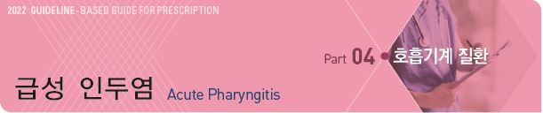
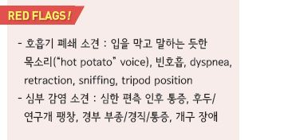
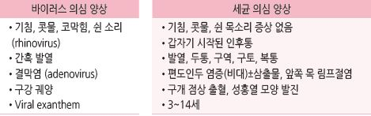
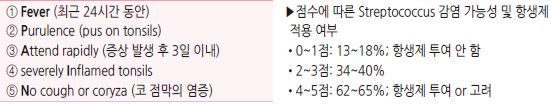
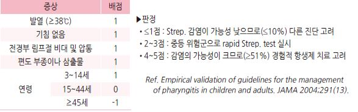
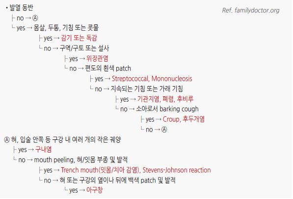
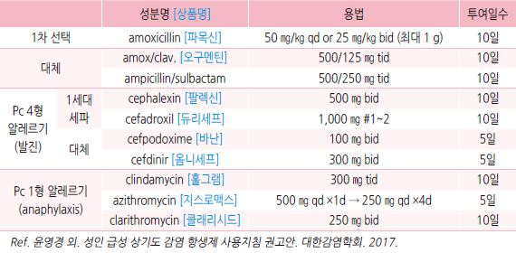
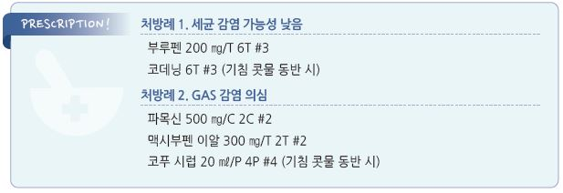

# 급성 인두염 Acute Pharyngitis



## 일반 사항

* 인두의 급성 염증
* 재발 또는 만성 감염의 경우 해부학적 이상, 면역 저하 등에 대한 평가/치료를 위하여 의뢰
* 전염 : 바이러스- 코 분비물 접촉(☞ p.281); GAS- 비말 감염
*   GAS 경과 : 24~~72시간의 잠복기 후 발병 → 발병 2~~3일째 발열이 최고조에 이름 → 합병증이 없으면 5\~7일째 호전

    (자연 치유); 항생제로 약간 단축되거나 완화됨
*   생활 복귀 : 적절한 항생제 치료 24시간 이후에는 전염성이 없는 것으로 간주하며 발열 등의 심한 증상이 없으면

    직장/학교 복귀 가능

## 원인

* 바이러스 : 감염의 대부분 차지; 주로 rhinovirus
* 세균 : 성인 10~~15%, 소아 15~~30%; 주로 group A Streptococcus (GAS)
* 비감염성 : 물리적/화학적 손상

### 위험 인자

* 늦가을\~초봄의 감기/독감 유행 시기
* 연령 : 소아, 청소년
* rheumatic fever 가족력
* 보육 시설, 학교 등 집단 생활
* 당뇨, 면역저하자
* 직간접 흡연
* 위산 역류
* 편도/아데노이드의 세균 군체

## 임상 양상

*   주요 증상 : 인후통, 삼킴곤란

    
* 인두 궤양 : CMV, HIV, 크론병, 혈관염 관련
* 편도/연구개 점상 출혈 : EBV, CMV 관련
* adenovirus 감염 시 인두결막열(발열은 7일, 결막염은 14일간 지속될 수 있음)

## 인두염 외 GAS 감염

### Scarlet fever

* GAS 인두염 의심 증상 + 피부 발진 (☞ p.845)

#### 피부 증상

* 선홍색 작은 구진
*   구진으로 인하여 피부는 건조하고 거친 질감의 사포 같은 느낌 또는 햇볕에 탄 피부에 소름이 끼친 것 같은 모양

    (goose pimple appearance)
* 홍반은 누르면 일시적으로 사라짐
* 모세 혈관이 약해져서 점상 출혈이 생길 수 있음; 굴곡부에 Pastia’s line이 생길 수 있음
* 얼굴에는 발진이 없는 편이나 이마와 뺨이 홍조를 띠면 입 주위가 창백하게 보임
* 가려움이 있을 수 있으며 통증은 보통 없음
* 겹친 부위(예: 겨드랑이, 팔꿈치 전와부, 오금, 사타구니), 압력을 받는 부위(예: 엉덩이)에 현저
* 출현 시기 : 열 출현 12\~48시간 후 발진 발생; 병의 첫 징후로 나타날 수도 있음
* 출현 순서 : 귀, 목, 가슴, 겨드랑이 → 몸통 및 사지 → 전신; 24시간에 걸쳐 진행
* 4일(3\~5일) 후부터 사라지기 시작
*   표피 탈락 순서 : 얼굴 → 몸통 → 손발: 발진 소실 7\~10일 후 시작; 가벼운 일광 화상과 비슷한 모습으로 탈락

    •표피 탈락의 정도와 지속 기간은 발진의 심한 정도에 비례 (1개월 이상 지속되기도 함)

### Post-Streptococcal Glomerulonephritis

* GAS 인두염 발병 1\~3주 후에 고혈압, 부종, 혈뇨 발생
* 항생제 치료로 PSGN의 발병 위험을 줄이지는 못함

### Rheumatic fever

* GAS 감염과 관련된 류마티스열은 드묾 (미국 10만 명당 1명 이하)
* GAS 인두염 발병 2\~3주 후에 발생
* GAS 인두염 발병 9일 이내 항생제를 투여하면 예방 가능

## 진단

### 검사

* 임상적으로 세균 감염 여부를 판단할 수 없으며 이에 대한 감별이 필요한 경우에 고려
* rapid GAS Ag detection test (인후 면봉 샘플) : 높은 특이도/낮은 민감도
* anti-streptococcal Ab : 과거 감염을 반영
* 배양 검사 : 보균 상태에서도 양성으로 나옴

### FeverPAIN criteria

```

```

### Centor Score (Modified/McIsaac) for Strep. Pharyngitis

```

```

### 증상/병력에 따른 인후 문제의 감별

```

```

***

## Management

### 치료 방침

* 대증 치료
* 항생제 : GAS 감염의 특징이 있는 경우에 시행; FeverPAIN or Centor score에 기초하여 결정
* 치료 후 완치 판정 검사는 필요 없음 (예외: 류마티스열)

## 비-약물 치료

* 안정 휴식
* 적당한 수분 섭취
* 사탕 물고 있기
* 소금물 가글 : 물 1컵(250 ㎖), 소금 ¼~~½ teaspoon(1.5~~3 g); 일부에서 효과

## 약물 치료

### 항생제

* 투여 기간 : 보통 10일간; 치료 중 증상이 완화된 경우에도 치료 일정을 끝까지 마침
* 항생제 투여 2\~3일 내 증상이 완화되지 않으면 항생제 변경 또는 재평가
* 지속 또는 재발 감염 시 배양 검사를 시행하고 진단된 균주에 대하여 항생제 치료 (보통 10일간)
* 반복 감염 시 가족 및 밀접하게 관계하는 사람들에 대하여 배양 검사 및 치료
* 예방적 항생제 치료 : 급성 류마티스열 병력 환자에서 적용
*   S. pyogenes (GABHS) 급성 인두편도염의 권고 항생제 용량 및 치료 기간

    
*   \[NICE 지침] phenoxymethylpenicillin ×5~~10d (1차 선택제); Pc 알레르기 시 clarithromycin 250~~500 ㎎ bid ×5d;

    임신부에서 erythromycin 250~~500 ㎎ qid or 500~~1000 ㎎ bid ×5d

### 통증

* NSAID, acetaminophen

> ✽NSAID가 acetaminophen보다 통증 완화에 다소 효과적이라는 보고가 있음 ✽NICE 지침에서는 급성 인후통에 대하여 acetaminophen을 1차 선택제로 추천

* 경구 steroid : 증상 완화에 도움을 줄 수 있으나 일률적 사용은 권하지 않음. steroid의 부작용을 고려하여 결정
*   국소 마취제/진통제 : 심한 인후통에 대하여 도포 또는 가글 (비보험)

    •lidocaine [카미스타드-엔 겔](%E2%89%A512%EC%84%B8/), benzocaine \[허리케인 겔], diclofenac \[아프니벤큐 액]

## 예방

* 손씻기 등 일반적 호흡기 감염 예방법과 동일
* 예방적 항생제 치료는 권하지 않음

> **질병코드** J02 급성 인두염


