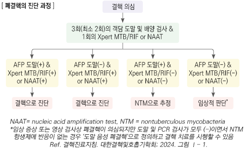
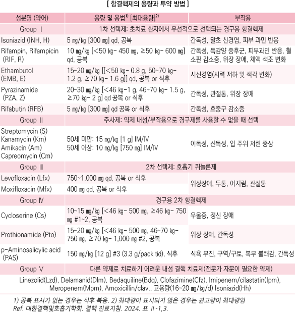
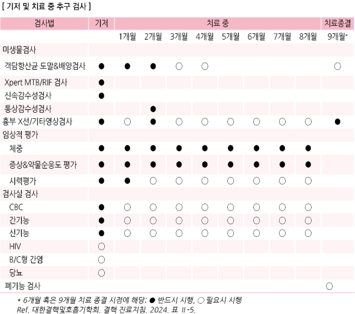
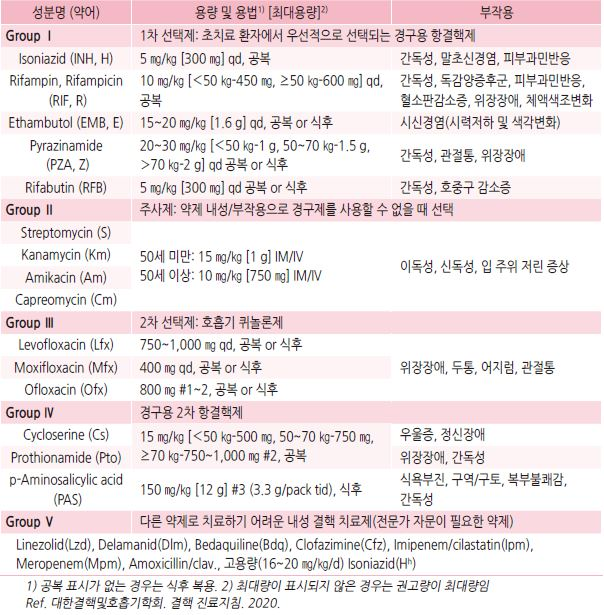
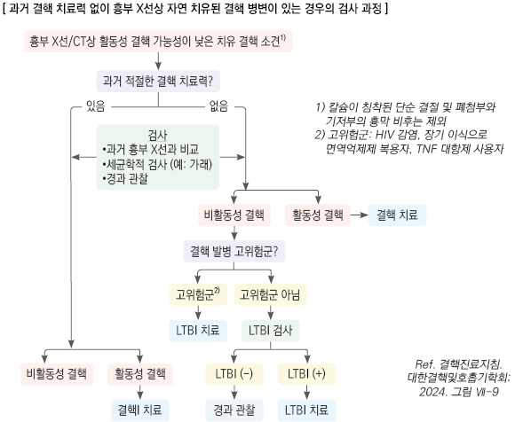
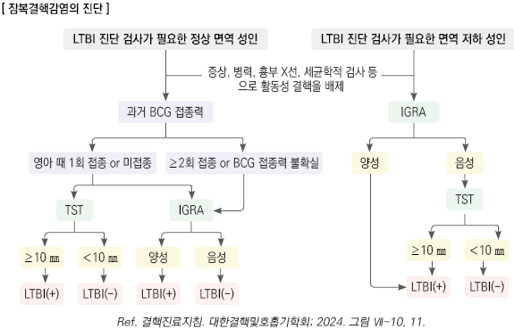
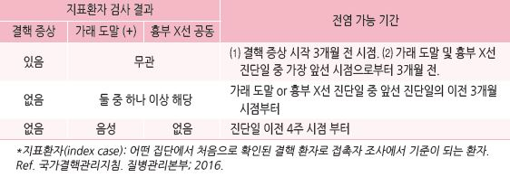
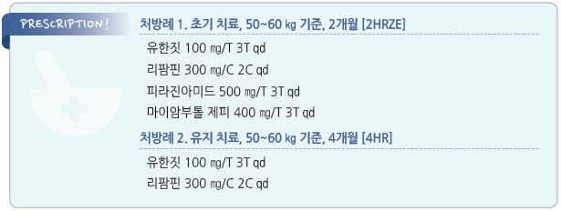

# 결핵 Tuberculosis


## 일반 사항

* 원인균 : Mycobacterium tuberculosis , M. bovis , M. africanum
*   전염 : 활동성 결핵 환자의 호흡기 분비물의 공기 매개 감염; 기침, 재채기, 말하기, 웃기 등을 할 때 배출되어 수 시간

    동안 공기 중에 떠다니며 감염을 일으킴
* 경과 : 결핵균에 노출된 사람의 20\~30%가 감염 → ‘박멸’, ‘초감염’, 또는 ‘잠복결핵’ 중 하나의 경과를 보임

### 용어 정의

#### 초감염 결핵 (Primary tuberculosis)

* 결핵균 감염 후 잠복결핵을 거치지 않고 바로 발생한 결핵

#### 잠복결핵감염 (Latent Tb infection, LTBI)

* 체내에 소수의 살아 있는 결핵균이 존재하지만 임상 증상이 없고 균이 외부로 배출되지 않아 타인에게 전파되지 않는 상태
* 면역학적 검사(TST, IGRA)에서는 (+)이나 가래 결핵균 검사와 흉부 X선 검사에서는 (-)

#### 활동성 결핵

* 결핵 병변에서 결핵균이 증식하면서 병을 일으키고 있는 상태
* 초감염 또는 LTBI의 재활성화에 의함

\*\* 분류\*\*

1. 도말, 배양, PCR 검사 등 세균학적으로 진단된 결핵
2. 세균학적으로 진단되지는 않았지만 증상, 영상/조직 검사 등의 방법으로 진단된 결핵

#### 전염성 결핵

*   다음 중 하나 이상에 해당

    ① 호흡기 검체에 대한 도말이나 배양 검사 또는 PCR 검사에서 양성

    ② 흉부 X선상 공동 관찰

    ③ 주치의가 전염성이 있다고 판단하는 경우 (검사 결과 무관)

#### 재활성화 결핵 (Reactivation Tb)

* LTBI 상태에서 면역 기전이 약해지면서 결핵균이 활성화되어 결핵이 발병한 상태
* 일생 동안 LTBI의 5\~10%가 ‘재활성화’되며, 발병 사례의 ½이 감염 후 첫 2년 내 발생

#### 자연 치유된 결핵 병변 (Spontaneously healed Tb leision)

* 흉부 X선에서 유소견이면서 활동성 결핵이 배제되고 결핵이나 LTBI 치료 경력이 없는 경우
* 결핵 발병의 상대 위험도가 높으므로(6\~19배) LTBI 치료를 권고

### 고위험군

* 건강 검진 결과 폐결핵 관련 유소견자
* ≥65세, 청소년, 마른 체형(ideal body weight의 ＜90%)
*   면역저하자 및 만성질환자 : 신부전, 당뇨병, 규폐증, HIV 감염, 위절제술 또는 공회장우회술 시행 or 예정,

    면역억제제 또는 TNF 대항제 또는 장기간 steroid(prednisone ≥15 ㎎/d ×≥1달) 사용 or 예정
* 취약 계층 : 광부, 알코올/마약 중독자, 노숙인, 이탈 주민
*   결핵 발생률이 높은 국가로부터 입국한 외국인. 예) 러시아, 중국, 몽골, 인도, 인도네시아, 말레이시아, 베트남, 태국,

    필리핀, 우즈베키스탄

## 임상 양상

* 결핵 초기에는 무증상이 많음
* 폐 증상 : 지속되는 기침, rale, 호흡 곤란(진행, 흉수 발생 시), 객혈(공동 형성 시)
* 전신 증상 : 발열, 야간 발한, 체중 감소, 무력감, 식욕 부진, 무통성 림프절 부종

## 진단

#### 검사 대상

* 환자 접촉자 (☞ p.333)
* 뚜렷한 원인 없이 ＞2주 기침과 가래가 있는 경우 결핵 가능성을 고려하여 검사
* 다음의 경우 연 1회 이상 흉부 X선 등으로 결핵 검진 : ≥65세, 기숙사 입소 or 예정

#### 진단 및 조치

1. 폐결핵 의심 시 흉부 X선, 가래 항산균 도말 및 배양 검사, Tb-PCR 검사
2.  검사 결과에 따라 다음 조치 (결핵 확인 시 보건소에 신고)

    

영상 검사

*   흉부 X선 : 정상 면역 시 주로 상엽, 면역 저하 시 하엽 침범

    • 환자의 \~⅓에서 비전형적 소견을 보임; 흉부 X선 단독으로 결핵 유무를 판단하지 않음

    • X선상 폐결핵 의심 시 과거 사진과 비교하고 가래 결핵균 검사 시행

    • 폐렴에 대한 치료에 반응하지 않으면 폐결핵 의심
*   흉부 CT : 다음의 경우 고려

    ① 도말(-) 폐결핵에서 흉부 X선으로 활동성 여부를 판단하기 어려움, ② 결핵과 다른 유사 질환의 감별이 어려움
* 치료 중에도 영상 소견은 악화될 수 있으며, 회복 후에도 영상 소견의 호전에는 수개월 이상 소요될 수 있음

### 가래 항산균 도말 및 배양 검사

* 3회(최소 2회) 시행; 1회차는 즉시, 2,3회차는 아침 기상 직후 채담하여 시행

#### 채담 방법

① 음식물과 세균을 제거하기 위해 물로 입안을 헹구어 냄

② 두 번 깊게 숨을 들이쉰 후 서서히 내쉼 → 깊게 숨을 들이쉰 후 세게 숨을 내쉼

```
→ 다시 깊게 숨을 들이쉰 후 기침을 하면서 가래통에 충분한 양(≥3 ㎖)의 가래를 모음
```

③ 보관 : 냉장 보관, 가래통이 햇빛에 노출되지 않도록 함(종이로 감싸거나 봉투에 담음)

* 전염 위험을 감안하여 외부와 환기가 잘 되는 곳에서 시행
*   유도객담 채취 : 네뷸라이저로 46~~52℃의 고장성 식염수를 15~~30분간 흡입시킨 후 기침을 자극하여 가래를 얻음;

    가래가 잘 나오지 않는 경우 고려

### 가래 결핵균 핵산증폭검사 (NAAT; Tb-PCR)

*   결핵이 의심되는 모든 환자에서 시행; 항산균 증식이 확인되면 결핵균과 NTM(non-tuberculous mycobacteria,

    비결핵 항산균) 감별 검사를 시행
* 위양성을 감안하여 결핵이 의심되지 않는 경우에는 시행 안 함
* 폐외 결핵 검체(예: 흉수, 뇌척수액, 소변)에 대해서는 민감도가 낮음

#### XpertⓇ MTB(M. tuberculosis )/RIF(rifampicin)

* 가래 검체에 대한 자동화된 real-time PCR 검사 시스템
* MTB DNA 및 RIF-resistance mutation을 2시간 내 진단할 수 있음
* 대상 : 다제 내성 결핵의 고위험, 신속한 결핵 진단, 약제 내성 확인이 필요한 경우. 예) 재치료, 중증 결핵, HIV 감염
* RIF 내성 가능성이 낮은 상황에서 검사 결과가 내성으로 나오면 다른 검사로 확인을 요함

### 면역학적 긴단(결핵균 감염 검사)

* 위양성, 활동성 결핵과 LTBI의 구별 안 됨
* 결핵이 의심되지만 결핵균 검사가 음성이고 진단이 어려운 경우 활동성 결핵의 진단을 위해 보조적으로 사용 가능

#### 투베르쿨린 검사 (Tuberculin Skin Test, TST)

* 장점 : 검사 오류 가능성이 적음, 질병 진행 위험도의 예측 가능, 저렴한 비용
* 단점 : 위양성, 활동성 결핵과 LTBI의 구별 안 됨, 2회 방문 필요, 검사 부작용, 영아(＜3개월)에서는 위음성 가능성이 높음
*   검사 제외 대상 : 결핵 과거력, LTBI 진단력, BCG를 ≥1세 접종 또는 ≥2회 접종, 검사할 피부 상태가 안 좋음,

    피부 자극 우려(예: 간질환, SLE, 스티븐스-존슨증후군, 백혈병, 심한 아토피, 켈로이드 피부, 조절되지 않는 당뇨병)

**검사 방법 (Mendel-Mantoux Test)**

* 검사 항원 : 2TU PPD RT 23
* 부위 : 정맥에서 멀리 떨어지고 피부 병변이 없는 팔꿈치 관절 5\~10 ㎝ 아래 전박 안쪽 피부
*   주입 방법 : 0.1 ㎖ 피내 주사, 6\~10 ㎜의 팽진을 만듦; PPD가 밖으로 많이 흘러나왔거나 팽진이 생기지 않은 경우

    반대쪽 전박 또는 같은 쪽 이전 주사 부위에서 5 ㎝ 떨어진 곳에 재시행
* 생백신과의 동시 접종 가능; 따로 시행 하는 경우 생백신 접종 4주 이후 TST 시행

**판독 방법**

* 접종 후 48\~72시간 사이에 판독 (☞ 검사 및 판정 방법 https://www.cdc.gov/tb/education/mantoux/)
*   팔꿈치를 약간 구부린 상태에서 팔의 길이 방향과 직각으로 경결 부위의 가장 긴 지름을 ㎜ 단위로 측정(발적 부위를

    측정하지 않음); 여러 차례 측정한 경우에는 최대값으로 판정
* 수포나 괴사 반응이 있으면 크기와 모습을 병기. 예) 18B, 20V, 25N
* 판정에 1세 이전에 접종한 BCG 접종력은 고려하지 않음

**TST 양성 기준**

* 일반 : ≥10 ㎜
* HIV 감염자: ≥5 ㎜
* 신생아 : BCG 접종 시 ≥10 ㎜, BCG 미접종 시 ≥5 ㎜
* 강양성 : ≥15 ㎜ 또는 경결 크기에 상관없이 수포(B), 소수포(V), 또는 괴사(N)가 있는 경우
* 지연(72시간 이후) 판독한 경우에도 양성에 해당되는 값을 보이면 양성으로 판정

**투베르쿨린 연속검사 (serial TST)**

*   균 침범 후 8주 이내에 검사 시 위음성으로 나올 수 있으므로 환자와 접촉한 사람에서 최초 검사에서 음성인 경우에는

    마지막 환자 접촉 시점으로부터 8\~10주 이후에 TST를 재시행
* 양전(positive conversion) : 처음 검사에서 (-)이었으나 재검에서 (+); 최근 감염을 의미
* 양전 판정 기준

⑴ ≥19세 : 이전 음성 → 재검에서 ≥10 ㎜

⑵ ＜19세

```
① 이전 결과가 ＜5 ㎜ 경우 → 두 번째 결과가 ≥10 ㎜
```

② 전염력이 높은 전염원, 접촉자가 전염원과 긴밀 또는 장기간 접촉, 접촉자가 ＜5세 또는 면역저하자,

```
    이전 결과가 5~9 ㎜ → 이전 결과보다 ≥6 ㎜ 증가
```

#### 인터페론감마 분비검사 (Interferon-gamma releasing assay, IGRA)

* 원리 : (결핵균에 감작된) T 림프구를 결핵균 항원으로 자극하여 분비되는 인터페론 감마를 측정
*   장점 : 위양성 가능성이 적음(검사 특이도가 높음), BCG 접종에 영향을 받지 않음, 1회 방문으로 완료, 재검사 시의 증폭

    효과 없음 (QuantiFERONⓇ, SPOTⓇ)
*   단점 : 활동성 결핵과 LTBI의 구별이 안 됨, 까다로운 검체 관리(예: 검체 튜브 온도 관리, 채취 후 배양까지의 시간 제한),

    소아에서의 임상 자료 부족, 고비용
* 5\~18세에서는 일반적으로 IGRA 단독 사용은 권하지 않음; ＜5세에서는 적용하지 않음

**QuantiFERONⓇ 검사 방법**

1. 전용 blood collection tube 준비 (보관 조건 : 2\~25℃에서 15개월; ＞25℃에서 보관 시 폐기)
2. 혈액 채취

⑴ 회색, 빨강, 보라색의 3개의 튜브에 각 1 ㎖씩 채혈

① 냉장 보관 하던 tube를 미리 꺼내어 ≥17℃ 되도록 하고 채혈하는 동안 17\~25℃을 유지

② 반드시 회색(Nil), 빨강(Tb-Ag), 보라색(Mitogen) 튜브 순으로 채취

③ 2\~3초에 걸쳐 혈액을 튜브 라벨의 검정색 마크까지 천천히 주입

⑵ 튜브 벽면에 코팅된 항원이 혈액에 녹을 수 있도록 10번 이상 충분히, 부드럽게 흔들어 줌(심하게 흔들면 겔이

```
망가질 수 있으므로 주의)
```

⑶ 채혈한 튜브는 17℃\~27℃에서 보관하며 16시간 이내에 배양 시작

### 약제 감수성 검사

* 모든 결핵 환자의 첫 배양 분리 균주에 대하여 최소한 INH 및 RIF에 대하여 시행
*   INH 또는 RIF에 대한 내성이 확인된 경우 다른 항결핵제(퀴놀론제, 주사제 포함)에 대해서도 시행;

    그 외 2차 항결핵제는 약제 감수성검사의 정확성이 떨어지므로 필요한 경우에만 시행
* 3개월 이상 치료에도 배양에서 (+) 또는 치료 실패가 의심되는 경우에는 재시행
*   신속 내성 검사 : 재치료 등 다제 내성 결핵이 의심되는 경우 도말 양성 검체 또는 배양된 결핵 균주를 대상으로

    INH 및 RIF에 대한 신속 내성 검사를 시행

### 조직 검사

* 대상 : 폐외 결핵 진단 또는 치료 반응 평가가 필요한 경우
* 조직 검사 시 조직 검체에 대해 항산균 배양 검사와 Tb-PCR 검사를 함께 시행

***

## Management

## 치료 전 조치

* 병력 청취 : 항결핵제 부작용 발생 위험 평가, 임신 가능성
* 기저 검사 : 시력, CBC, LFT(AST, ALT, ALP, bilirubin), RFT(Cr)
* 약제 감수성 검사 : 치료 시작 시 얻은 배양 양성 결핵균에 대하여 시행

## 항결핵제

```

```

#### Isoniazide, INH

* \[유한짓] 100 ㎎/T
*   \[부작용] 말초신경염 : Vit B6 결핍 초래와 관련. 통상 용량(≤400 ㎎/d)에서는 흔하지 않으며 임신, 영양실조,

    알코올 남용, 고령, 간질 기왕력, 만성콩팥병, 당뇨병 등에서 보다 흔함

    • 대처 : 피리독신 10\~50 ㎎/d 투여로 예방

#### Rifampicin, RIF

* \[리팜핀] 150 ㎎/C, 300 ㎎/C, 600 ㎎/T
*   \[부작용] 혈소판 감소

    • 대처 : 투여 중단, 주기적 혈소판 검사; 정상 회복 후에도 RIF는 재투여 하지 않음
* 주의 : 약 색깔로 인하여 소변, 눈물 및 땀이 오렌지색으로 변색됨; 콘택트렌즈 착색 주의
*   상호 작용 : 다음 약제들은 RIF와 병용 시 CYP450 대사와 관련하여 용량을 늘리고 주의를 요함; 경구 피임약, steroid,

    quinidine, phenytoin, warfarin, 인슐린, sulfonylurea

Ethambutol, EMB

* \[마이암부톨 제피] 400 ㎎/T; 고용량 사용 시 2개월 후 감량
*   \[부작용] 시신경증 : 시력 저하, 적록 색맹, 중심 암증, 주변 시각 장애; 용량, 투여 기간과 관련. 신기능 저하 환자 또는

    ≥25 ㎎/㎏/d 투여 시 위험성 증가
* ＜12세 금기

Pyrazinamide, PZA

* \[피라진아미드] 250 ㎎/T, 500 ㎎/T
*   \[부작용] 관절통 : ⅓에서 주로 치료 2개월 이내에 발생

    • 대처 : 투약을 유지하면서 NSAID 투여
*   \[부작용] 통풍 : 발작은 드묾

    • 대처 : 중단, 통풍 환자 또는 ≥2개월 사용 시 요산 모니터링

#### Aminoglycoside

* streptomycin sulfate \[황산스트렙토마이신 주], kanamycin \[카나마이신황산염 주], amikacin \[아미킨 주]
*   \[부작용] 이독성(이명/어지럼), 입 주위 감각 이상, 두통

    •대처 : 심한 경우 감량
* 용법 : 5~~7일/주 qd → 2~~4개월 후 또는 임상적 호전 시(예: 균 음전) 2\~3일/주 qd

## 초치료 (New patient)

### 치료 원칙

1. 초치료 대상자 : ① 이전에 결핵 치료를 받은 적이 없거나, ② ＜1개월의 결핵 치료를 받은 환자
2. 내성 발현을 예방하기 위해서 ≥3가지 항결핵제들의 병합 요법 시행
3. 정확한 용량 처방, 최고 혈중 농도가 중요하므로 1일 1회 복용
4. 간헐적으로 증식하는 균까지 멸균하기 위해 규칙적으로 ≥6개월 이상 장기 치료 시행

### 치료 프로토콜

#### 표준 6개월 요법 : 2HRZE/4HR(E)

*   초기 집중 치료기 : 2개월간 4제(H 이소니아지드, R 리팜핀, Z 피라진아미드, E 에탐부톨)

    → 유지 치료기 : 4개월간 3제(H, R, E) 투여; 약제 감수성 검사에서 INH와 RIF에 감수성 결핵으로 확인되면

    3개월째부터 에탐부톨은 제외할 수 있음

#### 9개월 요법 : 9HRE

* 초치료 시 피라진아미드를 사용하지 못하는 경우 이소니아지드, 리팜핀, 에탐부톨 9개월 투여

> ✽복합제 사용으로 투약 순응도를 높일 수 있음. 예) [리파터](HRZ/), [튜비스투](HR/)

#### 치료 기간 연장

*   치료 전 흉부 X선상 공동이 있고 집중 치료기 2개월 완료 시점에서 시행한 객담 배양 검사가 양성인 경우에는

    유지 치료 기간의 연장을 고려

## 치료 효과 평가/추구 검사

*   가래 도말 또는 배양(+) 환자 : 치료 시작 후 2회 연속 (-)으로 나올 때까지 매달 도말 및 배양 검사를 시행;

    치료 종결 시점에 마지막 가래 검사 시행
*   임상적으로 치료 실패가 의심되는 경우 : 추가로 가래 도말 및 배양 검사 시행 → 배양(+)이 나오는 경우 이 결핵균에

    대해 추가로 약제 감수성 검사 시행
* 흉부 X선 단독으로 치료 반응을 평가하지 않음
*   역설적 반응 : 치료 도중(보통 치료 시작 2개월 이후) 치료 실패가 아니면서 면역 반응이 증가되어 임상 증상 및

    영상 소견이 일시적으로 악화되는 현상(예: 고열, 림프절염 발생/악화, CNS 병변 악화, 폐결핵 병변 악화, 흉수 증가);

    항결핵제들을 적절히 복용 중이며 객담 도말 및 배양 검사에서 (-)이고 다른 질환의 가능성이 거의 없을 경우

    기존 치료를 유지함
*   치료 종결 시점에 결핵 후 폐 질환에 대하여 평가; 호흡 곤란이 있거나 영상 검사에서 유의미한 후유증이 관찰되면

    치료 종결 시점 혹은 종결 후 6개월 이내에 폐기능 검사를 권고



### 초치료 결과의 분류

* 완치 : 치료 종료 후(마지막 달) 시행한 가래 배양 검사(-) & 이전 시행 배양 검사가 1회 이상 (-)
*   완료 : 치료 종료 후(마지막 달)의 가래 도말 및 배양 검사(-)인 결과가 없지만 이전에 시행한 도말 및 배양 검사에서

    1회 이상 (-)이고 치료 실패의 기준에 해당되지 않음
* 실패 : 치료 4개월 후 또는 그 이후 시행한 배양 검사가 (+)인 경우
* 추적 방문 중단 : 치료를 시작하지 않았거나 연속 2달 이상 치료가 중단된 경우
* 평가 미정 : 다른 기관으로 전출되었거나 치료 결과를 알 수 없는 경우
* 치료 성공 : 완치 또는 완료된 경우

## 부작용 대처법

#### 간 독성

*   증상 : 간 효소 수치 상승, 전신 쇠약감, 구역, 구토, 우측 상복부 불쾌감, 가려움, 황달

    •고령, 간질환 기왕력, 알코올 남용자에서 정기적으로 간 효소 검사
* 조치 : ALT가 정상 상한치(ULN)의 ≥3배+간염 증상 or ≥5배 시 INH, RIF, PZA 투여 중단
*   재투여 : ULN의 ≤2배로 감소(기존 간질환자는 정상화) 시 1주마다 RIF, INH, PZA 순서로 한 가지 약제씩 간 기능 검사를

    시행하면서 재투여; 필요시 저용량으로 시작, 점차 증량
*   재투여 시도 기간이 길어지고 내성 발생이 우려될 경우에는 간 독성이 적은 3가지 이상의 약제(예: ethambutol,

    cycloserine, quinolone, aminoglycoside)를 투여하면서 한 가지 약제씩 재투여 시도

#### 위장 장애

* 간 독성 여부 확인 : 구역, 구토, 식욕 저하 등의 증상이 심하거나 ＞1주 지속 시 간 검사 시행
*   간 독성과 무관한 경우의 대책 : 복용 시간 변경(예: 식후, 취침 시), 분할 복용(한 성분의 약은 절대로 분할 투여하지 않음),

    위장약 병용

#### 피부 발진

* 가려움을 동반한 국소 발진 : 항히스타민제로 완화 시도
* RIF 복용 중 출혈성 발진 : 투여 중단 후 주기적으로 혈소판 수치 검사; 정상으로 회복되어도 RIF는 재투여 하지 않음
*   점막 침범, 발열 등을 동반한 전신 홍반성 발진 : 모든 약제 투여를 즉시 중단. 필요시 일시적으로 3가지의 다른 항결핵제

    투여. 발진이 호전되면 2\~3일 간격으로 RIF, INH, PZA 순서로 한 가지씩 재투여

#### Drug fever

* 결핵 자체에 의한 발열과 약제에 의한 발열의 감별 필요
*   약제열인 경우 모든 약을 중단하면 24시간 이내에 발열이 소실됨

    

## 특별한 경우의 치료

### 실패 후 재치료

* 치료 실패 결핵의 재치료는 전문가에게 의뢰하는 것을 권고
* 치료 실패의 원인을 찾기 위한 병력 청취
* 1, 2차 항결핵제에 대한 약제 감수성 검사 및 INH/RIF에 대한 신속 내성 검사 시행
* 치료 실패 후 재치료로 새로운 항결핵제를 추가할 때는 한 가지씩 추가하지는 않음

### 치료 중단 후 재치료

*   결핵 치료 초기(결핵균의 양이 많은 시기)에 중단되거나 치료 중단을 자주 할수록 약제 내성균이 증가하고 치료 실패

    위험성이 증가함
* 2개월 이상 항결핵제 투여 중단 시 신고
* 자세한 병력 청취 등을 통하여 중단의 원인을 파악하고 재치료 시 교육, 상담, 사회적 지지 제공
* 치료 중단 후 다시 치료 시작 시 반드시 가래 배양 검사와 약제 감수성 검사를 시행
* 이전 치료 중 항결핵제 부작용이 발생하지 않았을 경우에는 표준치료 요법으로 재치료
* 이전 치료에서 항결핵제 부작용이 발생한 경우에는 해당 약제는 제외, ≥3가지의 약제로 구성

#### 초기 집중 치료기 때 중단 시 대처

*   치료 중단 기간 ＜14일 : 약물 치료를 유지하면서 초기 집중 치료 기간 동안 복용해야 하는 약제들을 모두 복용한 후

    유지기로 넘어감
* 치료 중단 기간 ≥14일 : 처음부터 치료를 다시 시작

#### 유지기 때 중단 시 대처

* 총 유지기 기간의 ＜80% 복용 후 중단 및 중단 기간 ＜2개월 : 남은 기간 모두 복용
* 중단 기간 ≥2개월 : 처음부터 다시 치료 시작
*   총 유지기 기간의 ≥80% 복용 : 치료 시작 시 도말(-)이었으면 치료 종결, 도말(+)이었으면 유지기의 남은 기간을 모두

    복용하고 종결

### 재발 결핵

* 권고에 따른 초치료 종료 후에 재발한 경우 : 초치료 시 사용한 약제로 재치료
* 초치료 종료 2년 이내에 재발한 경우 : 치료 기간을 3개월 연장하여 9개월 요법으로 재치료
* 결핵균에 대한 신속 내성 검사를 시행하여 다제 내성 결핵 여부 확인 및 처방 조정

## 내성 결핵

* 한 가지 이상의 항결핵제에 내성을 가진 결핵균에 의해 발생한 결핵

#### INH 단독 내성 결핵

* REZ(RIF, E, PZA)으로 6\~9개월간 치료; INH는 중단함
* 병변의 범위가 넓고 심한 경우 퀴놀론계 약제 추가를 고려
*   초치료 표준요법 HREZ으로 치료를 시작한 후 PZA 중단 시점에서 INH 단독 내성으로 확인되면 INH를 중단하고

    RE로 총 12개월간 치료

#### RIF 단독 내성 결핵

* RIF 중단
* HEZ(INH, EMB, PZA) & 퀴놀론으로 12\~18개월간 치료(PZA를 최소 2개월 사용)
* 병변의 범위가 넓고 심한 경우 주사제 병용 고려

#### 다제 내성(multi-drug resistant) 결핵 및 광범위 약제 내성 결핵

* 의뢰
* 치료 기간 : 다제 내성 결핵 치료력이 없는 경우 최소 20개월(집중 치료기를 최소 8개월로 함)

### 임신

* 초치료 : 6개월 표준치료 \[2HREZ/4HR(E)] 또는 9개월 치료 \[9HRE]
* 모유 수유 : 1차 항결핵제 치료 시 모유 수유 가능; INH 투여 시 피리독신 병용

### 간질환자

* 간 손상이 심하지 않은 만성 간질환자 : 9HRE 및 정기적 간 효소 검사
* 중증, 불안정한 간 기능 변화를 보이는 만성 간질환자 : 의뢰

### 신질환자

* 신 기능 저하자 : 투약 간격 연장, 일 투여량 변경; INH, RIF, moxifloxacin은 조절 필요 없음
* 투석 환자 : 투석 직후 항결핵제 투여

### 결핵성 흉막염

* 의심 소견 : 편측 흉수(흉수 adenosine deaminase ＞40 IU/L)
* 치료 : 2HREZ/4HR(E)
*   흉수 치료 : 흉수의 양이 많아 호흡 곤란이 심하거나 loculated pleural effusion이 있는 경우에 흉수 배액 및 섬유 용해제

    사용 고려

### 기관지 결핵

* 일반적인 폐결핵 치료와 동일; 기관지 협착 주의
* steroid 투여 : 기관지 협착 발생 가능성이 높을 경우 고려
* 중재 시술 : 기관지 협착이 진행된 환자에서 증상과 폐 기능 개선을 위해 고려

### 림프절 결핵

* 검사 : 림프절 검체로 조직 검사 및 항산균 배양 검사 시행
* 치료 : 2HREZ/4HR(E)
* 림프절 제거 대상 : 진단 목적, 적절한 약물 치료에 호전되지 않음, 림프절 비대와 관련한 심한 불편

### 기타 결핵

* 결핵성 수막염 : 사망 및 신경학적 후유증 발생 위험이 높음; 2HREZ/7\~10HR(E)
* 결핵성 복막염, 장 결핵, 속립성 결핵, 비뇨생식기 결핵, 결핵성 심낭염 : 2HREZ/4HR(E)
* 골 및 관절 결핵 : 6\~9개월 치료; 약제에 무반응, 감염 진행, 또는 신경 손상 시 수술
* 복부 결핵 : 복강경을 통한 복막 생검
* 결핵성 심낭염 : 보조 요법으로 steroid 추가

## 환자 격리 및 해제

#### 격리

* 격리 개시 : 전염력 의심 때부터
* 외출 시 : 진료 등 외출이 불가피한 경우 마스크 착용 (덴탈 마스크 가능)

#### 입원 명령 대상

① 다제 내성 전염성 호흡기 결핵 환자 (신속 내성 검사 및 Xpert 검사에서 리팜핀 내성의 경우도 다제 내성으로 간주)

② 치료 비순응 환자

③ 진료 의사가 입원 명령이 필요하다고 판단하고 자치단체장이 승인한 경우 (외국인은 별도 규정)

#### 입원/격리 해제 기준

*   다음을 모두 충족한 경우

    ① 최소 2주간의 결핵 치료 시행 (✽전염력은 치료 개시 2주 내에 급속히 사라짐)

    ② 가래 도말검사 연속 ≥3회 (-) (첫 음성 결과 확인 후 8\~24시간 간격으로 연속 2회 시행)

    ③ 임상적 호전

    ④ 담당 의사가 전파 우려가 충분히 감소되었고 퇴원 후 치료에 순응할 것이라고 판단
*   가래 도말검사(+)인 경우에도 임상 소견이 호전되어 퇴원이 가능할 경우에는 퇴원하여 균 음전 시까지 집에서 격리 치료

    할 수 있음
*   다음의 경우에는 보다 장기간의 주의를 요함 : 낮은 약제 순응도, 통원 치료 불가능, 지속적으로 균을 배출하는 만성 환자

    (내성 결핵)

## 예방

* BCG 접종 : 생후 4주 이내의 모든 신생아에게 시행 (☞ p.1108)
* 환자 교육 : 금연, 금주(특히 간에 대한 약물 부작용 등을 고려하여 금주 권고)

### ■ 잠복결핵감염 Latent tuberculosis infection, LTBI

* LTBI(+) 환자는 평생에 걸쳐 5\~10%에서 결핵 발생(이들 중 ½은 감염 후 2년 이내에 발생)

### 선별 검사 대상

*   시행 : 전염성 결핵 환자 접촉, HIV 감염, 면역억제제/TNF 길항제/생물학적 제제/소분자 억제제 투여(예정),

    과거 결핵 치료력 없이 흉부 X선 상 자연 치유 결핵 병변, 규폐증
* 권고 : steroid 장기 투여, 투석, 혈액암, 의료기관 종사자
* 고려 : 당뇨병, 고형암, 위절제술(예정)
* 제외 : 과거에 활동성 결핵 또는 LTBI로 치료한 환자 또는 LTBI 검사(+)으로 확인되었던 자(이런 상황에서는 검사가 유용하지 않음)

### 진단

```

```

### 

### 치료 및 검사

* 치료 결정 전 반드시 활동성 결핵의 가능성을 배제해야 함
* 기저 검사 : CBC, ASTALT, 빌리루빈, B형/C형 간염; 필요시 HIV, 임신
* 치료 전 기저 혈액 검사를 시행; 간독성 위험군에서는 규칙적으로 혈액 검사 시행
*   치료 중 검사 : 첫 방문 시 간기능, 빌리루빈 검사, CBC(리파마이신 복용 시); 기저 간기능 검사에 이상이 있거나 간질환 위험

    인자가 있는 경우 매달 간기능 검사
*   치료 완료 : 9H는 12개월 내에, 4R은 6개월 내에, 3HR은 4개월 내에 정해진 약제의 80% 이상을 복용한 경우; 3HP의 경우

    16주 내에 11회 이상의 약제를 복용한 경우
*   재치료 : 결핵 발병의 위험군이 전염성 결핵 환자와 최근 접촉한 경우에는 과거에 적절한 결핵 치료 또는 LTBI 치료를

    성공적으로 완료하였더라도 LTBI에 대한 재치료를 고려
* LTBI 치료 중 활동성 결핵이 발생한 경우 : LTBI 치료에 사용 중이었던 약제를 포함한 초치료 표준 처방으로 새로이 치료 시작

#### 치료 약제 용법

* 최근에 전염성 결핵 환자와 접촉한 경우에는 전염원의 약제 감수성 검사 결과를 참고
* 표준 치료 : RIF 4개월\[4R], INH/RIF 3개월\[3HR], INH 9개월\[9H]\(or \[6H])
* 대체 치료 : 3HP(이소니아지드/리파펜틴 3개월 간헐 요법; 주 1회 ×12주)

### ■ 접촉자 관리

* 전염성 결핵 환자의 밀접 접촉자에 대하여 접촉자 조사 시행
* 전염성 결핵 환자 접촉자의 1%가 결핵 진단; 접촉자의 20\~30%는 LTBI로 진단됨
* LTBI(+) 진단 시 LTBI 치료 시행

### 접촉자 검진 대상자

#### 가족 접촉자 (household contact)

*   호흡기 결핵 환자의 전염 가능 기간에 같은 주거 공간에서 생활한 접촉자. 예) 가족, 같은 군내무반, 요양 시설 같은 방,

    기숙사 같은 방 사용자
* ≤96개월 소아 결핵 환자의 경우 폐외 결핵이더라도 접촉자 검진 시행 (가족 전염원 확인 목적)

#### 밀접 접촉자 (close contact)

* 환자와 밀폐된 공간에서 장시간 직접 접촉한 적이 있는 접촉자
* 장시간의 기준 : 연속해서 하루 8시간 이상 접촉 또는 누적 기준으로 40시간 이상 접촉
* 대형 강의실, 복도 등 넓은 공간에서의 전염 가능성은 낮음

#### 일상(일반) 접촉자(casual contact)

* 가족 또는 밀접 접촉자 이외의 일상 접촉자에 대한 조사는 일반적으로 시행하지 않음
*   조사 대상 : 역학 조사반에서 필요하다고 판단한 경우

    • 결핵 감염 시 발병의 위험이 높은 경우. 예) 면역 억제자, ＜5세 소아

    • 강도가 높은 경우. 예) 밀접 접촉자의 조사 결과 추가 환자가 발견되거나 잠복결핵 감염률이 높은 경우

### 검사 방법

* 결핵 검사 : 흉부 X선, 가래, Tb-PCR
* 잠복결핵감염 검사 : TST, IGRA
* 절차 : 기침, 가래 등 결핵 증상 확인 및 흉부 X선 검사 → 결핵 의심

→ 추가 검사(예: 가래 검사)

→ (+)이면 치료, (-)이면 잠복결핵감염 감별 검사(TST &/or IGRA)

→ LTBI (+)이면 잠복결핵 치료, (-)이면 접촉자 2차 검진 절차 수행

### 지표환자 검사 결과 및 전염 가능 기간

```

```

■ 의료기관 종사자

* 신규 고용 시 LTBI 기저 검사 시행
* 과거 활동성 결핵이나 LTBI로 치료한 경우, 또는 LTBI(+)인 경우는 LTBI 검사를 시행하지 않음
* 1, 2, 3군 의료기관1) 종사자는 주기적 LTBI 검진을 실시(시행 주기는 위험도에 따라 각 기관에서 결정)2)

1.  1군 : 호흡기 결핵 환자와 접촉 가능성이 높은 경우; 호흡기/감염 내과 외래 병동, 기관지 내시경실, 결핵균 검사실,

    폐기능 검사실, 흉부 영상 촬영실, 내과 중환자실, 응급실, 소아호흡기알레르기 클리닉

2군 : 면역이 약하여 결핵 발병 시 중증 결핵 위험이 높은 환자와 접촉하는 경우; 신생아실, 분만의료기관, 조산원,

```
산후조리원, 장기 이식 병동, 혈액 암 병동, 투석실, HIV 관련 부서
```

3군 : 호흡기 결핵 환자를 일상적으로 접촉하지 않지만, 호흡기 감염이 우려되는 경우; 치과, 흉부외과, 마취과, 부검,

```
해부 병리 업무
```

2\) 결핵 환자를 검진/치료하는 의료인(의사, 의료기사, 간호사 등)은 매년 잠복결핵감염검진 실시

\*의료기관, 아동 시설 종사자는 기관에 소속된 기간(다른 기관/학교 등으로 그 소속을 변경하여 근무한 기간을 포함) 중

```
1회 실시 (☞ 질병관리청-잠복결핵감염 검진 사업)
```

* 주기적 LTBI 진단 방법 : 2단계 TST or IGRA; 가능한 한 기저 검사와 같은 방법 적용
*   LTBI 치료 대상 : LTBI(+)인 1, 2, 3군 의료기관 종사자, 주기적 TST or IGRA에서 2년 이내 양전, 흉부 X선 상 과거 치료력 없이

    자연 치유된 병변이 있으며 LTBI(+)
* LTBI 치료 방법 : 일반 LTBI 치료 대상자와 동일

질병코드

A15\~A19 결핵

R76.80 잠복결핵


