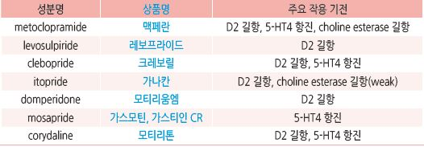
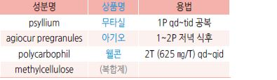
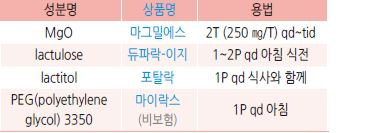
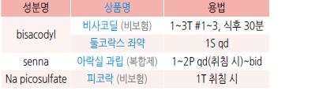
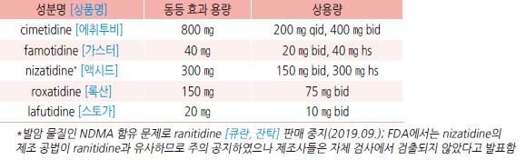
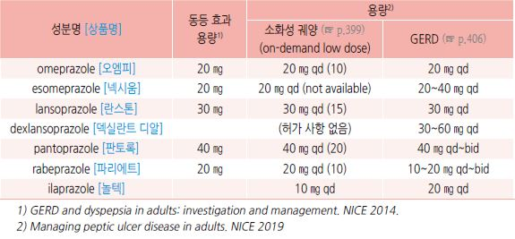

# 소화기계 약제

## 위장 운동 촉진제 (GI prokinetic agent)
    

- 투여 시간 : 위 배출 촉진 목적 시 식전 30분~1시간, 소장세균과다증식증 치료 목적 시 야간

- 금기 : 위장관 출혈, 위장관 폐색/천공

- 항콜린제와 상호 길항작용을 하여 효과가 상쇄될 수 있음

### Dopamine D2 receptor antagonist
- 기전

  •acetylcholine 분비를 억제하는 도파민 수용체를 억제 → acetylcholine 분비↑ → 위장관 평활근의 muscarinic receptor 자극

    → 위장관 수축↑

  •medulla oblongata의 chemoreceptor trigger zone에 작용하여 구역이나 구토 등의 증세를 억제하는 항구토 위장 운동 촉진

    (anti-emetic prokinetic) 작용

- 대장 운동을 촉진할 수 있음

- 부작용

  •BBB 통과 약제 : metoclopramide, levosulpiride, clebopride; 추체외로 증상, 진정, 저혈압, 설사,

근육 긴장 이상 반응, 고프로락틴혈증(유즙 분비, 성 기능 장애)

  •BBB 비-통과 약제 : domperidone, itopride

  •metoclopramide : 40%에서 부작용 발생; 졸음, 흥분, 비가역적 지연운동이상증(3개월 이상 투여 시 20%에서 발생)

  •domperidone : 심장 전도 장애 우려로 구역/구토 증상에 대해서만 1주 이내로 제한 사용

### Serotonin agonist
- 기전 : 5-HT4 또는 5-HT3 수용체에 작용 → acetylcholine 분비↑ → 위장관 수축↑

- metoclopramide, clebopride, mosapride, prucalopride(☞ p.375)

- mosapride : CYP3A4 억제제와 약물 상호 작용; macrolide와 병용 주의

### Motilin receptor agonist
- 기전 : motilin 수용체 활성 → 하부 식도 괄약근, 위체부, 십이지장 상부, 원위부 대장 수축

- motilin : 부교감 신경 말단과 평활근에 작용하는 endogenous peptide hormone; 위장 팽만(예: 식사) 또는 공복 시 주기적으로

    십이지장에서 분비되어 위장 운동 촉진 및 펩신 생산 자극

#### Erythromycin
- 작용 : motilin과 구조적으로 유사하며 저용량 투여 시 motilin 수용체에 작용

- 주의 : CYP3A4에 의해 대사되는 약제와 상호 작용

- 부작용 : 구역, 구토, 내성 발생

- 용법 : 250 ㎎ tid ×5~7d

### Acetylcholinesterase inhibitor
- 대상 : 소장의 dysmotility 또는 pseudoobstruction

- 허가 : 중증 근무력증

- pyridostigmine : 60~180 ㎎/d [메스티논]

## 진경제 (GI antispasmodic agent)
- 종류 : 비선택적 항콜린제, 선택적 항콜린제, 칼슘차단제, 아편수용체 조절제

- 부작용 : 입마름, 소변 저류, 시야 흐림, 어지럼, 졸림, 녹내장

### 약제
- trimebutine : 100~200 ㎎ tid 식전. 약한 opioid agonist 효과 [포리부틴]

- cimetropium : 50 ㎎ tid [알기론]

- phloroglucinol : 160 ㎎ tid [후로스판]

- pinaverium : 50 ㎎ tid [디세텔]

- scopolamine : 10~20 ㎎ tid~qid [부스코판]

- tiropramide : 100 ㎎ bid~tid [티로파]

- dicyclomine : 10~20 ㎎ tid~qid [스파토민]

- hyoscine [부스코판 주], atropine [아트로핀 주], hyoscyamine, otilonium, peppermint oil

## 기타 항구토제

### 항히스타민제, 1세대
- 대상 : 멀미, 내이 장애 관련 구역/구토; 항콜린 작용이 있음

- dimenhydrinate : 50 ㎎ tid~qid [보나링에이]

- hydroxyzine : 25~100 ㎎ q6h [아디팜]

- meclizine : 12.5~25 ㎎ q4~6h. 25~50 ㎎ q6h [염산메클리진]

- promethazine : 25 ㎎ bid

### Serotonin 5-HT3 antagonist
- 대상 : 화학요법 및 방사선치료, 수술 후 구토

- 부작용 : 두통, 무기력, 변비, 어지럼, 부정맥

- ondansetron : 4~8 ㎎ bid [조프란]

- granisetron : 1~2 ㎎ bid [카이트릴]

- dolasetron : 100~200 ㎎ qd

- palonosetron : 0.25~0.5 ㎎ 1회 IV [알록시 주]

### NK1 antagonist
- 대상 : 화학요법 유발 구역/구토

- aprepitant : 초회 125 ㎎ qd, 이후 80 ㎎ qd [에멘드]

- fosaprepitant [에멘드 주], netupitant [아킨지오](복합제), rolapitant

### TCA
- 대상 : (저용량으로) 만성 특발성 구역, 기능성 구토 (☞ p.1147)

- amitriptyline : 10~25 ㎎ hs 또는 10 ㎎ bid~tid [에트라빌]

- nortriptyline : 10~25 ㎎ hs 또는 10 ㎎ bid~tid [센시발]

### Benzodiazepine
- 대상 : 불안 증상이 동반되어 있는 구토 (☞ p.1149)

- diazepam : 2.5 ㎎ qd~tid [디아제팜]

- clonazepam : 0.25 ㎎ qd~tid [리보트릴]

- lorazepam : 1~4 ㎎/d #2~3 [아티반]

### 임신성 구토
- doxylamine : 5~10 ㎎ qd 취침 시 [자미슬] (✽FDA 임신 투여 A등급)

- pyridoxine 10 ㎎ q6hr [피리독신]

- 생강 : 250 ㎎ q6hr 또는 1 g qd (응고 장애, 소화성 궤양, 장 폐쇄에서는 금지)

## 복부 가스 제거제

### Probiotics
- 작용(가설) : 장내 세균에 의한 가스 형성과 염증을 억제

- [AGA](2020)

    •유익성과 안전성에 대한 증거가 부족하므로 급성 위장관염, IBS, IBD, C. difficile 감염 등 대부분의 소화기 문제에 대하여

    권고하지 않음

    •조산아, 저체중 출생아에서 특정 probiotics가 mortality와 necrotizing enterocolitis를 줄일 수 있음

    •항생제 복용 중 C. difficile 예방 및 외과적으로 치료된 궤양성 대장염 합병증인 pouchitis 관리를 위해 probiotics를 고려

- Lactobacillus : L. rhamnosus [람노스], L. bifidus [락토필], L. acidophilus [안티비오]

- Saccharomyces boulardii [비오플]

- Bacillus subtilis [메디락]

>   (보험기준 : ① 6세 미만에서의 급성 감염성 설사 또는 항생제에 의한 설사, ② 괴사성 장염)

### Galactosidase
- 대상 : 가스 형성 음식 유발성 팽만, 유당 불내성

- β-Galactosidase [갈타제]

### Simethicone
- 효과가 입증되지 않음

- 용법 : 40~80 ㎎ tid 식후 또는 취침 시 [가소콜]

### 비흡수성 항생제
- 작용 : 장내 세균 활동을 억제하여 탄수화물 발효 감소; 장기 사용에 대한 효과는 입증되지 않음

- 대상 : 세균 증식 의심 복부 팽만, 방귀

- 부작용 : 부종, 구역, 어지럼, 가스

- rifaximin : 200 ㎎ qid ~ 400 ㎎ tid ×7d [노르믹스]

### Bismuth subsalicylate
- 대상 : 악취가 나는 방귀. 소화성 궤양

- 용법 : 525 ㎎ qid 또는 필요시

## 변비 치료제 (Laxative)

### 식이 섬유
- 소장 원위부 및 대장에서 발효되고 지방산과 가스를 생성하여 위장관 기능과 감각에 영향을 줌

- 권장 용량 : 20~30 g/d

- 충분한 효과 발현까지 ＞6주의 기간이 필요할 수 있음

- 서행성 변비나 해부학적 문제가 있는 경우에는 효과가 없거나 변비 관련 증상을 악화시킬 수 있음

- 부작용 : 복부 가스, 팽만감, 복통(특히 대변 저류가 있는 경우)

- 함유 음식 : 밀기울, 전곡류, 채소, 과일 (☞ p.1170)

### 부피 형성 하제 (Bulk-forming)
- 함유 성분 및 식품 : psyllium, methylcellulose,

     isphagula, 씨앗, karaya, guar gum, wheat dextrin,

    해초, 한천

- 충분한 물과 함께 섭취해야 효과

- 투여 2~3일 내 반응

- 서행성 변비나 해부학적 문제가 있는 경우 효과가 없거나

    변비 관련 증상을 악화시킬 수 있음

- 부작용 : 복부 가스, 팽만감, 협착 시 impaction, Ca/Fe 흡수 장애

### 삼투성 하제 (Hyperosmotics)
- 종류 : MgO, 비흡수성 다당류(lactulose, lactitol,

     sorbitol), glycerol, PEG

>   ✽일부에서 PEG가 보다 효과
- 투여 1~3일 내 반응

- 주의 : 신 기능 저하 환자에서 Mg 제제 사용 금지

- 부작용 : 구역, 복부 팽만, 가스, 설사; 특히 비흡수성

    다당류에서 흔함;  점차 호전되며 심각한 부작용은

    거의 없음 (장기간 투여 가능)

### 자극성 하제 (Stimulant)
- 작용 : 장 속으로의 수분 분비 및 장 운동 자극

- 종류

  •surfactant laxative : dehydrocholic acid, castor oil

  •anthraquinone : senna, cascara

  •polyphenol : phenolphthalein, Na picosulfate

- 대상 : 다른 하제에 반응 없는 환자에서 단기 사용

- 경구 투여 6~12시간 후 반응; 직장 투여 15~60분 후 반응

- 부작용 : 전해질 불균형, 복통, 구역, 팽만감; 임신 시 금기

### 대변 연화제 (Stool softener)
- 종류 : docusate, dehydrocholic acid (✽복합제로 시판 [둘코락스 에스] bisacodyl, docusate sodium,

    [메이킨 에스] bisacodyl, casanthranol, docusate sodium, dehydrocholic acid)

- 대상 : 수술 후, 출산 후, 치핵, 치열

- 충분한 물과 함께 섭취해야 효과

### 윤활제 (Lubricant)
- mineral oil : 15~45 ㎖/d

- glycerin [그린 관장약]

- 경구제 부작용 : 흡인 시 지방성 폐렴, 지용성 Vit 흡수 장애(✽장에서 윤활제에 결합되어 배설)

### Prokinetic Agent (5-HT4 agonist)
- 작용 : GI motility 조절 → 대장 통과 시간 단축

- 대상 : 다른 하제에 반응이 없는 환자

- 주의/금기 : 신장 기능 저하, 장폐쇄/천공 의심, 심한 염증성 장질환

- 4주 이내에 효과가 없는 경우 재평가

- prucalopride : 부작용- 두통, 복통; 1~2 ㎎ qd [레졸로] (보험기준 ☞ p.1183)

- tegaserod : 여성 변비형 과민대장증후군, 만성 변비 치료; 허혈성 혈관 질환 문제로 사용 제한

- renzapride : 부작용- 설사, 두통, 복통, 허혈성 장염

### Colonic secretagogue

#### 선택적 Chloride channel agonist activator (ClC-2)
- 작용 : 장 속으로의 chloride 및 수분 분비 자극, 장 운동 증가

- 부작용 : 구역, 설사, 두통, 복부 팽만, 복통, 부글거림

- lubiprostone : 24 ㎍ bid [아미티자] (비보험)

#### Guanylate cyclase-C agonist
- 작용 : 장 속으로의 수분 분비 및 장 운동 자극

- 부작용 : 설사, 복부 팽만

- linaclotide : 145 ㎍ qd; 6세 이상의 기능성 변비에 대해 FDA 승인 72 ㎍ qd

- plecanatide : 3 ㎎ qd

### Opioid antagonist
- 작용 : peripherally acting μ-opioid receptor antagonist; opioid의 장에 대한 영향을 줄임

- 대상 : opioid 유발 변비 (✽BBB를 통과하지 않으므로 opioid의 진통 작용을 감소시키지는 않음)

- 다른 방법에 효과 없을 때 고려; 고령자에서는 연구 부족

- alvimopan, methylnaltrexone, naloxegol

## 지사제 (Antidiarrheal agent)

### Opiates
- 주의 : 이질 및 침습성 병원균에 의한 감염 시 증상을 악화시킬 수 있고 마비성 장폐색을 일으키거나 원인균 배출을

    지연시킬 수 있음

  •혈변, 고열, 전신 독성, 치료에도 악화되는 설사 환자에서는 제한

- loperamide : 처음 4 ㎎, 이후 필요시 2 ㎎. 최대 16 ㎎/d [로프민]

- diphenoxylate : 2.5~5 ㎎ qid

### 진경제 (항콜린제, 항무스카린제)
- 작용 : 복통 및 복부 불편감 호전

- 용법 : 통증 발생 전 또는 식전 30분 복용 (☞ p.371)

### 5-HT3 antagonist
- 작용 : 위장관 motility 및 sensation의 매개체인 serotonin 작용을 억제시켜 설사 개선

- 부작용 : 변비, 급성 허혈성 대장염

- alosetron : 여성 0.5 ㎎ bid; 부작용 문제로 사용상 제한

### Probiotics
- 변비 또는 설사 환자의 일부에서 효과; 신뢰할만한 연구 부족 (☞ p.372)

### 흡착제

#### Dioctahedral smectite
- 알루미늄 및 마그네슘의 이중 silicate로 구성된 천연 점토

- 작용 : 장점막 보호. 병원성 세균, 독소, 바이러스, 가스, 담즙산 흡착 및 배설

- [스타빅] 3 g/20 ㎖ tid 식간 복용. 3~4세- 5 ㎖, ≥15세- 20 ㎖; ＞24개월 허가

#### Kaolin-pectin
- [후라베린 큐 시럽] 3~4세- 5 ㎖, ≥15세- 20 ㎖ tid (비보험)

#### Bismuth subsalicylate
- 작용 : 항염 항균; 여행자 설사의 증상 완화, 바이러스성 장염 관련 구토 완화

- 용법 : 525 ㎎, 필요시 1일 최대 8회

### 기타
- paregoric : 아편제(camphorated tincture of opium)

- racecadotril : 장 운동 감소, 분비 억제; 로타 장염 등 급성 장염에 효과 [하이드라섹](비보험)

## 제산제 (Antacid)
- 주의 : 상부 위장관 증상을 차폐함. 신부전 시 부작용이 상승함

- 용법 : 보통 1일 4회, 매 식후 1~2시간 및 취침 시

- Al hydroxide/phosphate : 부작용-변비, 장기 대량 투여 시 대사 이상 [겔포스(현탁액)](비보험), [암포젤(정)]

- almagate : 부작용- 변비 또는 설사 [알마겔(정/현탁액)]

- Na bicarbonate : 부작용- Na 수분 저류, 알칼리혈증 [타스나](비보험)

- Ca carbonate : 부작용- 고칼슘혈증, 고인산혈증, 대사성 알칼리증, 신부전 [씨씨본]

- Mg hydroxide/oxide : 부작용- 설사 [마그밀], [마그밀에스]

## 위 점막 보호제 (Gastric mucosal protective agent)

### Sucralfate
- Al hydroxide + sucrose octasulfate

- 작용 : 점막 보호, 치유 촉진; 위산 중화 효과는 없음

- 효과 : 소화성 궤양에서 H2-수용체 차단제와 동등한 효과

- 부작용 : 변비, 알루미늄과 관련된 독성

- 용법 : 공복 투여 (✽pH 3.5 이하에서 효과적으로 위 점막 궤양 바닥에 부착됨)

  •소화성 궤양 : 치료 1 g tid~qid, 재발 예방 1 g bid [아루사루민(정/액)](비보험)

  •역류성식도염 : 1g qid 매, 식전 1시간 및 취침 시

- 약물 상호 작용 : tetracycline, norfloxacin, ciprofloxacin, theophylline 흡수 저하

### Bismuth
- 작용 : 점막 보호. 헬리코박터에 대한 항균 작용

- H2-수용체 차단제 병용 시 흡수율 증가

- 부작용 : 변비, 검은 변, 고용량 장기 투여 시 신경 독성

- 주의 : 신부전

- colloidal bismuth subcitrate가 bismuth subsalicylate에 비해 흡수율이 높음

- tripotassium dicitrato bismuthate ; 300 ㎎ qid 또는 600 ㎎ bid 식전/공복 복용 [데놀]

### Prostaglandin E analogue
- 작용 : 점막 보호, 재생 증진

- 대상 : NSAID 투여 시 (특히 위궤양 또는 출혈 병력자에서 병용)

- 부작용 : 설사, 복통

- misoprostol : 200 ㎍ qid, 음식과 함께 복용 [싸이토텍]

### 기타 점막 보호제
- Na alginate : 위식도 증상 완화, 포만감 유발을 통한 식욕 억제 효과; 약간의 콜레스테롤 저하 및 고혈압 예방 효과가 보고됨;

    부작용- 변비 또는 설사; 1~3 g tid~qid 공복 [라미나지 액]

- benexate betadex : 400 ㎎ bid [울굿]

- ecabet : 1 g bid [가스트렉스 과립]

- irsogladine : 4 ㎎ qd [가스론엔]

- polaprezinc : 75 ㎎ bid [프로맥]

- rebamipide : 100 ㎎ tid [무코스타]

- sulglycotide : 200 ㎎ tid [글립타이드]

- teprenone : 50 ㎎ tid [셀벡스]

- eupatilin : 60 ㎎ tid, 90 ㎎ bid [스티렌]

## 위산 분비 억제제 (Gastric antisecretory drug)

### H2-수용체 차단제 (H2-receptor Antagonist)
- 반동 현상 : 2주 이상 투여 시 고가스트린혈증의 반동 현상으로 위산 억제 효과가 상쇄됨; 약물 중단 후 위산 분비 증가가

    9일간 유지됨

- 제산제 동시 투여 시 H2-차단제의 흡수가 10~20% 감소됨

- 주의 : 고령, 신부전 시 감량 사용

- 부작용 : 고용량 장기 투여 시 여성형유방증, 발기 부전

- 용량 보정 후 제제별 유의한 효과 차이는 없음 (✽상병에 따른 보험 인정 용량 유의)

- 간에서 CYP450 작용을 저해함; theophylline, phenytoin, diazepam, lidocaine, quinidine, clopidogrel, warfarin 등의 효과가

    증대됨

  

### 프로톤 펌프 차단제 (Proton pump inhibitor, PPI)
- 기전 : prodrug 으로서 복용/흡수 후 혈류를 거쳐 위장 벽세포의 산성 환경에서 활성화

    → 산을 분비하는 효소인 H+-K+-ATPase(프로톤 펌프)에 결합/영구적 불활성화

- 산 분비 억제 효과 : 표준 용량에서 24시간 산 분비의 ＞90% 억제 (H2 차단제는 ＜65% 억제)

- 매일 반복 투여 시 5~7일에 최대 효과 도달; 빠른 효과 획득을 위해 투약 시작 2~3일간 bid 투여 또는 취침 시 H2-차단제를

    병용할 수 있음 (보험주의)

- 반감기는 60분이지만 새로운 펌프 합성까지 18시간이 소요되므로 24시간 이상 위산 억제 효과가 나타나며, 약제 중단 후

    2~5일까지 효과가 지속됨

- 대상 : 소화성 궤양, GERD, NSAID 연관 궤양 치료/예방, H. pylori 제균

- 투여 시간 : 펌프가 활성화되는 식전 30분 복용; qd 복용 시 아침 식전 30~60분, bid 복용 시 아침/저녁 식전 30~60분 복용

 (✽dexlansoprazole은 이중 지연 방출/흡수 되므로 식사 무관 복용 가능)

- 표준 용량에서의 제제별 유의한 효과 차이 없음

  ✽산 억제 효능에는 차이가 있다는 보고가 있음; omeprazole 기준(1), pantoprazole 0.23, lansoprazole 0.90, esomeprazole 1.60,

    rabeprazole 1.82

- 투여 시간 : 펌프가 활성화되는 식사 직전(아침 첫 식사 30~60분 전) 투여; 서방형 제제 및 dexlansoprazole은 식사 무관

- 표준 용량에서의 제제별 유의한 효과 차이 없음

- 대사 : 간 CYP2C19 및 3A4

- 약물 상호 작용 : diazepam, warfarin, phenytoin 제거 연장; 약물 흡수 장애(예: clopidogrel)

  •clopidogrel과 병용 시 심혈관 사고의 위험이 증가되지 않는 한 clopidogrel 증량은 필요 없음

  •산 분비 억제제(예: H2-차단제)와 동시 투여 시 PPI 효과 감소

- 부작용 : 폐렴(단기 사용에서 관찰됨), 소장 세균 증식, Clostridium difficile 감염/여행자 설사 위험, 영양 결핍(예: Vit B12,

    iron, Ca, Mg), 골다공증/골절(?), 급만성 신질환, 위암, 치매 증가(?)

>     (✽장기적인 acid suppression이 장 내 미생물의 변화를 일으키고, 이것이 비정상적인 포도당 대사를 일으킬 수 있어

>     규칙적이고 장기적인 PPI의 사용은 당뇨병의 위험 증가와 관련이 있다는 보고가 있음)
  

- 저용량 PPI를 위염 치료에 적용 : eomeprazole 10 ㎎ qd [에스코텐] [에소메졸 디알 서방]

**AGA 권고 **(2022)

- 확실한 적응증이 없는 모든 PPI 만성 투여자는 약제 감량을 고려해야 함(✽증상 관리를 위한 경험적 투여는 이득이 없음)

- 적응증에 해당 되는 PPI bid 만성 투여자의 대부분은 qd 투여로의 step down을 고려해야 함

>     (✽고용량 PPI는 합병증 위험을 높일 수 있는 반면 효과는 입증되지 않음)
- 다음의 경우는 중단을 시도 하지 않음 : complicated GERD(예: 중증 미란성 식도염/식도 궤양/소화성 협착) 병력자,

    바렛 식도, 호산구성 식도염, 특발성 폐섬유증, 상부 위장관 출혈 고위험

- PPI 장기(8주) 치료 후 중단 시 반동 현상 발생 유의(✽ 약제 중단 2주 후 위산 과다 분비 발생, 2개월까지 지속);

    반동으로 상부 위장관 증상 발생 시 H2-차단제 또는 제산제 투여 고려

- PPI 중단 시 tapering 및 즉각 중단 모두 가능(✽6개월째 증상이 없을 가능성은 중단 전략에 관계 없음)

- PPI 관련 이상반응(PAAE) 우려 때문에 PPI 치료 중단을 결정하면 안 됨

### 칼륨 경쟁적 위산 분비 억제제 (Potassium-competitive acid blocker, P-CAB)
- 기전 : 위벽 세포의 프로톤펌프(H+/K+-ATPase)에 K와 경쟁적, 가역적 결합 → 위산 분비 억제

- 위산에 의한 활성화가 필요 없어 식사와 관계없이 복용 가능

- 산에 의한 활성을 거치지 않고 직접 프로톤 펌프를 억제하므로 효과가 빠르게 나타남

- 결합 위치 차이 등으로 P-CAB 간의 효과와 부작용이 다를 수 있음 (연구 부족)

- rebaprazan : 위산 분비 억제 능력이 PPI보다 약함; peptic ulcer에 적용; 200 ㎎ qd [레바넥스]

- vonoprazan : 강력한 제산 효과, PPI보다 긴 반감기(7시간); GERD, H. pylori 제균에 적용

- fexuprazan : 미란성 GERD 40 ㎎ qd ×4주, 치료되지 않거나 증상이 계속되는 식도염의 경우 4주 추가 투여;  

    급성 및 만성 위염의 위점막 병변 개선 10 ㎎ bid ×2주 [펙수클루]

- tegoprazan : 강력한 제산 효과, 빠른 산 분비 억제 작용 시작 [케이캡]

  •부작용(＞1%) : 구역, 설사, 소화불량, 상기도 바이러스 감염, 흉부 불편감

  •주의/금기 : 간/신 장애, 고령, 벤즈이미다졸류에 과민, 임부, 수유부

  •약물 상호 작용 : 위산 의존 흡수 증가 약물의 농도↓(예: atazanavir, nelfinavir, rilpivirine)

  •대사 : 간 CYP3A4; 대사체 반감기- 3.7~7.1시간. 최대 혈중 농도- 0.5~1시간

  •vonoprazan에 비하여 gastrin 상승이 적으며 hypergastrinemia를 덜 일으킴 (PPI와 비슷)

  •허가 사항 : 비미란성 GERD 50 ㎎ qd ×4주, 위궤양 50 ㎎ qd × 8주,

    소화성 궤양 &/or 만성 위축성 위염의 H. pylori 제균 요법 50 ㎎ bid × 7d
