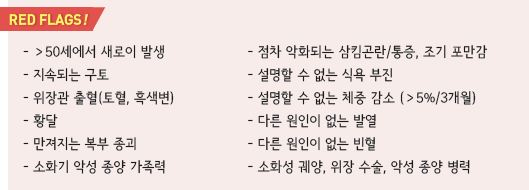
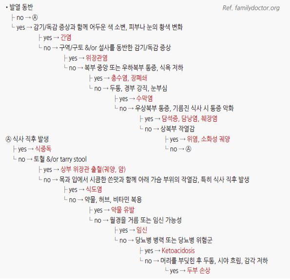
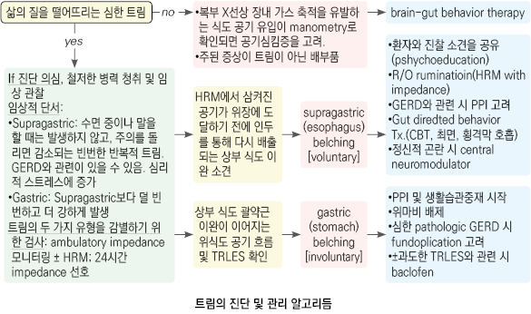
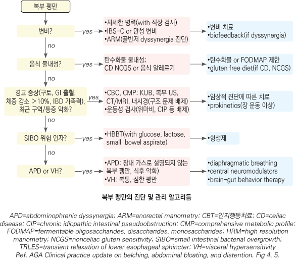

# 위장 질환의 감별




### 질환에 따른 증상

*   기능성 소화불량 : 기질적 원인 없이 식후 포만감, 조기 포만감, 상복부 통증, 또는 상복부 작열감이 6개월 중 3개월 이상

    나타남 (☞ p.387)
* 식후곤란증후군 (postprandial distress syndrome) : 식후 포만감, 팽만, 트림, 구역 (☞ p.387)
* 위식도역류질환 : 상복부에서 시작하여 목으로 방사되는 흉골 뒤 작열감(heartburn) (☞ p.406)
* 유문폐쇄, 위마비 : 식사 1시간 내 발현; 청진 시 갑작스런 움직임에 ‘첨벙’하는 소리
* 장폐쇄 : 식사 1시간 이후 발현. 구토에 의해 증상 호전; high-pitched 장음, 장 운동 증가
* 장마비 : 장음 소실
* 허혈 : 심한 복통; 압통 없음
* 내장 질환에 의한 복통 : 복부 중앙 또는 전체적 불편감
* 췌장염, 담낭염에 의한 통증 : 구토로 호전 되지 않는 상복부 통증
* 복막염, 복벽 통증 : 염증이 있는 부위 통증. 복부 경직, 반사통
* 삼투압 설사, 자극성 설사 : 금식하면 호전 (☞ p.416)
* 분비성 설사 : 금식해도 설사
* 약물, 독소, 위장관 감염 : 급성 발생
* 기저 질환 : 만성적 발생

### 증상/병력에 따른 감별

* 삼킴곤란, 삼킴 통증, 설명할 수 없는 흉부 통증 : 식도 질환
* 목의 덩어리 느낌 : 식도 또는 인후부 이상, 기능성 위장관 질환
* 스트레스로 악화 : 기능성 질환
* 잠에서 깰 정도의 통증 : 기질적 질환
* 압통, 불수의적 복부 근육 경직 : 염증 질환
* 발열 : 염증 질환, 종양
* 어지럼증과 이명을 동반한 구역/구토 : 미로 질환
* 체중 감소, 피로감 : 종양, 염증 질환, 운동/흡수 장애 질환, 정신적 질환
* 기립 시 저혈압 : 실혈, 탈수, 패혈증, 자율 신경계 이상
* 선홍색 출혈, 적갈색 변 : 하부 위장관 출혈
* 하부 위장관 출혈 : 고령- 종양, 게실염, 혈관 질환; 청년- 항문 주위 질환, 염증성 장염

### 구역/구토의 감별

```

```

### 발생 시간에 따른 감별

* 급성 : 급성 감염, 중독증, 허혈
* 급성, 수 시간 : 담낭 선통(biliary colic)
* 수일\~수 주 : 급성 췌장염
* 만성, 수 주\~수개월, 간헐적 : 궤양
* 식사로 악화 : 위궤양, IBS
* 식사로 호전 : 십이지장 궤양
* 식후 설사 및 설사 후 호전 : IBS, IBD
* 만성 : 만성 염증, 기저 질환, 신생물, 기능성 이상

### 위장관 내시경 적응증

* 비특이적인 증상, 경고 징후가 있음
* 중년 이후(＞50세) 새로이 시작된 증상
* 치료에 반응하지 않음

> ✽젊은 연령에서의 경고 징후가 없는 소화성 궤양 증상은 보통 즉각적인 내시경 검사 없이 외래 관리

#### 우리나라 위암 검진 권고안

*   남녀 모두 40세 이상에서 매 2년마다 UGI 또는 상부소화관 내시경 검사를 시행; 위점막의 조직학적 변화가 있거나

    위암 직계 가족력이 있는 고위험군은 1년마다 검사 고려

#### 미국내시경학회 권고안 \[ASGE]\(Appropriate use of GI endoscopy. 2012)

\*\* 대상\*\*

```
① 내시경 검사 결과에 따라 치료 방법이 변경될 가능성이 있는 경우

② 양성으로 추정되는 소화기 문제에 대한 경험적 치료가 실패한 경우

③ 영상 검사 대안으로서의 초기 평가 방법인 경우

④ 치료 방법을 결정하기 어려운 경우
```

\*\* 제외 대상\*\*

```
① 검사 결과가 치료 선택에 영향을 주지 않는 경우

② 전암성 상태의 추적이 아닌, 치유된 양성 질환의 주기적 추적 검사
```





### 트림 및 복부 팽만(bloating, distention)의 평가 및 관리 권고 [AGA](2023/)

1. 병력 청취, 신체 검사, impedance pH 검사는 supragastric(esophagus) or gastric(stomach) belching 감별에 도움이 될 수 있음
2.  supragastric belching에 대한 치료 옵션으로 brain‚gut behavioral therapy(예: 인지행동치료, 횡격막 호흡(복식 호흡),

    speech therapy, central neuromodulator)를 포함할 수 있음
3. 원발성 복부 팽만 진단에 Rome IV criteria를 사용해야 함
4.  식이 제한 &/or breath test로 탄수화물 효소 결핍을 배제할 수 있음; 위험 환자에서 흡인 소장액 미생물 분석 및

    glucose or lactulose 기반 수소 호흡 검사를 SIBO 평가에 사용할 수 있음
5. 혈청 검사로 celiac병을 배제할 수 있으며 혈청 검사 양성 시 소장 생검로 확진해야 함
6. 복부 영상 및 상부 위장관 내시경 검사는 경고 증상, 최근 증상 악화, 또는 비정상 신체 진찰 환자에서만 시행해야 함
7.  Gastric emptying study는 복부 팽만 환자에서 일상적으로 시행해서는 안되며, 오심/구토가 있는 경우 고려할 수 있음.

    Whole gut motility & radiopaque transit study는 신경근병성 질환에 대한 검사를 요구하는 추가적이고 난치성인

    하부 위장관 증상이 있지 않는 한 시행하지 않음
8.  변비와 관련이 있어 보이는 복부 팽만 환자나 evacuation이 어려운 환자에서 골반저 이상을 감별하기 위한

    anorectal physiology test를 제안
9. 식이 중재가 필요할 때 (예: low FODMAP)는 monitor treatment를 선호
10. 복부 팽만 치료를 위해 Probiotics를 사용해서는 안 됨
11. 골반저 이상이 확인되었을 때 biofeedback therapy가 복부 팽만에 유효할 수 있음
12. Central neuromodulator(예: 항우울제)가 복부 팽만 치료에 사용됨. 이는 내장 과민성을 줄이고, 감각 역치를 높이고,

    심리적 동반 문제를 개선함
13. 변비가 있는 경우 변비에 대한 약물 치료를 고려해야 함
14. Psychological therapy(예: 최면, 뇌‚장 행동 치료)를 사용할 수 있음
15. abdominophrenic dyssynergia 치료에 횡격막 호흡 및 central neuromodulator을 사용함
