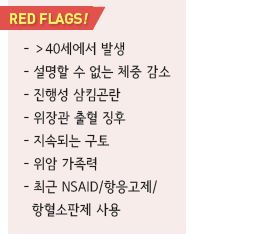
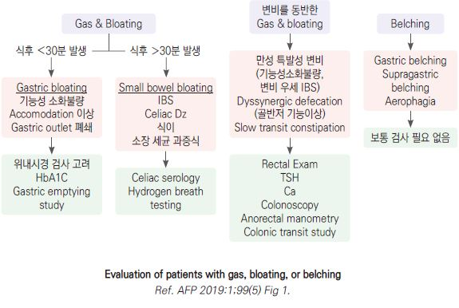
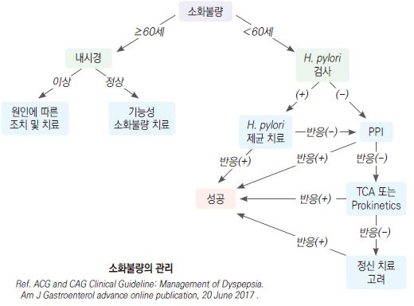

# 소화불량 Indigestion, Dyspepsia

## 소화불량의 상태들
- 소화불량 (indigestion, dyspepsia) : 구역, 구토, 역류, 상복부 답답함/통증, 가슴쓰림, 조기 포만감, 식후 팽만감 등

    상복부의 다양한 증상을 아우르는 비특이적 용어; ¾이 기능성 문제 관련

- 구역 (nausea) : 토하고 싶은 느낌

- 구토 (vomiting, emesis) : 장/흉복벽 근육 수축에 의한 위장관 내용물의 입을 통한 압박 방출

- 역류 (regurgitation) : 구역 없이 힘들이지 않은 상태에서의 위 내용물의 입을 통한 방출

- 되새김 (rumination) : 위 내용물의 역류와 되씹고 되삼킴을 반복. 보통 조절 가능함

- 삼킴곤란 (dysphagia) : 입으로부터 음식물이 내려가는 것에서의 문제; 음식물이 가슴에 들러붙은 느낌 또는 걸려 있는 느낌

    (☞ p.392)

- 삼킴통증 (odynophagia) : 삼킬 때의 통증; 감염 또는 정제/캡슐 약제에 의한 구인두 또는 식도의 점막 궤양,

    위식도 역류 환자에서 식도 궤양 또는 염증 시 발생

- 인두이물감 (globus pharyngeus, globus hystericus) : 목안의 덩어리 느낌 또는 꽉 찬 느낌; 불안증, 강박증에서 흔함;

    삼킴에는 제한이 없거나 삼킴으로 호전

- 가슴쓰림 (heartburn) : retro-sternum의 타는 듯한 증상; 간헐적 발생. 주로 식후, 운동 중, 누웠을 때 발생;

    물을 마시거나 제산제 복용으로 호전

## 원인 및 위험 인자
- 기능성 소화불량 : 기질적 질병 없이 소화불량 증상이 발생하는 상태; 가장 흔함 (☞ p.387)

- 위식도역류질환 : 하부 식도괄약근의 긴장 감소 또는 이완 (☞ p.406)

- visceral afferent hypersensitivity : 위장의 감각 신경 장애가 소화불량을 초래; 소화불량 환자들은 낮은 압력에서도

    정상인보다 위저부 팽만의 불편감을 느낌; IBS 환자에서 관찰됨

- LES 이완 : 음주, 흡연, 카페인, 지방식, 민트

- 복부 가스 생성 : 탄수화물 음료, 당분, 불용성 식이 섬유, 껌 씹기, 빨리 먹기

- H. pylori 감염 (논란)

- 약물 : NSAID, aspirin, 산 분비 억제/제산제, 항생제, 당뇨(예: metformin), 고혈압(예: ARB, CCB), 고지혈증(예: fibrates,

     orlistat), 치매(예: donepezil), SSRI, SNRI, 파킨슨(예: dopamine 작용제), steroid, estrogen, progesterone, 디곡신,

    nitrate, bisphosphonate, iron

- 유전, 비만, 임신, 스트레스, 우울, 불안, 신체화장애, 폭식증, 알코올 남용

- 위장 운동 장애(예: 위저부 이완 장애), 담석증, 담낭염, 췌장염, 충수돌기염, 게실염, 유당 불내성, 셀리악병, 장폐쇄,

    위장관 수술 병력, 화학요법, 전정신경염, 폐렴, 요로 결석, PID

※ acute, self-limited indigestion은 흔히 과식, 너무 빨리 먹는 것, 고지방 음식 섭취, 스트레스 상황에서의 식사, 과음,

    많은 커피 음용이 원인이 됨

## 진단
- 증상과 징후를 근거로 진단하며 경고 징후가 있으면 검사

- 신체검사는 거의 도움이 되지 않음

- 식사 내용과 증상을 기록하는 식사 일기 작성

### Diagnostic criteria [ROME Ⅳ]

#### 기능성 소화불량 (Functional dyspepsia)
    (☞ p.387)

#### 만성 구역/구토증후군 (Chronic nausea vomiting syndrome)
- 발생한 지 최소 6개월 되었고 최근 3개월간 다음 조건을 모두 충족

  ① ≥1일/주 또는 ≥1회/주 발생하는 불편한(일상생활에 지장을 주는) 구역증

  ② 다음 상태 배제 : 자가 유도 구토, 섭식 장애, 역류, 반추

  ③ 일상적인 검사(상부 소화기 내시경 포함)에서 증상의 원인이 되는 기질적, 전신적, 또는 대사 질환의 증거 없음

#### 되새김증후군 (Rumination syndrome)
- 발생한 지 최소 6개월 되었고 최근 3개월간 다음 조건을 모두 충족

  ① 뱉거나 다시 씹어 삼키게 되는, 섭취한 음식의 지속 또는 반복적인 역류

  ② 역류 전 구역증이 선행되지 않음

#### 인두이물감 (Globus pharyngeus)
- 최소 1회/주 발생하며 발생한 지 최소 6개월 되었고 최근 3개월간 다음 조건을 모두 충족

  ① 진찰, 후두경, 또는 내시경에서 확인되는 구조적 이상이 없는, 인후부의 지속 또는 간헐적인, 통증이 없는 덩어리 느낌

    또는 이물감

    a. 식간에 발생

    b. 삼킴곤란 또는 삼킴 통증 없음

    c. 식도 근위부에 장애물(gastric inlet patch) 없음

  ② 위식도 역류 또는 eosinophilic esophagitis가 증상의 원인이라는 증거 없음

  ③ 주요 식도 운동 이상 질환*은 없음

>   *예) achalasia, EGJ outflow obstruction, diffuse esophageal spasm, jackhammer esophagus, absent peristalsis)

#### 기능성 가슴쓰림 (Functional heartburn)
- 최소 2회/주 발생하며 발생한 지 최소 6개월 되었고 최근 3개월간 다음 조건을 모두 충족

  ① 흉골 뒤의 타는 듯한 불편감 또는 통증

  ② 적절한 산 분비 억제제 치료에도 불구하고 증상이 완화되지 않음

  ③ 위식도 역류(산 노출 시간 증가 &/or 관련된 역류 증상) 또는 eosinophilic esophagitis가 증상의 원인이라는 증거 없음

  ④ 주요 식도 운동 이상 질환*은 없음

#### 기능성 삼킴곤란(Functional dysphagia)
    (☞ p.394)

### 검사
- 실험실 검사 : 다른 질환을 배제하기 위하여 시행

  •CBC, 전해질, Ca, RFT, LFT, 단백질/알부민, TSH, amylase, lipase, u-HCG

- H. pylori 검사 : 산 분비 억제제, prokinetics에 반응하지 않는 경우 고려

- 영상 검사 : 췌장, 담관, 혈관 질환, volvulus 의심 시 고려

  •흉부 및 복부 X선, CT, 복부 초음파

- 상부위장관내시경 : ≥40세, 경고 증상, 치료에 반응하지 않는 경우 고려 (☞ p.381)

> ✽[미국소화기학회] ＜60세에서 소화불량 원인 감별을 위한 일률적인 내시경 검사는 권고하지 않음
- 난치성 증상 또는 진행성 체중 감소 시 셀리악병, 기생충 검사, 지방, elastase 검사 고려

### 감별

#### 증상 시작에 따라
- 갑자기 발생 : 담낭염, 식중독, 위장염, 췌장염, 약물

- 서서히 발생 : GERD, 위마비, 대사 이상, 임신, 약물

#### 증상 발생 시간에 따라
- 식전 : 알코올, 뇌압 증가, 임신, 요독증

- 식사 중 또는 식후 : 정신적 문제, 소화성 궤양, pyloric stenosis

- 식사 1~4시간 후 : 위장 출구 폐쇄(예: 궤양, 종양), 위마비

- 지속 : 신체화장애, 우울

- 불규칙 : 우울

- 이른 아침 : 임신

#### 구토물의 양상에 따라
- 소화 안 된 음식물 : achalasia, 식도 질환(예: 게실, 협착)

- 부분 소화된 음식물 : 위장 출구 폐쇄, 위마비

- 담즙 포함 : 소장 근위부 폐쇄

- 악취 또는 대변성 : fistula, 장 폐쇄

- 대량 (＞1,500 ㎖/24h) : 기질적 문제 가능성

#### 복통 부위/양상에 따라 (☞ p.26)
- epigastric : 췌장 질환, 소화불량, 위염, 소화성 궤양, 위식도역류질환, MI

- RUQ : 담관 질환, 담낭염 

- RLQ : 충수염 

- LLQ : 게실염

- Pelvic : PID, 난소 질환, 자궁외임신

- 심한 통증 : 담관 질환, 췌장 질환, 소장 폐쇄, peritoneal irritation

- 구토 전 심한 통증 : 소장 폐쇄

#### 동반/관련 증상에 따라
- 발열 : 감염 질환

- 체중 감소 : 악성 종양

- 설사, malaise, 근육통, 두통 : 바이러스 감염

- 두통, 경부 강직, 어지럼, 국소 신경학적 이상 소견 : 뇌염, 뇌막염, 두부 손상, 편두통, 기타 두개 내 압력이 증가되는 요인들

- 조기 포만감, 식후 팽만감, 복부 불쾌감 : 위마비

- 반복되는 편두통, 과민 대장 증상 : cyclic vomiting syndrome

- 자세 관련 : 신경성

- 어지럼, 안진 : vestibular neuritis

- lactose, 밀가루 음식, 밀기울, 콩류 등 음식과 관련된 복부 팽만 : lactose intolerance, 셀리악병, carbohydrate malabsorption,

    올리고당 발효(예: 콩류)

- 가슴쓰림 : GERD, 소화불량

- 빈맥, 저혈압 : 탈수, 패혈증, 심근경색

    

---

## Management

### 치료 방침
- 심각한 기질적 원인이 없는 경우 안심시킴

- 경고 징후가 없는 ＜60세 : 경험적 치료 (☞ p.387)

    → 경험적 치료에 반응하지 않거나 재발하는 환자에 대하여 상부 소화기 내시경 검사

    → H. pylori 감염, 소화성 궤양, GERD, 암 등 감별

- 기질적 원인이 있는 경우에는 이에 대한 치료, 약물이 원인인 경우에는 용량 조절 또는 약물 교체

## 식생활 요법
  ① 아침 식사를 거르지 않는다.

  ② 조금 더 먹고 싶을 때 수저를 놓는다.

  ③ 야식은 조금만, 잠은 식사 2시간 뒤에.

  ④ 음식은 꼭꼭 씹어 먹는다. 씹지 않은 음식을 물로 삼키지 않는다.

  ⑤ 규칙적인 생활, 충분한 수면을 취한다.

  ⑥ 금연한다.

  ⑦ 적당히 운동한다.

  ⑧ 스트레스를 관리한다.

  ⑨ 회피 또는 주의가 필요한 음식

    •증상을 유발시키는 음식

    •유제품, 카페인 음료(커피, 차), 알코올

    •맵고 짠, 자극적인 음식 : 매운 고추, 생마늘

    •지방이 많은 음식 : meat, 버터, 튀긴 음식, 치즈

    •압축된 음식 : 면류, 떡

    •질긴 음식 : 뿌리채소(예: 도라지, 더덕), 질긴 고기, 점도가 높은 음식/빵

    •잡곡류 : 보리, 현미, 통밀

    •설탕/당분이 많이 든 음식

- 치료 시작 시에는 액상 음식을 선택하는 것이 효과적일 수 있음

- 특히 식후에 증상이 있는 환자들은 소식, 저지방 식사

- low-FODMAP diet

>     ✽FODMAP(Fermentable Oligo-, Di-, Mono-saccharide, And Polyol) 식품 : 과당(옥수수 시럽, 사과, 배, 꿀, 수박, 건포도), 유당,

>     fructan(마늘, 양파, 부추, 아스파라거스, 아티초크), 밀 제품(빵, 파스타, 시리얼, 케이크), 소르비톨(stone fruits), 라피노오스(콩류,

>     양배추); 소장에서 천천히 흡수되고 대장 세균에 의해 발효되어 가스 형성 및 삼투압 작용을 유발할 수 있음

## 약물 치료
- H. pylori 제균 치료 : H. pylori (+)인 ＜60세 소화불량 환자에서 권고 (☞ p.403)

- PPI

  •H. pylori (-) ＜60세 및 비정형 GERD 환자에 대하여 4주간 투여 → 중단 후 재발 시 간헐적 또는 장기간 투여 (투여 기간에

    대하여 논란)

  •H. pylori 제균 후 증상이 남아 있는 경우 PPI 치료

- prokinetics, TCA : H. pylori 제균 치료 또는 PPI 치료에도 증상이 지속되는 ＜60세에서 고려

    (☞ p.370)

    

> **질병코드**
K31.88 소화불량

K31.9 위 및 십이지장의 상세불명 질환
