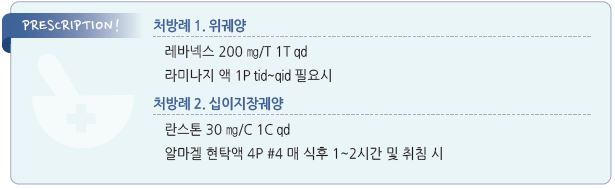

# 소화성 궤양 Peptic Ulcer, PUD


## 일반 사항

* 5 ㎜ 이상 깊이의 손상을 포함하는 위십이지장의 점막 손상
* 위궤양 (gastric ulcer, GU) : 55\~70세에서 흔함
* 십이지장궤양 (duodenal ulcer, DU) : 30\~55세에 흔함; H. pylori 제균으로 감소 추세
* 식도궤양 (esophageal ulcer) : GERD에 의해 식도 원위부에 호발
* refractory peptic ulcer : PPI 12주 치료에도 호전 안 됨; 빈도- 5\~10%
* recurrent peptic ulcer : 완전한 치유 이후 다시 발생
*   유병률 : 미국 2%; 보통 젊은 연령에서 시작, 연령 증가에 따라 유병률 증가

    •NSAID 장기 사용자의 10~~20%에서 GU, 2.5%에서 DU 관찰; 매년 2~~5% 증가
*   경과 : 자연 치유율 60%, 치료에 의한 치유 성공률 90~~95%, 재발률 5~~30%

    •H. pylori (+) 환자에서 제균에 성공한 경우 1\~2년 후 ＜20%에서 소화성 궤양(PUD) 재발
*   합병증 : 천공(＜5%), 위 배출구 폐쇄, 출혈(선행 증상 없이 발생할 수 있음; \~25%)

    •recurrent 또는 refractory ulcer의 경우 합병증이 발생했을 가능성을 고려

## 원인

### 병태 생리

* 위궤양 : 주로 위점막 방어 기제 문제; 위산 분비는 정상(감소한 경우도 있음)
* 십이지장궤양 : 위산 분비 증가(정상인 경우도 있음), 중탄산염 분비 감소
* 공격 인자 : 위산, 펩신, 담즙, 췌장액
* 방어 인자 : mucus, bicarbonate, 혈류, prostaglandin, growth factor, cell turnover

### 위험 인자

* 약물 : NSAID, aspirin, steroid, bisphosphonate, 화학요법, 다제약물 복용
* H. pylori 감염
* 흡연, 음주, 가족력
* 식이 습관 : 잘 씹지 않음, 물/국에 말아 먹음, 자극적 식사
* 스트레스 : 정신적 스트레스, 급성 질환, 심한 외상
* 위 점막 절제, 림프종, gastrinoma, 크론병, COPD, 만성 신부전, 간경변, 방사선 치료

## 임상 양상

*   흔히 자각 증상이 없음

    •증상이 있는 경우 흔히 주기적으로 발생
* 상복부 복통/불편감/작열감, 가슴쓰림, 산 역류
* 조기 포만감, 트림, 구역, 구토
* 혈변, 검은 변 : 위장관 출혈 증상
* GU : 식후 악화
*   DU : 새벽 공복 또는 식후 1\~3시간에 악화; 제산제나 음식물 섭취로 호전

    

## 진단

#### 진찰

* 상복부 압통 : 고령 환자의 ⅓에서는 잘 관찰되지 않음
* 합병증이 없는 PUD 환자는 비특이적 증상을 보임
* PUD가 있는 모든 환자에서 NSAID 복용 이력 및 H. pylori 보균 여부를 확인

#### 실험실 검사

* 빈혈/출혈 진단 : CBC, anemia study(ferritin, TIBC, Fe, reticulocyte), 대변 잠혈
* 공복 혈청 gastrin : 다발성/난치성 궤양에서 gastrinoma 배제를 위하여 고려

#### 영상/내시경 검사

* 위장관 내시경 검사
* 위장관조영술 : 내시경 검사를 할 수 없는 경우의 대체 또는 보조

#### 헬리코박터 검사 (☞ p.403)

* 대상 : 새롭게 발생된 PUD, PUD 과거력, 경험적 치료 후 지속되는 PUD 의심 증상
* 검사 방법 : 요소호기검사 등

### 위장관 내시경

#### 대상 (☞ p.381)

* 경고 징후가 있음
* 치료에 반응하지 않음
* 증상이 중년 이후(＞50세)에 새로이 시작하였음

※ 경고 징후가 없는 젊은 연령에서의 PUD 증상은 보통 즉각적인 내시경 검사 없이 외래 관리

※ 우리나라 위암 검진 권고안 : 남녀 모두 40세 이상에서 매 2년마다 UGI 또는 상부소화관 내시경 검사를 시행;

```
위점막의 조직학적 변화가 있거나 위암 직계 가족력이 있는 고위험군은 1년마다 검사 고려
```

#### 치료 후 내시경 추적 검사 대상

* 증상이 지속됨
* H. pylori 관련 PUD (치료 시작 6~~8주 후 또는 치료 종료 2~~4주 후 시행)
* 위암 병력, Giant gastric ulcer(＞2 ㎝), 악성 종양 의심, 위암 위험 인자가 있음
* 이전 내시경 검사에서 조직 검사를 시행하지 않았거나 부적절
* 이전 검사를 출혈 때문에 시행했었음

***

## Management

### 치료 방침

* 금연, 절주, 식이 요법 (☞ p.385)
* NSAID 또는 aspirin 복용 시 중단 또는 대체, 다제약물 복용 회피 (☞ p.15)
* 해당하는 경우 H. pylori 제균 (☞ p.403)
* 약물 치료 : 위산 분비 억제제, 제산제, 점막 보호제 (☞ p.376)

## 약물 치료

* 치료 기간 : GU 8주, DU 4\~6주; NSAID 복용 또는 H. pylori 양성 환자는 별도 일정

### 치료 약제

#### Proton pump inhibitor (PPI)

* 위산 분비 억제 : 표준 용량에서 24시간 위산 분비의 ＞90% 억제
* 적용 : PUD 치료, NSAID 관련 PUD 치료 및 예방
* 용법 : 보통 아침 공복 복용 (✽dexlansoprazole은 식사와 무관하나 PUD 허가 없음)
* 부작용 : 장기 투여 시 Vit B12/iron/Mg/Ca↓, 세균성 위장관염/폐렴/골절 위험↑, 중단 시 반동 현상
* omeprazole : 20\~40 ㎎ qd \[오엠피]
* esomeprazole : 20\~40 ㎎ qd \[넥시움]
* lansoprazole : 15\~30 ㎎ qd \[란스톤]
* dexlansoprazole : 30\~60 ㎎ qd \[덱실란트 디알]
* pantoprazole : 40 ㎎ qd \[판토록]
* rabeprazole : 10\~20 ㎎ qd \[파리에트]

#### Potassium-competitive acid blocker (P-CAB)

* 위산에 의한 활성화가 필요 없이 직접 프로톤 펌프를 억제하므로 효과가 빠르게 나타나며 식사와 관계없이 복용 가능
*   tegoprazan : 강력한 제산 효과, 빠른 산 분비 억제 개시, 식사 무관 복용; 50 ㎎ qd ×4(\~8)주. 식사 무관 복용 \[케이캡]

    (보험주의; PUD에 대한 허가 없음)
* rebaprazan : 위산 분비 억제 능력이 PPI보다 약함; 200 ㎎ qd \[레바넥스]

#### H2 receptor antagonist (H2RA)

* 위산 분비 억제 : 표준 용량에서 24시간 위산 분비의 ＜65% 억제
* PPI보다 효과 발현 및 치유율이 낮음; 6주(DU)~~8주(GU) 투여로 치유율 85~~90%
* PPI 투여가 곤란하거나 반응이 부족한 경우 고려
* cimetidine : 400 ㎎ bid 또는 800 ㎎ hs \[에취투비]
* famotidine : 20 ㎎ bid 또는 40 ㎎ hs \[가스터]

#### 제산제

* 단독으로는 치료 효과 부족; 증상 완화 목적 또는 PPI 치료 초기에 병용

### NSAID 연관 PUD 예방

* NSAID 사용을 피함; acetaminophen 등 대체제 사용을 고려
* NSAID를 투여해야 하는 경우 COX-2 억제제 선택 (✽aspirin 병용 시 COX-2의 이점은 소실됨)

#### 예방 약제 병용

* NSAID 투여 시 예방 약제 병용을 고려
* 대상 : ＞65세, 심한 정신적 스트레스, steroid를 투여 중인 PUD 병력
* 종류 : PPI(선호), H2RA(통상 용량의 2배 투여), 합성 prostaglandin E1 analog

> ✽sucralfate는 유효성이 입증 안 됨 \*\* 합성 prostaglandin E1 analog\*\*

* 부작용 : 설사, 복통
* misoprostol : 200 ㎍ qid, 음식과 함께 복용 \[싸이토텍]

### 헬리코박터 제균

* 대상 : PUD가 있는 H. pylori (+) 환자
* 용법 : 제균 기간을 포함하여 총 4\~8주간 항궤양제 등 투여

### 불응 및 궤양 재발

* NSAID 등 약물 복용 및 금연 여부 확인, 다른 질환 배제(예: gastrinoma, malignancy, 크론병)
* H. pylori 검사 : (+) 시 제균 치료 및 결과 확인; (-) 시 위음성 가능성 고려
*   추가 치료 : 표준 용량으로 치료 실패 시 두 배 용량으로 6\~8주간 추가 치료

    •재발하는 경우 필요시 투여 또는 최소 유효 용량으로 지속 투여하는 것을 고려

> **질병코드** K25 위궤양

K26 십이지장궤양

K27 상세불명 부위의 소화성 궤양


