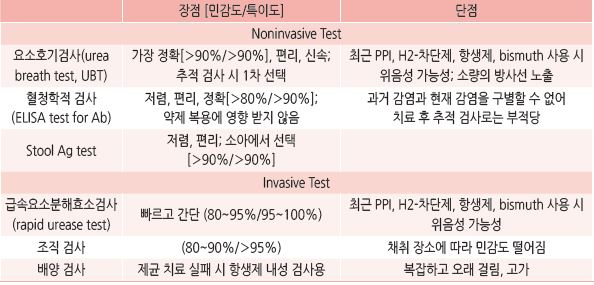

# 헬리코박터 감염 Helicobacter Pylori Infection


## 일반 사항

* 유병률 : 전 인류의 50% 추정
*   경과 : 대부분 무증상이며 문제를 일으키지 않으나, 일부에서 소화성 궤양 등의 소화기 문제를 일으킬 수 있으며 위암과

    관련될 수 있음; 어떤 경우에 문제를 일으키는지는 알려져 있지 않음
* 전파 경로 : 분변으로 오염된 물 또는 음식
* 제균 치료가 PUD와 위 MALT 림프종의 예후를 개선시키지만, 위암의 진행 위험을 줄이는지는 명확하지 않음

## 진단 검사

### 대상

*   ＜60세의 경고 증상이 없는 H. pylori 를 검사한 적이 없는 소화불량 환자 : 비침습성 검사를 우선 권고;

    내시경 검사를 하는 경우에는 H. pylori 조직 검사 시행
*   활동성 소화성 궤양, 과거 제균 치료를 받은 적이 없는 소화성 궤양 병력, MALT lymphoma, 조기 위암에 대한

    내시경 절제 병력
* 저용량 aspirin을 장기간 투여 중인 환자, NSAID 장기 투여를 시작하는 환자
* 적절한 검사에도 불구하고 원인을 찾을 수 없는 철결핍빈혈, ITP

#### 제외 대상

```
(검사 및 제균의 이익이 불분명)
```

* 소화성 궤양 병력이 없는 전형적인 GERD 또는 위염 환자
* 위암 가족력은 있으나 증상이 없는 자, lymphocytic gastritis, hyperplastic gastric polyp

> ✽기존의 NSAID 복용 중인 환자에서 H. pylori 검사 및 제균의 이익은 불확실함

### 검사 방법

```

```

***

## Management

## 제균 요법

#### 대상 [대한상부위장관 헬리코박터 학회](2020/)

*   기존 적응증 : 소화성궤양, 위점막림프종, 위암 절제, 위암 가족력, 특발성 혈소판감소성 자반,

    저용량 aspirin의 장기간 사용
* 추가 적응증(권고강도 약함) : 원인 미상의 철결핍빈혈, 양성 위선종 내시경 절제 후, 기능성 소화불량증

#### 한계

* 장기간 NSAID를 투여하는 환자에서 H. pylori 제균 치료만으로는 소화성 궤양 발생의 위험을 감소시키지 못함
* H. pylori 제균 치료는 GERD의 발생 및 경과에 영향을 미치지 못하는 것으로 보임
*   H. pylori 균이 미란성 식도염, 바렛 식도 또는 식도선암 발생을 억제할 수 있으며, H. pylori 유병률 감소가

    위식도역류질환의 증가와 관련된다는 보고가 있음

### 초치료 프로토콜

*   14일 표준 3제 요법 : {PPI 표준 용량, amoxicillin 1 g \[파목신], clarithromycin 500 ㎎ \[클래리시드]} bid

    \*처방 일수에 대하여 보험 적용 주의

    •표준 3제 요법 7일 투여를 1차 제균 요법으로 사용할 때에는 clarithromycin 내성 검사를 권고
*   10일 순차 치료 : {PPI 표준 용량, amoxicillin 1 g} bid ×5d, 이후 {PPI 표준 용량, clarithromycin 500 ㎎,

    metronidazole 500 ㎎ \[후라시닐]} bid ×5d
* 10일 동시 치료 : {PPI 표준 용량, clarithromycin 500 ㎎, amoxicillin 1 g, metronidazole 500 ㎎} bid
*   10\~14일 bismuth 4제 요법 : 다른 제균 치료를 사용할 수 없는 경우에 1차 치료로 사용; PPI 표준 용량 bid,

    metronidazole 500 ㎎ tid, bismuth 120 ㎎ qid \[데놀], tetracycline 500 ㎎ qid

#### PPI 표준 용량

```
(보험기준 ☞ p.1183)
```

* omeprazole : 20 ㎎ \[오엠피]
* esomeprazole : 20 ㎎ \[넥시움]
* lansoprazole : 30 ㎎ \[란스톤]
* rabeprazole : 20 ㎎ \[파리에트]

#### Potassium-competitive acid blocker (P-CAB)

* tegoprazan : 50 ㎎ \[케이캡] (표준 3제 요법 7일 투여 허가)

### 재치료

* 표준 3제 요법, 순차 치료, 동시 치료에 실패 → bismuth 포함 4제 14일 요법 권고
*   bismuth 4제 요법에 실패 → levofloxacin 포함 3제 요법 고려 : PPI 표준 용량 bid, Amox 1 g bid,

    levofloxacin 500 ㎎ qd(or 250 ㎎ bid) \[크라비트]

### 치료 후 추적 검사

*   방법 : UBT(선호), 내시경 조직 검사 (✽대변 항원 검사는 근거가 부족하여 권고 안 함)

    •UBT 검사 시기 : 검사에 대한 영향을 피하기 위하여 항생제 또는 비스무스제제 투여 종료 4주, PPI 투여 종료 2주,

    H2 차단제 투여 1주 후
* H. pylori (+)인 소화성 궤양 환자의 내시경 F/U : 병변 크기에 따라 치료 시작 6\~8주 후

### 부작용

* 복통, 속쓰림, 설사
* metronidazole 복용 중 음주 시 홍조, 두통, 구역, 구토, 발한, 빈맥
* metronidazole, clarithromycin : metallic taste
* bismuth : 변비, 검은 변

질병코드 B98.0 다른 장에서 분류된 질환의 원인으로서의 헬리코박터 파일로리균


