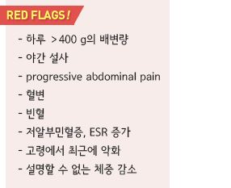
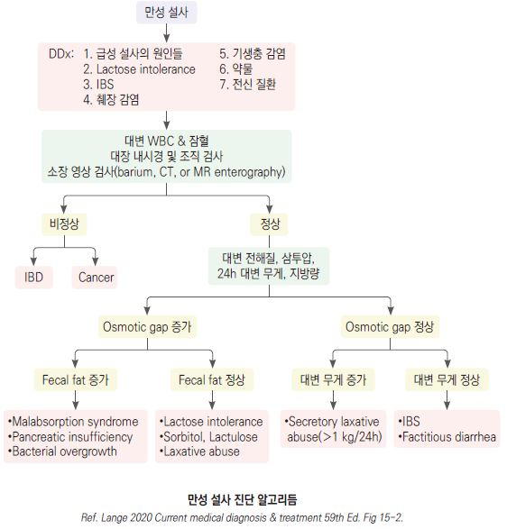

# 만성 설사 Chronic Diarrhea

## 일반 사항
- ≥3회/d, ≥4주 지속되는 설사

- 기전상 여러 특성을 지님

- 대부분 장 점막에서의 수분 및 전해질의 흡수-분비에 불 균형이

    발생되어 있음

- 진정한 식품 알레르기는 성인의 만성 설사에서는 드묾

## 원인

#### 과운동성 설사 (Hypermotility)
- IBS (☞ p.423), 기능성 설사

#### 삼투압 설사 (Osmotic)
- 탄수화물 흡수 장애 : 당분(예: lactose, fructose, sorbitol, xylitol, sucralose), 사카린

- 삼투성 하제(예: MgO), phosphate, sulfate

#### 흡수 장애 (Malabsorption)
- Whipple Dz, Giardiasis, 셀리악병, short bowel syndrome, 소장 세균 과증식,

    췌장 외분비 기능 부전(예: chronic pancreatitis, pancreatic cystosis)

#### 분비성 설사 (Secretory)
- 자극성 하제(예: senna, docusate)

- 담낭절제술(간혹 6~12개월 내 회복), ileal bile acid malabsorption

- 장 운동 이상 : postvagotomy, 당뇨병신경병증, 갑상선항진증

- 종양 : VIPoma, gastrinoma, carcinoid syndrome, 갑상선의 전이성 medullary carcinoma

- systemic mastocytosis

- protein-losing enteropathy

#### 약물 유발 설사
- cholinesterase inhibitors, SSRI, ARB, PPI, NSAID, metformin, allopurinol, orlistat

- 허브 : St. John’s wort, echinacea, 마늘, 인삼, saw palmetto, cranberry,

    알로에 염증성-비감염성 설사 (Inflammatory-Noninfection)

- IBD, microscopic colitis, 혈관염, radiation enterocolitis, eosinophilic enterocolitis

#### 감염성 설사 (Infection)
- 세균 : Clostridium difficile , Mycobacterium avium intracellulare

- 바이러스 : cytomegalovirus

- 기생충 : Giardia lamblia , Cryptosporidium , Isospora , Strongyloides

#### 만성 전신 질환
- 장 운동 또는 흡수 변화로 인하여 발생

- 갑상선 질환, 당뇨병, 콜라겐 혈관 질환

## 임상 양상
- 과운동성 설사 : 하복부 통증, 과도한 장 운동(부글거림), 소량 설사; 야간에는 드묾, 금식으로 호전

- 삼투압성 설사 : 식사 후 설사, 금식하면 호전

•탄수화물 흡수 장애 : 복부 팽창/가스; 2~3주간 탄수화물 섭취를 제한하면 호전

- 흡수 장애 : 체중 감소, 삼투압성 설사 양상, 지방변, 영양 결핍

- 분비성 설사 : 많은 양의 물 설사, 식사에 관계없이 설사

- 염증성 설사 : 복통, 발열, 혈변, 농변, 체중 감소

## 진단
- 기저 질환, 정신 사회적 스트레스, 약물, 식이(음식 일기) 검토

### 검사
- 경고 징후에 해당되는 경우 시행

- 혈액 : CBC, ESR, CRP, 전해질(Mg, P, Ca, Na), LFT(단백질, 알부민), TSH, anemia study, INR,

    anti-tissue transglutaminase IgA(셀리악병), Vit A, Vit /B9/B12, Vit D

- 대변 : WBC, 배양 검사, 기생충, 잠혈, 전해질(Na, K, 삼투압), 지방, lactoferrin

- hydrogen breath test : 탄수화물 흡수 장애, 소장 세균 과증식 진단에 유용; 위양성이 많음

- 영상 검사 : X선, CT

- 위장관 내시경

- 조직 검사 : 셀리악병, Whipple Dz 의심 시

### 기능성 설사 Diagnostic criteria [ROME Ⅳ]
A. 발생한 지 최소 6개월 되었고 최근 3개월간 통증이나 불편을 주는 복부 팽만이 없는 죽 또는 물 같은 대변 배출이

    배변 횟수의 ＞¼에서 발생

B. 설사 우세형 과민대장증후군에 해당되지 않음

    

---

## Management

### 치료 방침
- 원인 질환 치료

- 탈수 관리, 영양 공급, well-balanced diet

- 증상 유발 음식 회피 : 음식 일기 작성이 도움

  •유당 불내성 : lactose-free diet

  •식이 제한 : gluten, 흡수 장애 탄수화물, lactose, sorbitol (☞ p.420)

- 위생 관리 : 특히 손 청결 유지

- 명확한 진단이 되지 않거나 IBS 진단 기준에 부합하며, 경고 징후에 해당되지 않는 경우에 진단적 치료 시행;

    치료에 반응하지 않는 경우 추가 평가 시행

- 항문 주위 피부 보호 : zinc oxide 연고 [보소미](비보험), 피부 방수제 [카빌론](비보험) 고려

## 치료 약물

#### Opiates (μ-opiate receptor selective)
- 작용 : 장 운동 지연

- 대상 : 비특이적 설사에 대한 대증 치료제로 고려; 만성 설사에서는 규칙적인 투여 고려

- loperamide : 2~4 ㎎ bid~qid [로프민]

- diphenoxylate : 2.5~5 ㎎ tid~qid

#### α-2 Adrenergic agonist
- 작용 : 장내 전해질 분비 억제, intestinal transit time 지연

- 대상 : 분비성 설사, 당뇨병성 설사, opiate 금단 설사, cryptosporidiosis

- 주의 : 혈압 강하

- clonidine : 0.1~0.3 ㎎ tid [켑베이] (보험주의)

#### Somatostatin analogue
- 작용 : 장 내 fluid 및 전해질 흡수 자극, 장 내 fluid 분비 & gastrointestinal peptides 분비 억제

- 대상 : carcinoid syndrome, VIPomas, 화학요법 관련 설사, HIV, 위 절제술 후 덤핑증후군

- octreotide : 50~250 ㎎ tid [산도스타틴 라르 주] (보험주의)

#### Bile acid-binding resin
- 대상 : bile acid malabsorption

- cholestyramine : 4 g ~qid with meal [퀘스트란 현탁용산] (☞ p.533)

#### Fiber supplement
- 대상 : 소량의 물 설사 및 대변실금

- 작용 : 수용성 식이 섬유 → 장 내용물 점도↑→ 위 비움 및 장 통과 지연 → 장관 내 수분 흡수↑ → 대변 수분↓

- 수용성 식이 섬유 (☞ p.1170)

- psyllium : 10~20 g/d [무타실] (☞ p.373)

- polycarbophil : 5 g/d [웰콘]

#### Bismuth subsalicylate
- 대상 : colitis

- 장기 사용 시 안전성에 대한 우려가 있음

#### 항생제
- 대상 : 소장 세균 과증식 (보험주의)

- ciprofloxacin : 500 ㎎ bid [씨프로바이]

- metronidazole : 500 ㎎ tid~qid [후라시닐]

#### Probiotics
- 간혹 유효 (☞ p.372)
