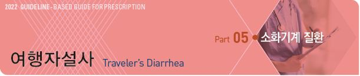
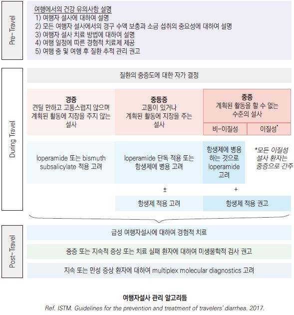
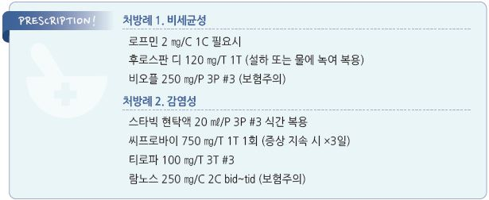

# 여행자설사 Traveler’s Diarrhea

## 원인

### 원인균

* 세균성 : 80\~90%; E. coli (ETEC/EAEC) Campylobacter , Shigella , Salmonella
* 바이러스 : 5\~15%; norovirus, rotavirus, astrovirus
* 기생충 : 10%; Giardia lamblia

### 위험 인자

* 면역저하자, 제산성 약물 복용자(PPI, H2-차단제), 위장관 수술, 젊은 성인
* 지역 : 더운 기후, 나쁜 위생 지역(특히 상하수도 시설/전력 공급 미비)
* 여행 초기 (첫 1주)

## 임상 양상

* 일반적 증상 : 설사, 복통, 구역, 구토, 발열 (☞ p.427)
* ETEC : malaise, 식욕 부진, 복통 → 곧 이어지는 물 설사
* Campylobacter , Shigella : 발열, 대장염 증상(뒤무직, 절박변, 경련성 복통, 혈변)
* 잠복기 : 세균 및 바이러스- 6~~72시간, 원생동물- 1~~2주(예외: Cyclospora cayetanensis 고위험 지역에서는 빠르게 진행)
*   경과 : 치료하지 않은 경우 세균성- 3~~7일, 바이러스성- 2~~3일, 기생충- 수 주\~수개월 지속

    •postinfectious IBS : 감염균이 사라진 후에도 위장관 증상이 지속되는 상태가 발생할 수 있음

### 중증도 분류

* 경증 : 견딜 만하고 고통스럽지 않으며 계획된 활동에 장애를 주지 않는 설사
* 중등증 : 고통스럽거나 계획된 활동에 지장을 주는 설사
* 중증 : 계획된 활동을 할 수 없는 수준의 설사; 모든 이질은 중증으로 간주
* 지속성 : 2주 이상 지속되는 설사 (기생충 감염에 대하여 평가가 필요)

## 검사

* 보통 필요 없음 (☞ p.429)
* 미생물 검사 : 중증, 지속적 증상, 대증 치료로 실패한 환자에서 고려

***

## Management

### 치료 방침

*   탈수 치료 및 영양 공급 : 대부분의 환자가 물/주스/스포츠 음료/스프/짭짤한 크래커를 통하여 적절한 수분과 소금을

    섭취할 수 있음, 심한 설사를 하는 경우 전해질 보충 고려, 식사 (☞ p.419)
* 약물 치료 : 장 운동 조절제, 흡착제, 항생제(중등증 이상에서 고려)

## 약물 치료

* 경증 : loperamide or bismuth 고려; 항생제 치료는 권고하지 않음
*   중등증

    •항생제 투여 고려- fluoroquinolone, azithromycin, rifaximin

    •혈성 설사나 열이 없는 경우 항생제에 loperamide 병용을 고려
* 중증 : 항생제 투여- azithromycin(선호), 비이질성 설사에서 fluoroquinolone와 rifaximin 고려

### 항생제

* 주의 : STEC 감염인 경우 항생제가 hemolytic-uremic syndrome 위험을 증가시킴
*   태국

    •1차 선택제- macrolide

    •대체제- fluoroquinolone; Campylobacter 의 감염 위험이 높고 fluoroquinolone 내성률이 높음
* TMP/SMX, doxycycline은 내성으로 권고 않음

#### Fluoroquinolone

* ciprofloxacin : 750 ㎎ 1회 또는 500 ㎎ bid ×3d \[씨프로바이]
* levofloxacin : 500 ㎎ qd ×1\~3d \[크라비트]
* ofloxacin : 400 ㎎ bid ×1\~3d \[타리비드]

#### Macrolide

* azithromycin : 1 g 1회 요법, 또는 500 ㎎ qd ×3d \[지스로맥스]

#### Rifamycin

* 비침습적 질환에서 고려
* rifamycin SV : 388 ㎎ bid ×3d
* rifaximin : 200 ㎎ tid ×3d \[노르믹스]

### 장 운동 조절제

*   loperamide : 처음 4 ㎎, 이후 필요시 2 ㎎. 최대 16 ㎎/d \[로프민]

    •경미한 설사에서 고려; 중증에서 사용할 때는 항생제에 병용

    •금기 : 발열, 혈변; 복용 후 복통 발생, 증상 악화 또는 1\~2일 내 반응이 없는 경우 중지
* cimetropium : 50 ㎎ tid \[알기론]
* tiropramide : 100 ㎎ bid\~tid \[티로파]
* phloroglucinol : 160 ㎎ tid \[후로스판]

### 흡착제

*   bismuth subsalicylate(BSS) : 262 ㎎ 30분마다, 1일 최대 8회 ×1\~2d

    •부작용 : 구역, 변비, 혀와 변이 검어짐

    •주의 : aspirin 알레르기, 신 기능 저하, 약물 복용(통풍, 항응고제, probenecid, MTX)
* diosmectite : 병원성 세균, 독소, 바이러스, 가스, 담즙산 등 흡착 및 배설; 3 g tid \[스타빅] (＞24개월 허가)
* 예방적 목적으로 투여할 수 있음

### Prebiotics 또는 Probiotics

* 여행자 설사 예방/치료에 대한 유용성은 입증되지 않아 권고하지 않음
*   \[람노스], \[비오플], \[메디락] (☞ p.372)

    

## 예방

* 자주 손을 씻는다(특히 식사 전 손 세척 또는 손 소독). (✽손 씻기 및 손 소독의 효과는 제한적임)
* 반드시 끓인 물을 마시며 양치질을 할 때에도 끓인 물을 사용한다.
* 용기는 직접 개봉하며, 마개가 깨진 물은 마시지 않는다.
* 밀봉되지 않은 물은 3분 이상 끓여서 먹는다.
* 위생 가공처리 되지 않은 우유나 유제품을 먹지 않는다.
* 껍질을 깎지 않은 과일이나 채소를 먹지 않는다.
* 익히지 않은 채소 섭취를 주의한다. 샐러드를 주의한다.
* 깨끗한 손이나 칼로 깎지 않은 과일이나 채소는 먹지 않는다. 가능한 한 직접 껍질을 벗긴다.
* 끓이거나 구운 음식을 먹는다. 생고기, 덜 익은 고기나 생선은 먹지 않는다.
* 가능한 한 방금 조리된 음식을 먹는다.
* 거리에서 파는 음식과 음료수를 먹지 않는다.
* 끓인 물이나 정수된 물로 만든 것이 확인되지 않은 얼음은 사용하지 않는다.
* 뷔페 음식은 특히 주의한다.
* 호수나 강에서 수영하지 않는다.

#### 예방적 항생제

* 일반적으로 권하지 않음
* 예방적 항생제 고려 대상 : 고위험군(예: 면역저하자, 유의미한 내과 질환자)의 단기 여행, 치료가

어려운 위험한 여행

* 적용 약제 : fluoroquinolone, azithromycin, rifaximin, rifamycin

