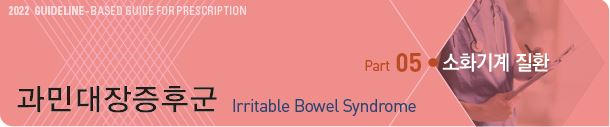
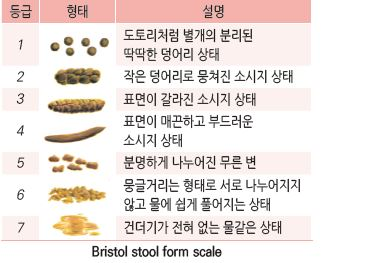
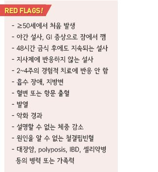
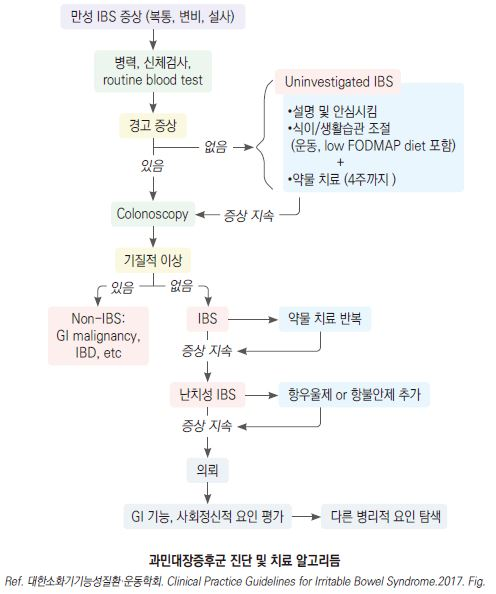
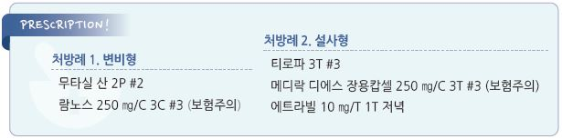

# 과민대장증후군 Irritable Bowel Syndrome



## 일반 사항

*   구조적 또는 생화학적 이상 없이 ‘복부 불편 또는 통증, 복부 팽만, 변비 &/or 설사’을 비롯한 다양한 하부 위장관 증상의

    호전과 악화가 6개월 이상 반복되는 장 기능의 만성 이상
*   흔히 다른 기능적/정신적 질환 동반 : 소화불량, 가슴쓰림, 흉통, 피로, 근육통, 섬유근육통, 두통/편두통, 수면장애,

    우울, 불안, 신체형장애, 요통, 비뇨기계 증상(빈뇨, 절박뇨, 성교통)
* 빈도 : \[미국] 7~~16%; 보통 10대 후반~~20대 초반에 시작, 여성에서 흔함(남성의 1.5\~2배)

### 분류

1.  설사 우세형 (IBS-D) : 무른 변(BST 6\~7)이 전체 배변 중

    ＞¼(4회 배변 중 ＞1회) & 굳은 변(BST 1\~2)이 ＜¼ 해당;

    적은 양의 무른 변, 잔변감, 잦은 배변 시도. 야간 배변은 드묾;

    남성에서 많음 (BST=Bristol stool types)
2.  변비 우세형 (IBS-C) : 굳은 변 ＞¼ & 무른 변 ＜¼ 해당;

    여성에서 많음
3. 혼합형 (IBS-M) : 굳은 변 ＞¼ & 무른 변 ＞¼ 해당
4.  미분류 (IBS-U) : IBS의 진단 기준에는 해당되지만

    특정 아형으로 분류하기 어려움; 환자들은 설사나

    변비의 변의 이상은 드물다고 호소함

* 최소 2주간의 관찰 후 결정; 흔히 우세 아형이 바뀜

## 원인

* 불명; middle or lower GI tract 이상(?), gut-brain interaction(?) 
* 단일 인자가 아닌 복합적 작용 가능성

### 추정 인자

* 유전
* 중추 신경계의 통증 처리 과정의 교란
* 내장 과민, 대장 운동성 이상
* 점막 염증
* 소장 세균 과증식/항생제 치료 (논란)
* 스트레스 : 우울, 불안, 신체화, 건강염려증

### 위험 인자

* 음식, 식사
* 위장관 감염
* 월경
* 정신적 스트레스, 우울
* 낮은 사회 경제적 상태

## 임상 양상

*   복통 : 하복부, 다양한 강도(때로 경련); 간헐적, 주기적, 깨어 있는 동안, 주로 아침이나 식후 발생;

    배변 후 호전(일부에서는 배변 후 악화)
* 설사, 변비, or 설사-변비 교대; 설사 시 보통 양은 많지 않음
* 소화불량, 상복부 불편, 구역, 속쓰림, 복부 팽창, 방귀
* 배변 시 긴장(힘주기), 절박변, 불완전한 배변감
* 두통, 피로, 설명할 수 없는 근육통/관절통, 성교통

## 진단

* 특이 진단 검사법 없음; 실험실 검사는 정상임
* 환자의 불안감 해소를 위하여 검사를 고려하지만 과잉 검사가 되지 않도록 주의를 요함
* 경고 징후 및 단순한 혈액/대변 검사에서 이상이 없으면서 진단 기준에 부합하면 진단 가능
* 다음 상태 배제 : 복부 종괴, 장 폐쇄 징후, Carnett sign(복부 근육 긴장 시 증가 or 지속되는 통증)

### Diagnostic criteria \[ROME Ⅳ]

* 발생한 지 최소 6개월 되었고 최근 3개월간 다음 기준을 충족
*   다음 중 ≥2개와 관련되는, 평균 ≥1일/주 발생하는 재발성 복통

    ① 배변과 관련, ② 배변 빈도의 변화와 관련, ③ 대변 형태(모양)의 변화와 관련

### 검사

* CBC, ESR, CRP, TFT, 대변 검사(기생충, 세균, 잠혈), tissue transglutaminase IgA(셀리악병)
*   GI 기능 평가(선택적 시행)

    •변비 : colon transit time, anorectal manometry, Balloon expulsion.

    •설사 : 대변 배양 검사, serial colonic biopsy, 48-h fecal bile acid excretion, serum 7α C4, fecal calprotectin/lactoferrin.

    lactose/glucose breath test
* 대장암 선별 : 대상이 되거나(예: ≥45세) 경고 증상이 있는 경우 대장 내시경 등 선별 검사 고려

> ✽변비 우세형이 아닌 IBS 466명에 대한 연구에서 대장암은 없고 ＜2%에서 IBD가 관찰되었다는 보고가 있음

### 감별

*   셀리악병 (Gluten enteropathy) : 만성 설사, 성장 장애, 피로, 빈혈, 골 통증, 구내염, 불임, 성 기능 저하, 저혈당,

    빵(밀가루)/보리 등 글루텐이 많은 음식을 먹으면 설사
* Lactose intolerance : 유제품 섭취와 관련하여 복부 팽만, 설사 발생
* IBD : 2주 이상 지속되는 설사, 항문 출혈 또는 혈변, 염증성 종괴, 체중 감소, 발열
* Colorectal carcinoma : 좌측 복부의 폐쇄성 통증, 만성 변비; 경고 징후 해당
*   Microscopic colitis : 고령에서의 설명할 수 없는 만성 재발성 물 설사; 복통/체중 감소 발생 가능;

    자가면역성 질환(예: 관절통, 갑상선질환, 건선, 쇼그렌병) 동반 가능
* Small-intestinal bacterial overgrowth : 소화 장애, 흡수 장애 발생
* Diverticulitis : 좌측 복통, 발열, 좌하복부 종괴 및 압통
* Endometriosis : 주기적 하복부 통증
* Pelvic inflammatory Dz : 비급성 하복부 통증, 발열
* Ovarian cancer : 40세 이상 여성; 복부 팽만, 절박뇨, 골반통
* 스트레스, 우울, 불안증 등 사회 정신적 문제 감별

***

## Management

### 치료 방침

* 모든 환자에게 효과적인 단일 요법은 없음. 증상에 따라 치료 방법 선택
* 안심시킴 : 치명적인 질환이 아니며 증상 조절이 가능함을 설명
* 생활 습관 중재 : 식이 조절, 운동
* 약물 치료 : 약물은 보조 치료 방법으로, 증상이 심하거나 비-약물 치료로 해결되지 않는 경우 고려
* 정신 치료 : 인지행동 요법, 최면 요법, 이완 요법, 심리 치료 : 일부 환자에서 유효
*   first-line therapy에 반응하지 않으면 기질적 문제 가능성을 고려해야 함

    

## 비-약물 치료

#### 식사 조절

* 일치된 유의미한 효과가 나타나지 않음. 같은 식단에서 다른 결과가 나올 수 있음
* 2\~6주간 시행하여 반응을 평가(음식 일기 작성 권고)
*   증상 유발 음식 회피 : 지방식, 알코올, 카페인, 매운 음식, bran, 우유, 청량음료, 인공 감미료

    •일률적인 음식 회피는 권하지 않으며 개인적인 경험에 따름
*   적당량(≤20\~25 g/d)의 수용성 식이 섬유 섭취. 가스 생성 등의 불편을 줄이기 위하여 서서히 늘림 (☞ p.1170)

    •불용성 식이 섬유는 증상을 악화시킬 수 있음
* 천천히 식사하며 과식을 피함
* gluten-free diet(특히 IBS-D) : 권고 안 함(효과는 입증되지 않은 반면 많은 노력이 필요)
*   low-FODMAP(Fermentable Oligo-, Di-, Mono-saccharide, And Polyol) diet

    •다음 식품들의 섭취를 줄임 : 과당(옥수수 시럽, 사과, 배, 꿀, 수박, 건포도), 유당, fructan(마늘, 양파, 부추, 아스파라거스,

    아티초크), 밀 제품(빵, 파스타, 시리얼, 케이크), 소르비톨(stone fruits), 라피노오스(콩류, 양배추) 식품을 피함 (☞ p.385)

#### 기타

* 운동 : 3\~5회/주
* cognitive behavioral therapy, dynamic psychotherapy, hypnotherapy, 침술 : 일부에서 효과

## 약물 치료

```
(☞ p.370) (보험 주의)
```

* 복통, 가스, 팽만 등에 대하여 대증 치료 : 진경제, neuromodulator(항우울제), 항생제(rifaximin), probiotics
* IBS-C : 삼투성 하제(PEG, lactulose), 5-HT4 agonist(prucalopride), 부피 형성 하제
* IBS-D : opioid(loperamide), 5-HT3 antagonist(ramosetron), bile acid sequestrant
* 약물의 조정은 2\~4주 간격으로 점진적으로 시행함

\*\*\[AGA] \*\*(2022)

변비 우세형 과민대장증후군

* strong recommendation : (high certainty) linaclotide
*   conditional recommendations :

    (moderate certainty) tenapanor, plecanatide, tegaserod, lubiprostone

    (low certainty) polyethylene glycol laxatives, TCA, antispasmodics
* conditional recommendation against : (low certainty) SSRI

설사 우세형 과민대장증후군 치료 약제에 대한 미국소화기학회 지침을 추가하였습니다.

* conditional recommendations :

∙(moderate certainty) eluxadoline(담낭이 없거나, 하루 3 잔을 초과하는 알코올 섭취 시 금기), rifaximin, alosetron

∙(low certainty) : TCA, antispasmodics

∙(very low) : loperamide

* conditional recommendation against : (low certainty) SSRI

#### 항콜린제 (진경제)

*   작용 : 자극에 의한 대장 운동 활성을 감소시킴으로서 식후 복통, 가스, 복부 팽만, 절박변 완화;

    효과에 대한 입증은 불충분함
* 대상 : IBS-D; 필요시 또는 식사/외식이나 스트레스 등 통증 발생이 예상되는 상황에서 복용
* 부작용 : 입마름, 시각 장애, 어지럼, 소변 저류, 변비, 빈맥; 고령, 변비 환자에서 주의
* 매 식전 or 필요시 투여
*   dicyclomine \[스파토민], trimebutine \[포리부틴], cimetropium \[알기론], pinaverium \[디세텔], scopolamine \[부스코판],

    tiropramide \[티로파]

#### Opiate성 지사제

* 작용 : 변의 유동성 및 배변 긴급성과 빈도를 줄임
* 대상 : IBS-D; 설사가 예상되는 상황에서 예방적 투여
* 부작용 : 복통, 팽만감, 구역, 변비
* loperamide : 2 ㎎, 최대 8 ㎎/d \[로프민]

#### 부피 형성 하제

* 작용 및 대상 : 대변 부피 형성으로 대변의 굳기 및 무른 변 완화; IBS-C, IBS-D
* 부작용 : 복부 팽만, 가스
* psyllium qd~~tid \[무타실], agiocur pregranules qd~~bid \[아기오]

#### 삼투성 하제

* 작용 및 대상 : 배변 빈도 개선, 긴장 완화; IBS-C
* polyethylene glycol 17 g qd\~bid \[마이락스]
* lactulose, sorbitol은 복부 가스와 팽만을 증가시킬 수 있으므로 회피

#### Probiotics

*   작용 : 장내 세균에 의한 가스 형성과 염증을 억제 (논란) •\[AGA] 유익성과 안전성에 대한 증거가 부족하여 권고 안 함;

    \[BSG] 최대 12주까지 시도하며 증상 호전 없으면 중단
* 대상 : IBS-C, IBS-D
* Lactobacillus \[람노스], Bacillus subtilis \[메디락], Bifidobacterium

#### 항우울제

* 작용 : 정신적 작용 및 motility, visceral sensitivity, 중추성 통증 지각에 작용
* 대상 : 통증, 팽만 등의 증상에 대하여 2차 선택
* 우울증 때보다 저용량 투여, 필요시 점차 증량
*   TCA : 항콜린 작용이 있어 IBS-D에서 효과; 4주 내에 효과가 명백하지 않으면 중단 고려

    •부작용 : 입마름, 시야 흐림, 변비, 요 정체, 빈맥, 혼돈

    •amitriptyline \[에트라빌], nortriptyline \[센시발], imipramine \[이미프라민]; 10 ㎎ hs, 1\~2주마다 10 ㎎ 씩 증량,

    최대 30\~50 ㎎/d
*   SSRI : gastrointestinal transit 향상 효과가 있어 IBS-C에서 효과

    •sertraline : 25\~100 ㎎ \[졸로푸트]

    •citalopram : 10\~20 ㎎

    •paroxetine : 20\~50 ㎎ \[세로자트]

    •fluoxetine : 10\~20 ㎎/d 아침, 점차 증량 40 ㎎/d \[푸로작]

#### 비흡수성 항생제

* 작용 : 장내 세균 활동을 억제하여 탄수화물 발효 감소; 장기 사용의 효과는 입증되지 않음
* 대상 : 난치성 IBS-D(특히 복부 팽만 환자)
* rifaximin : 400 ㎎ tid ×14d \[노르믹스]

#### Serotonin 5-HT4 receptor agonist

* 작용 : GI motility 조절(대장 통과 시간 단축)
* 대상 : 다른 하제에 반응이 없는 IBS-C
* 부작용 : 두통, 복통
* 주의/금기 : 신장 기능 저하, 장폐쇄/천공 의심, 심한 염증성 장질환
* prucalopride : 여성, 고령자에서 허가 1\~2 ㎎ qd \[레졸로] (보험기준 ☞ p.1183)
* tegaserod : 허혈성 혈관 질환 문제로 사용 제한 6 ㎎ bid

#### Serotonin 5-HT3 receptor antagonist

* 작용 : 위장관 motility 및 sensation의 매개체인 serotonin 작용을 억제시켜 대장 운동/분비 감소, 설사 개선
* 대상 : 난치성 IBS-D
* 부작용 : 변비, 급성 허혈성 대장염
* ramosetron : 남성 5(2.5\~10) ㎍ qd, 여성 2.5(\~5) ㎍ qd \[이리보]
* ondansetron : 4 ㎎ qd\~tid \[조프란]

#### Bile acid sequestrant

* 작용 : IBS-D 환자의 ½에서 발생하는 bile acid 흡수 장애 조절
* 대상 : IBS-D
*   부작용 : 변비, 복부 팽만, 복통, 담석증, 다른 약제 흡수 방해(digitalis, warfarin, propranolol, thiazide, amiodarone,

    thyroxine, acetaminophen, NSAID, steroid, 엽산, Vit A/D/K, PcG)
* 금기 : TG ＞400 ㎎/㎗
* cholestyramine : 4~~24 g/d, #2~~3, 식사와 함께 복용 \[퀘스트란]

#### 췌장 효소

* 작용 : 고칼로리, 고지방 식사 때의 가스, 식후 포만감 감소
* pancreatin \[판부론]\(복합제; 1\~2 T tid, 식후)

#### 기타

*   표면 활성제

    •대상 : IBS-C/IBS-D; 효과 입증되지 않음

    •simethicone 40\~80 ㎎ tid \[가소콜]
* α/β-galactosidase : 일부에서 효과
*   peppermint oil : 일부에서 복통 등 증상 완화 효과

    •부작용 : 위식도역류
*   guanylate cyclase-C agonist

    •대상 : 난치성 IBS-C

    •부작용: 설사 •linaclotide 145 ㎍ qd, plecanatide 3 ㎎ qd
*   chloride secretagogue

    •대상 : 난치성 IBS-C

    •부작용: 오심 •lubiprostone 8 ㎍ bid
*   Na-H exchange inhibitor

    •대상 : IBS-C

    •부작용: 설사

    •tenapanor 50 ㎎ bid
* 항불안제 : 습관화 가능성 때문에 IBS에서 만성적으로 사용해서는 안 됨

> **질병코드** K58 과민대장증후군


