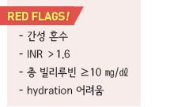
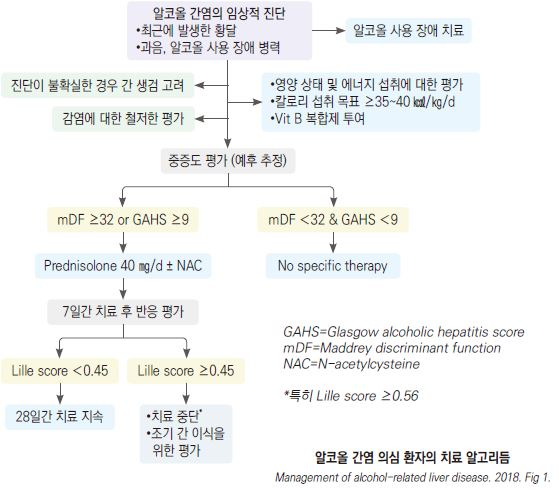

# 알코올 간질환 Alcoholic Liver Disease

## 일반 사항

* 과다한 알코올 섭취에 의해 발생한 지방간, 간염, 또는 간경변증
* 유병률(미국) : 1% ; 주로 40\~50세(대부분 60세 이전 발병); 환자의 대부분이 남성
* 하루 ≥50 g(소주 1병)의 알코올을 10년 이상 소비하는 사람의 10\~15%에서 알코올성 간경변증 발생
* 위험 인자 : 만성 바이러스 간염, 비만, 유전, 여성
* 최근에 과음한 사람에서 황달이 발생하면 알코올 간질환 확인을 요함
* 의료기관을 방문하는 음주력이 있는 환자들에게 알코올사용장애 선별 검사를 권고
* 조기 사망 위험이 있는 중증 알코올 간질환 감별을 위해 예후 점수 평가

## 임상 양상

* 지방간 : 무증상
*   알코올성 간염 : 피로, 식욕 부진, 구역, 미열, 복부 팽만/통증(우상복부), 황달, 체중 감소,

    빈맥, 저혈압, 말초 부종; 간혹 무증상
* 간경변증 : 여성형 유방, 근육 소실, 거미혈관종

## 진단

*   알코올 섭취 병력 : 음주 시작 연령, 하루 음주 횟수, 정기적/매일 음주 년수, 술의 종류, 가정에서의 음주, 음주 재활,

    음주 관련 사회적 문제
*   실험실 검사 : 알코올성 간염 진단

    • AST↑(보통 ＜300 IU/L), AST/ALT ratio ≥2(~~1.5), ALP↑(＜정상치 3배), GGT ＞100 U/㎖, t-bilirubin↑(＞3~~5 ㎎/㎗),

    albumin↓(＜3.0 g/L), INR ＞1.5, WBC ＞12,000, 빈혈, 엽산↓

    • 중증 시 WBC↑(Lt shift), bil ＞10 ㎎/㎗, prothrombin time 연장, albumin↓

    • 다른 간질환 감별 : HBsAg, HBcAb, HA Ab(IgM), HCV Ab/RNA, α-fetoprotein
* 영상 검사 : 초음파, CT, MRI
* 간 생검
*   modified Maddrey’s discriminant function score(mDF) : 알코올 간염의 중증도 평가 도구; prothrombin time과

    혈청 bilirubin 값으로 계산; ≥32점 시 중증/나쁜 예후 (1개월 사망률 35\~45%)

    •mDF = {4.6 x (PT test - control)}+ serum bilirubin (㎎/㎗)

***

## Management

* 금주 및 금단 증상 치료(필요시 입원 치료) (☞ p.995)
* mDF ≥32점, glasgow score ≤8, hepatic encephalopathy 시 입원 치료
* 지방간은 알코올 섭취 중단으로 빠르게 회복됨
*   충분한 영양 공급 : 탄수화물, 칼로리(≥35~~40 ㎉/㎏/d), 단백질(1.2~~1.5 g/㎏/d), 미량 영양소(특히 Vit B 복합제, 엽산,

    thiamine, 아연); 경구 공급을 선호
* 동반 문제/질환 관리 : 비만, 당뇨병, 인슐린 저항성, 영양실조, 흡연, 철분 과부하, 바이러스 간염
* acetaminophen 등 약물 사용 주의
*   steroid : 활동성 감염이 없는 경우 중증(mDF ≥32) 알코올 간질환 환자에서 고려

    •단기 사망률을 줄인다는 보고가 있으나 중장기 생존에 영향이 없으며 출혈, 감염 부작용을 증가시킬 수 있음;

    투여 전, 투여 중 및 후속 치료 기간 중 감염에 대한 감시를 요함

    •7일간 투여 후 반응을 확인하여 추가 투여를 결정; 통상 4주 코스

    •prednisolone 40 ㎎/d \[소론도], methylprednisolone 32 ㎎/d \[메치론]

    •N-acetylcysteine : 중증 알코올 간질환에서 steroid에 병용; 5일간 IV

    •Lille score : steroid 반응에 따른 예후 예측을 위해 고안된, bilirubin 변화를 바탕으로 한 모델

    ✽[온라인 계산툴](http://gihep.com/calculators/hepatology/lille-model/)
*   pentoxifylline : hepatorenal syndrome 위험을 줄인다는 보고가 있음. 중증 알코올 간염 환자에서 스테로이드 대체제로 고려;

    400 ㎎ tid ×4주
* 항산화제의 효과는 입증되지 않음
*   간 이식 : steroid에 반응이 없는 환자에 대하여 고려

    

> **질병코드** K70 알코올성 간질환
