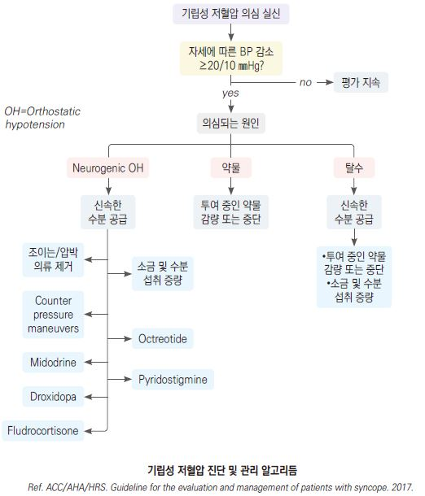
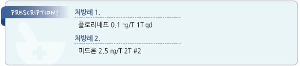

# 기립성 저혈압 Orthostatic Hypotension

## 일반 사항

*   앉거나 누운 자세에서 일어선 후 3분 이내 SBP ≥20 ㎜Hg or DBP ≥10 ㎜Hg 하락, 또는 SBP가 ＜90 ㎜Hg으로 저하되면서

    관련 증상이 발생
* 다른 명칭 : 체위저혈압(Postural hypotension)
*   기전 : 기립 시 정상적으로 발생하는 하지로의 blood pooling에 대하여 신체가 적절히 대응하지 못함 또는 체액 소실;

    sympathetic vasoconstrictor (autonomic) failure로 적정 BP를 유지 못함
*   Delayed orthostatic hypotension : 기립 3분 이후에도 떨어진 혈압이 지속되는 상태;

    sympathetic adrenergic dysfunction의 mild 또는 early form
* 무증상인 경우가 흔함
*   임상적 의의 : 사망의 독립적 위험 인자로서 MI, stroke, 심부전, atrial fibrillation 빈도 증가;

    기저 질환의 clue sign으로 신경퇴행성 질환에서의 autonomic failure의 초기 증상일 수 있음
* 혈압 강하와 함께 빈맥이 발생하는 경우 hypovolemia 또는 cardiac pump failure를 의심
* 혈압 강하는 있으나 맥박 증가가 거의 없는 경우 neurogenic cause를 의심
* 유의미한 혈압 강하 없이 기립성 빈맥이 발생하는 경우 postural orthostatic tachycardia syndrome을 의심

## 원인

* 탈수 : 수분 섭취 부족, 발열, 심한 설사 또는 구토, 심한 땀 흘림, 이뇨제 사용
* 혈액 내 용적 감소 : 배뇨, 배변
* 긴장, 무거운 것 들기
* 정맥 저류 : 음주, 식사(식후 저혈압), 격렬한 운동, 기온 상승, 오랫동안 누워 있거나 서 있기, 패혈증, 임신
* 심장 기능 이상 : 서맥, 심장 판막 질환, 심부전
* 당뇨병 : 다뇨, 저혈당, 신경병증
* 신경계 질환 : 진성 자율신경부전, 파킨슨병, 다발계통위축
* 약물 : 알코올, 항고혈압제, 이뇨제, 발기부전치료제, 진정제, 항우울제, 인슐린, 항파킨슨병제, 항정신병제, 마약류
* 노화

※ 흔한 일시적 원인 : 식사, 활동, 운동, 더위, 쇠약, 약물, 탈수

### 식후 저혈압 (Postprandial hypotension)

* 식후 15\~90분에 발생, SBP 20 ㎜Hg 이상 하락
*   추정 기전 : 식후 내장 순환에 따른 blood pooling에 대한 부적절한 sympathetic compensation, insulin 또는

    vasoactive gastrointestinal peptide에 의한 혈관 확장

## 임상 양상

* 어지럼, 힘없음, 불안정, 두근거림, 떨림, 울렁거림, 구역
* 축축한 느낌, 창백, 흐려 보임, 인지 장애(혼돈), 실신

## 진단

*   혈압 측정 : (필요시 배뇨 후) 5분 이상 눕거나 앉은 상태에서 측정 → 일어선 상태에서 1분 및 3분째 측정;

    기립 전에 비하여 어느 하나라도 SBP ≥20 ㎜Hg &/or DBP ≥10 ㎜Hg 하락 시 진단

※ supine SBP가 ＜90 ㎜Hg 인 환자에서는 이 질환명을 적용하지 않음

* 실험실 검사 : CBC, 혈당, 전해질, TSH
* ECG, Holter monitor, 심초음파, MRI
*   자율 신경 반응 검사

    •스트레스 검사 : 식사, 온수 목욕, 운동 등에 의한 증상 악화 또는 유발 관찰

    •heart rate variability, sudomotor function test, tilt-table test, Valsalva response

***

## Management

### 치료 방침

* 어지럼 증상 발생 시 한 번에 음료 500 ㎖를 마시고 다리를 올리고 5분간 누워 있음
* 기저 질환 치료 : 당뇨병, 파킨슨병, 심장 질환, 빈혈
* 복용 중인 모든 약물 평가, 약물 복용 최소화
* 혈압 모니터링 : 눕거나 앉거나 선 자세, 식전 및 식후 1시간, 취침 시 등 여러 상황에서 혈압 측정

## 비-약물 치료 및 예방

*   천천히 일어남 (특히 아침 기상 시) : 수 분간 앉아 있은 후 일어남, 지지가 될 만한 가구나 벽체를 붙잡고 일어남,

    누운 상태에서 가벼운 운동 후 일어남

    •하지의 isometric contraction, feet dorsiflexion, leg crossing/squatting, leg elevation, hand grip isometric

    (☞ p.108 counter-pressure maneuver)
* 취침 시 머리 부위를 심장보다 20~~30 ㎝ 또는 10~~20°높임 (야간 고혈압 영향 감소 효과)
* 더운 환경 회피(예: 목욕탕, 찜질방), 더운 환경에서의 운동 회피
* 충분한(2 L/d) 수분 섭취; 특히 운동 전 수분 섭취
* 필요시 소금 섭취를 늘림(8 g/d), 고혈압 등의 제한이 없는 경우에는 짠 식사 허용
* 과음 회피
* 커피는 이른 아침에만 마심
* 종아리 강화 운동 및 유산소 운동(예: 수영, 에어로빅, 달리기, 자전거)
* abdominal binder, compression stocking
*   식후 저혈압 주의 : 과식 회피, 저탄수화물로 소량씩 자주 식사, 음주 회피, 식후 수분 섭취, 식사 직후 갑작스러운 기립

    또는 운동 회피

## 약물 치료

* 비-약물 치료로 교정되지 않는 경우 고려

#### Fludrocortisone

* 1차 선택제
* 기전 : 합성 mineralocorticoid으로서 신장에서의 Na 재흡수를 증가시켜 혈액량을 늘림
*   부작용 : supine hypertension, 저칼륨혈증, 부종, 두통, 심부전

    •저칼륨혈증은 과일, 채소, 육류 섭취로 해결
* 금기 : 전신적 진균 감염, 심부전, CKD
* 용법 : 시작 0.1 ㎎/d → 1주 후 0.1 ㎎/d 증량 → 유지 0.1\~0.3 ㎎/d \[플로리네프]

#### Midodrine

* 기전 : 말초 선택적 α-1-adrenergic agonist → vascular resistance↑; BBB를 통과하지 않음
* 부작용 : supine hypertension, 소름, 가려움, 소변 저류, 위장 장애
* 금기 : 조절되지 않는 고혈압, 심한 심질환, 신부전, 소변 저류, 갑상선 중독증, 갈색세포종
*   용법 : 시작 2.5 ㎎ bid~~tid → 주당 2.5 ㎎/d 증량 → 유지 5~~10 ㎎ tid \[미드론]

    •supine HTN을 피하기 위하여 오후 6시 이후나 취침 4시간 전에는 복용을 피함

#### Droxidopa (L-threo-dihydroxyphenylserine)

* 기전 : active synthetic prodrug으로서 norepinephrine으로 전환되어 혈압 상승 작용
* 주의 : 심질환
*   용법 : 1,800 ㎎/d #3

    •supine HTN을 피하기 위하여 취침 3시간 전에는 복용을 피함

#### Octreotide

* 기전 : somatostatin analogue로서 gastrointestinal peptide 분비 억제, 혈관 확장 억제
* 특히 식후 저혈압에 유용
* 부작용 : 구역, 복통, 서맥, 흉통, malaise, 어지러움, 두통, 발열, 고혈당, 관절병증
* 용법 : 시작 25~~50 ㎍ → 유지 25~~150 ㎍; 식전 30분, 피하 투여 \[산도스타틴 라르 주]

#### Pyridostigmine

*   기전 : acetylcholinesterase inhibition 작용 → postganglionic sympathetic nerves norepinephrine 분비↑

    → 기립성 저혈압 개선; supine HTN 유발 없음
* 부작용 : 콜린 증상, 무른 변, 발한, 과다 침 분비, 다발 수축
* 금기 : 기계적 장 폐쇄 또는 요 폐쇄
* 용법 : 시작 30 ㎎ bid\~tid → 유지 60 ㎎ tid \[메스티논]

#### 기타

*   NSAID : prostaglandin의 혈관 확장 작용을 억제. 일부 난치성 환자에서 유효; fludrocortisone 또는

    sympathomimetic agent와 함께 사용
* vasopressin receptor agonist : dDAVP, lysine vasopressin, desmopressin \[미니린]
* yohimbine
* dihydroergotamine
* fluoxetine \[푸로작]
* dihydroxyphenyl serine
* dopamine antagonist : metoclopramide \[맥페란], domperidone \[모티리움 엠]
* caffeine
*   ephedrine, pseudoephedrine \[슈다페드]

    

> **질병코드** I95.1 기립성 저혈압

