# 당뇨병 Diabetes Mellitus


## 일반 사항

* 인슐린 분비 결핍 &/or 인슐린 저항성으로 인하여 고혈당이 발생한 대사 이상 증후군
*   유병률(우리나라 ≥30세) : 16.7%(남 17.7%, 여 13.6%); 당뇨병전단계 44.3%(남 47.1%, 여 41.6%);

    T2DM이 전체 당뇨병의 90% 이상 차지
*   호발 연령 : T1DM- 4~~6세, 10~~14세; T2DM- ＞40세

    ✽✽당뇨병전단계인 ≥65세의 9%가 6.5년 후, ≥60세의 13%가 12년 후 당뇨병으로 발전했다는 보고가 있음

### 분류

1. 제1형 당뇨병 (T1DM) : 인슐린 결핍을 초래하는 자가 면역 β-cell 파괴
2. 제2형 당뇨병 (T2DM) : β-cell 인슐린 분비 기능의 점진적 상실; 종종 인슐린 저항성 및 대사증후군이 있음
3. 임신당뇨병 (GDM): 이전에 명백한 당뇨병이 없던 임신부에서 임신 2, 3분기 중 진단된 당뇨병
4.  기타 당뇨병 : monogenic diabetes syndrome(예: 신생아당뇨병, maturity-onset diabetes of the young),

    췌장외분비기능장애(예: pancreatitis, cystic fibrosis), 약물 or 화학 물질 관련 당뇨병(예: steroid, HIV/AIDS 치료,

    장기 이식), 간질환(만성 간염, 간경화), 감염(풍진, CMV)

#### 추가 분류

* Latent autoimmune diabetes of adult onset(LADA) : 초기에 종종 T2DM으로 잘못 분류되며, 때로 T1.5DM으로 불림
* Maturity onset diabetes of youth(MODY) : 다양한 genetic expression이 있고, 여러 subtype이 있음
*   Nondiabetic glycosuria (Renal glycosuria) : 소변으로 당분이 배출되지만 혈당은 정상인 양성 무증상 뇨당증

    • 원인 : SGLT2 gene 변이, 근위 세뇨관 이상(예: 판코니증후군, CKD), 임신(특히 3\~4개월째)

### 원인 및 위험 인자

* 유전, 가족력(직계 가족)
* T1DM : 바이러스 감염, Vit D 결핍, 자가 항체 존재, 태아 인자(산모 연령, 자간전증 병력), 조산아, 과체중 출생
*   T2DM : 비만/과체중(BMI ≥23)/복부비만, 공복혈당장애나 내당능장애 과거력, 비활동, 고령, 임신당뇨병, 거대아(≥4 ㎏) 출산력,

    인슐린 저항성 관련 질환(예: 다낭난소증후군, 흑색극세포증), 고혈압, 심혈관 질환(예: 뇌졸중, 관상동맥병),

    지질 이상(HDL-C ＜35 ㎎/㎗, TG ≥250 ㎎/㎗), 약물\*(예: thiazide, 2세대 항정신병제, steroid, 일부 statin)

### 합병증

```
(☞ p.565)
```

* 혈관계 : 망막병증, 신경병증, 신장병증, 관상동맥병, 뇌혈관 질환, 말초혈관 질환, 치매
*   비-혈관계 : 위장관 장애(예: 위마비, 설사), 비뇨생식기 장애(예: 배뇨, 성 기능 장애), 피부 질환, 감염, 백내장, 녹내장,

    치주 질환, 청력 장애

## 임상 양상

* 전형적 증상 : 다뇨/야뇨, 다음/갈증, 설명되지 않는 체중감소
* 피로, 무기력, 근육 경련, 복부 불편, 구역, 시력 변화(흐림), 잦은 감염

※ T2DM은 진단 시 무증상인 경우가 흔하며 체중 감소는 드묾

## 진단

```
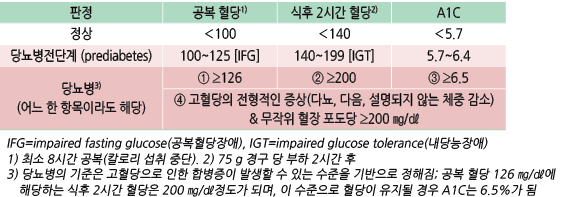
```

*   명백한 고혈당 증상이 없는 경우에는 다른 날 검사를 반복해야 하지만, 동시에 시행한 검사들에서 두 가지 이상의 기준에

    해당되면 바로 진단

※ portable glucose meter로 당뇨병을 진단해서는 안 됨 \[ADA]

* 고혈당 증상이 있는 T1DM의 급성 발병은 A1C보다 혈당으로 판단
* 혈당과 A1C 수준 불일치 원인 : A1C 검사 간섭, 불규칙한 약물 복용/생활 요법
*   1형/2형 당뇨 감별 : islet auto-Ab(인슐린, glutamic acid decarboxylase(GAD), islet antigen 2 (IA-2), zinc transporter 8(ZnT8)),

    인슐린, c-peptide

    • 공복 혈청 c-peptide : ＜0.6 ng/㎖(0.2 n㏖/L) 시 T1DM, ≥1.0 ng/㎖(0.33 n㏖/L) 시 T2DM; 경계 시 추후(5년 후) c-peptide 재검

    • 자가 항체 : 양성 시 면역 매개성 T1DM 가능성이 높으나 T2DM 진단 환자의 4\~25%에서도 항GAD Ab(+)이며, 이 경우

    인슐린 치료를 받을 가능성이 높음; T1DM과 겹치는 phenotype 위험이 있는 성인 당뇨병 환자(예: 진단 시 젊은 연령,

    의도하지 않은 체중 감소, 인슐린 치료까지 짧은 시간) 에서 분류를 위해 표준화된 islet auto-Ab 검사를 권고

※ 대부분의 환자에서 islet autoantibodies, 인슐린, proinsulin, c-peptide의 일률적 검사는 권고하지 않음 \[ADA]

#### 혈당 검사 유의 사항 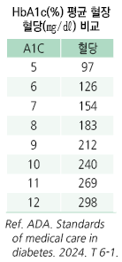

* 공복 : 8시간 이상 칼로리 섭취를 하지 않음; 단 ＞12시간 공복 시 결과가 부정확해짐
* 식후 2시간은 식사 개시부터 2시간째를 의미(경구 당 부하 검사도 마시기 시작부터)
* 혈당 측정은 정맥 혈장 혈당을 이용하는 것을 원칙으로 함
*   검체에 따른 차이 : 혈장＞전혈( ✽혈구 성분 영향으로 10\~15% 차이가 남)

    •동맥혈＞모세혈관혈＞정맥혈 (✽동정맥 차이: 공복 시 ＞10 ㎎/㎗, 식후 20\~50 ㎎/㎗)

    ✽일반적으로 손끝 전혈을 측정하는 혈당계는 혈장 혈당 값으로 보정되어 표시됨
*   신속 혈당 검사 영향 요인(실제 혈당보다 높게 측정) : 요산, acetaminophen, L-dopa, xylose, galactose,

    비타민C(＞500 ㎎/d), alcohol
*   당 부하 검사 : 검사 전 3일간 150\~200 g/d 탄수화물 섭취 → 전날 밤부터 금식

    → 다음날 오전에 정해진 포도당(+물 300 ㎖)을 5분 내에 섭취하고 검사

    •당 부하 검사 위양성 유발 인자 : 영양실조, 병상 생활, 감염, 심한 정서적 스트레스

#### 당화혈색소 검사 유의 사항

* A1C는 최근 2\~3개월의 혈당 상태를 반영. 특히 최근 1개월의 혈당 수준에 50%의 영향을 받음
*   A1C false increase : 철결핍/Vit B12/folate 결핍 빈혈, 신부전, uremia, TG ＞1,750 ㎎/㎗, Bil ＞20 ㎎/㎗, 만성 음주,

    aspirin 과량 복용, 만성 opioid 복용, 납 중독, 고령
*   A1C false decrease : 급만성 실혈, 용혈성 빈혈, ribavirin/interferon-α(용혈성 빈혈 관련), splenomegaly, Vit E 섭취,

    임신 2&3분기/산욕기, 채혈 또는 검사 지연에 의한 RBC 파괴
*   A1C false variation : 수혈, Hb variants, Vit C 복용

    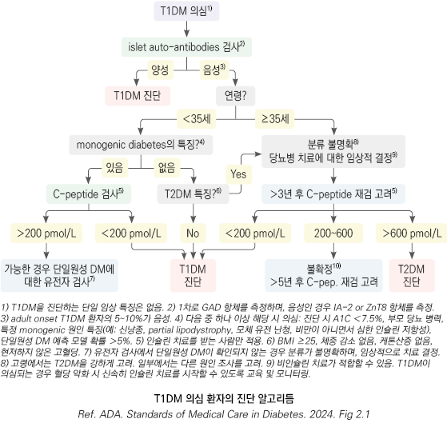

## 선별 검사

#### 항목

* 공복 혈당(FBS), 75 g 경구 당부하 검사(OGTT), A1C

#### 선별 검사 대상 및 일정

\*\* 대한당뇨병학회\*\* (2025)

* 35세 이상의 모든 성인, 위험 인자가 있는 19세 이상 성인
* ‘하나의 당뇨병 선별검사 결과가 당뇨병전단계에 해당하는 성인이 당뇨병이 의심되는 경우 다른 방법의 선별검사’로 추가검사를 시행
* ‘선별검사 결과가 정상인 성인 은 매년 재검사’
* 임신당뇨병을 진단받았던 임신부는 출산 6\~12주 후 75 g OGTT 시행을 고려

\*\* 미국당뇨병학회\*\*

1.  다음 중 하나 이상의 위험 인자가 있는 BMI ≥25 or BMI ≥23(Asian American)

    ① 1세대(부모, 형제) 당뇨병 가족력

    ② 고위험 인종(예: Asian American)

    ③ CVD 병력

    ④ 고혈압(≥140/90 ㎜Hg or 치료 중)

    ⑤ HDL-C ＜35 ㎎/㎗ or 중성지방 ＞250 ㎎/㎗

    ⑥ 다낭성난소증후군 여성

    ⑦ 비활동적 생활

    ⑧ 인슐린 저항성 관련 상태(예: 심한 비만)
2. 당뇨병전단계 환자(A1C ≥5.7%)는 매년
3. 임신당뇨병 병력자는 최소 3년마다 검사
4. 위에 해당하지 않는 모든 사람은 35세에 검사 시작
5. 검사에서 정상이면 최소 매 3년마다(처음 검사 결과와 위험 정도를 고려하여 간격 조절)
6. HIV 환자

※ 당뇨병 유발 약물을 투여하는 경우 당뇨병 검사 고려;

```
급성 췌장염 발생 후 3~6개월내 및 매년, 만성 췌장염 환자에서 매년 당뇨병 검사 권고;

임상전단계 T1DM는 6개월마다 A1C 및 매년 당부하 검사 권고 (ADA 2024) 
```

#### 당뇨병 위험도 체크 리스트

```
(Ref. 대한당뇨병학회. 당뇨병 진료지침 2023. Table 2-2)

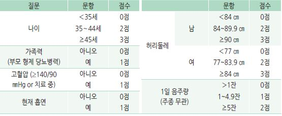
```

* 합계 점수가 높을수록 당뇨병 발생 위험 증가; 5~~7점 대비 8~~9점 시 2배, ≥10점 시 ≥3배
* 총점 ≥5점 시 혈당 검사(공복 또는 식후 혈당)를 권고

Management

### 치료 방침

1.  동반 질환 및 합병증 위험성 평가 : ASCVD 및 심부전 병력, ASCVD 위험 인자 및 10년 위험도 평가, CKD 단계 평가,

    저혈당 위험 평가, 망막병증/신경병증 평가

    ☞ [ASCVD 10년 위험도](https://tools.acc.org/ASCVD-Risk-Estimator-Plus/#!/calculate/estimate/)
2. 치료 목표 설정 : A1C/혈당 목표, 혈압, 당뇨병 자가 관리 목표 설정
3.  치료 계획 수립 : 생활 습관 중재, 항당뇨병제, 심혈관/신질환 관리, 혈당 측정 기기/인슐린 투여 기기 사용, (필요시) 의뢰\*

    \*다음의 경우에 교육 및 지원 필요 : 진단, 매년 &/or 목표 달성 실패, 합병증/위험 요소 발생(의료, 신체, 정신 사회적),

    삶/관리에 변화 발생

※ 당뇨병 자기 관리 교육

• 당뇨병 진단 후 ‘매년’ 자기 관리 교육; 1년 이내라도 ‘치료 목표에 도달하지 못하거나 자기 관리에 영향을 주는 문제가 발생했을 때’는

```
자기 관리 교육의 필요성을 평가하고 반복 재교육 [전문가의견]
```

• ‘의료, 간호, 영양, 운동, 약물, 사회 복지 각 분야의 자격을 갖춘 교육자가 참여

. • ‘당뇨병 자기 관리 교육에 디지털 기기의 활용을 적극 고려

### 치료 목표

```
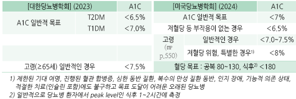
```

* 식전 포도당이 목표에 도달했음에도 불구하고 A1C 목표가 달성되지 않을 경우 식후 포도당을 목표로 할 수 있음
*   연속 혈당 측정 장치를 사용 시 목표 혈당 범위(70\~180 ㎎/㎗) 내 시간이 ›70%, 목표 혈당 범위 미만(＜70 ㎎/㎗) 시간을 ＜4%,

    특히 ＜54 ㎎/㎗만의 저혈당 시간은 ＜1%이 되도록 함

당뇨병 환자의 포괄적 관리

#### 첫 방문 시 평가 항목

1. 당뇨병 진단 확인, 병형 분류, 혈당 상태
2. 당뇨병성 합병증, 동반 질환 및 위험 인자
3. (기존 DM 진단 시) 과거 치료 방법, 위험 인자 조절 방법, 당뇨병 교육 여부
4. 영양 상태
5. 자가 관리 수행 능력
6. 신체검사와 실험실 검사
7. 예방접종 및 정기검진 여부

#### 재방문 시 평가 항목

1. 첫 방문 때 시행한 평가 항목 검토
2. 지난 방문 이후 병력
3. 약물 복용에 대한 순응도 및 부작용
4. 적절한 주기의 HbA1c, 대사 지표 등 검사
5. 합병증 위험, 자가 관리 실천 여부, 다른 기관으로의 전원 필요성 평가

* T1DM 환자에서 소화기 증상 또는 셀리악병 의심 소견이 있는 경우 셀리악병 선별
*   직계 1대 중 T1DM 환자가 있는 경우에 자가항체 판넬 검사 권고; 지속되는 자가항체는 임상적인 당뇨병의

    위험 인자이며 중재의 지표로 작용할 수 있음
* LFT↑ or 초음파상 지방간이 있는 전단계/당뇨 환자에서 비알코올 간염 및 간섬유화 평가 (☞ p.468)
* hypogonadism(예: 성 기능 저하) 징후를 보이는 남성 환자에서 아침 s-testosterone 검사 고려
*   ‘모든 T2DM 성인에게 대사이상지방간질환의 평가를 권고’, ‘대사이상지방간질환을 평가하기 위한 일차 선별검사로 ALT

    (alanine aminotrasnferase)와 복부초음파를 시행’, ‘대사이상지방간질환을 동반한 T2DM 성인에게는 간섬유화 확인을 위해

    vibration-controlled transient elastography를 고려’ \[무작위대조군연구]

    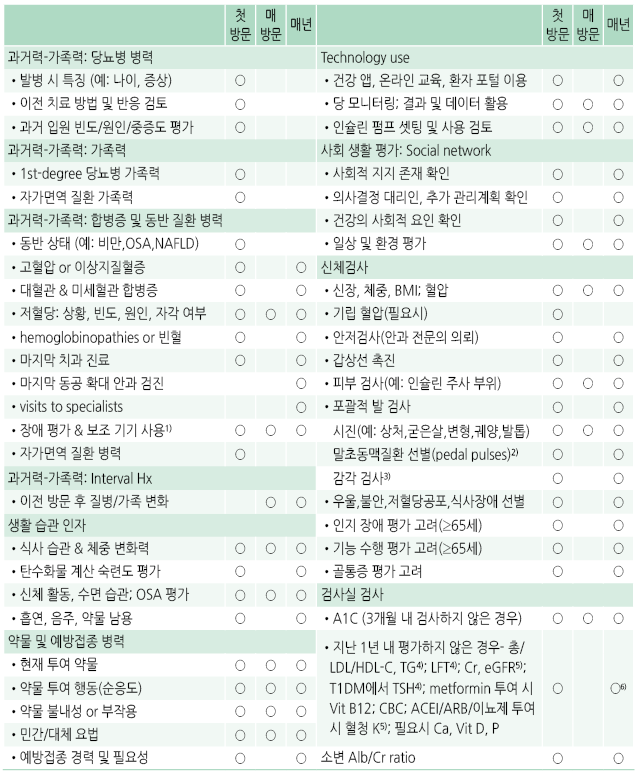

    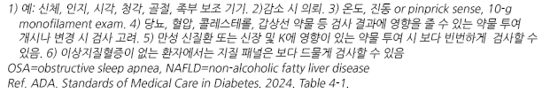

예방접종

```
(☞ p.1102)
```

* B형간염, 폐렴구균, 독감, COVID-19 백신 접종

## 비-약물 치료 및 예방

*   생활 습관 개선 : 체중 감량, 운동, 식이/영양 관리, 금연(전자 담배 포함), 음주 제한, 수면 관리(밤에 6\~8시간 수면,

    폐쇄수면무호흡증(OSA) 선별)
* 효과 : 생활 치료로 A1C 1\~2% 개선; 약물 치료 시작을 지연시키거나 약물 필요량 감소

### 식이/영양

*   개별화한 목표와 선호에 따라 지중해식, 채식, 저지방, DASH, 저탄수화물식 식이를 권고

    \*✽ ‘혈당 조절과 관리를 위해 과도한 탄수화물 섭취는 제한하되, 치료 목표와 선호에 따라 개별화; \*

    ```
      *‘식이섬유가 풍부한 통곡류, 콩류, 채소, 생과일의 섭취를 통해 탄수화물의 질적 섭취를 충족하도록 권고*
    ```
* ✽ 지중해식 식단 : 충분한 양의 식물성 식품(채소, 콩/견과류, 씨앗, 과일, 전곡류), 생선/해산물; \*
* 보통의 올리브유(지방 공급원); 보통\~소량의 유제품(요구르트, 치즈); 계란 ＜4개/주; 낮은 빈도의 소량의 붉은 고기; \*
* 보통\~소량의 와인; 매우 적은 량의 설탕 또는 꿀 섭취 (☞ p.1166)\*
* ✽DASH(dietary approaches to stop hypertension) diet : 1일 채소 5 servings, 과일 5 meals, 탄수화물 7 servings,\*
* 저지방 유제품 2 servings, lean meat 제품 ≤2 servings, 견과류/씨앗류: 2\~3 times\*
*   일반적으로 총 섭취 영양 구성을 탄수화물 50~~60%, 단백질 15~~20%, 지방 25% 이내로 하지만 탄수화물, 단백질, 지방의

    유일한 이상적 비율은 없음
* 식사 계획은 총 칼로리와 대사 목표를 염두에 두고 개인화되어야 함

#### 탄수화물

*   식이 섬유가 풍부하고 (최소 14 g/1000 ㎉) 영양 밀도가 높고, 가공이 덜 된, 설탕이 첨가되지 않은 탄수화물 선택.

    예: 채소, 과일, 콩류, 통곡물, 유제품
* 당류 섭취 제한; 당류 섭취를 줄이는데 어려움이 있는 경우에는 인공감미료의 제한적 사용 고려
* 정해진 용량의 인슐린 주사를 맞는 환자에서는 음식 섭취량과 시간을 일정하게 하도록 교육
*   낮은 당지수(glycemic index) 및 당부하지수(glycemic load) 식품 권고

    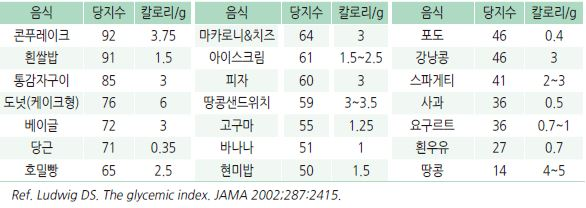

#### 식이 섬유

*   효과 : 당뇨병 발생 감소, 혈당 조절 개선, 심혈관 질환 감소

    • 대사에 있어서 수용성 식이 섬유의 효과에 대한 근거가 많으나 권장섭취량은 일반적으로 수용성과 불용성을

    구분하지 않음
* 충분 섭취량 : 20\~25 g/d (☞ p.1170)
* 수용성 섬유 식품 : 가지, 귀리 가공식품, 콩, 보리
* 불용성 섬유 식품 : 전곡류, 짙은 색 채소, 단단한 줄기, 밀기울, 사과/배의 껍질, 감자류

#### 단백질

* 일반적으로는 단백질 섭취를 제한하지 않음
*   T2DM 환자에서 단백질 섭취는 혈당 증가 없이 인슐린 반응을 높이므로 저혈당 발생에 대한 주의가 필요한 환자에서는

    고단백 식품 섭취를 피함
* ≥1 g/d의 단백뇨가 있는 신장 합병증 동반 시 단백질 섭취 제한 (☞ p.567)

✽단백질 섭취를 ＜0.8 g/㎏/d로 낮추는 것은 당 조절, 심혈관 질환 위험, GFR에 유의미한 영향을 주지 못하며 영양실조 위험을

```
높일 수 있음
```

✽ 신장 질환이 있는 환자에서 ‘단백질 섭취를 제한할 필요는 없으며, 과다 섭취나 엄격한 제한은 피함

#### 지방

*   불포화 지방산 풍부 식품(예: 등푸른 생선, 식물성 기름) 권고

    ✽'불포화지방산 보충제의 일반적인 투여는 권고하지 않음'은 삭제
* 포화지방 및 트랜스 지방(예: 돼지고기, 쇠고기, 닭 껍질, 버터, 마가린, 생크림, 쇼트닝, 치즈, 햄) 섭취 제한
* 지중해식 식단 권고, 오메가-3 풍부 식품(예: 생선, 견과류, 씨앗류) 권고

**기타**

*   음주 : 금주 권고(특히 간질환, 고지혈증, 비만인 당뇨병 환자); 혈당 조절이 잘되는 경우에만 여 ≤1 SD/d, 남 ≤2 SD/d로 허용,

    음주 후 당 모니터링 권고 (☞ p.995)

    • 음주는 저혈당 위험을 증가시킴(특히 인슐린 or 인슐린 분비 촉진제 투여 환자)
*   항산화제, ω-3, Vit, 무기질 보충 : 혈당 개선 목적의 일상적 보충은 권고 안 함

    • 부족한 상태가 아닌 한 보충이 도움이 된다는 증거 없음; 결핍이나 제한적 식사 시 보충 고려

    • 오메가-3 지방산(fatty fish(EPA, DHA), nuts/seeds(ALA))이 CVD 치료 또는 예방을 위하여 권고되지만 일률적 사용에

    대한 이득의 증거는 없음

    • β-carotene 보충제는 이득이 없고 일부에서 해롭다는 증거가 있어 사용하지 않도록 함

    • Vit D ≥1000 IU/d 보충이 T2DM의 위험을 줄인다는 보고가 있음; 영유아기부터의 꾸준한 Vit D 공급 시 청소년

    T1DM 발생 감소
* Na : ＜2.3 g/d(소금으로 6 g)으로 제한 (☞ p.483)

### 운동 (☞ p.1164 운동 지침)

* 효과 : T2DM 발병 위험 감소, 인슐린 감수성 개선; 적은 운동이라도 도움이 됨
*   유산소 운동

    • 중등도 이상 강도로 ≥150분/주(가급적 매일 ≥30분), ≥3일/주; 연이어 ＞2일 쉬지 않음

    • 신체적으로 건강한 젊은 사람은 고강도의 짧은 시간(75분/주) 또는 간헐적 운동도 가능
* 저항성 운동 : 금기 사항이 없는 한 연속되지 않은 날로 2\~3 sessions/주 권고
* 유연성/균형 운동 : 고령자에서 2\~3 회/주. 예) 요가, 태극권
* sedentary behavior(예: quiet sitting, lying, leaning) 최소화; 30분을 앉아 있었으면 일어나서 활동 함
* 운동 전후, 전신 상태나 운동의 강도가 변화, 또는 운동 시간이 길어질 때는 혈당을 측정하여 저혈당 또는 고혈당 여부 확인
* 처음 운동 시작 전 CVD, 고혈압, 미세혈관합병증 유무 평가, 금기사항 유무 확인
*   심한 당뇨망막병증이 있는 경우 망막출혈이나 망막박리의 위험이 높으므로 고강도 운동 회피, 심한 말초 신경병증이나

    발 질환이 있는 경우 체중 부하 많은 운동 회피, CVD가 있거나 위험이 높은 경우 고강도 운동 회피

    ✽과도한 운동은 미토콘드리아 장애와 당 내성 감소의 원인이 된다는 보고가 있음

#### 운동전 혈당 수준에 다른 대처

*   ＜ 90 ㎎/㎗ : 운동 시작 전 운동 수준에 따라 빠르게 흡수될 수 있는 15~~30 g의 탄수화물(예: 사탕 4~~6개, 주스 120\~200 ㎖)

    섭취(＜30분의 운동, 웨이트 트레이닝 등의 고강도 운동에서는 필요하지 않을 수 있음);

    중강도 장시간 지속되는 운동 시 탄수화물(혈당 수준에 따라 운동 1시간마다 0.5\~1 g/체중 ㎏) 추가 섭취
* 90~~150 ㎎/㎗ : 운동 시작 및 1시간마다 0.5~~1 g/체중 ㎏의 탄수화물 섭취(운동의 형태나 인슐린의 작용 정도에 따름)
* 150\~250 ㎎/㎗ : 운동 시작 후 ＜150 ㎎/㎗이 될 때까지 탄수화물 섭취 보류
*   250~~350 ㎎/㎗ : 케톤 검사 및 중간~~많은 량의 케톤이 나올 경우 운동 중지; 저강도\~중강도 운동 가능, 고강도 운동은 고혈당을

    유발할 수 있으므로 ＜250 ㎎/㎗이 될 때까지 운동 연기
*   ≥350 ㎎/㎗ : 케톤 검사 및 중간\~많은 량의 케톤이 나올 경우 운동 중지; 케톤이 없다면 운동 전에 인슐린 작용 상태에 따라

    인슐린 용량 조정(일반적으로 약 50%); 저강도\~중강도 운동 시작, 혈당이 내려갈 때까지 힘든 운동은 하지 않음

### 체중 관리

```
(☞ p.1012)
```

* 효과 : 인슐린 감수성, 혈당, 고혈압, 이상지질혈증 개선
* 목표 : 비만 또는 과체중 시 처음 체중에서 5\~7% 감량; 최소 5% 감량 후 유지

✽T2DM 환자에서 10% 이상 감량 시 당뇨 관해를 포함하는 질병 경과 변경 효과가 있을 수 있음

✽T2DM 환자에서 semaglutide와 tirzepatide가 체중 감량 효과가 큼

* 식이, 정기적 신체 활동/행동 (200~~300 분/주) 전략으로 500~~750 ㎉/d의 에너지 손실을 유도
* 과체중/비만인 당뇨병전단계 성인에게 당뇨병 예방을 위해 metformin 사용을 고려할 수 있음
* ‘비만한 T2DM 환자의 체중 감량을 위해 생활 습관 교정의 보조 요법으로 항비만제 사용을 고려 \[전문가의견, 일반적권 ]

#### 골절 관리

(☞ p.804)

* 골절 위험 인자 : 골다공증성 골절 병력, ＞65세, 낮은 BMI, 여성, 흡수 장애, 잦은 낙상, steroid 투여, 가족력, 알코올 남용, 흡연, RA
*   당뇨 특이 골절 위험 인자 : T-score ≤-2.0, 잦은 저혈당, 당뇨 병력 ＞10년, 당뇨 강하제( 인슐린, TZD, SU), A1C ＞8%,

    neuropathy, retinopathy, nephropathy
* DM 고령자 (＞65세) 에서 골절 위험 평가를 해야 함
* 고위험 DM 고령자와 DM 및 다중 위험 인자를 가진 젊은층에서 2\~3년마다 DEXA법으로 골밀도 모니터링
* 골절 위험이 높은 환자의 DM 치료 시 혈당 관리 목표를 개별화하고 약물 선택 시 골절 안전성 및 저혈당 위험을 고려
* T-score ≤-2.0 또는 골절 병력이 있는 DM 환자에서 골밀도 향상을 위한 치료 고려

## 약물 치료

```
(☞ p.555)
```

## 평가 및 모니터링

### 신체검사

* 매 진료 시 키/몸무게/BMI, 혈압(기립 혈압 포함)
* 갑상선 촉진
* 안저 검사 : 매년 안과 전문의에게 동공 확대 상태로 검사
* 피부 검사(인슐린 주사 부위 포함)
* 발 평가(족부 맥박 포함)
* patellar 및 Achilles 반사 평가
* proprioception, vibration, monofilament sensation 평가

### 실험실 검사

* 반복적인 자가 혈당 및 A1C로 혈당 조절 평가
* 처음 진단 시 또는 3개월 내 평가하지 않았다면 A1C 시행
*   지난 1년 내 평가하지 않았으면 다음 검사를 시행 (매년 시행) : 지질, 간 기능, TSH\*, 소변 알부민,

    u-microalbumin/Cr ratio, eGFR (항목별 검사 주기 ☞ p.565)

    \*_검사 대상: T1DM, 이상지질혈증, ≥50세 여성_
* 아침 s-testosterone : hypogonadism 증상(예: 성욕 감퇴, 발기 장애)이 있는 남성 환자에서 고려

#### HbA1c

* ‘일반적인 당뇨병 성인은 2-3개월마다’, ‘혈당조절이 안정적인 당뇨병 성 인은 연 2회까지 줄여서 시행’
* ‘혈당 변화가 심할 때, 약물을 변경했을 때, 철저한 혈당 조절이 필요할 때(예: 임신 시)’는 2-3개월보다 더 자주 시행

#### 자가 혈당 모니터링 (BGM)

* 모든 환자에게 자가 혈당 검사 방법을 교육
* 자가 혈당 측정기 관리 : 정확도를 유지하기 위해 연 1회 이상 실험실 측정 혈당치와 비교
*   측정 시간 : 식사 전후, 취침 전, 새벽, 운동 전후, 저혈당 의심, 위험한 일 수행 전, 기타 필요시

    • ‘공복 시’, ‘저혈당이 의심될 때, 저혈당 에서 정상혈당으로 회복될 때까지, 고혈당이 의심될 때’에도 측정
*   측정 횟수 및 대상 (환자 상태에 따라 개별화)

    ① 매일 1회 이상 측정 : 모든 당뇨병 환자

    ② 매일 3회 이상 측정 : 다회 인슐린 요법 환자

    ③ 연속 혈당 검사 : 혈당 조절 불량(저혈당 or 고혈당),

    적극적 인슐린 요법 시행 환자

※ 비인슐린 요법(식이 요법 &/or 경구제만으로)으로 관리되는 T2DM 환자에서는 일상적 BGM을 권고하지 않음. BGM은 A1C 감소를

촉진하지 않음 \[ADA]

#### 연속 혈당 측정 장치 (CGM)

*   대상 : \[권고] T1DM 환자(특히 저혈당 발생 또는 저혈당 무감지), 혈당 목표치를 달성하지 못한 환자;

    \[고려] 인슐린 요법을 하는 T2DM 환자
*   저혈당이 문제가 되는 경우(예: 저혈당 무감지, 야간 저혈당)에는 간헐 스캔 연속 혈당 측정보다는 알람 기능이 있는 실시간

    연속 혈당 측정을 권고. 간헐 스캔 연속 혈당 측정에도 불구하고 목표 혈당에 도달하지 못한 경우에도 실시간 연속 혈당

    측정으로 변경 고려

※ 비침습적 포도당 측정 시스템은 정확도가 부족하여 권고할 수 없음(FDA 미승인) \[ADA]

※ 인슐린 치료를 하는 T2DM 성인 환자에서 실시간연속혈당측정장치 사용은 다음 두 가지 경우로 구분하여 권고함.

① 다회 인슐린 주사 또는 인슐린 펌프를 사용하는 T2DM 환자는 실시간연속혈당측정장치를 상시적으로 사용하도록 권고 \[일반적권고]

②기저 인슐린 치료를 하는T2DM 환자는 실시간연속혈당측정장치를 상시적으로 사용하도록 권고\[제한적권고]

#### Glycated protein(fructosamine) or Glycated albumin

* 반감기가 짧아 최근 2\~4주간의 혈당 상태를 반영
* 유용성이 명확하게 확립되지 않음. 당뇨병의 만성 합병증과의 관계가 입증되지 않음
*   대상 : A1C 수치의 신뢰성이 떨어지는 경우(예: 혈당과 A1C 검사 결과가 상충. A1C에 영향을 주는 요인 발생),

    최근 당 상태를 평가하고자 하는 경우 고려 (보험주의)

#### 지질

* 검사 빈도 : 당뇨병 진단 시 및 매년 (＜40세에서는 5년 이하 간격)
* 검사 항목 : 총 콜레스테롤, HDL-콜레스테롤, LDL-콜레스테롤, 중성지방

### 기타

* 당뇨 합병증 모니터링 (☞ p.565)
* 불안, 우울, 섭식 장애 등 환자의 정신적/감정적 문제 모니터링

## 특별한 상황에서의 당뇨병 관리/ 동반 질환 관리

### Prediabetes

* 적극적인 비-약물 치료 시행
* T2DM 고위험군인 경우 metformin 투여 고려. 예: BMI ≥35인 25\~59세, FBS ≥110 ㎎/㎗, A1C ≥6.0%, 임신당뇨병 병력
* 매년 당 상태 검사

### 저혈당

* 매 진료 시 저혈당 증상이 있었는지 확인
*   중증 저혈당이 반복되는 환자에서 실시간 연속 혈당 측정 장치 권고; 저혈당 무감지증 의심 환자에서 저혈당무감지증

    평가 권고
* 저혈당 발생 시 치료 평가 및 조절 (☞ p.573)
* 임상적으로 유의미한 저혈당(≤54 ㎎/㎗) 위험이 높은 환자에 대하여 glucagon 처방
*   ‘저혈당 위험이 높은 모든 개인’뿐만 아니라 ‘인슐린을 사용하는 환자’에 대하여 저혈당 예방과 관리에 대한 체계적 교육,

    특히 ‘저혈당을 경험한 사람’은 지속적으로 저혈당 교육

#### 치료

① ＜70 ㎎/㎗ 시 포도당 15~~20 g 투여(예: 사탕 4~~5개, 주스 120\~150 ㎖)

② 포도당 투여 15분 후 저혈당 지속 시 포도당 반복 투여

③ 혈당이 정상으로 회복되면 음식 섭취

### 수술

* 수술 전후 금식 기간 조치 : 혈당 검사 빈도를 늘림, 인슐린 점적 정맥 주사 고려
* 수술 예정 시 A1C 목표 ＜8%, 수술 전후 혈당 목표 100\~180 ㎎/㎗를 권고

### 아픈 날 대처

* 투여 중인 인슐린 또는 경구 혈당 강하제는 계속 투여하며 더 자주 혈당 측정
* 탈수 예방을 위해 적당한 수분 섭취, 적당한 당질(탄수화물) 섭취
* 급성 질환에서 식사량이 감소하거나 고혈당이 발생하면 진료

### 입원 치료 고려 대상

* 고열 지속, 요중 케톤 강양성, 혈당 ≥350 ㎎/㎗

### 고혈압 관리

* T2DM 환자의 40%에서 당뇨병 진단 시 고혈압이 동반되어 있음
* 일상적인 병원 방문 때마다 혈압 측정; 가정 혈압 측정을 권고
*   목표 혈압

    • \[대한당뇨병학회] ‘당뇨병환자에서 혈압조절목표는 130/80 ㎜Hg 미만’

    • \[ADA] ＜130/80 ㎜Hg; 임신 시 110\~135/85 ㎜Hg
*   선택 약제 : ACEI/ARB(1차 선택제)를 비롯한 모든 1차 항고혈압제 가능

    • 특히 알부민뇨, 소변 Alb/Cr 비 ≥30 ㎎/g, Cr ≥30\~299 ㎎/g, eGFR ＜60, 또는 ASCVD : ACEI 또는 ARB 권고 (☞ p.497)

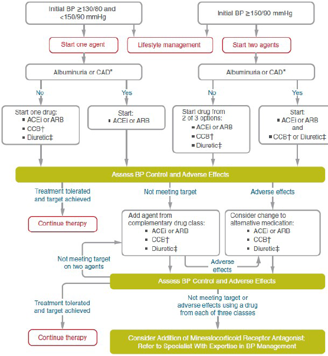


지질 관리

#### T2DM 환자에서의 지질 치료 목표 \[대한당뇨병학회] (☞ p.524)

* DM 유병 기간 ＜10년 & 주요 심혈관 질환(CVD) 위험 인자1) 없음 : LDL-C ＜100 ㎎/㎗
* 심혈관 질환 동반 시 LDL-C ＜ 55 ㎎/㎗ 미만 & 기저치보다 50% 이상 감소
* 유병 기간 ≥ 10년 또는 주요 CVD 위험 인자 or 표적 장기 손상 동반2) : LDL-C ＜ 70 ㎎/㎗
* 표적 장기 손상1) or 주요 CVD 위험 인자 ≥3개 동반 : LDL-C ＜55 mg/dL
*
  1. 주요 CVD 위험 인자 : 연령, 관상동맥질환 조기발병 가족력, 고혈압, 흡연, HDL-C ＜40 ㎎/㎗\*
*
  2. 표적 장기 손상 : 알부민뇨, eGFR ＜60, 망막병증, 신경병증, 좌심실비대증\*

#### 모니터링

* 당뇨병 진단 시 및 매년 1회 이상 지질 검사(총콜레스테롤, HDL-C, LDL-C, TG)
* 이상지질혈증 치료 대상에 해당하는 경우 이를 시행

#### 치료

* LDL-C 목표치 도달을 우선으로 치료
* 1차 선택 : statin
*   심혈관 질환이 동반된 환자에게서 statin에 ezetimibe를 추가한 후에도 목표치에 도달하지 못한 경우 statin과 PCSK9i

    병용을 고려
* TG ≥500 ㎎/㎗ 시 원인 검사 및 췌장염 위험 감소를 위한 약물 치료 고려

#### ASCVD 예방 \[ADA]

\*\* ASCVD가 없는 당뇨병 환자에서의 1차 예방\*\*

* ASCVD가 없는 40\~75세 : 생활 습관 중재에 추가하여 중강도 statin 치료
* ASCVD 위험 인자가 있는 20\~39세 : 생활 습관 중재에 추가하여 statin 치료를 고려
* ASCVD 위험 인자 ≥1개의 40\~75세 : LDL ≥50% 줄임 & LDL ＜70 ㎎/㎗ 목표 statin 치료
* 40\~75세 ASCVD 고위험군(특히 복수의 위험 인자 & LDL ≥70 ㎎/㎗) : statin 최대 내약 용량 & {ezetimibe or PCSK9i}
* ＞75세 : 이미 statin 복용 중인 경우 유지

•새로운 시작은 이익-위해를 비교하여 결정(✽＞75세에서는 stain의 효과가 적음)

\*\* ASCVD 동반 당뇨병 환자에서의 2차 예방\*\*

* ASCVD와 당뇨병이 있는 모든 연령의 환자 : 생활 습관 중재 및 고강도 statin 치료
*   ASCVD와 당뇨병이 있는 경우 LDL ≥50% 줄임 & LDL ＜55 ㎎/㎗ 목표의 고강도 stating 치료 권고. 최대 내약 용량의

    statin에도 목표를 달성하지 못할 경우 ezetimibe or PCSK9i 추가

#### 항혈소판제 \[대한당뇨병학회]

* 심혈관 질환을 동반한 환자에서 2차 예방 목적으로 aspirin 100 ㎎/d 사용
* aspirin 알레르기가 있는 경우 clopidogrel 75 ㎎/d 사용을 고려
* 급성관상동맥증후군이 발생한 경우에는 aspirin과 P2Y12수용체대항제를 병용
* 심혈관 위험이 높으나 출혈 위험은 높지 않은 환자에게는 심혈관 질환의 1차 예방을 위해 aspirin 100 ㎎/d 사용을 고려

### 신장 질환 위험 관리

```
(☞ p.566)
```

* SGLT2i 치료를 시작한 경우 eGFR이 감소하더라도 신대체 요법을 시작하기 전까지 유지
*   알부민뇨(+), eGFR↓, s-K 정상인 T2DM 환자에서, 당뇨병콩팥병증 진행 억제를 위해 심혈관 및 신장 이익이 입증된

    nonsteroidal mineralocorticoid receptor antagonist(finerenone \[케렌디아])를 권고
* 심혈관 위험이 높은 T2DM 환자에서, 알부민뇨의 진행 억제를 위해 심혈관 및 신장 이익이 입증 된 GLP-1 RA를 권고

### 행동/정신 건강 상담

*   다음의 경우가 확인되거나 의심 시 행동/정신 건강 전문가에게 의뢰를 고려

    •선별 검사 등을 통하여 당뇨병 고통, 우울, 불안, 저혈당 공포, 인지 장애

    •문란한 식사 행동 또는 식사 패턴, 섭식 장애

    •약물 투약의 고의적인 누락

    •심각한 정신 질환

    •행동의 자가 관리가 어려움, 당뇨병 케토산증으로 인한 반복적인 입원, 상당한 고통

    •당뇨병 자가 관리 행동 수행 능력 저하 또는 장애

    •조절 지원이 지속적으로 필요한 경우 비만 또는 대사 수술 시행 전 및 수술 후

### 예방접종

* B형간염, 폐렴구균, 독감, COVID-19 백신 접종

### ■ 고령자(≥65세)의 당뇨 관리

고령 당뇨병 환자의 당, 혈압, 지질 목표

```
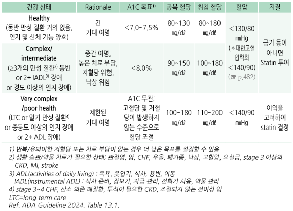
```

당뇨 선별 검사

*   공복 혈당 &/or A1C : 당뇨병이 없는 경우 2년마다 검사 권고(환자 상태에 따라 조정)

    • 고령에서는 RBC 수명에 영향을 주는 다른 질환 때문에 A1C가 부정확할 수 있음

    • 연령 증가에 따라 당뇨병 환자가 아닌 경우에도 A1C가 증가하므로 과잉 진단 및 치료가 되지 않도록 주의
*   prediabetes로 진단된 다음의 경우에 2시간 OGTT 권고 : 고위험군(과체중, 비만, 1세대 내 당뇨병 병력, CVD 질환 병력,

    고혈압), HDL-C ＜35 ㎎/㎗, TG ＞250 ㎎/㎗, 수면무호흡증, 비활동적 생활

### 인지 기능 및 전반적 건강 평가

*   당뇨병 자가 관리 및 삶의 질에 영향을 미치는 Geriatric syndromes(다제약물 복용, 인지 장애, 우울, 요실금, 낙상, 만성 통증)

    평가
* ≥65세에서 ‘포괄적 평가-첫 방문’을 시행하고, 매년 경도인지장애 or 치매 선별 검사 시행

**전반적인 건강 평가**

⑴ General health assessment : 기능 상태(ADLs/IADLs), 우울, 인지 기능, 낙상 위험, BMI, 혈압, 흡연, 음주, 복용 약물,

```
암 선별, 청력, 시력, 동반 질환, frailty/physical performance
```

⑵ General health tests : ECG, 지질 판넬, BMD, abdominal aortic aneurysm 초음파

⑶ Diabetes-specific health : retinopathy, nephropathy, neuropathy, medical nutrition therapy, diabetes management,

```
diabetes self-management training 
```

### 치료 방침

* 환자의 상태에 따른 조절 목표 설정
* 빈번한 혈당 검사
*   저혈당 발생 주의 : 고령자는 저혈당 위험이 높고, 저혈당을 스스로 잘 인지하지 못하므로 치료 중재 및 목표 혈당 설정에

    주의를 요함

    • 저혈당 경고 징후 : 70\~100 mg/dL, 24시간 이내 2회 이상 >250, 연속 2일 이상 >300, 측정 한계를 넘음, 구토나 고혈당

    증상이 있거나 식사를 못함

### 생활 습관 교정

* 적정 영양분 및 단백질 섭취, 규칙적 운동 권고
* 안전한 운동이 가능한 과체중/비만 T2DM 환자에서는 식이 조절, 신체 활동, 적당한 체중 감량(5\~7%)을 고려

#### 영양

*   영양 상태 평가

    •[Mini nutritional assessment](https://www.mna-elderly.com/forms/MNA_korean.pdf)

    •Short nutritional assessment questionnaire (SNAQ) : 입원 환자 대상

    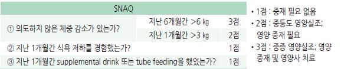
* 생활 습관 교정으로 목표 혈당에 도달하지 못한 영양실조의 위험이 있는 환자에 대하여 단순 당의 섭취 제한을 고려
* 식이 변화 시 당의 변화를 세심히 관찰해야 함

#### 운동

* 모든 고령자에게 안전하게 참여할 수 있는 범위에서 유산소 운동, 저항성 운동 등 활동을 권고

### 약물 치료

* 가능한 한 단순한 요법 선택. 특히 인지 장애, 말기/중증 질환자의 경우 단순한 관리 전략 수립
* 1차 선택 : metformin (단, 현저한 신장 기능 저하(eGFR ＜30), GI 불내성 경우는 제외)
* 생활 습관 중재 및 metformin으로 조절되지 않는 경우에 다른 약제 추가
* 저혈당 위험이 높은 약제(예: SU, glinides) 사용을 피하며 인슐린은 저용량으로 조절; over-treatment 주의
* ASCVD 고위험, 심부전, CKD 동반 시 이들 위험을 감소시키는 약제 선택
* 즉시 조치 대상 : 혈당 ＜70 ㎎/㎗
*   가능한 한 빠른 조치 대상 : 혈당 70\~100 ㎎/㎗, 24시간 내 ＞250 ㎎/㎗, 2일 연속 ＞300 ㎎/㎗; 구토, 증상이 있는 고혈당,

    구강 섭취 불량

### CKD 또는 CVD가 있는 고령 당뇨병 환자에서의 약물 특성

```
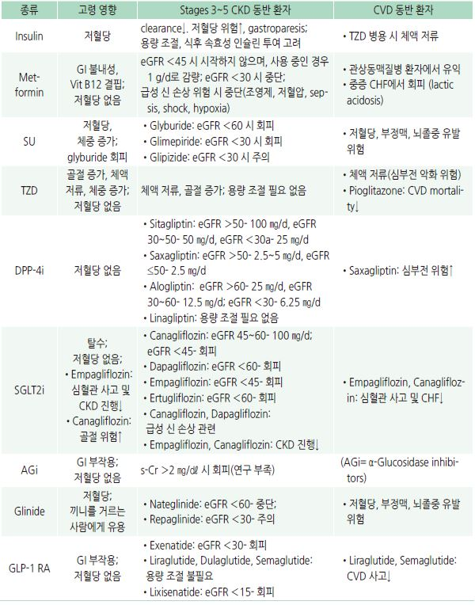
```

### 합병증 관리

#### 고혈압

* 1차 선택 : ACEI, ARB
* 65\~85세 당뇨병 환자에서의 목표 혈압 : 140/90 ㎜Hg
*   고위험군 (예: 뇌졸중 병력, 진행하는 CKD, 알부민뇨) : 보다 낮은 혈압(130/80 ㎜Hg)으로 조절 고려. 세심한 모니터링,

    기립성 저혈압 주의
* Group 3(poor health) state : 약간 높은 혈압(145\~160/90 ㎜Hg)으로 조절 고려

#### 고지혈증

* 당뇨병 환자에서 매년 지질 검사 권고
*   ≥80세 또는 기대 여명이 짧은 환자에서는 LDL-C 목표치를 엄격하게 하지 않음

    ✽≥75세에서는 LDL 수준과 CVD 발생 사이에 연관성이 없다는 보고가 있음
* 1차 선택 : statin
* 대체 또는 추가 : ezetimibe 또는 PCSK9 억제제로 시작
* 공복 TG ＞500 ㎎/㎗ : 췌장염의 위험을 줄이기 위하여 fish oil(ω-3) &/or fenofibrate 권고

※ 당뇨 환자에서의 stain 유의 사항 : statin은 T2DM의 위험을 높일 수 있지만 statin 중단은 권고하지 않음.

```
statin을 투여받는 환자는 규칙적인 혈당 모니터링이 필요함
```

#### 기타

* Congestive heart failure : 심부전을 악화시킬 수 있는 약제 주의(예: glinides, rosiglitazone, pioglitazone, DPP-4i)
*   ASCVD (죽상경화성 심혈관 질환) : 출혈 위험에 대한 주의깊은 평가 후 CVD 2차 예방을 위한 저용량 aspirin(75\~162 ㎎/d)

    투여 권고
* CKD : 매년 eGFR 및 u-Alb/Cr ratio 검사. 약물 사용 주의
* advanced chronic sensorimotor distal polyneuropathy 환자 : 낙상 위험 주의; 진정, 기립성 저혈압, 저혈당 유발 약제 주의
* 균형 및 보행 문제가 있는 peripheral neuropathy 환자 : 물리 치료, 낙상 관리 프로그램 권고
* peripheral neuropathy &/or peripheral vascular disease 환자 : 의뢰
* 눈 검진 : 매년 안과 전문의에 의한 포괄적 눈 검진 권고

### ■ 임신당뇨병 Gestational diabetes mellitus, GDM

* 임신의 3\~14%에서 발생
*   임신당뇨병의 영향 : 임신고혈압, 분만 시 손상, 난산, 임산부 당뇨병 발생과 관련; 거대아, 신생아 저혈당, 신생아 골절,

    신경 손상 등 주산기 합병증 등 유발; 자녀의 비만 및 당뇨병 위험 증가

### 선별 검사 및 진단 기준

#### 첫 번째 산전 진찰

* 모든 임신부를 대상으로 첫 산전 진찰 시 당뇨 검사(공복 혈당, 무작위 혈당, 또는 A1C) 시행
* 당뇨병의 일반 기준 적용

※ 첫 산전 방문 검사에서 당뇨병으로 진단되면 당뇨병이 있었던 것으로 규정

#### 임신 24\~28주 OGTT

* 당뇨병이나 임신당뇨병이 없었던 임신부는 임신 24-28주에 아래 방법 중 하나로 검사

※ GDM 환자가 출산 후 상담 및 T2DM 예방 관리를 받는다면 1단계 접근법이 비용 효율적임 \[ADA]

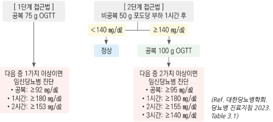

### 조절 목표 및 치료

* 목표 혈당 : 식전 70~~95 ㎎/㎗, 식후 1시간 110~~140 ㎎/㎗, 식후 2시간 100\~120 ㎎/㎗

•공복 또는 식전 혈당보다 식후 혈당 조절에 비중을 둠

* 목표 A1C : ＜6% (✽RBC turnover 증가로 비임신 때보다 낮게 측정됨)
* 저혈당 주의 : T1DM 시 임신 중(특히 1분기) 저혈당 위험이 증가하며, 저혈당 인지가 저하됨

•저혈당 예방을 위하여 필요시 ＜7%를 목표로 관리

* 탄수화물 제한 식사 : 탄수화물 50%, 단백질 20%, 지방 30%를 고려; 식후 혈당 개선, 태아의 과도한 성장 예방 목적
* 운동 : 금기 사항이 없는 경우 가벼운 운동 권고. 예: 1일 20~~30분씩 1~~2회 걷기

•운동 금기: 임신고혈압, 조기양막파열, 조기진통, 자궁경관무력증, 자궁출혈, 자궁내 성장 제한

* 안저 검사 : 임신 전, 임신 매 석달 & 출산 1년 후 안저 검사 권고
* 항응고제 : 자간전증 예방을 위하여 12~~16주부터 aspirin 100~~150 ㎎/d 투여
* prenatal vitamin(folic acid 400 ㎍), potassium iodide 150 ㎎ 권고

#### 항당뇨병제

* 인슐린 : 생활 요법으로 목표 혈당에 도달하기 어려운 경우 인슐린 치료 시행

•출산 직후 인슐린 저항성이 감소하므로 조절이 필요함; 보통 산욕기 첫 수일 동안 50% 감량

* 모든 경구 혈당 강하제는 금기임; 비교적 새로운 인슐린은 연구 부족

✽임신 중 metformin 사용의 안전성을 보여주는 증거들이 있으며, 인슐린과 선천성 기형 발생률의 차이가 없다는 보고들이 있음.

```
인슐린을 사용할 수 없는 경우 metformin을 고려할 수 있다는 주장이 있음 
```

#### 출산후 관리

*   당뇨병 또는 당뇨병전단계 산모는 출산 4\~12주 후 75 g OGTT 시행(진단은 비임신 여성 기준 적용)

    → 정상인 경우 이후 매년 당뇨병 선별 검사 고려 (\[ADA] 1\~3년마다 검사)
* prediabetes가 있었던 GDM 병력의 여성은 출산 후 당뇨병 예방을 위하여 엄격한 생활 요법 중재 및 필요시 metformin 투여
* GDM이 있었던 산모는 대사 위험 요인을 개선시키기 위해 출산 후 체중 조절 및 수유를 권고
