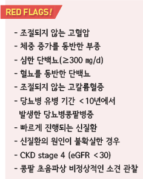
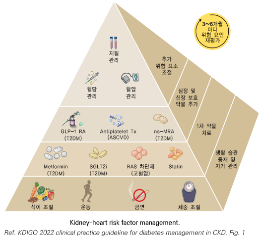
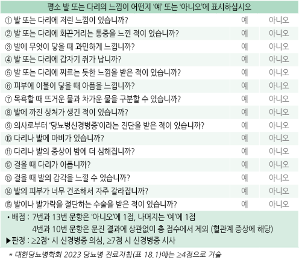
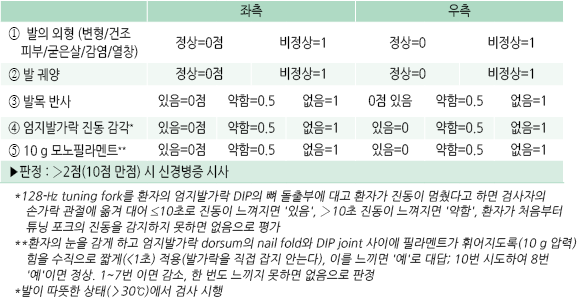
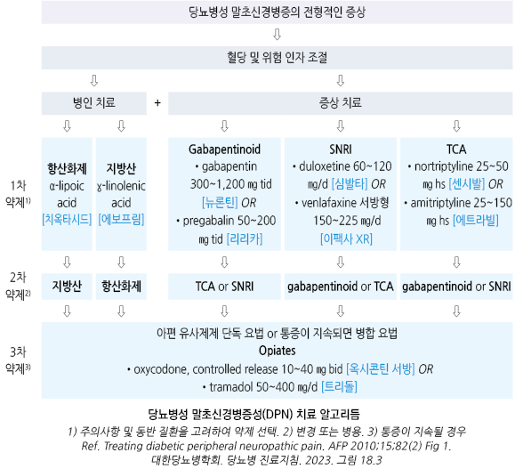
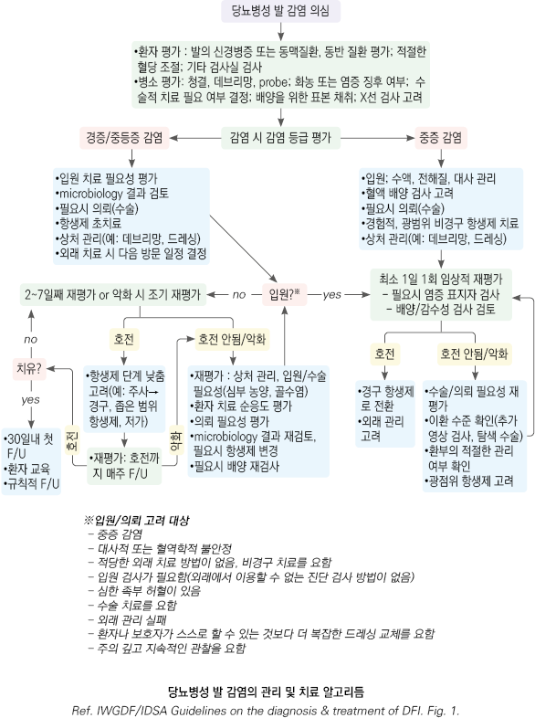
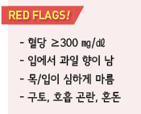

# 당뇨병 합병증 Complications of diabetes


## 일반 사항

### 합병증 발생 시기

* 고혈당 유병 기간이 20년이 될 때까지 보통 분명하게 드러나지는 않음
* 일반적으로 당뇨병 발병 10년 후 미세알부민뇨, 15년 후 단백뇨와 신 기능 저하가 발생

### 합병증의 종류

* 혈관계 : 망막병증, 신경병증, 신장병증, 관상동맥병, 뇌혈관 질환, 말초혈관 질환
*   비-혈관계 : 위장관 장애(예: 위마비, 설사), 비뇨생식기 장애(예: 배뇨, 성 기능 장애), 피부 질환, 감염,

    백내장, 녹내장, 치주 질환, 청력 장애

### 당뇨와 관련하여 위험이 증가하는 질환

* 청력 저하, 수면무호흡증, 지방간, testosterone↓, 치주 질환, 골절, 인지 장애, 우울, 악성 종양

**￭ 말초혈관 질환 Peripheral Vascular Disease**

## 임상 양상

* 간헐적 파행, 사지 허혈
* dependent 부위의 적색 피부 변화, 하지 거상 시 창백한 피부, 털의 소실, 발톱의 퇴행 위축
* 맥박 약화, 피부 감각 저하

## 진단

* ABI(ankle-brachial index) 시행 : 정상- 1.1\~1.3

✽[측정 방법](http://www.kvrwg.org/data/pdf/course/20080804.pdf)

## 치료

* aspirin : 100 ㎎ qd \[아스피린 프로텍트] (☞ p.1154)

•금기 : 활동성 소화성 궤양, 국소 출혈, 출혈성 소인, aspirin 과민

•심혈관 질환 예방을 위한 aspirin 투여 대상 : ≥1개의 위험 인자\*를 가진 남 ＞50세/여 ＞60세

\*위험 인자 : CVD 가족력, 고혈압, 흡연, 이상지질혈증, 알부민뇨증

* clopidogrel : 75 ㎎/d; CVD 병력이 있는 aspirin 알레르기 환자에서의 대체제 \[플라빅스)
* 고혈압 환자 중재 : DASH diet(특히 염분 섭취 제한), 신체 활동, 적극적인 혈압 조절 (☞ p.482)

**￭ 당뇨병콩팥병증 Diabetic Nephropathy**

* 당뇨병과 관련된 미세혈관 합병증의 결과로 발생하는 만성콩팥병
*   당뇨병이 있는 환자에서 미세 알부민뇨 또는 단백뇨(u-Alb/Cr ratio ≥30 ㎎/g), 신 기능 감소(eGFR ＜60)가 3개월 이상 지속

    및 다른 합병증(예: 망막병증) 동반 시 진단 (☞ p.617)
*   다음의 경우 진단을 위하여 콩팥 생검 고려 :

    당뇨병 환자에서

    ① 단백뇨의 급격한 증가,

    ② 신증후군 발생,

    ③ 현저한 콩팥 기능 저하 또는 급격한 eGFR 감소,

    ④ 혈뇨 또는 활성 요침전물 존재,

    ⑤ 짧은 당뇨병 유병 기간, ⑥ 당뇨병망막병증이 없는 경우
* 보통 GFR 감소보다 미세 알부민뇨가 먼저 발생
* 유병률 : 당뇨병 발병 10년 이상 환자의 40%
*   위험 인자 : 조기 발병 T2DM, 남성, 고령, 가족력, 고혈당, 고혈압, 고지혈증, 비만, 흡연,

    다른 당뇨병 합병증 발생, 낮은 사회 경제적 상태
* 급성 신장 손상의 위험이 있음; NSAID 등 주의

## 진단

#### 선별 검사

* 항목 : u-Alb, u-Alb/Cr ratio(uACR), eGFR

\*\*검사 시기 \*\*

* 1형 당뇨병 : 당뇨병 진단 후 5년째부터 매년
* 2형 당뇨병 : 당뇨병 진단 즉시 & 이후 매년
* 모든 고혈압 동반 당뇨병 : 당뇨병 진단 즉시 & 이후 매년

#### 단백뇨 검사

* 검사 빈도 : 선별 검사 이후 모든 당뇨병 환자는 매년 u-Alb 검사 시행
* 채뇨 시각 : 전날 밤 금식 후의 아침 첫 소변 및 식후 2시간, 불가피한 경우 임의뇨(식사 2시간 이후)
* 임의뇨 시험지봉 검사에서 (+)인 경우 u-Alb/Cr ratio 정량 검사 시행

•u-Alb/Cr ratio가 ＞500 ㎎/g인 경우에는 Prot/Cr ratio를 이용할 수도 있음

* 3\~6개월 간격으로 시행한 3번의 임의뇨 검사에서 ≥2번 미세 알부민이 출현하면 ‘미세 알부민뇨’로 진단 (☞ p.612)

#### 콩팥 기능 검사

* 검사 빈도 : 선별 검사 이후 모든 당뇨병 환자는 매년 s-Cr 검사 시행
* s-Cr과 eGFR로 만성콩팥병 단계 결정
* eGFR이 ＜60 이면 CKD와 관련한 합병증에 대한 검사 및 처치를 시행
* u-Alb/Cr ＞300 ㎎/g &/or eGFR 30\~60인 경우 연 2회 검사

#### 기타

* 혈압 : 진료 때마다 측정
* 지질 : 매년 총 콜레스테롤, LDL-C, HDL-C, 중성지방 검사

### 다른 원인에 의한 콩팥병이 의심되는 상황

* 당뇨병망막병증이 없는 콩팥병증
* eGFR이 이미 저하되어 있거나 매우 빠른 속도로 감소
* 단백뇨가 매우 빠른 속도로 증가하거나 신증후군 소견이 있음
* 약물 치료에 반응하지 않는 고혈압 동반
* active urinary sediment 또는 혈뇨가 있음
* 당뇨병 이외의 다른 전신 질환의 징후가 있음
* RAS 차단제(ACEI or ARB) 투여 2\~3개월 내에 eGFR이 30% 이상 감소

## 치료

### 치료 방침

* 혈당, 혈압, 지질 관리
*   식이 조절, 규칙적 운동 또는 활발한 신체 활동, 금연, 체중 조절(BMI ＜25 목표)

    • 단백질 섭취 : ＜0.8 g/㎏/d; 투석 중인 경우 1.0\~1.2 g/㎏/d (☞ p.619)

    • 저염식 : Na ＜2 g/d(소금 5 g)
*   1차 약물 : metformin, SGLT2i, RAS 차단제, statin

    • 혈압, u-Alb/Cr ratio, eGFR 등이 정상인 경우 예방 목적의 ACEI/ARB 투여는 권고 안 함

    • 알부민뇨(+) or eGFR↓ 시 심혈관 및 신장 이익이 입증된 SGLT2i를 포함한 치료를 고려

    • statin : 모든 CKD 환자에서 권고
*   심장/신장 보호 효과가 있는 약물 추가 고려 : GLP-1 RA, aspirin, ns-MRA

    • aspirin : ASCVD 고위험군에서 1차 예방, 확인된 심혈관 질환에서 2차 예방

    • nonsteroidal mineralocorticoid receptor antagonist(ns-MRA; finerenone \[케렌디아]) : 심혈관 및 신장에 유익. RAS 차단제

    투여에도 불구하고 알부민뇨가 지속되는 정상 s-K인 T2DM 환자에게 적용 고려; 치료 중 1개월 및 4개월마다 s-K 측정
* 빈혈 발생 위험이 높으므로(비당뇨 CKD에 비하여 2배) 필요시 조혈 치료
* 영양제, 한약, 민간요법, 기타 약물 복용 시 주의. 주치의와 미리 상의하도록 교육

※ 3\~6개월마다 혈압, u-ACR, eGFR, s-K 모니터링

### 당뇨병 관리

* 목표 : A1C ＜7%, 식전 혈당 90~~130 ㎎/㎗, 식후 1~~2시간 혈당 ＜180 ㎎/㎗
* eGFR ≥30 → 금기가 없다면 metformin을 처방
* eGFR ≥20 → SGLT2i를 처방하고 첫 투여 후 eGFR 저하가 30% 이내라면 지속 투여
* metformin이나 SGLT2i로 혈당 조절 목표 도달 실패 또는 이들 약제를 사용할 수 없음 → GLP-1 RA를 우선 고려
* 투석 환자 → 저혈당 위험이 낮은 약물을 우선 선택하고, 치료 반응과 저혈당 위험을 평가하여 인슐린 용량을 조절
* 콩팥 이식을 받은 eGFR ≥30 → 금기가 없다면 metformin을 포함하여 처방
* T1DM, 심각한 고혈당 및 이로 인한 증상이 있거나 급성 질환 동반 → 인슐린 투여를 우선 고려
*   인슐린 또는 인슐린 분비 촉진제를 사용하는 환자에서 SGLT2i 또는 GLP-1 RA 추가 시 저혈당 위험이 높은 약물들은

    중단하거나 감량하는 것을 고려
* 다음의 경우에 더욱 엄격히 조절 : 수술 전후, 심근 경색, 임신, 급성 질환이 있음
* 주의 : CKD stage 3 이상에서는 저혈당의 위험이 증가하므로 혈당 강하 치료 시 주의
*   치료의 한계 : 당뇨병콩팥병증으로 진행된 T2DM에서 엄격한 혈당 조절이 임상 경과를 호전시킬 수 있는지는 불확실 (특히

    짧은 기대 여명, ＜13세, ≥65세, 타 질환 동반 시)

### 고혈압 관리

* 목표 : 단백뇨(-) CKD 시 ＜140/90 ㎜Hg, 단백뇨(+) CKD 시 ＜130/80 ㎜Hg \[대한의학회] (☞ p.482)
*   약물 치료 : ① ACEI or ARB (예외: 증상이 있는 저혈압, 조절되지 않는 hyperkalemia, Cr ＞30% 증가); \[ADA] 중등도

    알부민뇨(u-Alb/Cr 30\~299 ㎎/g) 시 권고, 심한 알부민뇨(u-Alb/Cr ≥300 ㎎/g) &/or eGFR ＜60 시 강력한 권고;

    ② 추가 : 이뇨제, DHP-CCB, β-차단제(MI 시)
* 모니터링 : ACEI/ARB, 이뇨제 투여 시 (2\~4주 후) s-K, Cr 모니터링
*   체액 고갈이 없는 경우 sCr 증가가 기본값에서 30% 이내라면 RAS 차단제 중단은 하지 않음

    

##

**￭ 당뇨망막병증 Diabetic Retinopathy**

* 당뇨와 관련된 비염증성 망막 이상
* 성인 실명의 가장 흔한 원인
*   기전 : 지속되는 고혈당 → 망막 모세혈관 기저막 비후 → 혈관 주위 세포 손실, 내피 비대 → blood–retina barrier 손상

    → 모세혈관 폐쇄, 허혈, 혈청 누출 → 망막 점상 출혈, microaneurysms, lipid exudate, edema, 혈관 내피 성장 인자(VEGF)

    및 cytokines 증가 → 혈관 증식/신생
* 분류 : nonproliferative-, preproliferative(severe nonproliferative)-, proliferative-stage
* 유병률 : 6\~10년 환자의 20.9%, ＞15년 환자의 66.7%; T2DM 환자의 \~20%는 진단 시 이미 발생
*   위험 인자 : 유병 기간, 불량한 혈당 조절, 흡연, 신질환, 고혈압, 이상지질혈증, 임신

    • A1C 1% 증가마다 위험도 약 1.4배 증가

### 선별 검사

* 안과 전문의에 의해 동공을 확대시킨 상태로 안저검사를 포함한 포괄적인 검사 시행

#### 검사 시작 시기 및 주기

• T1DM: 당뇨병 진단 후 5년 내

• T2DM: 당뇨병 진단 즉시

• 임신 예정: 임신 전부터

```
            ⇨
```

• 망막병증(-) & 혈당 조절이 잘 되는 경우: 1\~2년

• 망막병증(+): 최소 매년 또는 보다 자주

• 당뇨병이 있는 임신부: 임신 및 산후 1년간 매 3개월

## 치료

* 혈당, 혈압, 지질 관리
* 규칙적인 운동, 건강한 식단, 금연, 금주
* 추천되는 일정에 따라 정기적인 안과 검진 및 망막병증 환자 의뢰
* anti-VEGF(bevacizumab, ranibizumab, aflibercept, brolucizumab, faricimab) 유리체내 주입
* laser photocoagulation therapy : 증식성 당뇨병망막병증, 황반부종 등에 적용
* vitrectomy : traction retinal detachment, vitreous hemorrhage에 적용
* dobesilate : 효과에 대한 증거 부족; 250 ㎎/T 2T qd\~bid \[독시움]
* candesartan : 일부 환자에서 효과; 8\~16 ㎎ qd \[아타칸] (보험주의)
* 항산화제(Vit C/E, β-carotene) : 효과 입증 안 됨

✽ aspirin은 망막출혈의 위험을 증가시키지 않으므로 망막병증은 aspirin 투여의 금기가 아님

✽당뇨병전단계 비만자에 대하여 집중적인 생활 습관 변경 또는 metformin 투여로 당뇨병으로의 진행은 감소하였으나

```
장기적인~20년) 당뇨병망막병증 유병률에서는 차이가 없었다는 보고가 있음
```

**￭ 당뇨병신경병증 Diabetic Neuropathy**

*   당뇨병의 가장 흔한 합병증; 20년 이상된 T1DM 환자의 ＞20%에서 발생; 신규 진단되는 T2DM 환자의 10\~15%에서

    관찰되며 발병 10년 후 50%에서 관찰됨
* 통증 등 감각 이상을 일으키고 부상, 낙상 위험을 증가시키며 발 궤양의 가장 중요한 원인임
*   발생 기전 : 미세 혈관 손상, 단백질/지질 oxidation 및 inflammatory stress 등이 대사 기능 장애를 일으키고 신경 세포

    손상으로 이어지는 등의 multifactorial pathogenesis로 추정되지만 명확한 원인은 모름
* 위험 인자 : 혈당 조절 불량, 긴 당뇨병 유병 기간, 고혈압, 고지혈증, 흡연, 음주, 다중 동반 질환, 다약제, 비만
*   여러 형태가 있으며 distal symmetric polyneuropathy(DSPN; 75%)과 autonomic neuropathy가 흔함;

    통상 '당뇨병신경병증'은 DSPN을 의미
* 당뇨병 말초신경병증 환자의 \~50%이 무증상일 수 있음; 선별 검사와 예방적 발 관리가 필요함

## 임상 양상

*   소섬유 침범 증상 : 통증, dysesthesia(불쾌한 작열감), 온도 감각 저하

    • 통증 : burning, lancinating, tingling, shooting(electric shock); 양말, 신발, 침구 등 사소한 접촉으로 통증이 유발되는

    통각과민. 특히 밤에 심함; 초기 증상으로 환자의 25%에서 발생; 일상 활동 저해, 심리적 장애, 삶의 질 저하를 유발
*   대섬유 침범 증상 : numbness, (통증 없는) tingling, 진동 및 고유 수용 감각 저하; "두꺼운 양말을 신고 걷는 것 같다";

    소섬유 침범 증상보다 나중에 발생

※ 발에서 먼저 시작되어 stocking-and-glove 패턴으로 수개월\~수년에 걸쳐 서서히 근위부로 진행;

```
손의 증상은 일반적으로 하지 증상이 무릎 수준에 도달할 때까지 발생하지 않음; 체간과 두부에도 발생할 수 있음 
```

## 진단

* 당뇨병신경병증과 일치하는 특징을 확인하고 다른 원인들을 배제하여 진단

1. 세심한 병력 청취 : MNIS 설문지 등 활용
2. 신경계 진찰 : MNIS examination 등 활용

• 소섬유 : 온도(냉/온) 감각, Pinprick 감각 •대섬유 : ankle reflex, vibration perception(128-㎐ tuning fork),

```
10-g monofilament test, proprioception
```

3\. 기타(옵션)

* 검사실 검사 : 혈당, A1C; CBC, 전해질, 간 기능, Vit B9, B12, TFT; ANA, RF, HIV, Hepatitis B/C, cryoglobulin
* 신경전도/근전도 검사 : 진폭 감소, 전도 속도 지연, denervation/reinnervation 소견; 소섬유만 침범 시 음성일 수 있음
*   안정 빈맥, 기립 저혈압, 위마비, 변비/설사, 발기 장애, 배뇨 장애, 요실금, 체간부/안면부 발한, 하지 무한증 시 심혈관/

    위장관계 자율신경 기능 검사, 요역동학 검사, 발한 검사
* 심한 파행, 발동맥 맥박 약화, ankle-brachial index ＜0.9 시 말초 혈관 조영 촬영

#### 선별 검사 시기

* T1DM : 당뇨병 진단 후 5년째부터 매년
* T2DM : 당뇨병 진단 즉시 & 이후 매년

#### Michigan neuropathy screening instrument(MNSI)

1.  Questionnaire

    

2.Examination 

## 치료

* 철저한 혈당 조절
* 금연, 금주, 운동, 균형 훈련, 적정 양의 염분 섭취, 건조 방지, 발 보호(패드, 양말 등), 탄력 스타킹 착용
* 위 마비 시 GI motility에 나쁜 영향을 주는 약제 회피 등 관리 (☞ p.위마비)
* 통증 조절이 되지 않으면 신경/통증 전문가에게 의뢰

### 약물 치료

*   1차 선택제(for 통증) : gabapentinoid, SNRI, TCA, Na channel blocker(lamotrigine \[라믹탈], lacosamide \[빔스크],

    oxcarbazepine \[트리렙탈], valproic acid \[바로인 에이])
*   gabapentinoid : 저용량으로 시작 → 점차 증량

    • 충분한 효과까지 2달 이상 필요할 수 있음; pregabalin이 보다 빠른 효과 발현

    • 부작용 : 용량 의존 어지럼/졸음(대처: 저용량으로 시작, 주의 깊은 증량), 도취감

    • gabapentin \[뉴론틴], pregabalin \[리리카] (☞ p.13)
* 항우울제 : nortriptyline \[센시발], duloxetine \[심발타] (보험기준 ☞ p.1177)
*   진통제 : 급성 신경병증에서 통증 발생 시 사용; acetaminophen \[타이레놀], NSAID

    • 병증이 진행되면 통증을 느끼지 못하게 되어 진통제의 투여 필요가 없어짐
* 부족할 가능성이 있는 비타민 공급. 예) Vit B12, folate
* thioctic acid(α-lipoic acid) \[치옥타시드], carbamazepine \[테그레톨] : 일부 연구에서 DPN 완화
*   capsaicin : 8% 패치 FDA 승인. 0.075% 크림도 일부 연구됨 \[다이악센] (☞ p.15)

    

**￭ 당뇨병성 발 감염 Diabetes-related foot infection(DFI)**

* 당뇨병 환자 입원의 가장 흔한 원인; 감염 환자 6\~7명 중 1명이 감염 후 1년 이내에 사망
* 발 궤양 유병률- 당뇨병 인구의 4~~10%; 연간 발생률- 2.2~~5.9%, 평생 발생률- 15\~25%; DFI 치료 실패율- 22.7%
* 말초신경병증에 2차적 또는 외상에 의한 상처에서 발생; 골수염을 일으킬 수 있음
*   위험 인자 : 당뇨병 기간 ＞10년, 혈당 조절 불량, 시력 저하, 말초신경병증, 말초동맥병, 국소 압력 증가(발 변형, 굳은 살,

    corn), 발 궤양 병력, CKD(특히 투석)

## 임상 양상

* 국소 : 홍반, 통증, 압통, 온감, 경화, 농성 분비물
* 전신 : 식욕 저하, 오심/구토, 발열, 오한, 식은땀, 정신 상태 변화

#### Wagner 당뇨병성 발 궤양 분류(Grading)

(당뇨 환자의 발 궤양의 심각도를 평가)

G 0 : 궤양은 없으나 고위험 발(예: 기형, 굳은살, 감각 저하)

G 1 : superficial full-thickness ulcer

G 2 : deeper ulcer, 힘줄 이환

G 3 : deeper ulcer, 골 이환

G 4 : partial gangrene(예: 발가락, 앞발)

G 5 : whole foot gangrene

#### IDSA/IWGDF 당뇨병성 발 감염 분류

(발 궤양에 동반된 감염의 정도를 평가)

1. uninfected : 감염의 전신 또는 국소 징후 없음
2.  mild infecDSA/IWGDF tion : 피부 또는 피하 조직 이환 국소 감염\*(심부 조직 이환 없음, 전신 염증 반응 징후† 없음);

    병소 주위 홍반 0.5\~2 ㎝
3.  moderate infection : 국소 감염, 병소 주위 홍반 ＞2 ㎝, 또는 피하 하부 조직 이환(예: 농양, 골수염, 패혈성 관절염, 근막염)

    (전신 염증 반응 징후 없음)
4. severe : 전신 염증 반응 징후가 있는 국소 감염

\*국소 감염 : 다음 5가지 중 ≥2개 해당: 국소 부종 또는 경화, 궤양 주위 홍반 ＞0.5 ㎝(방향 무관), 국소 압통 또는 통증,

```
국소 온감, 고름; 염증 반응의 다른 원인(예: 외상, 통풍, 골절, 혈전증) 배제
```

†전신 염증 반응 징후 : 다음 4가지 중 ≥2개 해당: 체온 ≥38℃ or ＜36℃, HR ＞90, RR ＞20,

```
WBC ＞12,000/㎕ or ＜ 4,000/㎕ or ≥ 10% immature band forms
```

## 진단

* WBC, BUN/Cr, acidosis, 혈당/A1C; prealbumin/albumin(영양 상태 평가)
* 염증 표지자(예: CRP, ESR, procalcitonin) 검사 고려(특히 진단이 모호하거나 골수염 의심 시)
*   연조직 감염이 의심되는 경우 병변 조직 그람 및 배양 검사 고려(표재성 표본은 신뢰할 수 없으므로 깊은 조직 검사);

    골수염 시 뼈 조직 배양 검사
* X선 검사, probe-to-bone 검사 고려; 골수염 의심 시 MRI

#### 중증 감염 소견

* 국소 및 전신 증상에 따라 감염의 중증도를 판단

\*\*Wound \*\*

* 피하 조직(예: 근막, 힘줄, 근육, 관절, 뼈) 이환
* 연조직염 : 림프관염을 포함하여 광범위(＞2 ㎝), 궤양에서 먼 곳, 빠르게 진행
* 국소 징후 : 통증, 심한 염증, 경화, crepitus, 물집, 변색, 괴사/괴저, 반상/점상 충혈

**General**

* 급성 발병/악화, 급속한 진행
* 발열, 오한, 저혈압, 착란, volume 고갈
* 검사실 검사 : 백혈구↑, CRP ↑, ESR ↑, 심한 고혈당, 산증, 심한 질소혈증, 전해질 이상
* complicating feature : 이물 존재, 자상, 심부 농양, 동맥 또는 정맥 부전, 림프부종, 면역 저하, 급성 신장 손상
* 치료 실패 : 적절한 항생제과 지지 요법에도 악화

### 선별 검사

*   평가 항목 : 피부 검사, 발 변형 검사, 신경학적 평가(10-g monofilament 검사 및 다음 검사들 중 최소 1개: pinprick, 체온,

    진동-128 ㎐ tuning fork), 혈관 평가(하지 및 족부 맥박)

#### 검사 주기

* 모든 당뇨병 환자 : 매 방문마다 발 관찰
* No LOPS(loss of protective sensation) and No PAD(peripheral artery disease) : 매년
* LOPS or PAD : 매 6\~12 개월
* LOPS + PAD, or LOPS + 발 변형, or PAD + 발 변형 : 매 3\~6 개월
* LOPS or PAD & {발 궤양 과거력, 절단, 말기 간질환} 중 하나 이상 : 매 1\~3개월

## 치료

### 치료 방침

*   상처 관리 : 발의 압박 제거, 괴사 조직 제거, 드레싱, 전신 항생제 (☞ p.918)

    • 국소 항생제 치료는 권하지 않음(효과가 제한적)
* 중등증 이상 감염 시 입원 치료 고려
* 철저한 혈당 관리, 적절한 영양 섭취, 예방적 발 관리

※ 보조 요볍(예: G-CSF, 국소 소독/항생제, 은, 꿀, bacteriophage, 고압 산소)은 권고하지 않음

#### 항생제

* 발 궤양에서 감염의 징후나 증상이 없는 경우 항생제 사용은 하지 않음
*   선택 항생제 : 경증 환자의 경험적 치료는 G(+) 균주(예: S. aureus)에 초점을 맞춤

    • cloxacillin, 1세대 cepha(cephalexin \[팔렉신]), clindamycin \[훌그램], fluoroquinolone(levofloxacin \[크라비트],

    moxifloxacin \[아벨록스]), TMP-SMX \[셉트린] (☞ p.901)

    • 최근 항생제 사용 : amoxicillin/clav \[오구멘틴], ampicillin-sulbactam \[유나신 주], fluoroquinolone, TMP-SMX

    • MRSA 고위험 : linezolid \[자이복스], TMP-SMX, clindamycin, doxycycline, fluoroquinolone
* 투여 기간 : 피부/연조직 이환 시 1~~2주; 광범위 감염, 호전 지연, 심한 PAD 시 3~~4주 고려; 골 이환 시 6주 고려
*   깊고 만성적인 감염 또는 이전 치료 병력이 있는 감염은 G(-)(예: P. aeruginosa, Acinetobacter, 혐기균), MRSA 등

    복합균 감염 가능성이 높음
* 4주간의 적절한 치료 후에도 해결되지 않는 경우 재평가 또는 치료 방법 변경

### 발 관리 방법

* 미지근한 물과 중성 비누로 매일 규칙적으로 발을 씻고 주의해서 문지르지 않고 말림 (특히 발가락 사이)
* 피부가 건조해지거나 갈라지지 않도록 보습제/연화제 도포 (특히 발뒤꿈치)
* 굳은 살/티눈 등을 주치의와 상의 없이 제거하지 않음. 특히 날카로운 도구나 화학 물질을 사용하지 않음
* 발톱은 일자로 깎음. 양쪽 모서리는 날카롭지 않을 정도만 깎음. 필요시 발톱을 깎기 전에 물에 불려 부드럽게 함
* 발을 너무 차거나 뜨겁게 하지 않음. 가열 기구를 주의함. 목욕 전 물의 온도를 확인함
* 맨발로 다니지 않음. 집안에서도 양말 또는 실내화를 착용함; 양말 없이 신발을 신지 않음
* 꽉 끼는 양말, 발이나 발목이 조이는 양말, 나일론 양말, 안쪽 솔기가 발을 압박하는 양말은 피함
* 샌들이나 앞이 노출된, 굽 높은, 앞이 좁은, 불편한, 또는 조이는 신발을 피함
* 편한 신발을 착용. 신발 구입 시 발이 약간 부어 있을 때 구입함 (예: 하루 종일 활동한 저녁)
* 새 신발은 처음 수일 동안은 하루 한 시간 이상 신지 않음
* 매일 신발 안에 발을 손상시킬 수 있는 이물 또는 손상된 부분이 있는지 확인
*   양말과 신발을 건조하게 함. 매일 양말과 신발을 교체하여 착용. 최소한 2켤레 이상의 신발을 준비. 필요시 신발/양말을

    신기 전 파우더를 사용
* 매일 발을 점검. 발바닥이 잘 보이지 않을 때는 거울을 사용, 필요시 다른 사람의 도움을 받음
*   발에 손상이나 발적, 부종, 저림, 따끔거림, 감각 둔화, 통증 등이 있는 경우 주치의에게 알림

    

**￭ 당뇨병위마비 Diabetic Gastroparesis**

* 당뇨병 환자에서 기계적인 폐색 없이 위 배출이 지연되는 상태
* 자율신경병증의 한 형태로 조절되지 않는 당뇨병과 관련
*   병인(추정) : 혈당 조절 불량, sympathetic vagal neuropathy, Cajal interstitial cell abnormalities, neuronal nitric oxide

    synthase 상실, 산화 스트레스
* 위험 인자 : 오래된(10년 이상) 당뇨병, 미세혈관 합병증 발생 상태, T1DM, 여성
* 10년 누적 발병률 : T1DM의 5.2%, T2DM의 1%
* 발생하면 혈당이 조절되어도 지속됨. 사망률 증가와의 연관성은 없는 것으로 추정
* 모든 위마비 사례의 약 1/3에 기여
* 당뇨병 관련 입원 위험을 증가시킴; 위마비 증상이 있는 환자는 심혈관 질환, 고혈압, 망막병증의 위험이 높음
*   인슐린 반응의 변동성 유발(음식물 흡수 속도지연 인슐린 흡수 사이의 불일치)로 인해 식사 직후 심각한 저혈당으로

    나타날 수 있음
*   임상 양상 : 조기/지속 포만감, 오심, 더부룩, 복통, (수 시간 후 소화 안 된 음식물) 구토

    • 장기 지속 시 저체중, 영양실조
* GLP-1 RA 투여 후(위 배출 감소 작용) 위마비를 인지할 수도 있음

## 진단

* 복부 진찰은 비특이적임(복부 팽만, 상복부 압통)
*   위 운동성 평가(gastric emptying scintigraphy) : 공복에도 장내 음식물 존재; 식사 4시간 후 10\~15% 위 저류 시 경증,

    16\~35% 시 중등증, ＞35%시 중증
*   다른 원인 배제 : 기능성 소화불량, gastric outlet obstruction, cyclic vomiting syndrome, IBS, rumination syndrome,

    섭식 장애(anorexia nervosa, bulimia) (☞ p.382)
* 필요시 실험실 검사 : HbA1c, TSH, total protein/albumin, Hb, Vit B12, ANA

## 치료

* 혈당 조절
*   식이 조절

    • 회피 : spicy, acidic, fatty, higb-fiber, 탄산 음료, 흡연, 알코올, 약물(GLP-1 RA, opioidanticholinergics, TCA, , pramlintide, DPP-4i)

    • 저지방/저섬유 음식으로 소량, 자주 식사(하루 4\~5끼); 저지방식 예) 유제품, 살코기, 가금류, 생선, 과일, 채소, 곡물, 시리얼,

    파스타; 저섬유식 예) 버터, 마가린, 오일, 흰빵, 흰쌀밥, 우유 함유 식품, 생선, 계란, 가금류

    • 중증 시 유동식, 필요시 전해질/영양소(비타민) 보충
* 인슐린 조정 : 속효성/식사 인슐린보다 식후 인슐린이 적합할 수 있음
*   약물 치료(단기 사용) (☞ p.370)

    • Prokinetics : 식전/취침 전 복용; metoclopramide, domperidone, erythromycin

    • Antiemetics : ondansetron, aprepitant, promethazine 12.5~~25 ㎎ q4~~6h, scopolamine patch

\*\*￭ 당뇨병케토산증 Diabetic Ketoacidosis(DKA) \*\*

*   세포가 인슐린 부족 등으로 인하여 에너지 공급원으로서 필요한 포도당을 얻지 못하고 지방을 분해함으로서 부산물인

    케톤이 너무 빨리 많이 생성되어 발생
* 발병률 : 환자 100 patient-year 당 2례; T1DM에서 흔함(⅔ 차지)
* SGLT2i 사용 중 전신 상태가 불량한 경우에는 고혈당 상태가 아니더라도 DKA 가능성을 고려
*   원인/위험 인자 : 인슐린 부족/counterregulatory hormone↑(hepatic gluconeogenesis, glycogenolysis); 음식 섭취 부족(감염 등

    신체 질환, 섭식 장애), 염증(예: acute pancreatitis), 허혈 질환(예: MI, stroke, bowel ischemia), 약물(이뇨제, steroid, SGLT2i),

    심한 탈수

## 임상 양상 

* 보통 천천히 진행됨; 초기에는 입마름, 빈뇨
* 다뇨, 다식, 체중 감소, 허약
* 탈수 징후(빈맥, 저혈압, 점막 건조, 눈 함몰, 피부 긴장도↓)
* 구역/ 구토, 복부 압통, 장폐색증
* 빠르고 깊은 호흡 (Kussmaul respirations), 과일향 날숨(아세톤에 의해 발생), 혼돈

## 진단

* 혈당 ＞250 ㎎/㎗ (※혈당이 200\~250 ㎎/㎗인 euglycemic DKA도 있음)
* 동맥혈 가스 pH ＜7.3; serum β hydroxybutyrate ＞3 mmol/L; 소변 케톤 ≥2+
* 혈중 전해질 : bicarbonate ＜18 mmol/L; K normal or high; Na 다양; Ca, Mg, P 저하; Anion gap\[Na - (Cl + HCO3)] 다양
* CBC with differential, urinalysis, 소변/혈액 culture, lipase, 간 효소, BUN/Cr
* ECG, 흉부/복부 X선 검사

## 치료

* 수액 치료 : 심각한 신장 손상이 없는 경우 N/S 1~~1.5 L/h로 1~~2시간 투여
* 혈당 조절 : 인슐린 투여; 당뇨병 약물 순응도 확인
* 전해질 불균형 교정
* DKA를 유발한 기저 인자(예: 급성 감염, 심혈관 질환, 고혈당 유발 약물) 교정

### 예방

* 지시대로 당뇨병 치료; 목표 범위로 혈당 관리(특히 240 ㎎/㎗을 넘지 않도록)
* 신체 질환(예: 독감) 발생, 혈당 ＞240 ㎎/㎗, DKA 의심 증상 발생 시 소변 또는 혈액 케톤 검사(4\~6시간 마다)
* 아플 때나 스트레스가 있을 때는 자주 혈당을 측정; 위험 수준에 도달하면 1\~2시간마다 측정
* 식사, 활동량, 아픈 경우에 따라 인슐린을 조정하는 방법 교육
* 케톤 양성, 고혈당 시 운동을 하지 않음

￭ 기타

### 비뇨기계 이상

* 방광 기능 장애 : bethanechol \[하이네콜] (☞ p.678)
* 발기 부전 : PDE5i \[비아그라] (☞ p.708)
* 여성에서의 성 기능 장애 : 질 윤활제 사용, 질 감염 치료, estrogen 대체 요법 (☞ p.712)

> **질병코드** E10.2\~E10.8 합병증을 동반한 1형 당뇨병

E11.2\~E11.8 합병증을 동반한 2형 당뇨병

H36.0 당뇨병성 망막병증
