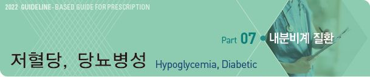
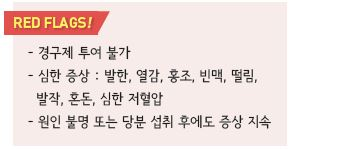

# 저혈당, 당뇨병성 Hypoglycemia, Diabetic



## 일반 사항

* 증상 유무와 관계없이 위해를 끼칠 수 있는 수준의 비정상적으로 낮은 혈당 상태
* 저혈당 기전 : 당 섭취 또는 흡수 부족, 혈당에 대한 counter-regulatory mechanism 부전
* 저혈당에 대한 정상 반응 : 혈당이 ＜80 ㎎/㎗가 되면 신체 조절 인자들이 작동 개시
*   보통 ＜54 ㎎/㎗이면 임상적으로 유의미한 저혈당 증상이 발생 함; 평소 높은 혈당에서 갑자기 떨어지면

    낮은 혈당이 아님에도 저혈당 증상이 발생할 수 있음
*   분류

    •Level 1 : ＜70 ㎎/㎗; 주의가 필요한 저혈당. 증상이 있을 수도 없을 수도 있음

    •Level 2 : ＜54 ㎎/㎗; 임상적으로 명백한 저혈당

    •Level 3 : 중증의 특징적 증상: 혼돈 &/or 도움이 필요한 신체 상태
* 유병률 : 일반적 관리 시 1%, 엄격한 관리 시 3%; 심한 저혈당의 ¾은 수면 중 발생
* 저혈당에 대한 과잉 치료는 반동성 고혈당을 초래할 수 있음

## 원인 및 위험 인자

* 인슐린 또는 인슐린 분비 촉진제(예: sulfonylurea, meglitinide) 사용
* 엄격한 혈당 조절, 최근 낮은 당화 혈색소 수준(＜6.0%), 갑작스런 혈당 강하
* 긴 당뇨병 유병 기간(＞5년)
* 중증 저혈당 과거력
* 고령(≥65세), 쇠약, 저체중, 임신
* 불규칙 식사/적은 식사/끼니 거름, 무계획적인 운동/과다한 활동
* 음주(지연 저혈당 위험), 다제약물 복용(특히 ACEI, ARB, nonselective b-blockers)
* 저혈당에 대한 행동 반응을 저해할 수 있는 신체 또는 지적 장애, 인지 기능 장애
*   간/신질환, CHF, 갑상선저하증, 자율신경병증, 불안, 우울, 섭식 장애, illness, 스트레스, 장염(구토/설사),

    저혈당 불감증, counterregulatory response 장애
* 낮은 사회 경제적 상태



## 임상 양상

*   Adrenergic Sx. : 배고픔, 두근거림, 구역, 떨림, 창백,

    식은땀, 불안, 과민
*   Neurologic Sx. : 어지럼, 두통, 기력 약화, 감각 이상,

    시각 이상, 말하기 힘듦, 협응 장애, 인지 장애, 혼돈, 섬망

## 저혈당 질환의 종류

### Spontaneous (Fasting) hypoglycemia

*   원인

    •단식, 식욕 억제제 투여, 섭식 장애, 영양 결핍, 구토, 설사

    •음주, 운동, 과활동, 발열, 임신

    •약물 : 혈당 강하제(특히 인슐린, SU), β-차단제, pentamidine, salicylate, quinine, hydroxychloroquine,

    fluoroquinolone, doxycycline, sertraline, disopyramide

    •식품 : 비터 멜론, 카페인, 계피, 호로파, 인삼, 과라나, 스테비아

    •수술 : gastrectomy, Roux-en-Y

    •종양 : insulinoma, extrapancreatic insulin-secreting tumor

    •간질환, 신부전, 혈액 투석, 뇌하수체/갑상선/부신 저하, glucagon 결핍, catecholamine 결핍

### Pseudo-hypoglycemia

* 혈당치 ≥70 ㎎/㎗에서도 전형적인 저혈당 증상을 보임
* 원인 : 고혈당 상태에 있던 환자에서 빠르게 혈당 강하를 시키는 경우
* 대처 : 당 조절에 있어서 속도 조절이 필요하며 당 조절이 정상화되면 발생하지 않음

### 저혈당 불감증 (Hypoglycemia unawareness)

* 혈당치 ＜70 ㎎/㎗에서도 저혈당 증상을 느끼지 않음
* 호발 인자 : 저혈당의 반복, 긴 당뇨병 유병 기간, 엄격한 당뇨병 조절 지속
* 대처 : 당뇨병 환자에서 발생하는 경우 혈당 조절 목표의 상향을 고려

### 반응성 저혈당 (Reactive hypoglycemia) 또는 식후 저혈당 (Postprandial hypoglycemia)

* 식사 후 과도한 인슐린 분비로 인하여 식후 4시간 내 발생하는 저혈당
*   원인 : 고탄수화물, 정제된 탄수화물 섭취, GI 수술(dumping syndrome), factitious hypoglycemia (예: insulin, SU), 내당능장애,

    insulin autoimmune hypoglycemia, noninsulinoma, pancreatogenous hypoglycemia syndrome, insulinoma
* 대처 : 소량씩 자주 식사, 식이 섬유가 많은 음식 선택, 고당 식품 회피, 규칙적 운동, α-glucosidase inhibitor 투여; 효과 입증은 안 됨

## 진단

* 혈당 검사 (※ 저혈당 여부는 반드시 혈당 검사를 하여 판단하여야 함)
* CT, MRI, 초음파 검사 : 원인 감별을 위하여 고려
* Whipple triad : ① 저혈당 증상, ② 검사로 확인된 낮은 혈당치 , ③ 당 공급/혈당 조절 후 증상 해소

***

## Management

### 환자가 의식이 있을 때

* 15-15 Rule : 포도당 15 g을 15분마다 투여

•포도당 15\~20 g or 단순 탄수화물 섭취 → 15분 후 혈당 검사 → ＜70 ㎎/㎗이면 반복 섭취

```
→ 정상으로 회복되면 저혈당의 재발을 막기 위해 식사나 스낵 섭취
```

•포도당 1 g으로 보통 혈당 3 ㎎/㎗ 상승

*   포도당 15 g을 15분마다 투여 : 포도당 15\~20 g or 단순 탄수화물 섭취 → 15분 후 혈당 검사

    → ＜70 ㎎/㎗이면 반복 섭취 → 정상으로 회복되면 저혈당의 재발을 막기 위해 식사 또는 스낵 섭취
* 포도당 15\~20 g 음식 예

•설탕(or 꿀) 한 큰술(15 g/15 ㎖) •사탕 4\~5개

•주스 또는 청량음료 150(~~175) ㎖ •요구르트 70~~100 ㎖

•우유(다른 탄수화물이 없을 때) 1\~2컵

* 지방이 포함된 초콜렛, 아이스크림은 혈당을 올리는 작용이 지연될 수 있으므로 적합하지 않음

### 환자가 의식이 없을 때

* 가능한 한 빨리 진료 받도록 조치
* glucagon : 1 ㎎ IM 또는 SC(삼각근 or 대퇴부), 필요시 15분 후 추가 투여

> ```
> ✽nasal glucagon : Baqsimi (✽시판 제품 없음)
> ```

*   glucose : 10~~25 g(50% dextrose 20~~50 ㎖) 1~~3분 간 IV, 필요시 5~~10분마다 추가 투여

    → 혈당이 ＞100 ㎎/㎗이 되도록 경구 &/or IV 5% dextrose 공급
* 회복 후 24\~48시간 동안 재발 여부 관찰

## 예방

* 저혈당의 증상/징후 및 대처 방법에 대하여 환자 및 주위 사람들에게 교육; 당뇨 패찰 착용
* 규칙적 식사 : 식사를 거르지 않음 (특히 과로, 스트레스 시)
* 식후 저혈당 시 고단백, 식이 섬유/복합 탄수화물(예: 전곡류, 잡곡)을 소량으로 자주 식사(1일 6회)
* 규칙적 자가 혈당 측정 (특히 인슐린 치료 환자)
* 저혈당 증상이 있을 때 즉시 자가 혈당 측정
* 운동 전 자가 혈당 측정; ＜100 ㎎/㎗ 시 운동 전 당분 섭취, 약물 조절
* level 2 이상의 저혈당(≤54 ㎎/㎗) 위험이 높은 환자에 대하여 glucagon kit 처방
*   저혈당 불감증이 있거나 중증 저혈당이 한 번 이상 반복되는 경우에는 저혈당의 재발을 막고 저혈당

    불감증을 회복시키기 위해서 최소 수 주 동안 혈당 목표치의 상향을 고려
* 낮은 인지 능력의 당뇨 환자에 대하여 관리자는 저혈당에 대하여 보다 주의를 기울여야 함
* 저혈당을 감지하지 못하는 환자, 빈번한 저혈당 발생 환자에서 real-time continuous glucose monitor 사용을 고려
* sulfonylurea나 인슐린에 의한 경우 저혈당이 지속될 가능성이 있으므로 입원 치료를 고려

> **질병코드** E10.63/E11.63 저혈당을 동반한 1형/2형 당뇨병

E14.63 저혈당을 동반한 상세불명의 당뇨병

E16.2 상세불명의 저혈당
