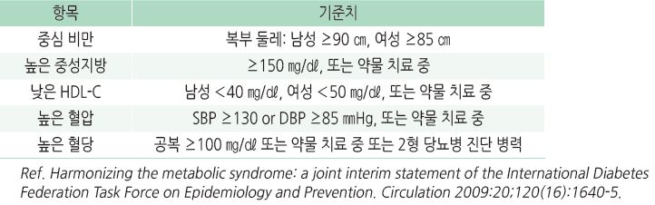

# 대사증후군 Metabolic Syndrome

## 일반 사항
- 2형 당뇨병, 심혈관 질환, 뇌졸중, 지방간, 암 등의 위험을 증가시키는 대사 문제들의 묶음

- 유병률(우리나라) : 24%; 고혈압에서 53%

- 인슐린 저항과 관련된 것으로 추정 (다른 명칭: insulin resistance syndrome, syndrome X)

- 심혈관 질환 관련 등 전체 사망률을 증가 시킴 (남 1.44~2.26배, 여 1.38~2.78배)

- 진단 : 다음 5개 항목 중 ≥3개 해당

    

## 원인

### 병태생리
- intra-abdominal & visceral adipose tissue 증가

- adipose tissue dysfunction, insulin resistance, leptin resistance

- adiponectin(2형 당뇨병, 고혈압, 죽상경화증, 감염 등으로부터의 보호 인자) 감소

- 지방산 대사 이상, endothelial 이상, 전신 염증(IL-6, TNF-α, resistin, CRP ↑), oxidative stress, renin-angiotensin

    system 활성↑, prothrombotic state (tissue plasminogen activator inhibitor-1 ↑)

### 원인/위험 인자
- 중심 비만, 인슐린 저항성

- 고령, 폐경기

- 유전

- 가족력 : 대사증후군, 당뇨병, 심혈관 질환

- 소아기 비만

- 고칼로리 식사, 설탕 가미 음료 섭취

- 낮은 사회 경제적 상태

- 음주, 흡연

- 비활동

- 약물(steroid, 항정신병제, β-blocker)

- pro-inflammatory state

- 장내 정상균총의 변화

### 관련 질환
- PCOS, acanthosis nigricans, NAFLD, 폐쇄수면무호흡증, 우울, 인지 장애, 담석증, 만성 신질환, 발기 장애,

    고요산혈증/통풍, Vit D 결핍, 무증상 갑상선저하증

---

## Management

### 생활 습관 개선
    (☞ p.544)

#### 금연, 음주 제한
    (☞ p.995)

#### 신체 활동
- 육체 활동 증가, 규칙적 운동

- 가급적 매일 ≥30분, ≥150~300분/주 중등 강도의 유산소 운동 및 근육 강화 운동 (☞ p.1160)

#### 식이
- 권고 : 식이 섬유, 정제된 곡물보다 통곡물을 섭취, 저나트륨, 채소/과일

- DASH diet, 지중해식 식단 (☞ p.1166)

  •권장 : 과일 및 채소 섭취(8~10 serv./d), 저지방 유제품(2~3 serv./d), 생선(2회/wk)

  •제한 : 음주(남 ≤2 SD/d, 여 ≤1 SD/d)(☞ p.995), 소금(＜6 g/d)(☞ p.483), 설탕 등 단순 당, 포화 지방, 붉은 고기

- 칼륨, Vit A/B/E, 견과류, 유제품 등의 효과에 대한 근거는 부족함

### 위험 인자 치료

#### 비만
- 첫 해에 현 체중의 7~10% 감량, BMI ＜25를 목표로 관리 (☞ p.1010)

#### 고혈압
- 목표 혈압 : ＜140/80 ㎜Hg (연령 및 상태별 목표치 적용) (☞ p.482)

#### 이상지질혈증
- 목표 TG : ＜150 ㎎/㎗

- 목표 LDL-C : ＜100 ㎎/㎗ (☞ p.527)

#### 당뇨병, 공복혈당장애, 인슐린 저항성
- 생활 습관 교정, 체중 감량 (☞ p.543)

- 필요시 약물 치료

- 예방적 약물 투여 : 논란; metformin 500~1,000 ㎎/d [다이아벡스]

#### 기타
- 저용량 aspirin : 심혈관 질환 또는 위험성이 높은 경우 고려 [아스트릭스] (☞ p.1154)

> **질병코드**
E88 기타 대사장애
