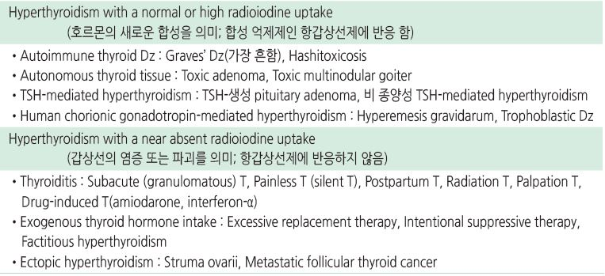
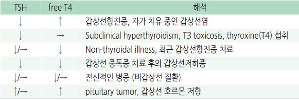
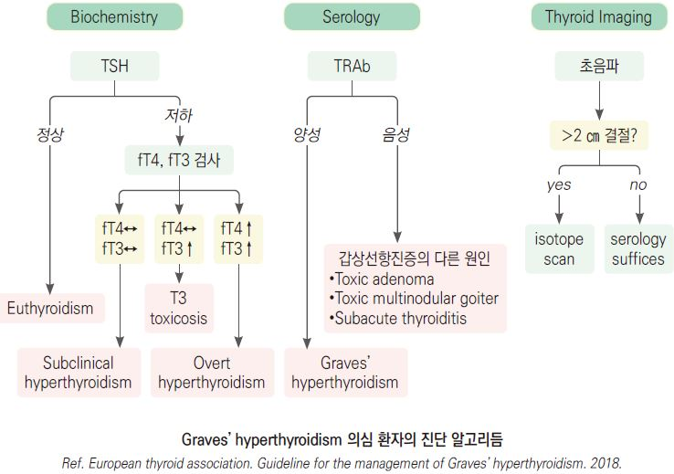
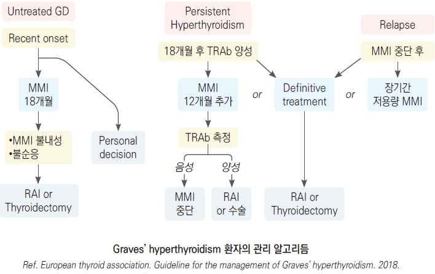
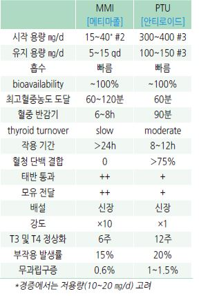
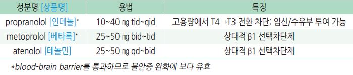
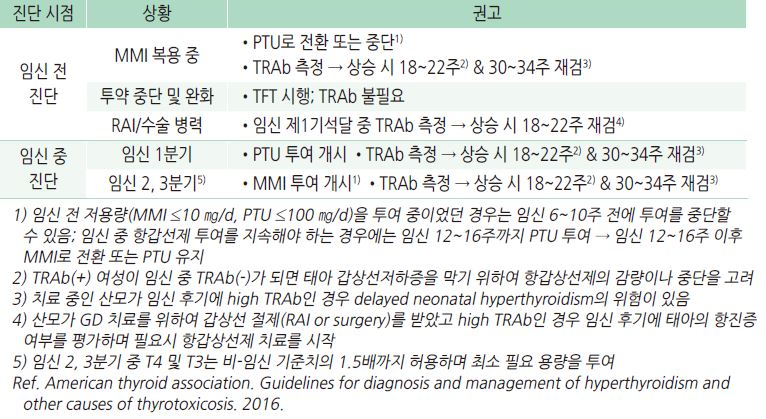
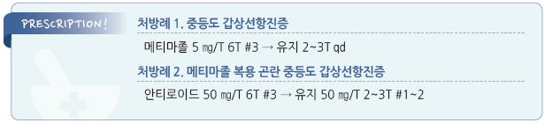
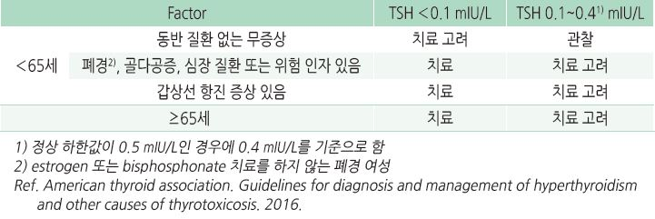

# 갑상선항진증 Hyperthyroidism

## 일반 사항
- 갑상선항진증 (Hyperthyroidism) : 갑상선 기능 과다로 갑상선 호르몬이 증가됨으로써 갑상선 호르몬의

    생리적 작용이 과도하게 나타나는 임상 증후군

- 갑상선중독증 (Thyrotoxicosis) : 갑상선 호르몬(T4 or T3)의 과도한 증가와 관련된 임상 양상

- 갑상선중독발작 (Thyroid storm) : 어떤 사건에 의해 갑상선 호르몬의 급격하고 과도한 작용이 발생한 상태

- 무증상 갑상선항진증 (Euthyroid hyperthyroxinemia) : 갑상선 호르몬은 증가되어 있으나 TSH는 정상이며

    갑상선 이상 증상은 없는 상태

- 경과 : 갑상선항진증 환자의 30~60%에서 자연 회복 (특히 청소년)

  •재발률 : 치료 종료 후 12개월 동안 T3/T4/TSH가 모두 정상인 경우의 8~10%에서 재발

## 원인 및 종류
    

Graves’ disease (GD)

- 자가면역 질환

- 갑상선항진증의 가장 흔한 원인(60~80%)

- 기전 : 갑상선 내 β-cell로부터의 TSH receptor Ab(TR Ab)의 과다 생성 → 갑상선의 TSH receptor에 결합, receptor 활성화

    → 갑상선 호르몬 합성 및 분출 자극(thyrotoxicosis), 갑상선 비대(goiter), 안구 돌출(안구 뒤 결합조직의 antigen과 결합)

- 위험 인자 : 여성(남성의 8배), 20~40세, 가족력(특히 모계)

- 다른 면역 질환 위험 증가와 관련 : Sjögren syndrome, 셀리악병, pernicious anemia, Addison disease, 원형탈모증, 백반증,

    1형 당뇨병, 부갑상선저하증, myasthenia gravis, 심근증

- 경과 : 항갑상선제 치료 시 30%에서 1~2년 내 완화

  •좋은 예후 : small goiter, 경증 항진 증상, 적은 항갑선제 요구량, TRAb ＜2 mU/L

### Toxic multinodular goiter (TMNG, Plummer’s Dz)
- 2번째로 흔함; ＞65세에서는 가장 흔함

- autonomous thyroid adenoma에 의해 발생; insidious onset

### 갑상선염 (Thyroiditis)
- 갑상선의 염증에 해당되는 여러 가지 질환군; transient autoimmune process

- 경과 : 갑상선 염증으로 갑상선 조직에 저장되어 있던 T3/T4 방출 [항진 증상 발생] → 방출 종료

    → 방출된 갑상선호르몬의 소멸 [저하 증상 발생] → 회복

- Subacute (granulomatous) thyroiditis (= de Quervain’s T) : viral URI 후 갑상선 비대/통증, 갑상선 항진 증상 발생

    → 감염 회복과 함께 완화 → 수개월 동안 갑상선 저하 증상; 10%에서 1년 후에도 지속. 1~4%에서 재발

- Silent (lymphocytic) thyroiditis : spontaneous, 약물(예: 화학요법제, lithium, amiodarone) 등에 의해 발생

- Postpartum thyroiditis : 출산 2~6주 후에 갑상선 항진 증상이 발생하여 2~3개월 동안 지속된 후,

    수개월 동안 갑상선 저하 증상이 이어질 수 있음; 30%에서 갑상선저하증이 지속될 수 있음

## 임상 양상
- 신경 : 과민, 안절부절, 손가락 떨림, 불면

- 근골격 : 근 약화, 근 경련, 심부 건반사 항진, 골다공증, 골절

- 심혈관 : 빈맥(두근거림), SBP 상승, 심방세동, 심장 비대, 심부전 악화

- 내분비 : 열 불내성, 다한증, 갑상선종, 여성형유방증, 성 기능 저하, 불규칙 월경, 당뇨병 악화

- 피부 : 따듯하고 습한 피부, 가려움, fine hair, onycholysis, pretibial myxedema(3%)

- 눈 : 안구 돌출(20~40%), 위 눈꺼풀 수축, 복시, 안구 건조, 안구 통증

- 기타 : 피로, 체중 변화(보통 감소), 발열, 무른 변/빈변, 호흡 곤란

- 갑상선 비대 : 광범위 비대(없을 수 있음), 경증 압통; 화농성 갑상선염에서는 국소 염증 반응

#### 고령에서의 특징
- 고령에서는 전형적 증상이 나타나지 않을 수 있음

- 피로, 쇠약, 체중 감소, 심방세동(TSH ＜0.1 mIU/L에서 흔함), 호흡 곤란

## 진단

### 선별 검사 대상
- 다음의 상태에서 검사 고려 : 갑상선 질환 의심 증상, 1형 당뇨병, 자가면역 질환, 폐경기증후군,

    새로이 발생한 심방세동, 설명할 수 없는 행동 변화/우울/불안

### 갑상선 호르몬 검사
- 기본 : TSH, free T4(thyroxine)

- 필요시 total T3, total T4, free T3(triiodothyronine)

>   ✽TSH ＜0.1 mIU/L로 진단 시 민감도 ＞98%, 특이도 92%
  ✽갑상선 호르몬의 반감기는 T3 = 1일, T4 = 1주일로, 갑상선염 등 갑상선 조직의 파괴에 의해 일시적으로 갑상선 호르몬이
     유출되는 상태에서는 T3가 T4보다 일찍 감소하여 T4/T3 비가 커짐
- 검사 결과에 영향을 주는 요인 (☞ p.579)

    

기타 검사

- 영상 검사 : Scintigraphy, 초음파, CT, MRI: 진단이 불확실하거나 결절 의심 시 고려

- TRAb : Graves’ Dz 감별 및 예후 판정을 위하여 고려 (Graves’ Dz 95%에서 양성)

- CBC, LFT : 항갑상선제를 투여하기 전에 기초 검사 목적으로 고려

#### 안과 검진 대상
- 눈꺼풀, 결막충혈 또는 부종

- (4주 이상) 안구 뒤 통증, 눈을 움직일 때 통증

- caruncle 부종

- 모든 방향의 안구 움직임 ≥5°감소

- 안구 돌출 ≥2 ㎜

- Snellen chart상 ≥1 line 시력 저하

    

---

## Management

### 치료 방침
- 증상 완화 : β-차단제, steroid

- 갑상선 치료 : 항갑상선제, 131I therapy(RAIT), 갑상선 절제

  •thyroiditis 환자에서 항갑상선제는 투여하지 않음

- 식이 요법 : 특이 방법 없음; 체중 저하 예방을 위하여 충분한 칼로리 섭취를 권고

>     ✽L-carnitine이 갑상선 호르몬의 대항제로 작용하여 증상 완화 및 골 대사에 유효하다는 보고가 있음
    

## 약물 치료

### 항갑상선제
- 작용 : 갑상선에서의 갑상선 호르몬 합성 억제

- 대상 : GD, RAIT/수술 전(4~8주간 투여)

#### Methimazole
- 1차 선택제; 1일 1~2회 복용하며 효과 발현이 빠르고

    간 괴사 부작용이 적어 선호됨

- 임신 1분기에는 금기

- 최소 유효 용량으로 조절 [메티마졸]

#### Propylthiouracil (PTU)
- 부가적으로 말초에서의 T4 → active T3 전환 차단 효과가 있음

- 1일 2~3회 복용 [안티로이드]

- 드물게 간 독성 부작용이 있음

- 임신 1분기에 1차 선택

#### 부작용
- 흔한 부작용(1~5%) : 피부 발진, 두드러기, 관절통, 발열;

    단순한 가려움은 항갑상선제 중단 없이 항히스타민제로

    조절할 수 있음

- 무과립구증 : 발생률- 0.6%, 가족력 있음, PTU에서 보다 흔함;

    복용 초기 3개월에 흔함; 인후통, 발열, 비정상적 출혈 발생 시

    즉시 항갑상선제 복용 중단 및 WBC 검사 (TSH 모니터링 시

    함께 검사); 보통 투약 중단과 항생제 치료로 회복

- 간염 : 발생률- 0.1~0.2%, 복용 초기 3개월에 흔함, PTU에서

    보다 흔함; 황달, 어두운색 소변, 밝은색 대변, 복통,

    체중 감소, 구역 등 발생 시 복용 중단 및 LFT 시행

#### 모니터링
- 치료 개시 후 (증상에 따라) 2~6주에 free T4 및 T3 검사; free T4가 정상이어도 T3는 증가 상태일 수 있으므로

    T3를 함께 측정; 초기 치료 반응 평가에서 TSH는 배제

>   ✽항갑상선제의 역할이 이미 방출된 갑상선 호르몬에 대한 작용이 아니라, 신규 합성을 차단하는 것이기 때문에

>     혈중 T4/T3 수준을 낮추는 데 3주 정도 소요되며 TSH 수준 정상화에는 더 긴 기간이 필요함
- 항진 증상이 해소되고 TFT가 정상화됨에 따라 약제 용량을 30~50% 감량하고 4~6주마다 TSH 및 T4 검사

    → 정상 수준의 TFT를 유지하는 최소 용량이 정해진 후에는 2~3개월 간격으로 검사

    → ＞18개월 장기간 치료 중인 경우에는 6개월 간격으로 검사

#### 치료 종료
- 성인에서는 12~18개월 치료 후 TSH 및 TRAb가 정상이면 치료 중단 고려

- 12~18개월 치료 후에도 high TRAb가 지속되면 12개월간 항갑상선제 치료를 추가로 지속하거나 RAIT 또는

    thyroidectomy 고려

>     ✽항갑상선제로 18개월 이상 치료 시 추가 회복이 거의 나타나지 않음
- 치료 종료 후 TFT 추적 검사 일정 : 첫 6개월 동안 2~3개월 간격 → 다음 6개월 동안 4~6개월 간격

    → 이후 6~12개월마다 또는 이상 증상이 있을 때

### β-차단제
- 작용 : T3 활성 억제, 두근거림/떨림/불안 등 증상 완화

- 대상 : 고령, 휴식 중 맥박 ＞90회, 심혈관 질환 동반; 금기가 아닌 모든 환자

- 투여 기간 : 증상이 호전될 때까지; 보통 2~3주

- β-차단제를 사용할 수 없는 환자에서는 CCB 선택

    

### 기타

#### Steroid
- 작용 : T4의 T3로의 전환 억제 (✽T3가 T4보다 3~4배 효력이 있음)

- 적용 : thyroid storm, Graves’ orbitopathy

- prednisolone : 5~20 ㎎ tid ×2~3wk [소론도]

#### Cholestyramine
- 작용 : 장간순환에서의 갑상선 호르몬 재흡수 억제

- 적용 : 갑상선 절제술, 임신, 갑상선중독증

- 용법 : 4 g qid [퀘스트란]

## 방사선 치료/수술

#### 대상
- TMNG, toxic adenoma

- 12~18개월간의 경구제 치료에도 지속되는 GD, 또는 재발 GD

- 심방세동, 심부전, 허혈성 심질환을 동반한 고령 환자

### Radioactive iodine therapy (RAIT)
- 작용 : 갑상선에 농축되어 갑상선 조직을 파괴

- 부작용 : 영구적 갑상선저하증, 경부 통증, 미각 저하, 홍조감, 갑상선저하증, 방사성 갑상선염, 안구병증 악화

- 모니터링 : RAIT 후 6주, 12주, 6개월, 매년 TFT 시행

### 수술
- 대상 : 항갑상선제 또는 RAIT로 치료할 수 없는 상태, 호흡에 지장을 주는 큰 갑상선종, 암으로의 진행 가능성이 있는

    결절, active Graves’ eye Dz

- 장점 : 빠르고 영구적인 치료

- 부작용 : 영구적 갑상선저하증, hypoparathyroidism, recurrent laryngeal nerve 손상

## 임신/수유 중 관리

### 검사 및 모니터링
- autoimmune thyroid disease 병력이 있는 모든 임신부는 1분기 중 TRAb를 측정

→ 증가되어 있는 경우 18~22주째에 재검

- 항목 : TSH, free T4 (필요시 total T4 & T3 포함); 매 2주 & 안정 후 매 4주

- 출산 후 TFT 시행 : 갑상선항진증 악화가 흔함. GD는 출산 3개월 이후 흔함

### 치료
- 선택 약제 : 임신 1분기- PTU ≤200 ㎎/d; 임신 2, 3분기- MMI ≤20 ㎎/d

### 수유 중 항갑상선제 투여
- 비-수유 산모와 동일하게 치료

- 약물 복용 시간 : 수유 직후 약물을 복용하고 약제 복용 3~4시간 후 모유 수유

- MMI : 1차 선택제; PTU의 간 독성 문제로 MMI를 권고; ≤20 ㎎/d

- PTU : 모유로의 이동이 적어 통상 용량에서 안전

> **질병코드**
E05 갑상선독증[갑상선기능항진증]

E06 갑상선염

## 

## ￭ 무증상 갑상선항진증 Subclinical (Mild) Hyperthyroidism
- TSH는 저하되어 있으나 T3 & free T4는 정상으로 갑상선 호르몬 관련 증상이 발생하지 않은 상태

- 원인 : TMNG, GD, solitary autonomously functioning nodule, thyroiditis, central hypothyroidism,

    nonthyroidal illness, 고령, 임신, 간질환, 약물(예: estrogen, steroid)

- 증가되어 있는 T3와 T4의 대부분은 단백질(예: thyroxine-binding globulin)에 결합되어 있고 실제 임상 증상을

    발생시키는 T3와 T4의 free form은 정상임

- 선별 검사 : 권고하지 않음

  •무증상 환자에 대한 선별 검사 및 치료가 예후를 향상시키는 근거가 없음

### 치료
- 대부분의 환자들은 치료가 필요 없으며 2년 내에 회복됨

- 대상

    

- 목표 : TSH 정상치 회복

- 방법 : 치료를 하는 경우에는 갑상선항진증과 동일하게 시행
