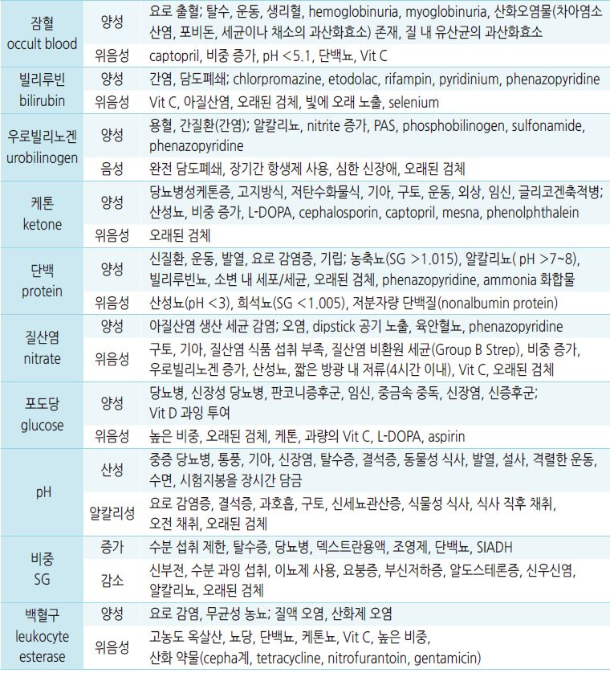
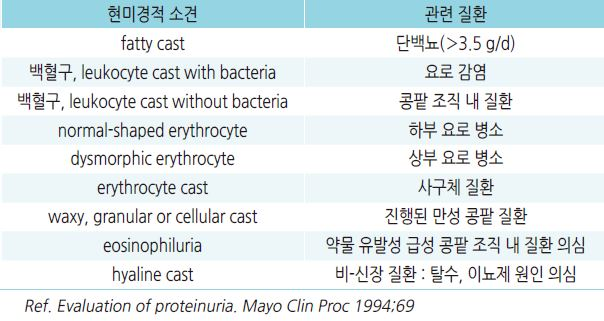
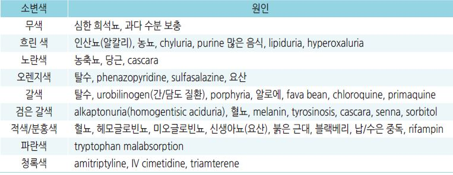
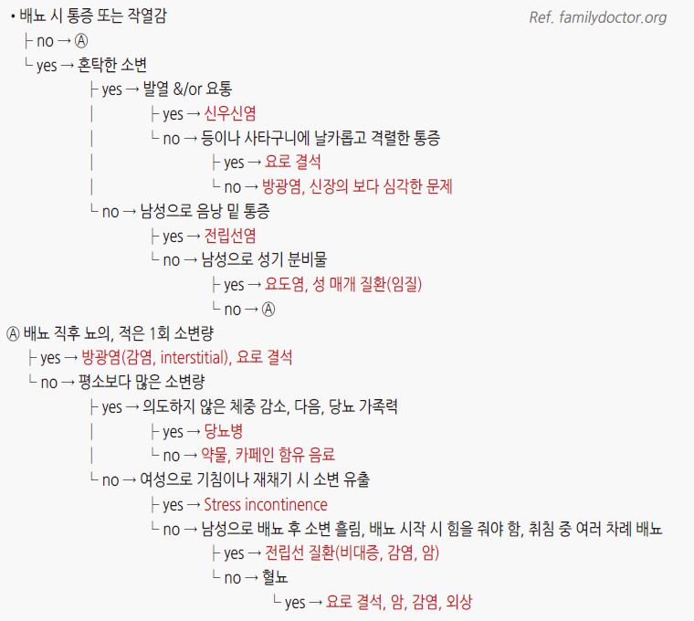

# 신장 질환의 진단

## 소변 검사

### 소변 채취 Tips
- 검사 전 3일간 과도한 신체 운동을 피함, 검사 전날 편향된 식이 섭취를 피함

- 아침 첫 소변(또는 8시간 농축뇨, 불가피한 경우 임의뇨)의 중간뇨 채취

- 붕산(보릭) 등 소독제로 요도 입구를 닦지 않음

- 오염되지 않도록 남성은 포피를 뒤로 젖히고, 여성은 음순이 닿지 않게 하고 채취

- 채취 후 실온(15~25℃)에서 보관하며 1~2시간 내 검사, 불가피하게 검사가 지연되는 경우 냉장(2~8℃) 보관

- 도뇨관을 통한 채취 : 가능하다면 새로 시술한 관을 통해 채취, 도뇨관 속에 남아 있는 소변을 버리고 채취

#### 24시간 소변 채취 방법
① 아침에 기상하여 방광을 완전히 비워 버림(첫 소변은 모으지 않음), 시간을 기록

② 이후 모든 소변을 병에 모음. 실온 또는 냉장 보관함

③ 배변할 때 배출되는 소변도 수집해야 함

④ 다음날 아침, 전 날 첫 번째 배뇨한 시간 전후 10분 이내에 배뇨하여 수거; 만약 20분 전에 요의를 느낀다면 잠시 참도록 함

### 배양 검사
- 대상 : 불확실한 진단, 비전형적 증상, complicated UTI 의심, 신우신염 의심, 임신, 남성, 초치료 실패, 재발,

    항생제 내성균 의심*, 도뇨관 유치, 증상이 있는 ＞65세에서 항생제 투여

>     *항생제 내성 위험군 : 비뇨생식기 이상, 신장 손상, 최근 6개월 동안 ＞7일 입원, 최근 내성 지역 여행, 이전 UTI 내성

### 무균성 농뇨(Sterile pyuria)의 원인
- 오염(용기, 질 분비물)

- chronic interstitial nephritis

- 신장 결석

- uroepithelial tumor

- 방광에 인접한 복강 내 염증

- painful bladder syndrome, interstitial cystitis

- atypical organism(예: Chlamydia, Ureaplasma urealyticum , 결핵)에 의한 감염

### 예방적 소변 검사의 한계
- 소변 검사의 양성 결과와 질병 상태가 일치하지 않을 수 있음

- 다수의 사람에게서 불필요하거나 잠재적인 위해가 될 수 있음. 예) 유의미하지 않은 결과와 관련된 걱정,

    불필요한 추가 검사 시행에 따른 비용 및 부작용

- 무증상 성인 또는 소아에서 예방 관리 범주에서의 소변 검사는 추천하지 않음

### 소변 시험지봉 검사의 해석
    

- 시험지봉의 부적당한 보관은 검사 결과에 영향을 미칠 수 있음

- 포도당 검사에 있어서 과당, 유당, 갈락토오스 등은 검출 안 됨

- 빌리루빈(+) & 우로빌리노겐(-) : 폐색성/담즙울체 질환

- 빌리루빈(+) & 우로빌리노겐(+) : 간 실질 장애

- overhydration 시 소변이 희석되어 위음성을 초래할 수 있음

- leukocyte와 nitrate 모두 양성일 경우 감염 예측 수준을 높임

- 고령 및 도뇨관 유치 환자에서는 무증상 세균뇨가 흔하므로 시험지봉 검사를 시행하지 않음

### 현미경적 소변 검사 소견의 해석
    

### 소변의 색에 따른 감별
    

- 혼탁뇨 : 농뇨, 알칼리뇨

- 자극적인 냄새 : 요로 감염, 농축뇨

- 거품 : 공기, 단백뇨

## 콩팥 기능 검사

### BUN
- 간에서 합성되는 단백질 대사의 최종 산물; 사구체에서 여과되고 renal tubule에서 재흡수 됨

- 증가 : 체액 고갈(신장에서의 재흡수 증가), catabolism↑(예: 위장관 출혈, cell lysis, steroid 사용), 단백질 섭취↑,

    신장 관류↓(예: 심부전, renal artery stenosis)

- 감소 : 간질환, 영양실조, sickle cell anemia, SIADH

- BUN/Cr ratio : 정상=10/1

### Cr clearance (Cockcroft-Gault)
- eGFR을 사용할 수 없을 때 적용; MDRD보다 부정확

- CrCl(㎖/분/1.73㎡) = {(140-연령) × 몸무게(㎏)} ÷ {72 × s-Cr} × 0.85(if female)

- 건강한 젊은 남성- 120, 여성- 100; 중년 이후 점차 감소(0.8/yr)

>   ✽Cr : 근육 대사산물로서 사구체에서 여과되며 재흡수 되지 않음; 신장 기능이 안정되면 일정하게 유지됨

### Cystatin C
- cysteine protease inhibitor의 cystatin superfamily의 일종인 저분자량 단백질. 혈청 측정

- Cr과 병용하여 GFR과 CKD를 보다 정확하게 평가하는데 활용; 근육양이 많은 젊은 환자에서 s-Cr이 높게 측정되는 경우

    또는 근육양이 적은 노인 환자에서 콩팥 기능 장애를 진단할 때 유용

> ✽측정 방법이 상대적으로 까다롭고 검사 비용이 높음

### 사구체여과율 (GFR)
- 콩팥 기능 평가 도구로 활용; 콩팥의 여과 능력을 반영

- 일반적으로는 Cr을 기초로 하는 계산식에 의해 산출한 eGFR을 사용

  •GFR 60 수준에서는 MDRD법이, GFR ＞60에서는 CKD-EPI법이 보다 정확하다는 보고가 있음

> (☞ 온라인 계산기 )
- 다음의 경우에는 직접 측정 : 초고령층, 매우 큰 체구, 심한 비만이나 영양실조, 골격근 질환, 하반신 또는 사지 마비,

    채식주의자, 급격한 신 기능 변화, 요 배설 약물 복용

#### Modification of Diet in Renal Disease (MDRD)
- Cr을 Jaffe법으로 측정했을 때 적용

- eGFR (㎖/분/1.73㎡) = 186 × Scr(㎎/㎗)^-1.154 × 연령^-0.203 × [0.742 if female]

>   ✽우리나라 사람들에 대한 보정으로 위 결과에 1.09825을 곱하는 것이 제안됨 (Ref. 이충식 외. 한국인의 MDRD 공식에 의한 추정

>     사구체여과율에 대한 계수. J Korean Med.2010 Nov;25(11):1616~25)

#### IDMS-traceable MDRD
- Cr을 calibration traceable to a standardized reference material로 측정했을 때 적용

- eGFR (㎖/분/1.73㎡) = 175 × Scr^-1.154 × 연령^-0.203 [× 0.742 if female]

#### CKD-EPI Creatinine equation (2021)
- eGFR = 142 × min(Scr/κ, 1)^α × max(Scr/κ, 1)^-1.200  × 0.9938^연령 [× 1.012 if female]

κ= 여 0.7/남 0.9, α= 여 -0.241, 남 -0.302; min= Scr/κ or 1 중 최소값, max= Scr/k or 1 중 최대값

#### CKD-EPI Cystatin C equation (2012)
- eGFR = 133 × min(Scys/0.8, 1)^-0.499 × max(Scys/0.8, 1)^-1.328 × 0.996^연령 [× 0.932 if female]

Scys = ㎎/L; min= Scys/0.8 or 1 중 최소값, max= Scys/0.8 or 1 중 최대값 

#### CKD-EPI creatinine–cystatin C equation (2021)
- eGFRcr-cys = 135 × min(Scr/κ, 1)^α × max(Scr/κ, 1)^-0.544 × min(Scys/0.8, 1)^-0.323 × max(Scys/0.8, 1)^-0.778 × 0.9961^연령

                        [× 0.963 if female]

κ= 여 0.7/남 0.9, α= 여 -0.219/ 남 -0.144; 

min(Scr/κ, 1)= Scr/κ or 1.0 중 최소값, max(Scr/κ, 1)= Scr/κ or 1.0 중 최대값; 

min(Scys/0.8, 1)= Scys/0.8 or 1 중 최소값, max(Scys/0.8, 1)= Scys/0.8 or 1 중 최대값

## 초음파 검사

#### 검사 대상
- 매우 빈번한 감염

- 치료에 반응하지 않음

- 배뇨 후 불완전 비움 증상 또는 촉지되는 방광

- 재발성 Proteus 감염(신결석 관련)

## 증상/병력에 따른 배뇨 문제의 감별
- 배뇨 곤란, 배뇨통(dysuria) : 요도염, 방광염, 전립선염, 질염, 성매개 감염, 외상, 종양

- 옆구리 통증 : 신결석, 신우신염

- 빈뇨 : 요도염, 방광염, 질염, 방광 결석, 과다 수분 섭취, 배뇨근 불안정, 이뇨제, 당뇨병, 불안

- 야간뇨 : 요로 감염, 고령, 불면, 전립선비대증, 방광 기능 부전

## Dysuria 감별 진단
    
