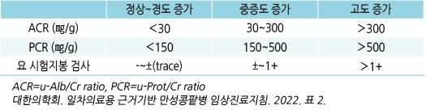
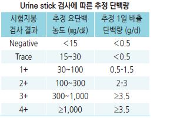
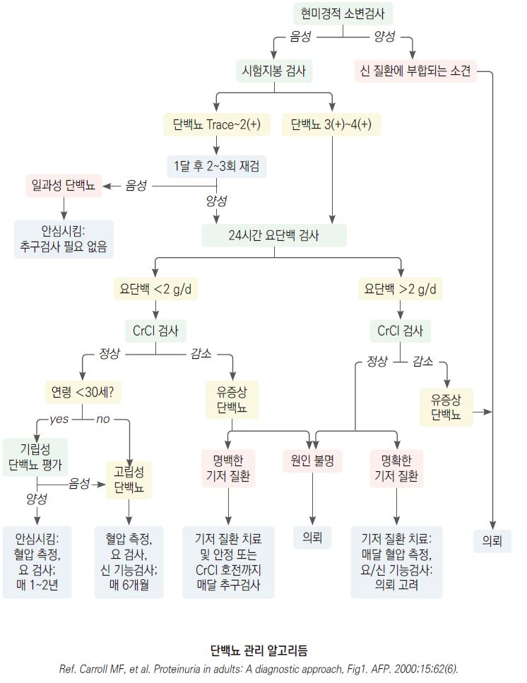

# 단백뇨 Proteinuria


## 일반 사항

### 단백뇨 및 미세알부민뇨의 정의

```

```

#### 미세알부민뇨 (Microalbuminuria)

* 기준 : 임의뇨 Alb/Cr ratio 0.03~~0.3(30~~300 ㎎/g) 또는 24시간뇨 알부민 30\~300 ㎎
* 진단 : 3\~6개월 간격으로 시행한 3번의 임의뇨 검사에서 ≥2번 미세알부민뇨 기준에 해당
* 의의 : 당뇨병콩팥병증 조기 진단 및 신부전 예측 지표, 고혈압 환자의 심혈관 사망 위험 인자

#### 고립성 단백뇨 (Isolated proteinuria)

* 정의 : GFR 감소가 없고 혈뇨 없이(＜3 RBC/HPF) 단백뇨만 발생; 보통 ＜3.5 g/d
* 보통 자각 증상 없음

### 예후

* 합병증 : 신부전, 고콜레스테롤혈증, 응고 경향 증가, 감염 위험 증가(신증후군)
* 많은 양의 단백뇨는 GFR에 관계없이 사망 위험 증가, 심근경색, 신부전으로 진행될 가능성이 높음
* 지속되는 단백뇨는 기저 원인에 따라 다양한 경과를 보임
* 일시적, 기립성 단백뇨는 양성 상태로 나쁜 예후를 보이지 않음

## 분류

### 기능성 단백뇨 (Functional proteinuria)

* 양성 경과의 일과성 단백뇨
*   원인 : 급성 질환, 발열, 심한 활동/운동, 기립 자세, 탈수, 정신적 스트레스, 임신, 고열, 추위 노출, 염증 상태, 심부전,

    고혈압, 약물
* 요단백 양 : ＜1 g/d (✽＞1 g/d의 요단백은 보통 사구체 질환에 의함)
* 건강한 사람에서 검출되는 단백뇨는 추적 검사 시 대개 소실됨
* 치료 : 필요 없음

#### 기립성 또는 자세 단백뇨 (Orthostatic or Postural proteinuria)

*   장시간 서서 활동한 후에 발생한 단백뇨

    •누운 자세로 휴식 후에는 정상, 기립 자세 활동 후에는 요단백 양성
* 요단백 양 : 아침 첫 소변에서 ＜50 ㎎
* 보통 ＜30세에서 호발
* 기전 : 불명; 기립 중의 혈류 역학 변화, 사구체 변화 등으로 추정
* 경과 : 일과성 또는 지속 경과를 보이지만 신장 기능에 영향을 주지 않으며 대부분 자연 소실됨
* 치료 : 필요 없음

#### 소아 및 청소년에서의 단백뇨

* 원인 : 대부분 발열, 운동 등에 의한 일과성 단백뇨
*   선별 검사 양성 시 채뇨 유의 사항을 지켜 재검

    → 1주 간격으로 3회 검사에서 최소 2번 단백뇨 검출 시 신질환에 대한 추가 검사 시행

### Overload proteinuria

* 기전 : 혈중 순환하고 여과되는 저분자 단백질의 생성 및 배설 증가. 예) hemoglobinuria, myoglobinuria
* 원인 : myeloma, acute leukemia, rhabdomyolysis, hemolysis

### Glomerular proteinuria

* 기전 : 사구체에서의 단백질 투과 증가
*   1차성 : minimal change Dz, 선천성 신증후군, focal segmental glomerular sclerosis, IgA nephropathy(Berger’s Dz),

    membranoproliferative glomerulonephritis, membranous nephropathy, Alport syndrome
* 2차성 : PSGN, 당뇨병, SLE, Henoch-Schönlein purpura

### Tubular proteinuria

* 기전 : 세뇨관에서의 단백질 재흡수 감소
* 1차성 : cystinosis, Dent’s syndrome, Wilson’s Dz, Lowe’s syndrome, polycystic kidney Dz, mitochondrial disorder
* 2차성 : 중금속 중독, tubular necrosis, tubulointerstitial nephritis, obstructive uropathy

### 신증후군 (Nephrotic syndrome)

* 정의 : ① 심한 단백뇨(＞3.5 g/24h), ② 저알부민혈증(＜3 g/㎗), ③ 말초 부종의 3주징이 발생한 상태
* 관련 원인 질환 : 당뇨병, amyloidosis, SLE, 사구체 질환
* 치료 : ACEI/ARB, Na 섭취 제한, loop diuretics

## 진단

### 신체검사

* 혈압, 체중
* 말초 부종, 안구 주위/안면 부종, 복수
* 신장, 폐, 심장 진찰 : CHF 징후 관찰

### 소변 검사

* 채뇨 방법 : 검사일 전날 밤 취침 시 배뇨 후 아침 첫 소변 채취 (☞ p.604)

#### 시험지봉 검사

* 글로불린, Bence-Jones 단백은 검출할 수 없음
* 위양성 : 육안혈뇨, 심한 농축뇨(SG ＞1.025), 알칼리 소변(pH＞8.0)

#### 소변 단백 정량 검사

*   임의뇨 Alb/Cr ratio 측정

    •가능한 한 아침 첫 소변 또는 식사 2시간 후 소변 채취

    •Alb/Cr ratio가 ＞500 ㎎/g 이면 Alb/Cr ratio 대신

    임의뇨 Prot/Cr ratio 이용 가능

    •24시간 단백 배설량과 상관관계가 있음; 근육량이

    너무 많거나 적으면 부적당
* 24시간뇨 수집 (미세알부민 검사 보험기준 ☞ p.1192)

### 소변 외 검사

* CBC, ferritin, 철분, ESR, LFT, 혈당, 전해질, 지질, prothrombin time
* anti-phospholipase A2 receptor Ab, ANA, antistreptolysin O titer, complement C3/C4
* HIV, 매독, 간염

### 선별 검사

*   시험지봉 검사상 단백뇨가 1+ 이상 : 3개월 내 단백뇨 정량 검사 실시 → 정량 검사에서 단백뇨 진단 시 1\~2주 간격으로 재검

    → 연속적으로 양성 시 관리
* 시험지봉 검사상 단백뇨이면서 Prot/Cr ratio 정상 : 주기적 추적 관찰
* 만성콩팥병 위험도가 높은 환자(예: 당뇨병) : 처음부터 단백뇨 정량 검사 실시 → 단백뇨 진단 시 만성 신질환에 대한 평가

•필요시 사구체성, 세뇨관성, 또는 범람성 단백뇨 감별을 위한 소변 단백 전기영동검사 시행

***

## Management

### 치료 방침

* 원인 치료, 혈압/당뇨병 관리
* 관리 목표 : 단백뇨 ＜0.5 g/d, 혈압 ≤140/90 ㎜Hg(연령, 상황에 따른 목표 설정) (☞ p.482)
* 필요한 것 외의 약제 사용을 피함, 특히 신장 독성 약물 사용을 피함(예: NSAID, aminoglycoside)



## 비-약물 치료

* 단백질 섭취 제한 : eGFR ＜30 시 ≤0.8 g/㎏/d
* Na 섭취 제한 : ＜2 g/d(소금으로 5 g/d) (☞ p.484)
* 적당한 수분 섭취 : 목표 소변량 \~2 L/d
* 금연, 적정 체중 유지
* supine posture 권고
* 심한 운동 삼가
* 과도한 커피 섭취 삼가

## 약물 치료

* ACEI 또는 ARB : 1차 선택제; 정상 혈압이 유지되는 최대 용량 적용 (☞ p.486)
* non-DHP CCB : diltiazem \[헤르벤], verapamil \[이솦틴]

> **질병코드** N39.1 상세불명의 지속성 단백뇨

N39.2 상세불명의 기립성 단백뇨

R80 고립된 단백뇨
