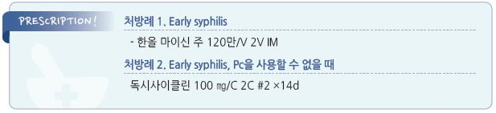

# 매독 Syphilis

## 일반 사항

### 분류

#### Early syphilis
- primary syphilis, secondary syphilis, early latent syphilis를 포함

- 전염 경로 : 감염 병소에 대한 직접 접촉; 성관계, 감염 산모의 출산 중 태아 감염

  •수혈에 의한 전염은 극히 드묾 (✽공여자의 혈액을 24~48시간 이상 저장하면 사멸됨)

- 잠복기 : 초감염 후 수 주~수개월 내 증상 발생

#### Late syphilis
- late latent syphilis, tertiary syphilis, neurosyphilis를 포함

- 초기 단계에서 치료되지 않으면 무증상의 late latent syphilis 또는 감염 합병증 단계(tertiary syphilis, neurosyphilis)로 진행

- 초감염 후 어느 시기(1~30년)에서나 다양한 조직에서 증상이 발현될 수 있음

## 1기 매독 (Primary syphilis)

### 임상 양상

#### 굳은 궤양 (Chancre)
- 통증 없는 한 개의 papule로 시작 → 곧 침식되고 단단해져 촉진상 연골 느낌의 바닥 및 둘레를 가지는 통증이 있는

    궤양으로 진행

- 구강, 항문, 음경, 질 등에서 감염 후 2~3주에 발생할 수 있으며 치료하지 않으면 몇 주간 지속될 수 있음

### 검사

#### 현미경 검사
- 암시야 현미경 검사법(darkfield microscopy of skin lesion) : 민감도 80%

#### 혈청 검사
 **Non-treponemal test**

- RPR, VDRL; 민감도 78~86%

- cardiolipin-lecithin-cholesterol Ag 복합체에 대한 IgG 및 IgM Ab 측정

- 역가가 4배 이상 증가하면 감염으로 진단

- 항체가와 질병 활성도에 상관관계가 있으므로 치료 반응 평가에 활용

 **Treponemal-specific test **

- FTA-ABS, TPPA, ICS, EIA; 민감도 76~84%

- 항체가와 질병 활성도의 상관관계 없음

- 초기 위음성 및 치료 후 위양성 문제로 해석이 중요함

## 2기 매독 (Secondary syphilis)

### 임상 양상
- 피부 발진 : 반, 구진, 구진비늘, 농포 등 다양한 형태; 손/발바닥 및 전신 분포; 가려움 없음

- 편평콘딜로마 (Condylomata lata) : 분홍색 또는 회백색, 넓고 짓무른 papules or plaques; 전염성이 높으며

    2기 매독 환자의 10%에서 발생

- 전신 증상 : 발열, malaise, 인후통, 두통, 근육통, 관절통, 전신 림프절병증, 체중 감소, 탈모

- 신질환(사구체신염, 신증후군), 간질환(간염) 발생 가능

### 검사
- non-treponemal test, treponemal-specific test : 민감도 100%

- darkfield microscopy of skin lesion : 민감도 80%

## 3기 매독 (Tertiary syphilis)
- 치료 받지 않은 환자에서의 late syphilis

- cardiovascular syphilis, gummatous Dz를 포함한 증상 발생

- 고무종 (Gumma) : 다양한 크기와 부위(피부, 피하, 골, 내장)의 결절; 궤양과 피부 괴사를 일으킬 수 있음

### 검사
- non-treponemal test : 민감도 71~73%

- treponemal-specific test : 민감도 94~96%

## 잠복매독 (Latent syphilis)
- 치료받지 않은 환자에서, 매독 혈청 검사는 양성이지만 CSF 검사는 정상이고 임상 증상은 없는 상태

- 조기 잠복매독 : 초감염 후 1년까지

- 후기 잠복매독 : 1년이 지나거나 미상인 경우

### 검사
- non-treponemal test : 민감도 95~100%

- treponemal-specific test : 민감도 97~100%

- CSF 검사 대상 : 신경 증상 발생(예: 청력 질환, 뇌신경 기능 이상, 수막염, 뇌졸중, 의식 변화, 진동 감각 상실),

    안과 증상 발생(예: 홍채염, 포도막염), 활동성 3기 매독 증거(예: 대동맥염, 고무종), serologic treatment failure

## 신경매독 (Neurosyphilis)
- 감염 경과 중 어느 시기에나 발생 가능

### 임상 양상

#### 조기 신경매독 (Early neurosyphilis)
- 뇌막염, 뇌혈관 질환(예: 수막염, 뇌졸중) : 두통, 혼돈, 구역, 구토, 경부 강직

- 시력 손실(홍채염, 포도막염), 청력 손실

#### 만기 신경매독 (Late neurosyphilis)
- 뇌/척수 이환; 치매, general paresis, tabes dorsalis

### 검사
- 혈청 검사, CSF 검사

---

## Management

## Early syphilis

#### 1차 선택제
- benzathine Pc-G : 240만 U IM ×1회 (다른 항생제 추가 효과는 없음) [마이신 주]

#### 대체제
- doxycycline : 100 ㎎ bid ×14d [독시사이클린]

- ceftriaxone : 1 g qd IM/IV ×10~14d [트리악손]

- amoxicillin 3 g + probenecid 500 ㎎ bid ×14d

- azithromycin : 2 g 1회 (타 약제 선택이 불가능할 때) [지스로맥스]

### 모니터링
- 치료 후 6개월 및 12개월째 임상 및 혈청학적 평가

- non-treponemal test 역가가 4배 이상 감소(예: VDRL 1:32 → 1:8)하지 않으면 치료 실패로 판정하고 재치료 및

    HIV 감염 감별

## Late syphilis

#### 1차 선택
- benzathine Pc-G : 240만 U qwk IM ×3wk (총 720만 U)

#### 대체제
- doxycycline : 100 ㎎ bid ×4wk [독시사이클린]

- ceftriaxone : 2 g qd IM/IV ×10~14d [트리악손]

### 모니터링
- 치료 후 6, 12, 24개월째 non-treponemal test 시행

- 다음의 경우 CSF 검사 시행 : 역가 4배 증가, 초기 높은 역가(≥1:32)에서 12~24개월 내 4배 이상 감소 실패,

    매독 증상 발생

## 신경매독

#### 1차 선택
- aqueous Pc-G : 1,800~2,400만 U/d 점적 or 300~400만 U q4hr IV ×10~14d

- procaine Pc : 240만 U/d IV + probenecid 500 ㎎ qid ×10~14d

#### 대체제
- ceftriaxone : 2 g qd IV ×10~14d [트리악손]

### 모니터링
- non-treponemal test

- CSF 모니터링

## 성 파트너
- mucocutaneous syphilitic lesion이 존재할 때 전염력이 있음

#### 평가 대상
- 1기 매독 환자와 3개월 내 접촉자

- 2기 매독 환자와 6개월 내 접촉자

- 조기 잠복매독 환자와 1년 내 접촉자

#### 조치
- 진단 전 90일 내 접촉 시 : 혈청 검사가 음성인 경우에도 조기 잠복매독으로 간주하고 치료

- 진단 전 90일 이전 접촉 시 : 혈청 검사 음성 시 치료 필요 없음; 혈청 검사 결과를 즉시 확인할 수 없으며

    추적 방문이 불확실한 경우 조기 잠복매독으로 간주하고 치료

> **질병코드**
A50~52 선천매독, 조기매독, 만기매독

A53 기타 및 상세불명의 매독 질병코드

