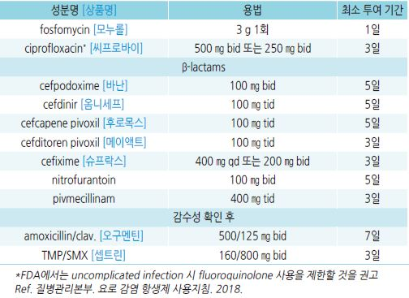
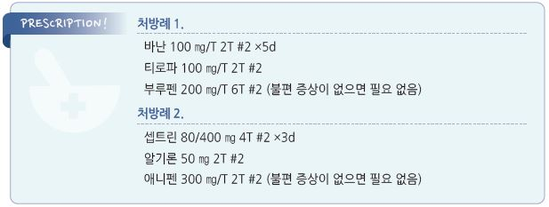

# 급성 방광염 Acute Cystitis

## 일반 사항
- 전염 경로 : 회음부/요도/항문으로부터의 상행 감염

- uncomplicated cystitis : 비-임신 성인에서의 방광에 국한된 감염

- complicated cystitis : 감염이 방광을 넘어 확장된 상태

- 방광염 환자의 30%에서 신우신염 발생

## 원인
- 원인균 : E. coli (가장 흔함), Staphylococcus saprophyticus

  •기타 : Pseudomonas, Klebsiella, Proteus, Candida, Aspergillus, Cryptococcus

### 위험 인자
- 여성

- 고령

- 당뇨병, 면역 저하

- UTI 과거력

- 배뇨 장애 질환(예: 요실금)

- 성관계, 살정자제 사용

- 도뇨관 유치, 입원

## 임상 양상
- 흔한 증상 : 갑자기 발생한 빈뇨, 절박뇨, 배뇨통

- 덜 흔한 증상 : 혈뇨(특히 여성), 치골위 불쾌감/압통, 척추늑골각 통증, 발열(＜38.9℃)

## 진단

#### 소변 검사
- U/A : 농뇨(WBC ≥10/HPF), 세균뇨; 증상의 중증도와 농뇨/세균뇨의 정도가 일치하지는 않음

- 시험지봉 검사 : leukocyte esterase, nitrite; 두 가지 모두 양성 시 요로 감염 확률 ~80%

- 배양 검사 : 보통 유용하지 않으며 필요 없음

  •검사 대상 : 불확실한 진단, 신우신염 의심, 비전형적인 증상, 임신부, 남성 요로 감염 의심, 치료 종료 후

    2-4주 이내에 증상이 호전되지 않거나 재발

  •≥103 cfu/㎖ 시 진단(기준에 대하여 이견이 있음)

### 영상 검사
- 남성에서의 방광염은 드물기 때문에 발생 시 결석, 전립선염, 만성 요축적 등의 감별을 위하여 복부 초음파,

    잔뇨 검사, 방광경 검사 등 시행

- CT : 신우신염, 재발 감염, 해부학적 이상이 의심되는 경우 고려

### 감별
- 고열, 오한, 근육통 → 신우신염, 세균성 전립선염

- 남성에서의 골반/음경 통증, 성기 끝까지 퍼지는 통증, 소변 저류 증상(배뇨 지연, dribbling) → 세균성 전립선염

- 남성에서의 재발성 방광염 증상 → 만성 전립선염

- 활발한 성관계 남성 → Chlamydia , Gonorrhea

- 남성에서는 세균뇨 유무로 만성 골반통증후군(chronic pelvic pain syndrome)과 급만성 세균성 전립선염을 감별하며,

    항생제 사용을 결정함

---

## Management

## 약물 치료

#### 항생제 (uncomplicated state)
    

### 기타
- 항진균제 : 칸디다 감염 시

  •fluconazole : 200 ㎎/d ×2주 [푸루나졸] (☞ p.931)

- 진경제 (☞ p.371)

  •cimetropium : 50 ㎎ tid [알기론]

  •scopolamine : 10~20 ㎎ tid~qid [부스코판]

  •tiropramide : 100 ㎎ bid~tid [티로파]

- 진통제

  •ibuprofen : 400~800 ㎎ tid [부루펜]

  •acetaminophen : 650~1,300 ㎎ tid [타이레놀]

- 방광 마취제 : 항생제 치료 후 첫 24시간 내 투여 개시

  •phenazopyridine : 200 ㎎ tid ×2d; 눈물, 소변이 오렌지색으로 변색될 수 있음

## 여성 recurrent uncomplicated UTI의 급성 episode
    [AUA]

- 증상이 있는 급성 방광염 episode에 대하여 1차 치료 항생제 선택

  •예) nitrofurantoin, TMP-SMX, fosfomycin

- 급성 방광염 episode에 대한 항생제 치료는 단기간(≤7일) 시행

- 배양 검사 결과 경구 항생제에 내성이 있는 경우 배양 검사에 따른 비경구 항생제 치료를 단기간(≤7일) 시행

#### 추적 관리
- 치료 후 증상이 사라진 경우에 치유 여부를 확인하기 위한 U/A 또는 소변 배양 검사는 필요 없음

- 항생제 치료 후에도 증상이 지속되는 경우에 치료 방침을 결정하기 위한 소변 배양 검사를 재시행

## 예방
(☞ p.625)

> **질병코드**
N30 방광염

N30.0 급성 방광염 질병코드

