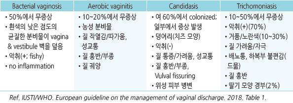
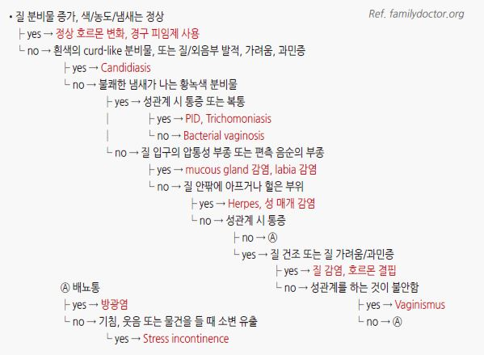
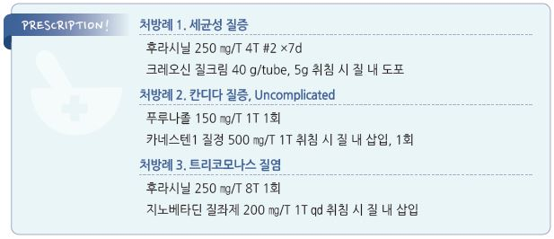

# 음문질 감염증 Vulvovaginal Infections

## 일반 사항
- 비정상적인 질 분비물, 악취, 가려움, 작열감 등의 증상을 일으키는 감염, 염증, 또는 normal flora의 변화 등과 관련된

    음문질의 감염증

- vaginosis- 염증이 없음; vaginitis- 염증이 있음

- 재발 시 성 파트너 치료

## 원인
- 감염 : 세균(40%~50% 차지), 칸디다(20%~25%), 편모충(15%~20%)

- 기타 : estrogen 감소(질 위축), 자극, 알레르기, 이물질, 자궁경부염, 박리성 염증성 질염

### 위험 인자
- 흡연

- 불결한 성관계

- 잦은 질 세척 (✽Lactobacillus 소실로 산도 유지 안 됨)

- estrogen 감소

- 물리적/화학적 자극 : 질 세정제, 향수 비누, 조이는 옷, 자궁 내 장치

## 종류 및 특징
- 3주징 : 질 분비물, 가려움, 악취(세균성 또는 편모충증에서 amine odor)

- 작열감, 통증, 자극 증상, 외음부 배뇨통(배뇨 시 음순, 질 입구가 자극됨)

### 세균성 질증 (Bacterial vaginosis, BV)
- 가임기 여성에서의 비정상 질 분비물의 가장 흔한 원인

- 기전 : 혐기성 균주가 정상 Lactobacilli를 대치 → 산성도 저하 → 혐기성 균주 증식

- 원인균 : Gardnerella vaginalis , Prevotella , Atopobium vaginae , Megasphaera , Mobiluncus

- 증상 : 50%에서 무증상

  •흰색~회색, 낮은 점도, 균질, 악취(생선 비린내)가 나는 분비물이 vagina & vestibule 벽을 coating(biofilm with G. vaginalis )

  •분비물 외 증상 : 다른 질증에 비하여 염증 및 자극 증상은 적음

- 재발률 : 1개월- 23%, 3개월- 43%, 12개월- 58%

### Aerobic vaginitis
- 기전 : Lactobacilli 감소, 산성도 저하; 호기성 균 우세(예: E. coli , GB Strep, S. aureus )

  •감염이 원인인지 세균 불균형이 원인인지 불분명

- 증상 : 농성 분비물, 약간의 atrophy, vaginitis

- 장기간에 걸쳐 간헐적 악화를 보일 수 있음. 치료 후 재발이 흔함

### 음문질 칸디다증 (Vulvovaginal Candidiasis; VVC)
- 건강한 여성의 60% 이상에서 Candida 가 colonization되어 있음

- 여성의 75%가 평생 ≥1회 발생; 6~9%에서 만성 재발(≥4회/년) 경과

- 원인균 : C. albicans (90%), C. glabrata (☞ p.933)

- 기전 : 정상 flora인 칸디다의 과잉 증식, 질 상피 세포 침범

- 위험 인자 : 쇠약, steroid or 항생제 사용, 당뇨병, 면역 저하, 임신; 열, 습기, 밀폐 의상

- 분비물 : 흰색, 높은 점도, 덩어리(치즈 모양), 악취(-)

- 분비물 외 증상 : 가려움, 작열감, 배뇨 곤란, 성교통

#### Uncomplicated VVC
- 원인균 : C. albicans

- 중등증 이하 증상

- 정상 면역 여성에서 가끔 발생

#### Complicated VVC
- 원인균 : non-albicans 감염

- 심한 증상 : 심한 음문 발적, 부종, 찰상, 열상

- 재발성(≥4회/년)

### 편모충 질염 (Trichomonal vaginitis)
- 원인균 : Trichomonas vaginalis

- 기전 : 성관계를 통하여 전파 → 질 상피 세포 침범(흔히 요도 침범)

- 10~50%에서 무증상

- 질 감염된 여성의 90%에서 요도 감염 발생

- 분비물 : 화농성, 악취, 노란색~초록색

- 분비물 외 증상 : 작열감, 가려움, 배뇨 곤란, 성교통, 성관계 후 출혈

### 자극성 및 알레르기성 질염 (Irritant and Allergic vaginitis)
- 원인 : 살정제, 질세정 용액, 피임용 가로막, 라텍스 콘돔, 국소 의약품

- 증상 : 가려움, 질 불편감

### 위축성 질염 (Atrophic vaginitis)
- 질과 질 주변의 조직들이 건조하고 얇고 염증을 일으킨 상태

- 원인 : estrogen 결핍(예: 폐경, 난소 제거술)

- 증상 : 질 건조, 자극 증상, 화끈거림, 성교통, 질 마찰 또는 자극 시 출혈, 질 분비물, 방광 자극 증상(빈뇨, 배뇨통, 출혈)

## 진단

### 검사
- pH test : 칸디다증 4~4.5(정상 pH), 세균성 ＞4.5, 편모충증 5~6; 비특이적

- 그람염색 & Hay-Ison criteria : 그람염색에 기초하여 grading; BV의 가장 좋은 진단법

- 배양 검사 : polymicrobial infection이 나타나므로 BV 진단을 위한 배양 검사는 권고 안함

- 질 분비물 saline-solution specimen 현미경 검사 : 움직이는 T. vaginalis 또는 세균 관찰

- KOH 현미경 검사 : blastospore 또는 pseudohyphae 관찰; 칸디다증 진단 (민감도 50%)

- NAAT(핵산증폭검사; PCR, TMA) : TV 진단에 가장 좋은 진단법으로 권고

- OSOMⓇ trichomonas rapid test, immunochromatographic capillary flow dipstick technology, PCR assay :

    편모충증 진단 (민감도＞80%, 특이도＞95%)

### Amsel’s criteria : 세균성 질증 감별
- 다음 중 ≥3가지 있으면 세균성 질증 가능성 90%

  ① 질 벽을 매끄럽게 코팅하고 있는 점도가 낮은 균질한 흰색~노란색의 분비물

  ② 현미경 검사상 총 상피 세포의 ＞20%에서 clue cell 관찰

  ③ 질 분비물 pH ＞4.5

  ④ 질 분비물에서의 생선 비린내(특히 질 분비물에 KOH를 바르면)

### 증상/병력에 따른 여성 Genital problem의 감별
    

---

## Management

## 비-약물 치료 및 예방
- 위험 요인을 피함 : 잦은 질 세척을 피함, 금연, 성관계 시 콘돔 사용, 물리적/화학적 자극(예: 질 세정제, 향수 비누,

    조이는 옷, 질 내 제품 사용)을 피함

## 약물 치료
- 1일 1회 국소 적용하는 경우에는 취침 시 적용

- 항진균제 질 크림은 콘돔 및 질 diaphragm을 약화시킬 수 있음

### Bacterial vaginosis
- BV 여성의 남성 파트너는 치료를 요하지 않음, 여성 파트너는 치료가 필요할 수 있음

#### 1차 선택제 (uncomplicated BV)
- metronidazole : 500 ㎎ bid ×7d (투약 종료 후 24시간 금주) [후라시닐]

- metronidazole 겔 : 0.75%, 5 g 질 내 도포 qd ×5d [메로 겔]

- clindamycin 크림 : 2%, 5 g 질 내 도포 qd ×7d [크레오신 질크림]

#### 대체제
- clindamycin : 300 ㎎ bid ×7d [훌그램]

- clindamycin 질정 : 100 ㎎ qd 취침 시 ×3d [훌그램]

- tinidazole : 2 g qd ×2d, 또는 1 g qd ×5d (투약 종료 후 72시간 금주) [티니다진](보험주의)

#### 빈번한 재발 시 예방 요법
- metronidazole gel : 0.75% 제제 주2회 ×4~6개월

 •주의 : 중단 시 예방 효과가 지속되지 않음. Candidasis가 증가할 수 있음

- Probiotics : 유효성에 대한 증거 부족

>   (✽Lactobacillus 분말 질 내 투여 시 미생물의 불균형이 12주와 24주차에 각각 30%/39%에서 재발하였다는 보고가 있음(위약 45%/54%))

#### 임신
- metronidazole : 500 ㎎ bid 또는 250 ㎎ tid ×7d

>   ✽임신 중의 세균성 질염 치료는 증상을 개선하지만 출산 전 위험을 감소시키지는 못함

### Aerobic vaginitis
- clindamycin 크림 : 2%, 5 g 질 내 도포 qd ×7~21d [크레오신 질크림]

- clindamycin 크림 & steroid 크림(예: hydrocortisone 300~500 ㎎) 질 내 도포 ×7~21d

### Vulvovaginal Candidiasis
- 무증상인 여성 환자 및 남성 파트너에 대한 치료는 권고하지 않음

#### Uncomplicated
- 경구제 : fluconazole 150 ㎎ 1회 [푸루나졸] or itraconazole 200 ㎎ bid ×1d [스포라녹스]

- 국소제(질 내)

  •clotrimazole 질정 : 500 ㎎ 1회 or 200 ㎎ qd ×3d [카네스텐 1 질정]

  •miconazole 질정 : 1200 ㎎ 1회 or 400 ㎎ qd ×3d

  •econazole pessary : 150 ㎎ 1회

  •clotrimazole 크림 : 1% 5 g 질 내 7~14d or 2% 5 g 질 내 ×3d

  •miconazole 크림 : 2% 5 g 질 내 ×7d or 4% 5 g 질 내 ×3d

#### Complicated 또는 중증
- 대상 : 심한 증상, non-albicans, 조절되지 않는 당뇨병, HIV 감염, 스테로이드 투여, 임신

- 국소 azole계 : 7~14d

- fluconazole : 150 ㎎ PO ×3일 간격으로 3회(1, 4, 7일)

#### Recurrent
- 정의 : ≥4회/년 발생; 배양 검사를 통한 확진이 필요

- 발생 시 치료 : clotrimazole(500 ㎎ 질정 주 1회 or 200 ㎎ 크림 주 2회) or fluconazole(150 ㎎ PO ×3일 간격 3회) ×6개월

- 유지 치료 : azole계 외용제 or 경구제 ×10~14일 → 이후 fluconazole 150 ㎎ 주1회 ×6개월; 약제 중단 후 재발이 흔함

- non-albicans 감염 재발 : 붕산 600 ㎎(gelatin capsule) qd ×2wk

#### 임신
- metronidazole : 2 g 1회

### Trichomonal vaginitis
- 성 파트너에 대한 치료를 요함

#### 1차 선택제
- metronidazole : 500 ㎎ bid ×7d [후라시닐] (투약 종료 후 24시간 금주)

- 남성 : metronidazole 2 g 1회

- 대체 (남, 여) : tinidazole 2 g 1회 [티니다진] (투약 종료 후 72시간 금주)

#### 지속 또는 재발
- metronidazole : 500 ㎎ bid ×7d (초치료 실패 환자의 40%에서 반응)

- 재노출이 없었으나 지속되거나 검사상 약물 내성이 있는 경우 고용량 투여

  •metronidazole or tinidazole : 2 g qd ×7d

- 고용량 치료 실패 시 tinidazole 2 g qd + tinidazole 500 mg 질 내 bid ×14d

    → 실패 시 tinidazole 1 g tid + paromomycin 6.25% 크림 질 내 4 g ×14d

- 부적당한 치료, 성 파트너 치료 및 재감염 여부 확인

### Atrophic vaginitis
- estrogen 외용제

  •제형 : emulsion, 겔, 스프레이, 크림, 질정, vaginal ring

  •용법 : 1~2주간 매일 도포 → 이후 주 2회 지속

  •estradiol hemihydrate 0.1% [에스트레바 겔]

- ospemifene : estrogen 유사 작용 경구제

- prasterone(=dehydroepiandrosterone, DHEA) 질 정

> **질병코드**
A59.00 편모충성 외음질염

B37.3 외음 및 질의 칸디다증

N76.0 급성 질염

N77.1 달리 분류된 감염성/기생충성 질환에서의 질염, 외음염 또는 외음질염

