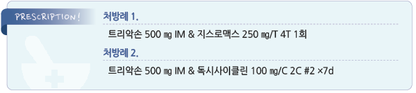

# 자궁경부염 Cervicitis

## 일반 사항

* uterine cervix의 염증; 1차적으로 endocervical gland의 columnar epithelial cell 이환
* 급성 : 클라미디아, 임균 등의 감염에 의하며 주로 성관계에 의해 전파
* 만성 : 대부분 국소 자극 등 비감염에 의함
* 위험군 : 성적 활동 연령, 콘돔 사용을 하지 않음, 복수의 성 파트너
* 감염 합병증 : PID, endometritis, 임신/태아 합병증, 불임
*   선별 검사 : 성관계를 하는 ＜26세 여성 및 새로운 또는 복수의 성 파트너가 있는 ≥26세 여성은 증상 유무에 관계없이

    매년 Gonorrhea 및 Chlamydia 검사를 권고
* 새롭게 발병한 경우 PID 감별이 필요함
* 클라미디아 또는 임질로 진단된 경우 60일 내 성관계 파트너에 대한 평가 및 치료를 요함

## 원인

*   원인균 : Chlamydia trachomatis , Neisseria gonorrhoeae , Trichomonas vaginalis , 세균성 질증 유발 균주(☞ p.658);

    대부분 검출 안 됨
* 물리적 자극 : 이물(예: pessary, diaphragm, tampon, cervical cap)
* 화학적 자극 : 라텍스, 뒷물, 피임 크림
* 방사선 치료, 전신성 염증 질환(예: Behçet Dz)

## 임상 양상

* 보통 무증상 또는 가벼운 증상
* 농성/점액 농성 질 분비물 : 자궁경부염의 특징적인 소견은 아님
* 질 출혈 : 성관계 후, 월경 사이; 자극에 쉽게 출혈
* 골반통, 성교통, 자궁 경부 홍반 및 압통
* 방광 자극 증상(빈뇨, 절박뇨, 배뇨통)

## 진단

1. 농성 또는 점액농성 자궁 경부 내 삼출물(mucopurulent cervicitis 증상)
2. cotton swab 같은 부드러운 마찰에 의해 자궁 경부 내 출혈 유발

### 실험실 검사

* C. trachomatis, N. gonorrhoeae 검사 : 분비물/소변 NAAT (☞ p.633)
* 세균성 질증, trichomoniasis 평가 (☞ p.658)
* herpes 감염이 의심되는 경우 이에 대한 검사를 고려(HSV-2) (☞ p.958)
* 자궁경부염이 의심되는 모든 환자에서 HIV 검사 시행

***

## Management

### 치료 방침

* 감염 원인의 50%가 클라미디아와 임균이므로 감염이 의심되면 이에 대한 치료를 개시
*   위험 요인을 피함 : 잦은 질 세척을 피함, 금연, 성관계 시 콘돔 사용, 물리적/화학적 자극(예: 질 세정제, 향수 비누,

    조이는 옷, 질 내 제품 사용)을 피함
* 추적 관리 : 클라미디아 또는 임균 감염 시 치료 3\~6개월 후 재검
* 치료 후 환자 및 성 파트너 모두 음성 확인 후 성관계 재개

## 약물 치료

*   ceftriaxone 500 ㎎ IM 1회 \[트리악손] (☞ p.637, 661)

    plus doxycycline 100 ㎎ bid ×7d \[독시사이클린] or azithromycin 1 g 1회 \[지스로맥스]
* 임신 : azithromycin 1 g 1회
* if Trichomonas, metronidazole 500 ㎎ bid ×7d \[후라시닐] or tinidazole 2 g 1회 \[티니다진]
* if Herpes, acyclovir, valacyclovir, or famciclovir (☞ p.663)

## 재발 및 지속성 자궁경부염

* 성병 노출 등 재평가. 성 파트너 평가
*   항생제 투여

    •주의 : 반복적인 항생제 치료에도 불구하고 반복되는 자궁경부염은 대부분 Chlamydia 나 Gonorrhea에 의한 것이 아니며

    지속 항생제 복용의 유용성은 불확실함
* 적절한 치료와 관리 후에도 지속되는 경우 M. genitalium 감염 확인
* 감염 외 다른 원인들 고려 : vaginal flora 이상, 빈번한 질 세척, 화학적 자극
* 의뢰

## 추적 관리

* Chlamydia 또는 Gonorrhea 감염 시 치료 3\~6개월 후 재검

> **질병코드** N72 자궁경부의 염증성 질환

A54 임균감염

A74.8 기타 클라미디아질환

A60.0 생식기 및 비뇨생식관의 헤르페스바이러스감염

