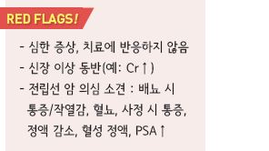
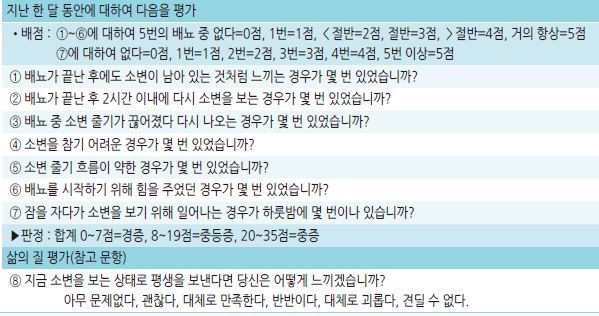
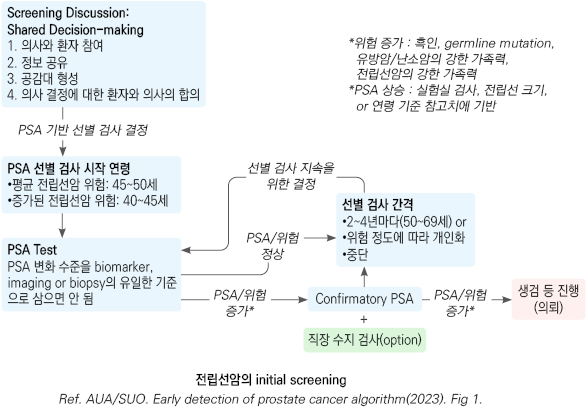
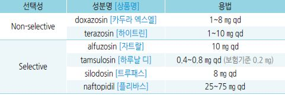
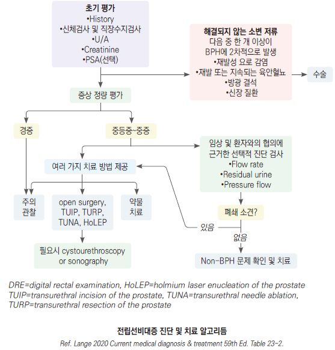
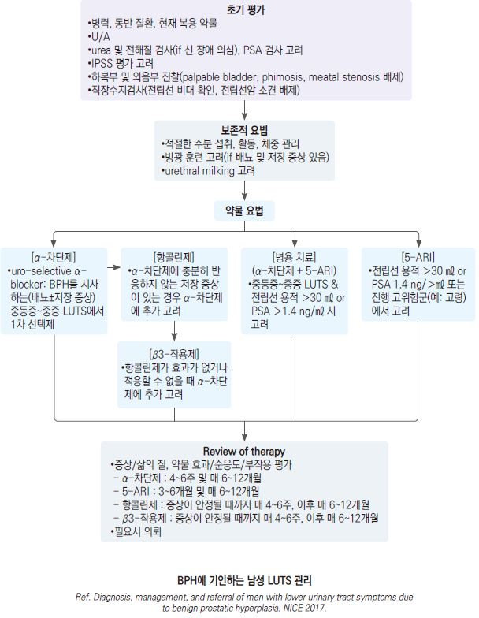
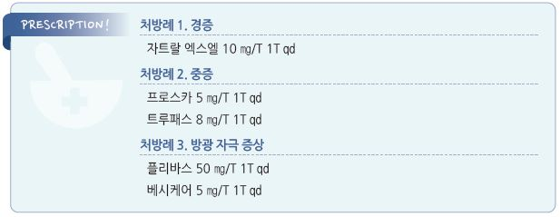

# 전립선비대증 Benign Prostatic Hyperplasia, BPH


## 일반 사항

*   전립선의 smooth muscle, epithelium, stromal cell의 양성 증식; 전립선 용적 증가에 따른 요로 폐쇄 증상과 과민성 배뇨

    증상을 야기
* 유병률 : 40대 10~~20%，50대 50%, 80대 80~~90%
* 전립선 크기와 증상의 중증도는 비례하지 않으며 자각 증상 호소 환자는 유병률보다 낮음
* BPH로 인하여 75세에서 치료가 필요한 경우는 ＜20%
* BPH 환자의 10\~30%는 전립선암일 가능성이 있음

원인

*   불명

    ✽testosterone, dihydrotestosterone, estrogen 등이 BPH의 진행에 영향을 주지만 이들 호르몬만으로 BPH의 진행을 설명할 수 없음;

    prostatic tissue가 여러 가지 성장 인자에 비정상적으로 민감한 embryonic-like state로 회귀하는 것이 관련된다는 보고가 있음

### 위험 인자

* 고령

- 심질환

* β-차단제 사용
* 비만, 운동 부족

임상 양상

*   폐쇄 증상 : 요주저(hesitancy), 소변 줄기의 힘없음/가늘어짐, 잔뇨감,

    이중 배뇨(2시간 내 두 번째 배뇨), 복압배뇨(straining), 배뇨 후 요점적
* 자극 증상 : 절박뇨, 빈뇨, 야뇨

※ 조직학적으로 BPH가 있는 남성의 ½에서 중등증 이상의 하부 요로 증상 발생 (☞ p.671)

진단

#### 기본 평가

*   병력 청취 : 비뇨기계 수술력, 외상, 요로 감염, 혈뇨, 요도 협착, 요폐, 신경학적 질환, 당뇨병, 약물 복용 병력(α-교감 신경 작용제,

    부교감 신경 억제제), 성 기능 장애, 전립선 질환 가족력
* 증상 평가 : 국제 전립선 증상 점수표(IPSS)
* 직장수지검사 : enlarged, firm, non-tender prostate
* U/A
*   PSA(전립선 특이 항원) 검사 : BPH 환자의 30\~50%에서 상승; 3.2 ng/㎖ 이상 시 암에 대한 감별 고려;

    직장수지검사, 경직장 초음파 검사, 또는 정액 사정 24시간 이내에는 PSA 검사는 피함

#### 추가 검사

* 배뇨 일지 작성 : 환자의 호소가 모호한 경우에 시행
* 요역동학 검사 : 요속 및 배뇨 후 잔뇨량 측정
* 소변 배양 검사 : 감염 시 시행
* 소변 세포 검사, 전립선 조직 검사 : 암 의심 시 고려
*   free PSA : 혈액 내에 다른 단백질과 결합되지 않은 PSA. PSA는 혈중에서 α1-antichimotrypsin이나 α2-marcroglobulin등과

    결합되어 존재하며, 30% 가량은 free form으로 존재; 정상 DRE & 총 PSA가 상승(4\~10 ng/㎖)되어 있는 경우의 암 위험도

    추정 및 치료 반응, 재발 모니터링에 유용 에 유용; total PSA 4\~10 ng/㎖인 경우 free PSA＞ 25% 시 암 위험 8%,

    ＜10% 시 암 위험 56%
* prostate cancer gene 3(PCA3) : DRE 후 소변에서 검사; ≥35 시 암 위험↑, 조직 검사 고려
* eGFR, s-Cr : 신질환 의심 시 시행
* 경직장 전립선 초음파 검사 : 전립선 크기 측정; 중년 남성 정상- 20\~25 ㎤, 심한 BPH- ＞50 ㎤
* 방광 초음파 검사 : 배뇨 후 잔뇨량 측정
* 신장 CT/초음파 : 신질환, BPH 합병증(예: 혈뇨, UTI, 만성 신질환, 결석 병력) 의심 시 고려
* 전립선 MRI : PSA가 상승한 환자에서 조직 검사 수행 여부를 결정하는데 유용
* 방광경 : 침습적 치료를 결정한 경우고려

#### 국제 전립선 증상 점수 (International prostate symptom score, IPSS)

```

```

### 감별

* 요로 감염, 전립선염, 방광 결석, 전립선암
* 신경인성 방광, 과민성 방광, 신경학적 이상(파킨슨병, 당뇨병)
* 심부전, 불면증, 수면무호흡증
* 약물 : 이뇨제, 항콜린제(TCA, 항히스타민제 포함), sympathomimetics(예: 코 울혈 제거제(예: ephedrine)), opioid

#### 전립선암 선별 검사 [AUA](2023/)

*   검진 일정 : 45\~50세에 baseline PSA 검사를 시작할 수 있음;

    가족력 등 전립선암 발생 위험이 큰 경우 40\~45세부터 검진 권고;

    50~~69세에 2~~4년마다 정기적인 검진 권고;

    환자 선호도, 연령, PSA 수준, 전립선암 위험, 기대 수명, 일반 건강 상태에 따라 재검사 간격 결정
* 1차 선별 검사 : PSA 선택. PSA가 새로 상승한 사람의 경우 PSA 검사를 반복; 필요시 직장 수지 검사 추가 시행
*   2차 검사 : biomaker, 영상, 또는 조직 생검

    

[**USPSTF**](2018/)

* ≥70세 남성 : PSA를 이용한 전립선암 선별 검사 권고
*   55\~69세 남성 : PSA를 이용한 전립선암 조기 검진이 전립선암으로 인한 사망률 감소 효과는 미약한 반면, 위양성에

    의한 추가 검사(예: 조직 검사) 및 치료 합병증(예: 요실금, 발기 부전)의 위해 때문에 일률적인 선별 검사는 권하지 않음

***

## Management

### 치료 방침

* 행동 및 생활 방식 중재
*   증상에 따라 치료 : 증상에 따라 치료 : 무증상\~경증(IPSS ≤7점) 또는 증상이 불편하지 않은 상태에서는 치료 없이 관찰

    → 매년 직장수지검사, PSA, U/A, 증상 평가(IPSS) 시행

## 비-약물 치료

* 체중 관리, 규칙적 운동, 변비 관리
* 이뇨 작용과 방광 자극 효과가 있는 음료 회피 : 카페인(예: 커피, 녹차), 알코올, 인공 감미료
* 빈뇨 불편 시 수분 섭취량을 1.5 L/d로 줄임. 특히 외출 전 수분 섭취를 피함
* 야뇨 불편 시 저녁 이후(취침 전 3\~4시간 내)에는 수분 섭취를 제한. 특히 카페인, 알코올 섭취를 피함
* 버스 여행 등 오랜 시간 배뇨를 할 수 없는 상황을 피함. 가능한 한 쉽게 배뇨를 할 수 있는 교통수단을 이용함
* 배뇨 악화 약제 주의 : 이뇨제, 항콜린제, TCA, 감기약(항히스타민제, 코 울혈 제거제), opioid
* double voiding technique : 불완전한 배뇨 또는 배뇨 후 점적 시 배뇨 수 분 후 다시 배뇨
* urethral milking : 배뇨 후 점적 시 음낭 뒷부분을 손가락 끝으로 짜냄
* 배뇨한 지 2시간 이내에 발생하는 요의에 대하여 한 번은 참으려고 노력 함

약물 치료

*   진단 후 관찰하여 불편한 상태가 호전되지 않으면 약물 치료 시작

    • α-차단제 1차 선택 → 반응 부족 시 5ARI 추가 고려, PDE5i 시도 고려
* 매년 IPSS, PSA, 요속 및 잔뇨량 검사

### α1-교감 신경 차단제 (α1-adrenoceptor antagonist)

```

```

*   기전 : 하부 요로 평활근의 α1-adrenergic receptor 차단 → 방광 경부 및 전립선 평활근 이완(방광 출구 이완), 요속 개선;

    전립선의 크기에는 영향 없음
* 중등증 이하 증상에 대하여 1차 선택; 5ARI보다 효과적
* 보통 중등증 이하 증상(전립선 용적 ＜30\~35 ㎤, IPSS ≤19점)에서 단독 적용
*   병용 : 5ARI 또는 항콜린제와 병용 가능

    •중증 또는 α1-차단제 최대 용량에 반응하지 않는 경우 5ARI와의 병용 고려
*   부작용 : 기립성 저혈압, 어지럼, 무기력, 비염, 두통, 소화불량, 정액 역류증

    • non-selective 제제 : 혈압 강하; 정상 혈압 환자에서도 사용이 가능하나 혈압 모니터링이 필요
*   용법 : 저용량으로 시작하여 효과와 부작용(특히 어지럼)을 평가하며 점차 증량

    • 초기에는 취침 시 투여하며 밤에 일어날 때는 천천히 일어나도록 교육

    • 선택적 α1-교감 신경 차단제는 전신 부작용이 적어 점차 증량의 필요성이 적음

    • PDE5i와 병용 시 혈압 강하 영향이 증가되므로 시간 차이를 두고 복용
* 투여 2\~4주 후 치료 반응 평가

### 항콜린제

* 효과 : 배뇨 후 잔뇨량은 적으나 과민성 방광 증상(예: 빈뇨, 절박뇨)이 있는 환자에서의 증상 개선
* 부작용 : 입/눈 마름, 두통, 어지럼, 변비, 빈맥, 시야 흐림, 녹내장 악화, 졸음; CYP450 대사
* 금기 : 요로폐색(배뇨 후 잔뇨량 ＞250\~300 ㎖), 장폐색, 조절되지 않는 녹내장, cholinesterase 억제제 복용자, 쇠약한 고령자
* oxybutynin : 5~~15 ㎎/d #2~~3 \[디트로판]
* propiverine : 20 ㎎ qd\~bid \[비유피-4]
* tolterodine : 2\~4 ㎎ qd \[디트루시톨 SR]
* solifenacin : 5\~10 ㎎ qd \[베시케어]
* darifenacin : 7.5\~15 ㎎/d
* fesoterodine : 4\~8 ㎎ qd \[토비애즈]
* imidafenacin : 0.1\~0.2 ㎎ bid \[유리토스]
* trospium : 40\~60 ㎎/d #2 \[스파스몰리트]

### 5α-reductase 억제제 (5α-Reductase inhibitor, 5ARI)

*   기전 : testosterone의 dihydrotestosterone(DHT)로의 전환 효소인 5α-reductase(5-AR)를 억제(isoenzyme type 1 주로 간과 피부에

    존재, type 2 주로 전립선에 존재) → DHT↓ → 전립선 세포의 성장 및 발달 억제 → 전립선 용적 감소, 소변 배출 기능 향상
*   효과 : 6개월 치료 시 전립선 용적 20\~40% 감소; 증상 개선에는 수개월 소요

    • 보통 전립선 용적 ＞30 ㎤에서 최대 효과

    ✽전립선 용적 ＜40 ㎤ 또는 PSA ＜1.4 ng/㎖에서는 유효하지 않다는 보고가 있음
* 부작용 : 피로, 유방 팽창/압통, 성욕 감소, 성 기능 저하, 기립성 저혈압, 어지럼
*   모니터링

    • 투여 3개월 후 치료 반응 평가; 6개월 투여 후 PSA가 ½로 감소하지 않거나 불편 증상이 지속되면 의뢰 고려(전립선암 감별)

    (✽약제에 의해 PSA가 감소(50%)되므로(단, free PSA 비율은 변하지 않음) 투약 전과 비교 시 ×2를 해야 함)

    • T2DM 발생 위험이 (30%) 증가한다는 보고가 있음; 당뇨병 모니터링을 권고
* finasteride : type 2-5ARI 억제:;5 ㎎ qd \[프로스카]
* dutasteride : type 1,2-5ARI 억제하며, 효과가 더 빠르고 강할 수 있음; 0.5 ㎎ qd \[아보다트]

\[보험기준] ①IPSS 점수 ≥8점 & ②초음파검사상 전립선 크기 ≥30 ㎖ or 직장수지검사상 중등증 이상의 BPH 소견 or PSA ≥1.4 ng/㎖;

```
약제 투여 중 1회/12개월 이상 PSA 검사
```

### β3-작용제 (β3-adrenoceptor agonist)

* 작용 : detrusor muscle에 대한 선택적 β-수용체 자극 → smooth muscle 이완
* antimuscarinics에 비하여 입마름이 적음
* antimuscarinics와 병용 가능
* 부작용 : 빈맥, 요도염, 혈압 상승; 허약한 고령자와 고혈압, 심장 질환이 있는 경우 주의
* mirabegron : 시작 25 ㎎/d → 2\~4주 후 50 ㎎/d. 늦은 작용(8주) \[베타미가]

### Phosphodiesterase type 5 Inhibitor (PDE5i)

* 발기 저하가 동반되어 있는 중등증 이하 증상에서 고려
* α1-차단제의 혈압 강하 부작용을 증가시킬 수 있으므로 상호 병용 금지
* tadalafil : 5 ㎎ qd \[시알리스] (✽BPH에 대하여 FDA 승인) (☞ p.708)

### 대체제

* 증명된 유효한 식품 보조제는 없음
* urtica dioica(서양쐐기풀) : 유효성을 입증할 증거 부족
*   saw palmetto(쏘팔메토) : Cochrane review 등에서 BPH 환자의 비뇨기 증상이 위약보다 우울하지 않았거나 일관된 효과를

    보이지 못함; 정제화된 추출물의 성분들이 anti-androgenic effect(lauric acid)와 항염 효과(β-sitosterol)이 있으며 BPH 증상

    완화에 약간의 효과가 있다는 일부 보고가 있음; 부작용은 드물지만 혈액 응고 저하 가능성이 있으므로 aspirin, warfarin,

    NSAID 복용 시 주의

    

## 수술

*   대상 : (12개월의) 비수술적 치료로 호전되지 않는 심한 증상, 폐쇄성 요로 질환, 재발성 육안혈뇨, 재발성 요로 감염,

    방광 결석, 큰 방광 게실, 만성 신질환, PSA 상승
* 하부 요로 증상이 있는 환자의 경우에 수술 후 25%에서 증상이 지속됨

##

## ■ 하부 요로 증상 Lower urinary tract symptoms, LUTS

### 일반 사항

* 방광 또는 배출로 이상과 관련되는 하부 요로의 복합 증상(저장, 배뇨, 배뇨 후 증상)
* 조직학적인 BPH가 있는 남성의 ½에서 중등증 이상의 LUTS이 나타남
* ＜45세에서 발생 또는 치료에 반응하지 않는 경우 의뢰

### 원인 또는 관련 인자

*   BPH(가장 흔한 원인), 배뇨근 과민(☞ p.680), 신경학적 장애, 평활근 기능 부전(방광 경부 구축), 요관 협착,

    전립선 암, 방광암, 요로 감염, 전립선염, 방광 결석
* 약물 : 이뇨제, 항콜린제(TCA, 항히스타민제), sympathomimetics(코 울혈 제거제), opioid
* 심혈관/신장/호흡기 질환

### 임상 양상

* 저장 기능 저하 : 빈뇨, 야뇨, 절박뇨/절박 요실금
* 배뇨 기능 저하 : 소변주저(hesitancy), 배뇨 시 힘주기, 요속 감소, 소변 줄기 가늘어짐/끊어짐
* 배뇨 후 증상 : 불완전 배뇨, 배뇨 말기 또는 배뇨 후 소변 방울 떨어짐

### 진단

* 전립선 평가
* 실험실 검사 : U/A, s-Cr, 혈당, PSA; urea, electrolyte
* 요역동학 검사 : 요속 및 배뇨 후 잔뇨량 측정; 유효성 논란(검사 결과와 증상이 일치하지 않는 경우가 있음)

### 치료

* double voiding technique : 배뇨 수 분 후 다시 배뇨
* α-차단제 : 전립선비대증에 의한 증상 발생 시 우선 선택
*   항무스카린제(항콜린제) : α-차단제 4\~6주 치료 후에도 증상이 지속되며 잔뇨＜200 ㎖ 및 최대 소변 유속 ＞5 ㎖/sec인 경우 고려

    

> **질병코드** N40 전립선증식증

R39.8 비뇨계통의 기타 및 상세불명의 증상 및 징후


