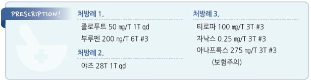

# 월경전증후군 Premenstrual Syndrome, PMS


## 일반 사항

*   월경전증후군(premenstrual syndrome, PMS) : 월경 5일(\~2주) 전에 발생하여 월경 시작과 함께 호전되기 시작하며

    월경 종료 시 사라지는 반복적인 신체적 정신적 증후군
* 월경전불쾌장애(premenstrual dysphoric disorder, PMDD) : 기능 장애를 초래하는 중증의 월경전증후군
* 많은 여성들이 월경 전에 신체적, 정신적 증상을 보이지만 이들이 모두 PMS에 해당되지는 않음
* 유병률 : PMS- 월경 여성의 30%(사춘기 여성의 51~~86%); PMDD- 월경 여성의 3~~8%

## 원인

* 불명

#### 추정 기전

* estrogen 및 progesterone에 대한 반응 증가, 또는 estrogen 과다 및 progesterone 부족
* aldosterone & renin 활성도↑
* 신경 전달 물질 이상 : 특히 serotonin level↓
* Vit B6 부족, 당 대사 이상

### 위험 인자

* 20대 후반\~30대 중반
* 정신적 스트레스
* 출산력이 없거나 적음
* 기분 장애(우울증, 불안증) 병력
* PMS 가족력
* 흡연
* 비만

## 임상 양상

*   신체적 변화 : 복부 팽만감/복통, 피로, 구역, 변비, 유방 팽만감/압통, 근육통, 두통, 어지럼, 사지 부종, 체중 증가, 여드름,

    두근거림
* 정서적 변화 : 과민, 감정 기복, 우울, 불안, 분노, 흥미 감소, 피로, 집중력 저하, 수면 장애, 식욕 변화, 성욕 변화, 활동 위축

## 진단

### 검사

* 다른 질환 감별을 위하여 선택적 시행
* 실험실 검사 : TSH, Hb, 25-OH Vit D(월경전증후군과의 관련성은 명확하지 않음)
* 영상 검사 : 골반 초음파

### 월경전증후군

* 최소 두 번의 연속된 월경 주기에서 정의에 따른 증상의 발생과 소실

### PMDD 진단 기준 \[DSM-5]

A. 지난 1년 동안 대부분의 월경 주기에서 다음 증상 중 ≥5개(①\~④ 중 ≥1개 포함 필수)이 월경 시작 1주 전에 발생하여

```
월경 시작 후 수일 내에 완화되어 월경 1주 후에는 증상이 없거나 거의 없음
```

① 현저한 감정의 불안정. 예) 갑자기 슬퍼지거나 눈물이 나거나, 거절에 대해 민감

② 현저한 과민, 분노 또는 대인 갈등 증가

③ 현저한 우울, 절망감, 자기 비하

④ 현저한 불안, 긴장감, 안절부절

⑤ 일상생활(예 : 직장, 학교, 친구, 취미)에 대한 관심 저하

⑥ 집중이 어렵다는 느낌

⑦ 무기력, 쉽게 피로함, 현저한 활력 결핍

⑧ 식욕의 현저한 변화, 과식, 특정 음식에 대한 갈망

⑨ 과다 수면 또는 불면

⑩ 자신을 전혀 조절하지 못하는 것 같은 느낌

⑪ 유방 압통 또는 부종, 두통, 관절통, 근육통, 복부 팽만감, 체중 증가 같은 신체적 증상

B. 이 증상들은 직장, 학교, 일상적인 사회적 활동, 또는 다른 사람들과의 유대 관계에 임상적으로 심한 고통 또는

```
방해를 야기함. 예) 등교 회피, 직장/학교/가정에서의 능력 저하
```

C. 주요우울장애, 공황장애, 기분저하장애, 인격장애 같은 다른 질환의 단순한 증상 악화가 아님(동반될 수는 있음)

D. 위의 기준들은 최소 두 증상 주기 동안 전향적으로 일일 평가에 의해 확인되어야 함. 확정에 앞서 임시로 진단할 수 있음

E. 이 증상들은 물질(예: 약물, 약물 남용, 다른 치료)의 생리적 효과 또는 다른 의학적 상태(예: 갑상선항진증)에 기인한 것이 아님

### 감별

* 기분장애, 주요우울증, 공황장애, 불안장애. 특히 한 달 내내 증상이 지속되면 우울증 등 정신적 문제 감별을 요함
* 자궁내막증, 다낭성난소증후군, 부신 질환, 고프로락틴혈증
* 편두통, 과민대장증후군, 만성피로증후군, 자가면역 질환

***

## Management

### 치료 방침

* 신체적, 정신적 증상 완화
* 생활 요법 중재
* 약물 요법 : 배란 억제 호르몬, 뇌 신경전달물질 농도 조절(SSRI), 진통제, 항콜린제

## 비-약물 치료

* 스트레스 관리 : 이완, 심호흡, 마사지, 음악, 따듯한 목욕
* 규칙적인 유산소 운동 (✽식이와 운동의 효과에 대한 근거는 충분하지 않음)
*   균형 잡힌 건강 식이 : 저지방식, 전곡류, 과일, 채소

    •피할 음식 : 설탕, 소금, 카페인, 유제품, 음주
* 인지행동 요법(증거 불충분)

## 약물 치료

### Serotonergic antidepressant

* 정서 장애가 주요 증상일 때 SSRI를 1차 선택 (☞ p.1146)
*   용량 : 최소 유효 용량 유지

    • 이전 치료에서 효과가 있었던 용량을 이후에 적용; 이전 치료에서 반응이 적었던 경우 다음 치료에서는 증량 또는

    다른 약제 선택
* 투여 기간 : 월경 예정일 14일 전(황체기)\~월경 시작 후 수일

> ```
> (✽황체기 전체 투여와 증상 발생 직후부터 투여하는 용법의 유의미한 효과 차이는 없다는 보고가 있음)
> ```

* 2 cycle 시도 후 효과 판정; 약제들 간의 효과 및 부작용에 차이가 있을 수 있음
*   부작용 : 성 기능 저하, 두통, 어지럼, 구역, 불면, 집중력 저하; 항콜린 부작용(입마름, 배뇨 장애)

    •보통 투여 초기에 일시적으로 발생하여 투여 1\~2주 내 완화

    •대처 : 감량 또는 약물 교체
* fluoxetine : 20 ㎎/d 또는 90 ㎎ qwk ×2wk(황체기) \[푸로작]
* escitalopram : 10\~20 ㎎/d \[렉사프로]
* sertraline : 50\~150 ㎎/d \[졸로푸트]
* paroxetine : 10 ㎎/d, 20~~50 ㎎/d \[세로자트]; CR 12.5 ㎎/d, 25~~62.5 ㎎/d \[팍실 CR]
* desvenlafaxine : 50\~100 ㎎/d \[프리스틱]
* venlafaxine : SNRI; 75\~150 ㎎/d \[이팩사 XR]

### 피임제

```
(☞ p.700)
```

#### 경구제

*   휴약 기간이 짧은 복합 호르몬 경구 피임제 선호; 일부 환자에서는 오히려 증상이 악화될 수 있음

    •\[야즈] (28T) : 24일간 연분홍색 → 4일간 흰색(위약) 복용

    •\[Seasonale] (91T) : 12주간 복용 → 1주간 위약 복용

    •\[Lybrel] (28T) : 위약 없이 연속 복용
* 고용량 progestin : medroxyprogesterone acetate 20\~30 ㎎ qd \[프로베라]

#### 비경구제

* depot medroxyprogesterone acetate(DMPA) : 150 ㎎ IM 3개월마다
* etonogestrel subdermal implant : 3년 마다 \[임플라논 엔엑스티 이식제]

### GnRH 작용제

* 작용 : 난소에서 일시적으로 estrogen 및 progesterone 생성을 중단시킴
* 대상 : SSRI 또는 경구 피임제로 조절되지 않는 심한 증상에 대하여 고려
*   부작용 : 호르몬 보충 없이 단독으로 사용 시 low estrogen 증상 발생(안면 홍조, BMD↓)

    •투여 시 매일 호르몬 보충이 필요(폐경기 호르몬 치료와 같은 방식) (☞ p.595)
* leuprolide acetate : 3.75 ㎎ depot, 4주마다(매월) 주사 \[루피어 데포 주]
* goserelin acetate : 3.75 ㎎ depot, 4주마다(매월) 배에 피하 주사 \[졸라덱스 데포 주]

### 진통제

* 통증에 대한 대증 치료
* mefenamic acid : 500 ㎎ 1회 이후 250 ㎎ qid \[폰탈]
* ibuprofen : 400 ㎎ tid \[부루펜]
* naproxen : 275 ㎎ tid \[아나프록스]

### 항콜린제

* 경련성 복통에 대한 대증 치료 (☞ p.371)
* cimetropium : 50 ㎎ tid \[알기론]
* scopolamine : 10~~20 ㎎ tid~~qid \[부스코판]
* tiropramide : 100 ㎎ bid\~tid \[티로파]

### 기타

*   일부에서 효과가 있는 방법들

    •Vit B6 50~~100 ㎎, Ca 600 ㎎ bid (☞ p.806), chasteberry 추출물 20~~40 ㎎/d, 오메가-3 2 g/d \[오마코]

    •항불안제 : 의존 주의; alprazolam 0.25 ㎎ tid\~qid ×황체기(월경 시작 후 tapering) \[자낙스]

    •이뇨제 : spironolactone 50~~100 ㎎/d ×황체기(5~~10d) \[알닥톤]
* 입증되지 않은 방법들 : Mg(200\~400 ㎎), Vit D(2,000 IU/d), Vit E(400 IU), Mn(1.8 ㎎), St. John’s wort(900 ㎎/d),

soy(68 ㎎/d isoflavone), gin㎏o(160\~320 ㎎/d), saffron(30 ㎎/d)

> **질병코드** N94.3 월경전긴장증후군


